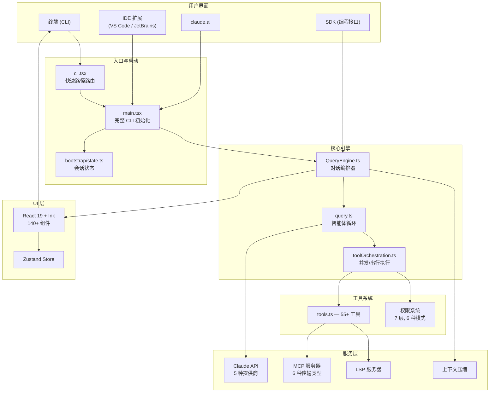

# Opened Claude Code

[English](README.md)

基于 2026 年 3 月 31 日通过 npm 包中的 source map [公开暴露](https://x.com/Fried_rice/status/2038894956459290963) 的 TypeScript 源码快照，对 Anthropic **Claude Code** CLI 的可构建重建。

原始快照仅包含 `src/` —— 没有 `package.json`、没有构建配置、没有依赖。本仓库重建了完整的开发环境，使代码可以构建、运行和研究。

## 隐藏彩蛋：电子宠物系统（"Buddy"）

源码 `src/buddy/` 目录下隐藏了一套完整的电子宠物系统，由 `feature('BUDDY')` 特性开关保护。计划作为 **2026 年愚人节彩蛋** 发布（预告窗口：4 月 1-7 日）。

```
   \^^^/            ♥    ♥
   /\_/\           ♥  ♥   ♥
  ( ✦   ✦)       ♥   ♥  ♥
  (  ω  )
  (")_(")~
   Pixel ★★★★
```

- **18 个物种** —— 鸭子、猫、龙、美西螈、水豚、幽灵、蘑菇、胖猫等
- **抽卡式稀有度** —— Common (60%) → Legendary (1%)，另有 1% 闪光概率
- **确定性生成** —— 外观由 `hash(userId)` 决定，无法伪造
- **LLM 生成灵魂** —— 名字和个性由 Claude 在首次孵化时创作
- **ASCII 精灵动画** —— 3 帧空闲循环、眨眼、躁动，`/buddy pet` 触发爱心特效
- **对话气泡** —— 宠物在每轮对话后发表评论
- **RPG 属性** —— DEBUGGING、PATIENCE、CHAOS、WISDOM、SNARK
- **帽子系统** —— 王冠、巫师帽、螺旋桨帽、光环……还能头顶一只迷你鸭子

完整报告：[`docs/deep-dive-buddy-companion-system_cn.md`](docs/deep-dive-buddy-companion-system_cn.md) | [English](docs/deep-dive-buddy-companion-system.md)

## 截图


## 快速开始

```bash
bun install
bun run build
bun dist/cli.js --help
```

或直接运行

```bash
bun run dev
```

**环境要求：** [Bun](https://bun.sh) v1.1+

## 已完成的重建工作

原始源码提取缺少约 150 个内部文件、所有构建配置，以及约 15 个 Anthropic 私有包的引用。本仓库补充了：

- **`package.json`** —— 80+ npm 依赖、构建脚本、正确的 React 19 + reconciler 版本
- **`tsconfig.json`** —— Bun + TypeScript + JSX 配置
- **`shims/`** —— `bun:bundle` 特性开关、`MACRO.*` 构建时常量和私有包的类型声明
- **`stubs/`** —— `@ant/*`、`@anthropic-ai/*` 内部包和原生模块的本地桩
- **约 150 个生成的源码桩** —— 为缺失文件提供最小化导出
- **`scripts/`** —— `generate-stubs.ts` 和 `fix-stub-exports.ts` 用于维护桩文件

## 使用方法

```bash
# 构建（打包 5284 个模块，约 400ms → 24 MB 输出）
bun run build

# 运行
bun run start                          # 交互式 REPL
bun dist/cli.js -p "your prompt"       # 非交互模式
bun run dev                            # 构建 + 运行

# 认证（二选一）
export ANTHROPIC_API_KEY="sk-ant-..."  # API 密钥
bun dist/cli.js login                  # 通过浏览器 OAuth

# 运行时启用特性开关
FEATURES=BRIDGE_MODE,VOICE_MODE bun dist/cli.js

# TypeScript 检查（约 2500 个因桩类型导致的残留错误）
bun run typecheck
```

## 文档

完整的逆向工程文档位于 [`docs/reverse-engineering/20260331/`](docs/reverse-engineering/20260331/README.md) —— 超过 10,000 行，涵盖架构、数据流、状态机和关键算法，附有代码片段和源码引用。足以重建整个系统。

## 架构



| | |
|---|---|
| **运行时** | Bun |
| **语言** | TypeScript (strict) |
| **终端 UI** | React 19 + Ink（自定义 reconciler 位于 `src/ink/`） |
| **CLI** | Commander.js |
| **Schema** | Zod v4 |
| **协议** | MCP SDK, LSP |
| **API** | Anthropic SDK |
| **遥测** | OpenTelemetry |
| **认证** | OAuth 2.0, JWT, macOS Keychain |

### 入口文件

| 文件 | 作用 |
|---|---|
| `src/entrypoints/cli.tsx` | 启动入口。为 `--version`、MCP 服务器、bridge、daemon 提供快速路径。其余走 `main.tsx`。 |
| `src/main.tsx` | 完整 CLI 初始化。在加载重量级模块前并行预取（MDM、keychain、GrowthBook）。 |
| `src/QueryEngine.ts` | LLM 流式引擎。工具调用循环、思考模式、重试、token 计数。 |
| `src/tools.ts` | 工具注册表。基于约 90 个特性开关的条件导入。 |
| `src/commands.ts` | 斜杠命令注册表（约 50 个命令）。 |
| `src/bootstrap/state.ts` | 集中式会话状态存储。 |

### 子系统

| 目录 | 用途 |
|---|---|
| `src/tools/` | 约 40 个工具，每个都有输入 schema、权限模型和执行逻辑 |
| `src/commands/` | 斜杠命令（`/commit`、`/review`、`/compact`、`/mcp`、`/doctor` 等） |
| `src/services/` | API 客户端、MCP、OAuth、LSP、分析、压缩、策略限制 |
| `src/hooks/` | React hooks + 权限系统（`toolPermission/`） |
| `src/components/` | 约 140 个 Ink 终端 UI 组件 |
| `src/bridge/` | 双向 IDE 通信（VS Code、JetBrains），基于 JWT |
| `src/coordinator/` | 多智能体编排 |
| `src/skills/` | 可复用工作流系统 |
| `src/entrypoints/sdk/` | SDK 类型 schema —— `coreSchemas.ts` 和 `controlSchemas.ts` 是所有 SDK 类型的唯一真相源 |

### 设计模式

- **构建时宏** —— `MACRO.VERSION`、`MACRO.BUILD_TIME` 等通过 `bun build --define` 内联
- **特性开关** —— `bun:bundle` 的 `feature()`（约 90 个开关）。构建时死代码消除。开发模式下默认全部为 `false`
- **Ant-only 门控** —— `process.env.USER_TYPE === 'ant'` 用于 Anthropic 内部工具
- **延迟 require** —— `const getFoo = () => require(...)` 打破循环依赖
- **并行预取** —— MDM、keychain、API 预连接在加载重量级模块前触发

## 已知限制

- **约 150 个桩文件** 导出 `any` —— 如果命中这些代码路径会产生运行时错误
- **TypeScript 严格模式已放宽** —— `noImplicitAny: false`、`strictNullChecks: false`（因桩类型）
- **私有包**（`@ant/*`、`@anthropic-ai/sandbox-runtime` 等）—— 已替换为最小桩
- **原生模块**（`color-diff-napi`、`modifiers-napi`、`audio-capture-napi`）—— 已桩化；结构化 diff、修饰键和语音输入功能不可用
- **无测试** —— 原始快照不包含测试文件或测试运行器配置

## 来源

2026 年 3 月 31 日，[Chaofan Shou](https://x.com/Fried_rice) 发现 Claude Code 的 TypeScript 源码可通过 npm 包中的 `.map` 文件访问。Source map 引用了 Anthropic R2 存储桶上的未混淆源码。本仓库镜像了该 `src/` 快照，并重建了开发环境。

## 免责声明

- 原始源码为 **Anthropic** 所有。
- 本仓库与 Anthropic **无关联、未获授权、非其维护**。
- 本项目**仅供教育、研究和非商业目的使用**。**明确禁止**任何商业用途。
- 上传者对因使用本项目而产生的任何后果**不承担责任**。使用风险自负。
- 使用本仓库即表示您同意仅将其用于学习、学术研究和技术研究。
