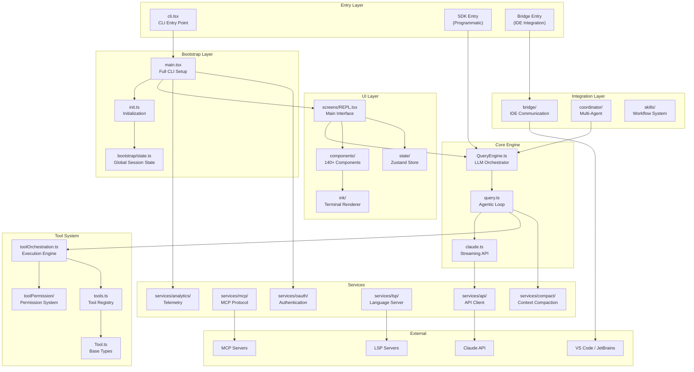
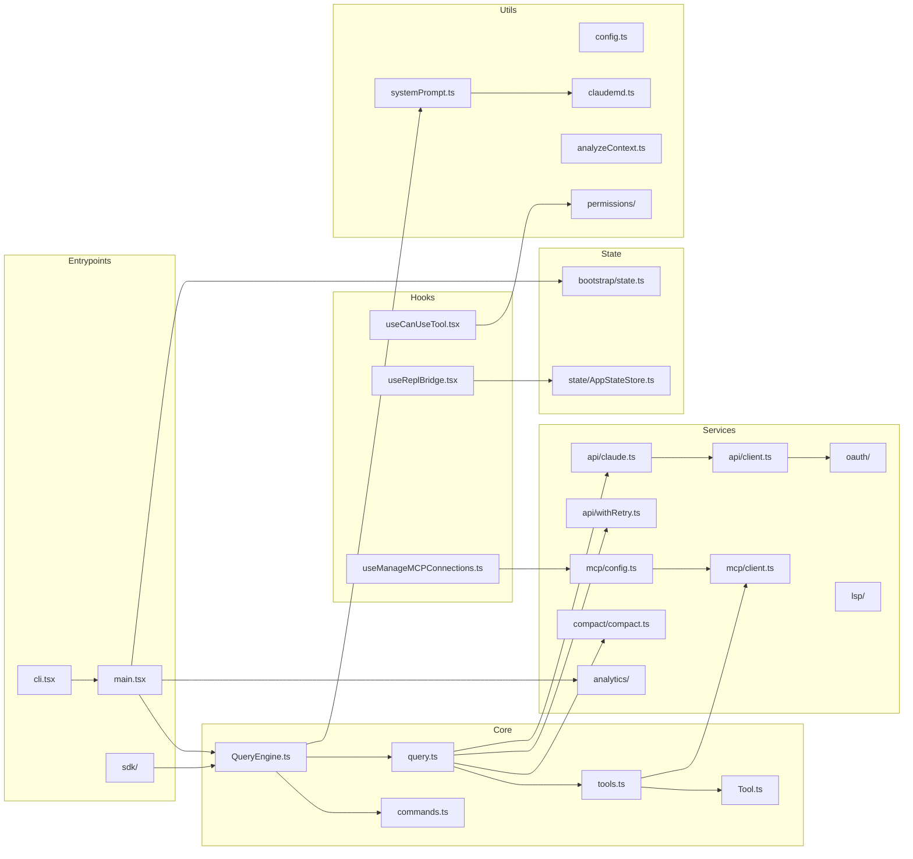
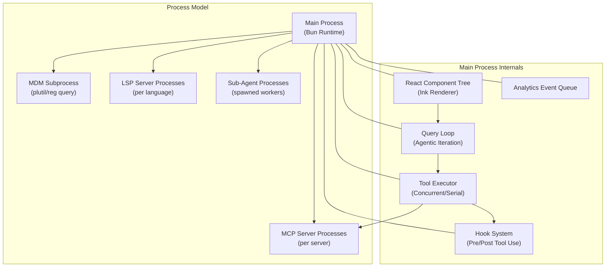

# System Architecture Overview

> Reverse-engineered from Claude Code CLI source snapshot (2026-03-31)

## High-Level Architecture

Claude Code is a terminal-based AI coding assistant built with **Bun + TypeScript**, **React 19 + Ink** for terminal UI, and **Commander.js** for CLI parsing. It operates as an agentic loop — accepting user input, querying the Claude API, executing tools, and iterating until the task is complete.

The architecture is organized into six distinct layers, each with a clear responsibility boundary. This layering is not accidental -- it reflects deliberate decisions to optimize startup time, support multiple entry modes (CLI, SDK, IDE bridge), and enable build-time elimination of entire subsystems that are not relevant to a given build target.

At the top sits the **Entry Layer**, which handles routing between the various ways Claude Code can be invoked. Below that, the **Bootstrap Layer** initializes global session state and performs parallel prefetches of MDM settings, keychain credentials, and API preconnect data -- all before the heavy module evaluation of the main CLI begins. The **Core Engine** owns the agentic loop: streaming API calls, tool dispatch, context compaction, and turn management. The **Tool System** defines a uniform interface for every action Claude can take, from reading files to executing shell commands. The **Services** layer abstracts external integrations behind clean interfaces. Finally, the **UI Layer** renders the terminal interface using React 19 components via a custom Ink fork.

Data flows downward through these layers in a predictable way. User input enters through the Entry Layer, passes through bootstrap initialization, and reaches the Core Engine's `QueryEngine`. The engine constructs a system prompt, sends messages to the Claude API, receives streaming responses, and dispatches tool calls. Tool results flow back up through the same engine, which decides whether to continue iterating or return control to the user. The UI layer observes state changes via a Zustand store and re-renders accordingly.

A key design trade-off is the heavy use of **dynamic imports** and **feature flags** at every layer boundary. This increases code complexity (many `const getFoo = () => require(...)` patterns) but enables zero-import fast paths for simple operations like `--version` and allows entire subsystems (Bridge, Daemon, Voice, Kairos) to be compiled out of non-Anthropic builds via dead-code elimination.



### Walk-through: A Request's Journey

When a user types a message in the REPL, the following sequence unfolds:

1. **REPL.tsx** captures input and calls `QueryEngine.submitMessage()`.
2. **QueryEngine** processes the input through `processUserInput()` (handling slash commands, attachments, skill discovery) and persists the user message to the transcript.
3. **QueryEngine** delegates to `query()` in `query.ts`, which enters a `while(true)` loop.
4. Each iteration of the loop calls the Claude API via `claude.ts`, streaming the response.
5. When the model emits `tool_use` blocks, `toolOrchestration.ts` dispatches them -- concurrency-safe tools run in parallel, others run serially.
6. Each tool invocation passes through the permission system in `toolPermission/`.
7. Tool results are appended to the message history, and the loop continues.
8. The loop terminates when the model produces a response with no tool calls (a "stop" reason), the user aborts, or a budget/turn limit is reached.

---

## Module Dependency Graph

The dependency graph below shows how modules reference each other across the codebase. Understanding this graph is critical for comprehending the codebase's circular dependency management strategy and why the lazy-require pattern is so pervasive.

The graph reveals two important structural properties. First, the entrypoints (`cli.tsx`, `main.tsx`, `sdk/`) form a strict tree -- they import downward into the core and never import each other. This ensures that each entry mode can load only the modules it needs. Second, the Core layer (`QueryEngine.ts`, `query.ts`, `Tool.ts`, `tools.ts`, `commands.ts`) forms a tightly connected subgraph, with circular dependencies broken by lazy `require()` calls rather than restructuring.

The Services layer sits below Core and is imported by it, but never imports Core directly. This keeps external integrations (API client, MCP, OAuth, LSP) decoupled from the query orchestration logic. The Hooks layer bridges the gap between the UI and Core -- hooks like `useCanUseTool.tsx` implement the React-side permission flow that wraps the Core's permission checking logic.

State management is split between two stores: `bootstrap/state.ts` holds process-wide session state (session ID, cost tracking, telemetry counters, model configuration), while `state/AppStateStore.ts` holds the Zustand-based UI state (messages, tool progress, permission context). This split reflects the fact that some state is needed before React even mounts (bootstrap) while other state is purely reactive UI concern.



### Circular Dependency Management

The codebase uses three strategies to break circular imports:

1. **Lazy `require()` wrappers** -- The most common pattern. A module that is needed at call time (not import time) is wrapped in a function:

```typescript
// src/tools.ts:63-68 — breaking tools.ts -> TeamCreateTool -> ... -> tools.ts cycle
const getTeamCreateTool = () =>
  require('./tools/TeamCreateTool/TeamCreateTool.js')
    .TeamCreateTool as typeof import('./tools/TeamCreateTool/TeamCreateTool.js').TeamCreateTool
const getTeamDeleteTool = () =>
  require('./tools/TeamDeleteTool/TeamDeleteTool.js')
    .TeamDeleteTool as typeof import('./tools/TeamDeleteTool/TeamDeleteTool.js').TeamDeleteTool
```

2. **Centralized type re-exports** -- Types that would create import cycles are placed in leaf modules (`src/types/permissions.ts`, `src/types/message.ts`, `src/types/hooks.ts`) and re-exported through the modules that logically own them:

```typescript
// src/Tool.ts:42-48 — importing permission types from centralized location
import type {
  AdditionalWorkingDirectory,
  PermissionMode,
  PermissionResult,
} from './types/permissions.js'
```

3. **Feature-gated conditional requires** -- For modules behind feature flags, the require is wrapped in a build-time-evaluated conditional that enables dead-code elimination:

```typescript
// src/QueryEngine.ts:112-118 — conditional import for coordinator mode
const getCoordinatorUserContext: (...) => { ... } = feature('COORDINATOR_MODE')
  ? require('./coordinator/coordinatorMode.js').getCoordinatorUserContext
  : () => ({})
```

---

## Entry Point Dispatch: cli.tsx

The entry point at `src/entrypoints/cli.tsx` implements a dispatch tree that routes different invocation modes to their respective handlers. The design principle here is aggressive fast-pathing: the most common quick operations (`--version`, `--help`) resolve with zero module imports beyond the entry file itself, while the full CLI (which requires evaluating 200+ modules) is loaded only when actually needed.

The dispatch tree checks arguments in order of expected frequency and complexity:

1. **`--version`** -- Returns immediately using the build-time macro `MACRO.VERSION`. No imports at all.
2. **`--dump-system-prompt`** -- Ant-only diagnostic path, gated by `feature('DUMP_SYSTEM_PROMPT')`.
3. **MCP/Chrome integration paths** -- `--claude-in-chrome-mcp`, `--chrome-native-host`, `--computer-use-mcp`.
4. **Daemon worker** -- `--daemon-worker=<kind>` for supervisor-spawned worker processes.
5. **Bridge mode** -- `remote-control` / `rc` / `remote` / `sync` / `bridge` for IDE integration.
6. **Daemon supervisor** -- `claude daemon [subcommand]`.
7. **Background sessions** -- `ps`, `logs`, `attach`, `kill`, `--bg`, `--background`.
8. **Template jobs** -- `new`, `list`, `reply` for template-based workflows.
9. **Environment/self-hosted runners** -- Headless execution modes.
10. **Fall-through** -- Loads `main.tsx` for the full interactive CLI.

```typescript
// src/entrypoints/cli.tsx:33-42 — Zero-import fast path for --version
async function main(): Promise<void> {
  const args = process.argv.slice(2);

  // Fast-path for --version/-v: zero module loading needed
  if (args.length === 1 && (args[0] === '--version' || args[0] === '-v' || args[0] === '-V')) {
    // MACRO.VERSION is inlined at build time
    console.log(`${MACRO.VERSION} (Claude Code)`);
    return;
  }
  // ...
```

Each fast-path uses dynamic `await import(...)` to load only the modules required for that specific path. The full CLI path loads `main.tsx` last, after starting the early input capture:

```typescript
// src/entrypoints/cli.tsx:287-298 — Fall-through to full CLI
  // No special flags detected, load and run the full CLI
  const { startCapturingEarlyInput } = await import('../utils/earlyInput.js');
  startCapturingEarlyInput();
  profileCheckpoint('cli_before_main_import');
  const { main: cliMain } = await import('../main.js');
  profileCheckpoint('cli_after_main_import');
  await cliMain();
  profileCheckpoint('cli_after_main_complete');
}
```

The `startCapturingEarlyInput()` call is significant: it begins buffering keystrokes before `main.tsx` finishes loading, so the user can start typing immediately. The captured input is replayed once the REPL is ready.

Additionally, the entry point performs environment-level setup that must happen before any module evaluation. For Claude Code Remote (CCR) environments, it configures Node.js heap limits. For ablation baselines (an Ant-internal testing mode), it sets a suite of environment variables that disable various features:

```typescript
// src/entrypoints/cli.tsx:8-26 — Top-level side effects before any async work
if (process.env.CLAUDE_CODE_REMOTE === 'true') {
  const existing = process.env.NODE_OPTIONS || '';
  process.env.NODE_OPTIONS = existing
    ? `${existing} --max-old-space-size=8192`
    : '--max-old-space-size=8192';
}

if (feature('ABLATION_BASELINE') && process.env.CLAUDE_CODE_ABLATION_BASELINE) {
  for (const k of [
    'CLAUDE_CODE_SIMPLE', 'CLAUDE_CODE_DISABLE_THINKING',
    'DISABLE_INTERLEAVED_THINKING', 'DISABLE_COMPACT',
    'DISABLE_AUTO_COMPACT', 'CLAUDE_CODE_DISABLE_AUTO_MEMORY',
    'CLAUDE_CODE_DISABLE_BACKGROUND_TASKS'
  ]) {
    process.env[k] ??= '1';
  }
}
```

---

## Bootstrap and Initialization: main.tsx

The `main.tsx` file is where the full CLI comes to life. At approximately 800,000 lines (after source map extraction), it is by far the largest single module in the codebase. Its design is driven by a single imperative: **minimize perceived startup latency through aggressive parallelism**.

The file begins with three top-level side effects that fire at import evaluation time -- before the `main()` function is even called:

```typescript
// src/main.tsx:9-20 — Side effects at module load time
import { profileCheckpoint, profileReport } from './utils/startupProfiler.js';
profileCheckpoint('main_tsx_entry');

import { startMdmRawRead } from './utils/settings/mdm/rawRead.js';
startMdmRawRead();

import { ensureKeychainPrefetchCompleted, startKeychainPrefetch }
  from './utils/secureStorage/keychainPrefetch.js';
startKeychainPrefetch();
```

These three operations -- startup profiling, MDM (Mobile Device Management) subprocess launch, and keychain credential prefetch -- are deliberately placed before the remaining ~170 import statements. The MDM read spawns `plutil` (macOS) or `reg query` (Windows) subprocesses that run in parallel with the ~135ms it takes Bun to evaluate all remaining module imports. The keychain prefetch fires both macOS keychain reads (OAuth token + legacy API key) concurrently, avoiding the ~65ms sequential penalty that would otherwise occur inside `applySafeConfigEnvironmentVariables()`.

The `main.tsx` module also demonstrates the feature-flag-gated conditional import pattern at scale:

```typescript
// src/main.tsx:76-81 — Dead code elimination for optional subsystems
const coordinatorModeModule = feature('COORDINATOR_MODE')
  ? require('./coordinator/coordinatorMode.js') as typeof import('./coordinator/coordinatorMode.js')
  : null;

const assistantModule = feature('KAIROS')
  ? require('./assistant/index.js') as typeof import('./assistant/index.js')
  : null;
```

When building for external distribution, `feature('COORDINATOR_MODE')` evaluates to `false` at build time, and Bun's bundler eliminates the entire `require()` call and all transitive dependencies of `coordinatorMode.js`. This is how entire subsystems (Coordinator, Kairos/Assistant, Bridge, Daemon, Voice) are compiled out of non-Anthropic builds.

---

## Core Engine: QueryEngine.ts

The `QueryEngine` class is the central orchestrator for all conversation interactions, whether they originate from the interactive REPL, the headless SDK, or a coordinator sub-agent. Each conversation gets one `QueryEngine` instance; each call to `submitMessage()` represents a single user turn within that conversation. Session state (messages, file caches, usage tracking, permission denials) persists across turns.

The class is designed as an `AsyncGenerator`, yielding `SDKMessage` events as the turn progresses. This generator-based API serves two purposes: it provides a natural back-pressure mechanism (the consumer controls iteration speed), and it enables the SDK to observe intermediate events (tool calls, permission denials, progress updates) without polling.

```typescript
// src/QueryEngine.ts:130-173 — QueryEngineConfig type definition
export type QueryEngineConfig = {
  cwd: string
  tools: Tools
  commands: Command[]
  mcpClients: MCPServerConnection[]
  agents: AgentDefinition[]
  canUseTool: CanUseToolFn
  getAppState: () => AppState
  setAppState: (f: (prev: AppState) => AppState) => void
  initialMessages?: Message[]
  readFileCache: FileStateCache
  customSystemPrompt?: string
  appendSystemPrompt?: string
  userSpecifiedModel?: string
  fallbackModel?: string
  thinkingConfig?: ThinkingConfig
  maxTurns?: number
  maxBudgetUsd?: number
  taskBudget?: { total: number }
  jsonSchema?: Record<string, unknown>
  verbose?: boolean
  replayUserMessages?: boolean
  handleElicitation?: ToolUseContext['handleElicitation']
  includePartialMessages?: boolean
  // ...
}
```

The `QueryEngineConfig` reveals the engine's dual nature. It accepts both low-level plumbing (`canUseTool`, `getAppState`, `setAppState`, `readFileCache`) and high-level policy (`maxTurns`, `maxBudgetUsd`, `thinkingConfig`). This lets the REPL wire in its React hooks and Zustand store while the SDK provides simpler function implementations.

A particularly interesting design decision is the `canUseTool` wrapper inside `submitMessage()`:

```typescript
// src/QueryEngine.ts:244-271 — Permission denial tracking wrapper
const wrappedCanUseTool: CanUseToolFn = async (
  tool, input, toolUseContext, assistantMessage, toolUseID, forceDecision,
) => {
  const result = await canUseTool(
    tool, input, toolUseContext, assistantMessage, toolUseID, forceDecision,
  )

  // Track denials for SDK reporting
  if (result.behavior !== 'allow') {
    this.permissionDenials.push({
      tool_name: sdkCompatToolName(tool.name),
      tool_use_id: toolUseID,
      tool_input: input,
    })
  }

  return result
}
```

This wrapper injects denial tracking into the permission flow without modifying the permission system itself. The tracked denials are included in the `SDKMessage` stream, allowing SDK consumers to see exactly what was blocked and why.

The `submitMessage()` method follows a precise sequence:

1. Clear per-turn skill discovery tracking.
2. Fetch system prompt parts (default prompt, user context, system context).
3. Compose the final system prompt from default + custom + append segments.
4. Register structured output enforcement hooks if a JSON schema is specified.
5. Process the user input (handle slash commands, build messages).
6. Persist the user message to the transcript file.
7. Load skills and plugins (cache-only in headless mode).
8. Yield a `system_init` message with metadata.
9. Enter the `query()` loop, yielding all intermediate messages.
10. Accumulate usage statistics and yield a final `result` message.

---

## The Agentic Loop: query.ts

The `query()` function in `src/query.ts` implements the core agentic loop -- the `while(true)` iteration that streams API responses, executes tools, and decides when to stop. It is a separate module from `QueryEngine` to keep the engine class focused on session lifecycle while the loop handles per-turn mechanics.

The function signature reveals its generator-based design:

```typescript
// src/query.ts:219-239 — The query function signature
export async function* query(
  params: QueryParams,
): AsyncGenerator<
  | StreamEvent
  | RequestStartEvent
  | Message
  | TombstoneMessage
  | ToolUseSummaryMessage,
  Terminal
> {
  const consumedCommandUuids: string[] = []
  const terminal = yield* queryLoop(params, consumedCommandUuids)
  for (const uuid of consumedCommandUuids) {
    notifyCommandLifecycle(uuid, 'completed')
  }
  return terminal
}
```

The outer `query()` wraps `queryLoop()` to handle command lifecycle notifications. The inner `queryLoop()` maintains mutable cross-iteration state:

```typescript
// src/query.ts:268-279 — Mutable state across loop iterations
let state: State = {
  messages: params.messages,
  toolUseContext: params.toolUseContext,
  maxOutputTokensOverride: params.maxOutputTokensOverride,
  autoCompactTracking: undefined,
  stopHookActive: undefined,
  maxOutputTokensRecoveryCount: 0,
  hasAttemptedReactiveCompact: false,
  turnCount: 1,
  pendingToolUseSummary: undefined,
  transition: undefined,
}
```

Each iteration of the loop:

1. Starts a memory prefetch (relevant CLAUDE.md content for the current context).
2. Yields a `stream_request_start` event.
3. Calls the Claude API via the streaming client, receiving tokens incrementally.
4. Processes the model response: if it contains `tool_use` blocks, dispatches them through `toolOrchestration.ts`.
5. Checks termination conditions: no tool calls (natural stop), user abort, turn limit exceeded, budget exhausted.
6. If continuing, checks whether auto-compaction should fire (context window usage above threshold) and performs it if needed.
7. Prepares the next iteration's state and continues.

The loop also handles error recovery. If the API returns a "prompt too long" error, it attempts reactive compaction. If a `FallbackTriggeredError` occurs (primary model unavailable), it transparently switches to the fallback model. Token budget tracking (`feature('TOKEN_BUDGET')`) monitors cumulative token spend against a configured budget.

---

## Tool System: Tool.ts and tools.ts

### Tool Interface (Tool.ts)

The `Tool` type in `src/Tool.ts` defines the contract that every tool -- built-in and MCP -- must satisfy. It is one of the most extensively typed interfaces in the codebase, with over 30 members covering input validation, permission checking, execution, result rendering, and search indexing.

```typescript
// src/Tool.ts:362-402 — Core Tool type definition (abbreviated)
export type Tool<
  Input extends AnyObject = AnyObject,
  Output = unknown,
  P extends ToolProgressData = ToolProgressData,
> = {
  aliases?: string[]
  searchHint?: string
  call(
    args: z.infer<Input>,
    context: ToolUseContext,
    canUseTool: CanUseToolFn,
    parentMessage: AssistantMessage,
    onProgress?: ToolCallProgress<P>,
  ): Promise<ToolResult<Output>>
  description(input: z.infer<Input>, options: { ... }): Promise<string>
  readonly inputSchema: Input
  readonly inputJSONSchema?: ToolInputJSONSchema
  readonly name: string
  maxResultSizeChars: number
  isConcurrencySafe(input: z.infer<Input>): boolean
  isEnabled(): boolean
  isReadOnly(input: z.infer<Input>): boolean
  isDestructive?(input: z.infer<Input>): boolean
  interruptBehavior?(): 'cancel' | 'block'
  checkPermissions(input: z.infer<Input>, context: ToolUseContext): Promise<PermissionResult>
  validateInput?(input: z.infer<Input>, context: ToolUseContext): Promise<ValidationResult>
  prompt(options: { ... }): Promise<string>
  userFacingName(input: Partial<z.infer<Input>> | undefined): string
  mapToolResultToToolResultBlockParam(content: Output, toolUseID: string): ToolResultBlockParam
  renderToolResultMessage?(...): React.ReactNode
  toAutoClassifierInput(input: z.infer<Input>): unknown
  // ...
}
```

Several design decisions stand out:

- **`isConcurrencySafe(input)`** -- This per-invocation check (not per-tool) allows the tool orchestrator to run multiple tool calls in parallel when safe, while serializing operations that could conflict (e.g., two `FileEdit` calls to the same file).
- **`isReadOnly(input)` and `isDestructive?(input)`** -- These are separate because "not read-only" does not imply "destructive." A file write is not read-only but is also not destructive (it can be undone). A file delete is destructive. This distinction informs the permission system's risk classification.
- **`maxResultSizeChars`** -- Prevents a single tool result from consuming the entire context window. Results exceeding this limit are persisted to disk and the model receives a summary with a file path. Set to `Infinity` for tools like `Read` where persisting would create circular read loops.
- **`shouldDefer`** -- Enables the ToolSearch optimization: tools marked as deferrable are sent to the model with `defer_loading: true`, reducing initial prompt size. The model must use the `ToolSearch` tool to discover them before they can be called.
- **`toAutoClassifierInput(input)`** -- Produces a compact representation for the auto-mode security classifier, which evaluates whether a tool call looks suspicious (e.g., `rm -rf /` for Bash).
- **`preparePermissionMatcher?(input)`** -- Pre-computes a matcher for hook `if` conditions, enabling efficient pattern matching against permission rules like `Bash(git *)`.

The `ToolUseContext` type defines the environment available to a tool during execution:

```typescript
// src/Tool.ts:158-300 — ToolUseContext (abbreviated)
export type ToolUseContext = {
  options: {
    commands: Command[]
    debug: boolean
    mainLoopModel: string
    tools: Tools
    verbose: boolean
    thinkingConfig: ThinkingConfig
    mcpClients: MCPServerConnection[]
    mcpResources: Record<string, ServerResource[]>
    isNonInteractiveSession: boolean
    agentDefinitions: AgentDefinitionsResult
    maxBudgetUsd?: number
    customSystemPrompt?: string
    appendSystemPrompt?: string
  }
  abortController: AbortController
  readFileState: FileStateCache
  getAppState(): AppState
  setAppState(f: (prev: AppState) => AppState): void
  messages: Message[]
  // ...
}
```

This context-passing pattern (rather than global state access) is a deliberate choice that enables sub-agents and coordinator workers to operate with their own isolated contexts while sharing the same tool implementations.

### Tool Registry (tools.ts)

The `src/tools.ts` file is the single source of truth for which tools are available in a given session. It assembles the tool list through a combination of static imports, feature-flag-gated conditional requires, and environment variable checks.

```typescript
// src/tools.ts:193-251 — getAllBaseTools() (abbreviated)
export function getAllBaseTools(): Tools {
  return [
    AgentTool,
    TaskOutputTool,
    BashTool,
    // Ant-native builds have embedded search tools
    ...(hasEmbeddedSearchTools() ? [] : [GlobTool, GrepTool]),
    ExitPlanModeV2Tool,
    FileReadTool,
    FileEditTool,
    FileWriteTool,
    NotebookEditTool,
    WebFetchTool,
    TodoWriteTool,
    WebSearchTool,
    TaskStopTool,
    AskUserQuestionTool,
    SkillTool,
    EnterPlanModeTool,
    ...(process.env.USER_TYPE === 'ant' ? [ConfigTool] : []),
    ...(process.env.USER_TYPE === 'ant' ? [TungstenTool] : []),
    ...(SuggestBackgroundPRTool ? [SuggestBackgroundPRTool] : []),
    // ... many more conditional tools ...
    ...(isToolSearchEnabledOptimistic() ? [ToolSearchTool] : []),
  ]
}
```

The tool registry follows a layered filtering pipeline:

1. **`getAllBaseTools()`** -- Returns every tool that could exist in the current environment, respecting feature flags and `USER_TYPE`.
2. **`filterToolsByDenyRules()`** -- Removes tools that are blanket-denied by the permission context (e.g., enterprise policy blocks `mcp__server`).
3. **`getTools()`** -- Applies mode-specific filtering (SIMPLE mode gets only Bash/Read/Edit, REPL mode hides tools wrapped by the REPL VM).
4. **`assembleToolPool()`** -- Combines built-in tools with MCP tools, deduplicating by name with built-ins taking precedence, and sorting each partition for prompt-cache stability.

The Ant-only gating (`process.env.USER_TYPE === 'ant'`) and feature-flag gating (`feature('KAIROS')`, `feature('COORDINATOR_MODE')`, etc.) mean that external builds ship with a significantly smaller tool set. Approximately 15-20 tools are gated behind various flags.

---

## Command System: commands.ts

The `src/commands.ts` file mirrors the tool registry's pattern but for slash commands. It defines approximately 60+ commands, with a similar conditional import structure:

```typescript
// src/commands.ts:60-107 — Feature-gated command imports
const proactive =
  feature('PROACTIVE') || feature('KAIROS')
    ? require('./commands/proactive.js').default
    : null
const bridge = feature('BRIDGE_MODE')
  ? require('./commands/bridge/index.js').default
  : null
const voiceCommand = feature('VOICE_MODE')
  ? require('./commands/voice/index.js').default
  : null
const forceSnip = feature('HISTORY_SNIP')
  ? require('./commands/force-snip.js').default
  : null
```

Commands are classified into two groups:

1. **`INTERNAL_ONLY_COMMANDS`** -- Only available when `USER_TYPE === 'ant'` and not in demo mode. Includes diagnostics like `/backfill-sessions`, `/break-cache`, `/share`, `/teleport`, etc.
2. **`COMMANDS()`** -- The main command list, returned by a memoized function (not evaluated at import time, since commands read from config which is not yet available during module initialization).

The command system also aggregates skills from multiple sources through `getSkills()`:

```typescript
// src/commands.ts:353-398 — Skill aggregation from multiple sources
async function getSkills(cwd: string): Promise<{
  skillDirCommands: Command[]
  pluginSkills: Command[]
  bundledSkills: Command[]
  builtinPluginSkills: Command[]
}> {
  const [skillDirCommands, pluginSkills] = await Promise.all([
    getSkillDirCommands(cwd).catch(err => { ... }),
    getPluginSkills().catch(err => { ... }),
  ])
  const bundledSkills = getBundledSkills()
  const builtinPluginSkills = getBuiltinPluginSkillCommands()
  return { skillDirCommands, pluginSkills, bundledSkills, builtinPluginSkills }
}
```

This design allows the command namespace to be extended from four independent sources: `.claude/skills/` directories, installed plugins, bundled skills, and built-in plugin skills -- all loaded in parallel with graceful error handling per source.

---

## Global Session State: bootstrap/state.ts

The `src/bootstrap/state.ts` module is the centralized mutable state store for session-wide data that exists outside the React rendering cycle. It is intentionally placed in a leaf module of the import DAG (it imports almost nothing) to avoid circular dependencies.

The file's comments are unusually emphatic about its role as a last resort:

```typescript
// src/bootstrap/state.ts:31
// DO NOT ADD MORE STATE HERE - BE JUDICIOUS WITH GLOBAL STATE

// src/bootstrap/state.ts:259
// ALSO HERE - THINK THRICE BEFORE MODIFYING

// src/bootstrap/state.ts:428
// AND ESPECIALLY HERE
```

The `State` type contains approximately 80 fields, grouped into categories:

- **Session identity**: `sessionId`, `parentSessionId`, `originalCwd`, `projectRoot`
- **Cost/usage tracking**: `totalCostUSD`, `totalAPIDuration`, `modelUsage`, `totalLinesAdded/Removed`
- **Model configuration**: `mainLoopModelOverride`, `initialMainLoopModel`, `modelStrings`
- **Telemetry infrastructure**: `meter`, `sessionCounter`, `locCounter`, `eventLogger`, OpenTelemetry providers
- **Feature-specific state**: `kairosActive`, `scheduledTasksEnabled`, `sessionCronTasks`, `invokedSkills`
- **Cache latches**: `afkModeHeaderLatched`, `fastModeHeaderLatched`, `cacheEditingHeaderLatched` -- sticky-on flags that, once set, never revert within a session to preserve API prompt cache coherence.

The state is initialized once via `getInitialState()` and accessed through exported getter/setter functions:

```typescript
// src/bootstrap/state.ts:429-433 — The singleton state instance
const STATE: State = getInitialState()

export function getSessionId(): SessionId {
  return STATE.sessionId
}
```

The getter/setter pattern (rather than direct property access) serves two purposes: it enforces controlled mutation (setters can validate, normalize, or trigger side effects), and it enables future instrumentation (e.g., logging every state change for debugging).

A particularly notable design is the session switching mechanism:

```typescript
// src/bootstrap/state.ts:468-479 — Atomic session switching
export function switchSession(
  sessionId: SessionId,
  projectDir: string | null = null,
): void {
  STATE.planSlugCache.delete(STATE.sessionId)
  STATE.sessionId = sessionId
  STATE.sessionProjectDir = projectDir
  sessionSwitched.emit(sessionId)
}
```

`switchSession()` atomically updates both `sessionId` and `sessionProjectDir` to prevent them from drifting out of sync (documented as fix for CC-34). It emits a signal so other modules (like `concurrentSessions.ts`) can react to the change.

---

## Subsystem Overview

| Subsystem | Location | Purpose | Key Files |
|-----------|----------|---------|-----------|
| **Entry Points** | `src/entrypoints/` | CLI bootstrap, fast-paths, mode dispatch | `cli.tsx`, `sdk/` |
| **Core Engine** | `src/` | Query orchestration, tool loop | `QueryEngine.ts`, `query.ts` |
| **Tool System** | `src/tools/`, `src/Tool.ts` | 55+ tools with schema, permissions, execution | `tools.ts`, `Tool.ts` |
| **Command System** | `src/commands/` | 60+ slash commands | `commands.ts` |
| **Permission System** | `src/hooks/toolPermission/` | Multi-mode permission checking | `useCanUseTool.tsx` |
| **API Client** | `src/services/api/` | Multi-provider Claude API access | `client.ts`, `claude.ts` |
| **MCP** | `src/services/mcp/` | Model Context Protocol integration | `client.ts`, `config.ts` |
| **OAuth** | `src/services/oauth/` | Authentication flows | `index.ts`, `client.ts` |
| **LSP** | `src/services/lsp/` | Language server integration | `LSPServerManager.ts` |
| **Compaction** | `src/services/compact/` | Context window management | `compact.ts`, `autoCompact.ts` |
| **Analytics** | `src/services/analytics/` | Telemetry and event tracking | `index.ts`, `growthbook.ts` |
| **UI** | `src/components/`, `src/ink/` | Terminal UI via React + Ink | `REPL.tsx`, `App.tsx` |
| **Bridge** | `src/bridge/` | IDE communication (VS Code, JetBrains) | `bridgeApi.ts`, `bridgeMessaging.ts` |
| **Coordinator** | `src/coordinator/` | Multi-agent orchestration | `coordinatorMode.ts` |
| **Skills** | `src/skills/` | Reusable workflow system | `bundledSkills.ts` |
| **Configuration** | `src/utils/settings/` | Multi-source settings hierarchy | `settings.ts`, `types.ts` |
| **Bootstrap** | `src/bootstrap/` | Session state and initialization | `state.ts` |
| **Utilities** | `src/utils/` | 340+ utility modules | Various |
| **Constants** | `src/constants/` | System prompts, limits, product info | `prompts.ts`, `betas.ts` |

---

## Runtime Architecture

The runtime model below illustrates how Claude Code operates as a single main process with multiple child processes for external integrations. The main process runs the Bun runtime and hosts the React component tree (via Ink), the query loop, the tool executor, and the analytics event queue. Child processes are spawned for MDM settings reads, LSP servers (one per language), MCP servers (one per configured server), and sub-agent workers.

The main process internals are single-threaded (JavaScript event loop), but concurrency is achieved through two mechanisms: async/await for I/O-bound operations (API calls, file reads) and the `StreamingToolExecutor` for running concurrency-safe tool calls in parallel. The hook system intercepts tool execution at pre/post boundaries, enabling enterprise policy enforcement, audit logging, and custom validation logic without modifying tool implementations.

The React component tree deserves special mention: it runs in the same event loop as the query loop, not in a separate thread. Ink's custom renderer translates React state changes into terminal escape sequences. This means long-running tool executions do not block UI updates (they are async), but CPU-intensive rendering could theoretically delay tool dispatch. In practice, terminal rendering is fast enough that this is not a concern.



### Process Lifecycle

The main process lifecycle follows these phases:

1. **Bootstrap** (~5ms) -- `cli.tsx` evaluates, checks for fast-path arguments, starts profiling.
2. **Module evaluation** (~135ms) -- `main.tsx` import triggers evaluation of 200+ modules. MDM subprocess and keychain prefetch run in parallel.
3. **Initialization** -- Commander.js parses arguments, GrowthBook initializes, settings merge from multiple sources, migrations run.
4. **REPL mount** -- React component tree mounts, Ink renderer starts, early input is replayed.
5. **Steady state** -- REPL loop: user input -> QueryEngine -> API -> tools -> render -> repeat.
6. **Shutdown** -- Graceful shutdown: flush analytics, persist transcript, clean up session teams, close MCP/LSP connections.

---

## Technology Stack

| Layer | Technology | Version |
|-------|-----------|---------|
| Runtime | Bun | Latest |
| Language | TypeScript | Strict (relaxed for stubs) |
| UI Framework | React | 19 |
| Terminal Rendering | Ink (custom fork) | Custom |
| Layout Engine | Yoga | Native |
| CLI Parsing | Commander.js | Extra typings |
| Schema Validation | Zod | v4 |
| State Management | Zustand | Latest |
| Build System | Bun bundler | Built-in |
| Protocol | MCP SDK | @modelcontextprotocol/sdk |
| Protocol | LSP | Custom client |

---

## Design Philosophy

1. **Fast-Path Optimization**: Zero-import paths for `--version`, `--help` return instantly without loading the 200+ module dependency tree.

2. **Parallel Prefetch**: MDM settings, keychain reads, and API preconnect fire at module load time, completing during the ~135ms import evaluation.

3. **Build-Time DCE**: Feature flags via `bun:bundle` enable dead-code elimination — entire subsystems (Bridge, Daemon, Voice) are compiled out of non-Anthropic builds.

4. **Lazy Requires**: Circular dependency breaks use `const getFoo = () => require(...)` pattern extensively.

5. **Safety by Default**: Every tool invocation passes through a multi-layer permission system with rules, hooks, classifiers, and user consent.

6. **Extensibility**: MCP servers, plugins, skills, hooks, and custom agents provide multiple extension points without modifying core code.

7. **Cache Coherence**: Sticky-on latches for API beta headers (`afkModeHeaderLatched`, `fastModeHeaderLatched`, `cacheEditingHeaderLatched`) ensure that mid-session feature toggles do not bust the server-side prompt cache, which would waste ~50-70K tokens of cached context.

8. **Generator-Based Streaming**: The `AsyncGenerator` pattern throughout `QueryEngine` and `query()` provides natural back-pressure, composability (generators can be wrapped, filtered, mapped), and clean cancellation semantics via `.return()`.

---

## Source References

| File | Line(s) | Description |
|------|---------|-------------|
| `src/entrypoints/cli.tsx` | 1-26 | Top-level side effects: CCR heap config, ablation baseline env vars |
| `src/entrypoints/cli.tsx` | 33-42 | Zero-import `--version` fast path |
| `src/entrypoints/cli.tsx` | 50-71 | `--dump-system-prompt` fast path (ant-only) |
| `src/entrypoints/cli.tsx` | 100-106 | Daemon worker fast path |
| `src/entrypoints/cli.tsx` | 112-162 | Bridge mode fast path with auth/policy checks |
| `src/entrypoints/cli.tsx` | 185-208 | Background session management (`ps`, `logs`, `attach`, `kill`) |
| `src/entrypoints/cli.tsx` | 287-298 | Fall-through to full CLI via dynamic `main.tsx` import |
| `src/main.tsx` | 9-20 | Parallel prefetch: MDM subprocess + keychain reads at import time |
| `src/main.tsx` | 68-81 | Lazy requires and feature-gated conditional imports |
| `src/main.tsx` | 76-77 | `feature('COORDINATOR_MODE')` conditional require |
| `src/main.tsx` | 80-81 | `feature('KAIROS')` conditional require |
| `src/QueryEngine.ts` | 130-173 | `QueryEngineConfig` type definition |
| `src/QueryEngine.ts` | 184-207 | `QueryEngine` class: constructor, private fields |
| `src/QueryEngine.ts` | 209-212 | `submitMessage()` AsyncGenerator signature |
| `src/QueryEngine.ts` | 244-271 | Permission denial tracking wrapper |
| `src/QueryEngine.ts` | 284-325 | System prompt composition (default + custom + memory + append) |
| `src/QueryEngine.ts` | 410-428 | `processUserInput()` call and slash command handling |
| `src/QueryEngine.ts` | 437-463 | Transcript persistence (blocking vs fire-and-forget for `--bare`) |
| `src/query.ts` | 219-239 | `query()` outer function with command lifecycle notifications |
| `src/query.ts` | 241-279 | `queryLoop()` state initialization |
| `src/query.ts` | 307 | The `while(true)` agentic loop entry |
| `src/Tool.ts` | 15-21 | `ToolInputJSONSchema` type |
| `src/Tool.ts` | 140-148 | `getEmptyToolPermissionContext()` factory |
| `src/Tool.ts` | 158-300 | `ToolUseContext` type with full context for tool execution |
| `src/Tool.ts` | 348-360 | `toolMatchesName()` and `findToolByName()` helpers |
| `src/Tool.ts` | 362-599 | `Tool` type definition with all 30+ members |
| `src/tools.ts` | 1-156 | Tool imports: static, ant-only, feature-gated conditional |
| `src/tools.ts` | 193-251 | `getAllBaseTools()` -- exhaustive tool list |
| `src/tools.ts` | 262-269 | `filterToolsByDenyRules()` -- permission-based filtering |
| `src/tools.ts` | 271-327 | `getTools()` -- mode-aware tool filtering |
| `src/tools.ts` | 345-367 | `assembleToolPool()` -- built-in + MCP tool merging with cache-stable sorting |
| `src/commands.ts` | 1-155 | Command imports: static and feature-gated |
| `src/commands.ts` | 225-254 | `INTERNAL_ONLY_COMMANDS` -- ant-only command list |
| `src/commands.ts` | 258-346 | `COMMANDS()` -- memoized main command list |
| `src/commands.ts` | 353-398 | `getSkills()` -- parallel skill loading from 4 sources |
| `src/bootstrap/state.ts` | 44-257 | `State` type: ~80 fields across session, telemetry, cache, feature state |
| `src/bootstrap/state.ts` | 260-426 | `getInitialState()` -- default values for all state fields |
| `src/bootstrap/state.ts` | 429 | `const STATE: State = getInitialState()` -- the singleton |
| `src/bootstrap/state.ts` | 431-433 | `getSessionId()` |
| `src/bootstrap/state.ts` | 435-449 | `regenerateSessionId()` with parent tracking and cleanup |
| `src/bootstrap/state.ts` | 468-479 | `switchSession()` -- atomic session ID + project dir update |
| `src/bootstrap/state.ts` | 500-525 | `getOriginalCwd()`, `getProjectRoot()`, `setProjectRoot()` |
