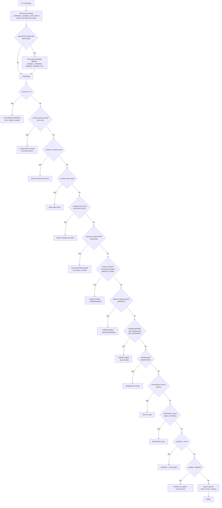
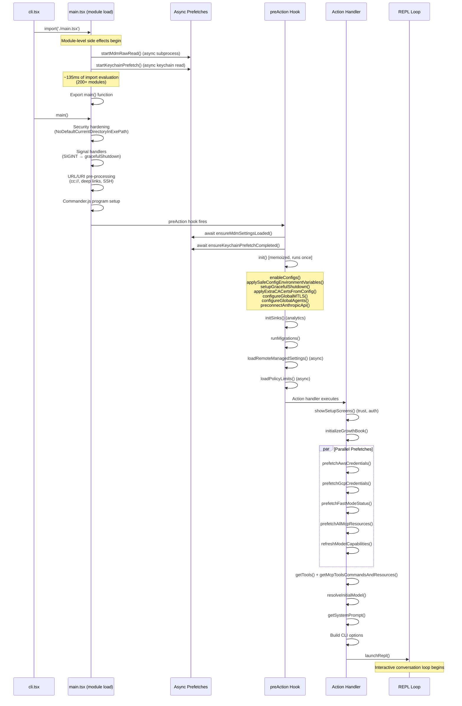
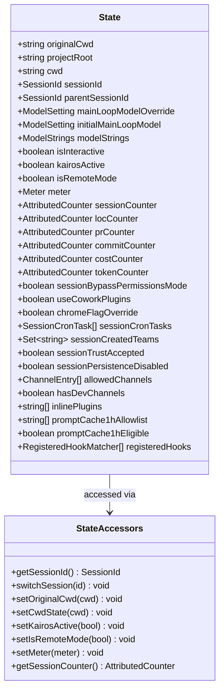
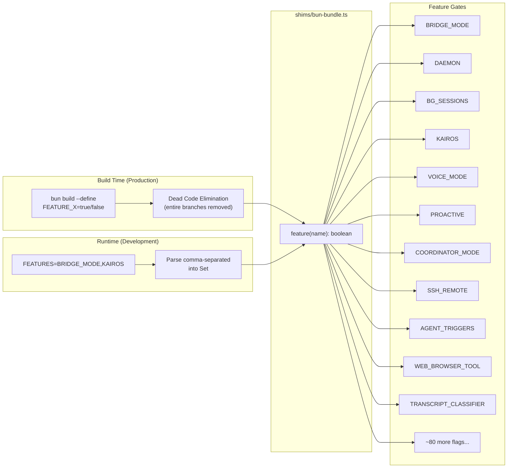
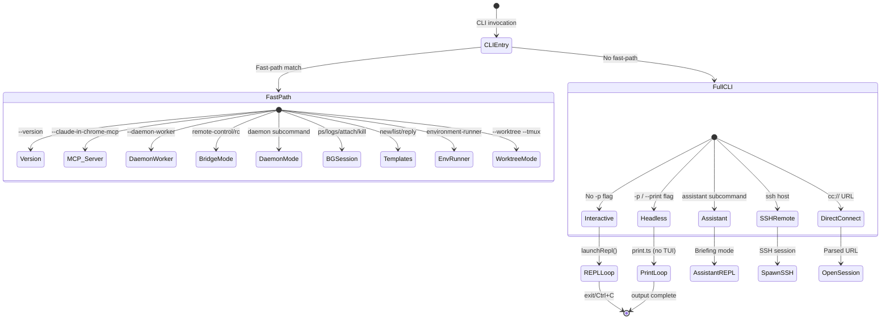
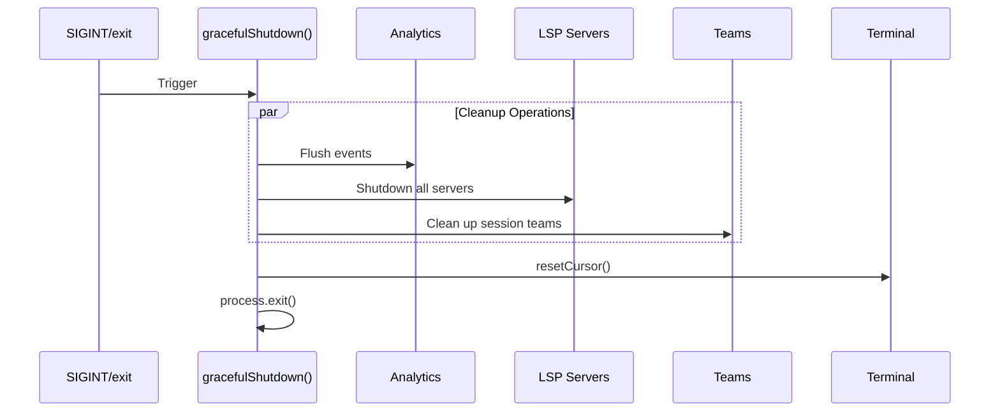

# Startup and Bootstrap

This document traces the complete startup sequence of Claude Code CLI, from the initial process invocation through to the interactive REPL loop. The startup architecture is designed around two core principles: (1) minimize time-to-first-output for trivial operations like `--version`, and (2) maximize parallelism during the heavy initialization path by overlapping I/O-bound work (subprocess spawning, keychain reads, network preconnect) with CPU-bound work (module evaluation, configuration parsing).

## Entry Point Decision Tree

The CLI entry point (`src/entrypoints/cli.tsx`) implements a fast-path routing system that avoids loading the full application for simple operations. This is a critical performance optimization: the full CLI loads over 200 modules (~135ms of import evaluation), so operations that do not need the full application framework bypass it entirely.

### Why Fast-Paths Exist

The fast-path architecture exists because Claude Code serves many different roles beyond the interactive REPL. It can be invoked as an MCP server, a daemon worker, a bridge controller, a background session manager, or simply to print a version string. Each of these roles needs only a fraction of the full module graph. By checking `process.argv` before any heavy imports, the CLI avoids paying the ~135ms module evaluation cost for operations that complete in under 5ms.

The key implementation technique is **dynamic imports**: every fast-path branch uses `await import(...)` to load only the modules it needs. This is in contrast to the full CLI path, which uses static imports at the module level.

### Environment Setup (Lines 1-26)

Before any argument parsing, `cli.tsx` performs two pieces of environment setup at the module's top level (these run as side effects during module evaluation):

```typescript
// Bugfix for corepack auto-pinning, which adds yarnpkg to peoples' package.jsons
process.env.COREPACK_ENABLE_AUTO_PIN = '0';

// Set max heap size for child processes in CCR environments (containers have 16GB)
if (process.env.CLAUDE_CODE_REMOTE === 'true') {
  const existing = process.env.NODE_OPTIONS || '';
  process.env.NODE_OPTIONS = existing
    ? `${existing} --max-old-space-size=8192`
    : '--max-old-space-size=8192';
}
```

The `COREPACK_ENABLE_AUTO_PIN` fix prevents Corepack (Node's built-in package manager shim) from modifying users' `package.json` files when Claude Code spawns yarn/npm subprocesses.

The remote heap size increase is specific to Claude Code Remote (CCR) environments, where containers have 16GB of RAM but Node's default V8 heap limit (~4GB) may be insufficient for large codebases.

### Ablation Baseline (Lines 17-26)

The ablation baseline is an internal experimentation feature that disables advanced capabilities to measure their impact on user outcomes:

```typescript
if (feature('ABLATION_BASELINE') && process.env.CLAUDE_CODE_ABLATION_BASELINE) {
  for (const k of [
    'CLAUDE_CODE_SIMPLE',
    'CLAUDE_CODE_DISABLE_THINKING',
    'DISABLE_INTERLEAVED_THINKING',
    'DISABLE_COMPACT',
    'DISABLE_AUTO_COMPACT',
    'CLAUDE_CODE_DISABLE_AUTO_MEMORY',
    'CLAUDE_CODE_DISABLE_BACKGROUND_TASKS',
  ]) {
    process.env[k] ??= '1';
  }
}
```

This block is placed at the top of `cli.tsx` (not in `init.ts`) because several tools (`BashTool`, `AgentTool`, `PowerShellTool`) capture environment variables like `DISABLE_BACKGROUND_TASKS` into module-level constants at import time. The `init()` function runs after these imports, so setting environment variables there would be too late.

### Fast-Path Routing (Lines 33-299)

The `main()` function in `cli.tsx` implements a cascade of `if` checks, each guarded by both a `feature()` flag check and an argument check. The feature flag check enables build-time dead code elimination (DCE) -- in production builds, the Bun bundler evaluates `feature('BRIDGE_MODE')` as a compile-time constant and removes the entire branch if the flag is false.



### Walk-Through of Key Fast-Paths

**`--version` (zero imports):** The most extreme fast-path. It does not even import the startup profiler. The `MACRO.VERSION` token is replaced at build time by the Bun bundler, so this path performs a single `console.log` and returns. This makes `claude --version` instantaneous.

```typescript
if (args.length === 1 && (args[0] === '--version' || args[0] === '-v' || args[0] === '-V')) {
  console.log(`${MACRO.VERSION} (Claude Code)`);
  return;
}
```

**`--daemon-worker` (lean, no config):** Daemon workers are spawned by the supervisor process and are performance-sensitive. They intentionally skip `enableConfigs()` and analytics sinks to minimize overhead. If a specific worker kind (e.g., the assistant worker) needs config or auth, it calls those functions inside its own `run()` function.

```typescript
if (feature('DAEMON') && args[0] === '--daemon-worker') {
  const { runDaemonWorker } = await import('../daemon/workerRegistry.js');
  await runDaemonWorker(args[1]);
  return;
}
```

**Bridge mode (full auth chain):** The `remote-control` fast-path is more complex than others because it performs authentication, GrowthBook feature gate checks, version validation, and policy limit enforcement before handing off to `bridgeMain()`. The auth check must come first because GrowthBook needs the user context for proper gate evaluation.

**Full CLI fallthrough:** When no fast-path matches, the entry point captures early keyboard input (to buffer keystrokes during the ~135ms import), imports `main.tsx`, and calls `cliMain()`:

```typescript
const { startCapturingEarlyInput } = await import('../utils/earlyInput.js');
startCapturingEarlyInput();
profileCheckpoint('cli_before_main_import');
const { main: cliMain } = await import('../main.js');
profileCheckpoint('cli_after_main_import');
await cliMain();
```

The early input capture is important for perceived responsiveness: users who start typing before the CLI is ready will see their keystrokes appear in the prompt rather than being lost.

## Full Initialization Sequence

When the fast-path check falls through, the full CLI loads via `main.tsx`. This module is the largest in the codebase and orchestrates a complex initialization pipeline designed to overlap I/O-bound work with CPU-bound module evaluation.

### Module-Level Side Effects (Lines 1-209)

The first thing `main.tsx` does at module evaluation time (before any function is called) is fire off asynchronous operations that will be needed later:

```typescript
import { profileCheckpoint, profileReport } from './utils/startupProfiler.js';
profileCheckpoint('main_tsx_entry');

import { startMdmRawRead } from './utils/settings/mdm/rawRead.js';
startMdmRawRead();

import { ensureKeychainPrefetchCompleted, startKeychainPrefetch }
  from './utils/secureStorage/keychainPrefetch.js';
startKeychainPrefetch();
```

These three calls happen before the remaining ~200 import statements. The imports take approximately 135ms to evaluate, and during that time:

- **`startMdmRawRead()`** spawns a subprocess to read Mobile Device Management (MDM) settings. On macOS this runs `plutil`; on Windows it runs registry queries. The results are needed by `ensureMdmSettingsLoaded()` in the `preAction` hook, but by the time that runs, the subprocess has already completed.

- **`startKeychainPrefetch()`** fires both macOS keychain reads (OAuth token and legacy API key) in parallel. Without this prefetch, `applySafeConfigEnvironmentVariables()` would perform these reads sequentially via synchronous spawn, costing approximately 65ms on every macOS startup.

After the side effects, `main.tsx` imports everything else -- React, Commander.js, chalk, lodash utilities, and the full set of application modules. A `profileCheckpoint('main_tsx_imports_loaded')` marker at line 209 records when this completes.

### Conditional Module Loading

Some modules are loaded conditionally based on feature flags, using synchronous `require()` wrapped in ternary expressions for build-time DCE:

```typescript
const coordinatorModeModule = feature('COORDINATOR_MODE')
  ? require('./coordinator/coordinatorMode.js')
  : null;

const assistantModule = feature('KAIROS')
  ? require('./assistant/index.js')
  : null;
```

Other modules use lazy `require()` wrappers to break circular dependencies:

```typescript
const getTeammateUtils = () =>
  require('./utils/teammate.js') as typeof import('./utils/teammate.js');
```

### Anti-Debugging Guard (Lines 232-271)

For external (non-Anthropic) builds, `main.tsx` includes a guard that exits the process if Node.js debugging/inspection is detected:

```typescript
if ("external" !== 'ant' && isBeingDebugged()) {
  process.exit(1);
}
```

The string `"external"` is replaced at build time -- in internal builds it becomes `'ant'`, which makes the check always false. The `isBeingDebugged()` function checks `process.execArgv` for `--inspect` flags, the `NODE_OPTIONS` environment variable, and the `inspector` module's URL.

### The `main()` Function (Lines 585-856)

The exported `main()` function performs security hardening, signal handler registration, URL/URI pre-processing for deep links and SSH sessions, and then delegates to `run()` which sets up Commander.js.



### Walk-Through of the Initialization Stages

**Security hardening:** The very first thing `main()` does is set `process.env.NoDefaultCurrentDirectoryInExePath = '1'`, which on Windows prevents `SearchPath()` from looking in the current directory for executables -- a classic PATH hijacking mitigation.

**Signal handlers:** SIGINT is caught with a handler that calls `gracefulShutdown()` for interactive mode. For `--print` (headless) mode, SIGINT is skipped here because `print.ts` registers its own handler that aborts the in-flight query first.

**URL/URI pre-processing:** Before Commander.js sees the arguments, `main()` rewrites `process.argv` for special invocation patterns:
- `cc://` and `cc+unix://` URLs are parsed and converted to internal subcommands or stashed in `_pendingConnect` for the interactive path.
- `claude assistant [sessionId]` is stashed in `_pendingAssistantChat` and stripped from argv.
- `claude ssh <host> [dir]` is stashed in `_pendingSSH` with extracted flags (`--permission-mode`, `--continue`, `--resume`, `--model`).
- Deep link URIs (`--handle-uri`) bail out early with a dedicated handler.

**Client type determination:** The code determines the session's `clientType` from environment variables and entrypoint detection (e.g., `github-action`, `sdk-typescript`, `sdk-python`, `remote`, or the default `cli`). This affects telemetry tagging and feature gating.

**Early settings loading:** Before `init()` runs, `eagerLoadSettings()` parses `--settings` and `--setting-sources` flags. This ensures settings are available before the first settings read inside `init()`.

### The `preAction` Hook (Lines 907-967)

Commander.js's `preAction` hook runs before any command's action handler, including the default command. Using a hook rather than inline code ensures initialization runs for commands but is skipped for `--help` output.

```typescript
program.hook('preAction', async thisCommand => {
  // Await async subprocess loads started at module evaluation (lines 12-20).
  // Nearly free -- subprocesses complete during the ~135ms of imports above.
  await Promise.all([ensureMdmSettingsLoaded(), ensureKeychainPrefetchCompleted()]);

  await init();

  if (!isEnvTruthy(process.env.CLAUDE_CODE_DISABLE_TERMINAL_TITLE)) {
    process.title = 'claude';
  }

  const { initSinks } = await import('./utils/sinks.js');
  initSinks();

  // Wire up --plugin-dir from top-level program options
  const pluginDir = thisCommand.getOptionValue('pluginDir');
  if (Array.isArray(pluginDir) && pluginDir.length > 0) {
    setInlinePlugins(pluginDir);
    clearPluginCache('preAction: --plugin-dir inline plugins');
  }

  runMigrations();

  // Non-blocking async loads
  void loadRemoteManagedSettings();
  void loadPolicyLimits();
});
```

The `await Promise.all([ensureMdmSettingsLoaded(), ensureKeychainPrefetchCompleted()])` call is "nearly free" -- these awaits resolve immediately because the underlying subprocesses were launched ~135ms ago during module evaluation and have long since completed. The `init()` function is memoized (via lodash `memoize`), so it only runs once even if multiple subcommands trigger the hook.

### The `init()` Function (src/entrypoints/init.ts)

The `init()` function is the core one-time initialization routine. It is memoized so repeated calls are no-ops. It performs configuration validation, environment variable application, network configuration, and system setup:

```typescript
export const init = memoize(async (): Promise<void> => {
  // 1. Enable and validate configuration
  enableConfigs();

  // 2. Apply safe environment variables (before trust dialog)
  applySafeConfigEnvironmentVariables();

  // 3. Apply NODE_EXTRA_CA_CERTS from settings.json
  //    Must happen before any TLS connections (Bun caches the cert store at boot)
  applyExtraCACertsFromConfig();

  // 4. Register graceful shutdown handlers
  setupGracefulShutdown();

  // 5. Initialize 1P event logging (async, non-blocking)
  void Promise.all([
    import('../services/analytics/firstPartyEventLogger.js'),
    import('../services/analytics/growthbook.js'),
  ]).then(([fp, gb]) => {
    fp.initialize1PEventLogging();
    gb.onGrowthBookRefresh(() => {
      void fp.reinitialize1PEventLoggingIfConfigChanged();
    });
  });

  // 6. Initialize remote managed settings loading promise
  if (isEligibleForRemoteManagedSettings()) {
    initializeRemoteManagedSettingsLoadingPromise();
  }
  if (isPolicyLimitsEligible()) {
    initializePolicyLimitsLoadingPromise();
  }

  // 7. Configure mTLS and HTTP proxy agents
  configureGlobalMTLS();
  configureGlobalAgents();

  // 8. Preconnect to Anthropic API (overlap TCP+TLS handshake with action handler work)
  preconnectAnthropicApi();

  // 9. Platform-specific setup (Windows shell, scratchpad directory)
  setShellIfWindows();
  registerCleanup(shutdownLspServerManager);
  registerCleanup(async () => {
    const { cleanupSessionTeams } = await import('../utils/swarm/teamHelpers.js');
    await cleanupSessionTeams();
  });
});
```

The ordering within `init()` is deliberate. CA certificates must be configured before any TLS connection (step 3), graceful shutdown must be registered before any work that needs cleanup (step 4), and proxy agents must be configured before the API preconnect (steps 7-8).

If configuration parsing fails with a `ConfigParseError`, `init()` catches it and either prints a message (non-interactive mode) or shows an interactive Ink dialog (interactive mode). The dialog is dynamically imported to avoid loading React during init.

### Migrations (Lines 323-352)

After `init()`, the `preAction` hook runs `runMigrations()`, which executes a versioned set of synchronous data migrations:

```typescript
const CURRENT_MIGRATION_VERSION = 11;
function runMigrations(): void {
  if (getGlobalConfig().migrationVersion !== CURRENT_MIGRATION_VERSION) {
    migrateAutoUpdatesToSettings();
    migrateBypassPermissionsAcceptedToSettings();
    // ... 8 more migrations ...
    saveGlobalConfig(prev => ({
      ...prev,
      migrationVersion: CURRENT_MIGRATION_VERSION,
    }));
  }
}
```

Migrations are idempotent and version-gated: they only run when the stored `migrationVersion` differs from the code's `CURRENT_MIGRATION_VERSION`. This avoids re-running migrations on every startup. Examples include migrating model name strings (e.g., `sonnet-4-5` to `sonnet-4-6`), moving settings between config keys, and resetting auto-mode opt-in states.

### Deferred Prefetches (Lines 388-431)

After the REPL renders its first frame, `startDeferredPrefetches()` fires background work that is not needed for the initial render but improves first-turn responsiveness:

```typescript
export function startDeferredPrefetches(): void {
  // Skip all deferred work when measuring startup performance or in --bare mode
  if (isEnvTruthy(process.env.CLAUDE_CODE_EXIT_AFTER_FIRST_RENDER) || isBareMode()) {
    return;
  }

  void initUser();
  void getUserContext();
  prefetchSystemContextIfSafe();
  void getRelevantTips();
  void countFilesRoundedRg(getCwd(), AbortSignal.timeout(3000), []);

  void initializeAnalyticsGates();
  void prefetchOfficialMcpUrls();
  void refreshModelCapabilities();

  void settingsChangeDetector.initialize();
  void skillChangeDetector.initialize();
}
```

These prefetches exploit the "user is typing" window -- the time between the REPL appearing and the user submitting their first prompt. By the time the first query fires, user context, system context, git status, file counts, and model capabilities are already cached.

The `prefetchSystemContextIfSafe()` function is security-aware: it only runs git commands (which can execute arbitrary code via hooks and config) after trust has been established through either the trust dialog or implicit trust in non-interactive mode.

## Bootstrap State

The global session state (`src/bootstrap/state.ts`) is a mutable singleton that holds all session-scoped configuration. It is designed as a leaf module in the import DAG -- it has minimal dependencies to avoid circular imports, since nearly every other module in the codebase needs to read or write session state.

### Design Rationale

The state module uses a plain mutable object pattern rather than a more sophisticated state management approach (like a reactive store) for several reasons:

1. **Bootstrap isolation:** The module must be importable during the earliest phases of startup, before React, Ink, or any state management library is loaded.
2. **Circular dependency avoidance:** By keeping the module as a DAG leaf with minimal imports, it can be safely imported from anywhere without creating cycles.
3. **Performance:** Direct property access on a plain object is faster than any reactive proxy or getter/setter pattern.

The file contains prominent warning comments (`// DO NOT ADD MORE STATE HERE - BE JUDICIOUS WITH GLOBAL STATE` and `// AND ESPECIALLY HERE`) reflecting the architectural concern about state sprawl.

### State Initialization

The state singleton is created once at module evaluation time via `getInitialState()`:

```typescript
function getInitialState(): State {
  // Resolve symlinks in cwd to match behavior of shell.ts setCwd
  let resolvedCwd = ''
  if (typeof process !== 'undefined' && typeof process.cwd === 'function') {
    const rawCwd = cwd()
    try {
      resolvedCwd = realpathSync(rawCwd).normalize('NFC')
    } catch {
      // File Provider EPERM on CloudStorage mounts
      resolvedCwd = rawCwd.normalize('NFC')
    }
  }
  const state: State = {
    originalCwd: resolvedCwd,
    projectRoot: resolvedCwd,
    sessionId: randomUUID() as SessionId,
    isInteractive: false,
    kairosActive: false,
    clientType: 'cli',
    allowedSettingSources: [
      'userSettings', 'projectSettings', 'localSettings',
      'flagSettings', 'policySettings',
    ],
    // ... ~80 more fields with defaults ...
  }
  return state
}

const STATE: State = getInitialState()
```

The `cwd` is resolved through `realpathSync` and Unicode NFC-normalized to ensure consistency with how `shell.ts` setCwd works. The `try/catch` handles `EPERM` errors that occur on macOS CloudStorage (iCloud Drive) mounts where `lstat` is called per path component.

### Session Management

Sessions are identified by UUIDs. The `switchSession()` function atomically updates both the session ID and its associated project directory to prevent them from drifting out of sync:

```typescript
export function switchSession(
  sessionId: SessionId,
  projectDir: string | null = null,
): void {
  STATE.planSlugCache.delete(STATE.sessionId)  // Clean up old session
  STATE.sessionId = sessionId
  STATE.sessionProjectDir = projectDir
  sessionSwitched.emit(sessionId)  // Notify listeners (e.g., concurrent session PID file)
}
```

The `sessionSwitched` signal uses a lightweight pub/sub pattern (from `src/utils/signal.ts`) so that modules like `concurrentSessions.ts` can react to session changes without `bootstrap/state.ts` needing to import them.



### Key State Categories

The State type (approximately 90 fields) can be grouped into several categories:

**Session identity:** `sessionId`, `parentSessionId`, `originalCwd`, `projectRoot`, `cwd` -- these define where the session is and its lineage for tracking (e.g., plan mode creates a child session with `parentSessionId` pointing to the parent).

**Model configuration:** `mainLoopModelOverride`, `initialMainLoopModel`, `modelStrings` -- the active model and its display strings, set during startup and potentially overridden by `--model` or settings.

**Telemetry counters:** `meter`, `sessionCounter`, `locCounter`, `prCounter`, `commitCounter`, `costCounter`, `tokenCounter` -- OpenTelemetry metric instruments initialized after trust is granted. The `AttributedCounter` wrapper automatically merges per-call attributes with session-global telemetry attributes.

**Cache latches:** `afkModeHeaderLatched`, `fastModeHeaderLatched`, `cacheEditingHeaderLatched`, `thinkingClearLatched` -- sticky boolean flags that, once activated, remain on for the rest of the session. These prevent mid-session toggles from busting the ~50-70K token prompt cache on the inference server.

**Session-scoped flags:** `sessionBypassPermissionsMode`, `sessionTrustAccepted`, `sessionPersistenceDisabled` -- flags that are never persisted to disk and only last for the current process lifetime.

## Feature Flag System

Feature flags control conditional compilation and runtime behavior. The system has two modes: build-time dead code elimination for production, and runtime environment variable parsing for development.

### Build-Time Mode (Production)

In production builds, the Bun bundler replaces `feature('FLAG_NAME')` calls with literal `true` or `false` values via `--define`. This enables the JavaScript engine's dead code elimination to remove entire code branches:

```typescript
// In source:
if (feature('BRIDGE_MODE') && args[0] === 'remote-control') {
  // bridge code...
}

// After build (if BRIDGE_MODE=false):
if (false && args[0] === 'remote-control') {
  // entire branch removed by DCE
}
```

This means production binaries for external users physically do not contain the code for internal features like `BRIDGE_MODE`, `DAEMON`, or `KAIROS`. The binary size and attack surface are reduced accordingly.

### Runtime Mode (Development)

During development (without the Bun bundler), the shim at `shims/bun-bundle.ts` provides a runtime implementation:

```typescript
const enabledFeatures = new Set(
  (process.env.FEATURES ?? '').split(',').filter(Boolean),
);

export function feature(name: string): boolean {
  return enabledFeatures.has(name);
}
```

Developers enable flags by setting the `FEATURES` environment variable:

```bash
FEATURES=BRIDGE_MODE,VOICE_MODE bun src/entrypoints/cli.tsx
```

Without the `FEATURES` variable, all flags default to `false`, which means the development build runs in the most stripped-down mode. This is intentional: it ensures the development experience mirrors the external production build by default.



### Feature Flag Usage Patterns

Feature flags appear in three distinct patterns throughout the codebase:

1. **Fast-path guards in `cli.tsx`:** `feature('FLAG') && args[0] === 'subcommand'` -- these gate entire operational modes.

2. **Conditional `require()` at module level in `main.tsx`:** `feature('KAIROS') ? require('./assistant/index.js') : null` -- these gate module loading to avoid pulling in unused dependency subgraphs.

3. **Runtime behavior gates:** `if (feature('TRANSCRIPT_CLASSIFIER')) { ... }` inside function bodies -- these gate individual features within shared code paths.

## Operational Modes

Claude Code supports multiple operational modes, each with different initialization requirements. The mode is determined by CLI arguments and environment variables during the fast-path routing phase.



### Mode Characteristics

**Interactive mode** (default): Full TUI with Ink-based React rendering, alt-screen buffer, mouse tracking, keyboard shortcuts, and the complete tool set. This is the heaviest initialization path.

**Headless mode** (`-p`/`--print`): No TUI rendering. Output goes to stdout in text, JSON, or streaming JSON format. The trust dialog is skipped (implicit trust), and SIGINT handling is delegated to `print.ts` rather than the default handler. This mode is designed for scripting and piping.

**SSH Remote mode** (`claude ssh <host>`): The local CLI launches a full interactive TUI but drives a remote Claude Code instance over SSH. The local REPL handles interrupts and permissions while the remote process executes tools.

**Direct Connect mode** (`cc://` URLs): Connects to a pre-existing server session. The URL contains the server address and an optional auth token.

## Environment Variables

The following environment variables influence startup behavior. They are grouped by the phase in which they take effect.

| Variable | Phase | Effect |
|----------|-------|--------|
| `CLAUDE_CODE_REMOTE` | Module load | Increase max heap to 8GB |
| `CLAUDE_CODE_ABLATION_BASELINE` | Module load | Set experiment flags |
| `COREPACK_ENABLE_AUTO_PIN` | Module load | Prevent yarn auto-pinning |
| `CLAUDE_CODE_SIMPLE` | Runtime | Minimal mode (skip hooks, LSP, plugins) |
| `CLAUDE_CODE_PROFILE_STARTUP` | Runtime | Enable startup profiling |
| `FEATURES` | Module load | Enable feature flags (dev mode) |
| `USER_TYPE` | Runtime | `ant` enables internal features |
| `CLAUDE_CODE_DISABLE_TERMINAL_TITLE` | Runtime | Skip process title |
| `API_TIMEOUT_MS` | Runtime | API request timeout |
| `CLAUDE_CODE_MAX_CONTEXT_TOKENS` | Runtime | Override context window size |
| `CLAUDE_CODE_EXTRA_BODY` | Runtime | Extra API request body params |
| `ANTHROPIC_API_KEY` | Runtime | Direct API authentication |
| `ANTHROPIC_CUSTOM_HEADERS` | Runtime | Custom API headers |

## Graceful Shutdown

The graceful shutdown system (`src/utils/gracefulShutdown.ts`) ensures the terminal is left in a clean state and all telemetry/session data is flushed before the process exits. The shutdown sequence is triggered by SIGINT, explicit `process.exit()` calls, or the `signal-exit` library's handlers.

### Shutdown Architecture

The shutdown implementation has several safety mechanisms:

1. **Failsafe timer:** A `setTimeout` (minimum 5 seconds, scaled up for long hook budgets) guarantees the process exits even if cleanup functions hang (e.g., on dead MCP connections).

2. **Terminal cleanup first:** `cleanupTerminalModes()` runs synchronously before any async cleanup. This uses `writeSync(1, ...)` to ensure terminal escape sequences (alt-screen exit, cursor show, mouse tracking disable, Kitty keyboard protocol disable) are flushed even if the event loop is blocked.

3. **Resume hint:** After exiting the alt screen, `printResumeHint()` displays the session ID so the user can resume with `claude --resume <id>`.

4. **Ordered cleanup:** Session persistence (writing the transcript to disk) runs before hooks and analytics, since it is the most critical operation. If the terminal is dead (SSH disconnect, SIGHUP), hooks and analytics may hang on I/O, but session data will already be saved.



### Key Implementation Details

The `setupGracefulShutdown()` function (called from `init()`) registers handlers for uncaught exceptions and unhandled promise rejections, logging them to both diagnostics and Statsig analytics before the process terminates. It uses the `signal-exit` library rather than raw `process.on('exit')` for more reliable cross-platform behavior.

The cleanup registry (`src/utils/cleanupRegistry.ts`) allows any module to register async cleanup functions via `registerCleanup()`. During shutdown, these are all awaited (with a timeout). This is how LSP server shutdown and team cleanup are orchestrated without tight coupling.

## Startup Performance Profiling

The startup profiler tracks 40+ checkpoints with production sampling. It uses the Node.js built-in `performance.mark()` API for timing and has two modes:

- **Sampled logging (production):** 100% of Anthropic users, 0.5% of external users. Checkpoint phase durations are logged to Statsig as the `tengu_startup_phases` event.
- **Detailed profiling:** Enabled by `CLAUDE_CODE_PROFILE_STARTUP=1`. Produces a full timeline report with memory snapshots at each checkpoint, written to `~/.claude/logs/startup-profile-<sessionId>.txt`.

The profiler defines named phases as pairs of checkpoints:

```typescript
const PHASE_DEFINITIONS = {
  import_time:   ['cli_entry', 'main_tsx_imports_loaded'],
  init_time:     ['init_function_start', 'init_function_end'],
  settings_time: ['eagerLoadSettings_start', 'eagerLoadSettings_end'],
  total_time:    ['cli_entry', 'main_after_run'],
} as const;
```



```mermaid
gantt
    title Startup Timeline (Approximate)
    dateFormat X
    axisFormat %L ms

    section cli.tsx
    Environment setup     : 0, 5
    Fast-path checks      : 5, 15
    Import main.tsx       : 15, 20

    section main.tsx (module)
    Start MDM read (async)     : 20, 25
    Start keychain (async)     : 20, 25
    Heavy imports (~135ms)     : 25, 160

    section preAction
    Await MDM + keychain       : 160, 170
    init() - configs           : 170, 185
    init() - network setup     : 185, 200
    init() - API preconnect    : 200, 210
    initSinks()                : 210, 215
    Migrations                 : 215, 220

    section Action Handler
    Setup screens              : 220, 260
    GrowthBook init            : 260, 270
    Parallel prefetches        : 270, 310
    Load tools + MCP           : 310, 350
    System prompt build        : 350, 370
    Launch REPL                : 370, 380
```

The timeline shows that the critical path from CLI invocation to REPL launch is approximately 380ms, with the bulk of time spent in module evaluation (~135ms) and the action handler's setup screens and tool loading (~160ms). The MDM read and keychain prefetches are effectively free because they overlap with module evaluation.

## Source References

| Component | File | Key Lines | Description |
|---|---|---|---|
| Entry point / fast-paths | `src/entrypoints/cli.tsx` | 1-299 | Environment setup, ablation, argument routing, dynamic imports |
| Full CLI bootstrap | `src/main.tsx` | 1-209 | Module-level prefetches, import evaluation, conditional requires |
| `main()` function | `src/main.tsx` | 585-856 | Security hardening, signal handlers, URL rewriting, client type |
| `run()` / Commander setup | `src/main.tsx` | 884-967 | Commander.js program creation, `preAction` hook |
| `init()` function | `src/entrypoints/init.ts` | 57-238 | Memoized initialization: configs, env vars, network, cleanup |
| `initializeTelemetryAfterTrust()` | `src/entrypoints/init.ts` | 247-286 | Deferred telemetry setup after trust grant |
| Bootstrap state singleton | `src/bootstrap/state.ts` | 45-257 | State type definition (~90 fields) |
| State initialization | `src/bootstrap/state.ts` | 260-429 | `getInitialState()` with defaults |
| Session management | `src/bootstrap/state.ts` | 431-498 | `switchSession()`, `regenerateSessionId()`, signal-based notifications |
| Feature flag shim | `shims/bun-bundle.ts` | 1-19 | Runtime `feature()` implementation from `FEATURES` env var |
| Graceful shutdown | `src/utils/gracefulShutdown.ts` | 391-500+ | Failsafe timer, terminal cleanup, ordered async shutdown |
| `setupGracefulShutdown()` | `src/utils/gracefulShutdown.ts` | 270-334 | Signal-exit registration, uncaught exception handlers |
| Startup profiler | `src/utils/startupProfiler.ts` | 1-60 | Phase definitions, sampling rates, checkpoint system |
| Migrations | `src/main.tsx` | 323-352 | Versioned sync migrations with `CURRENT_MIGRATION_VERSION` |
| Deferred prefetches | `src/main.tsx` | 388-431 | Post-first-render background work |
