# Query Engine and API Client

## QueryEngine Overview

The `QueryEngine` (`src/QueryEngine.ts`) is the central orchestrator for conversations with Claude. One instance exists per conversation session, owning message state, usage tracking, and the agentic tool-call loop.

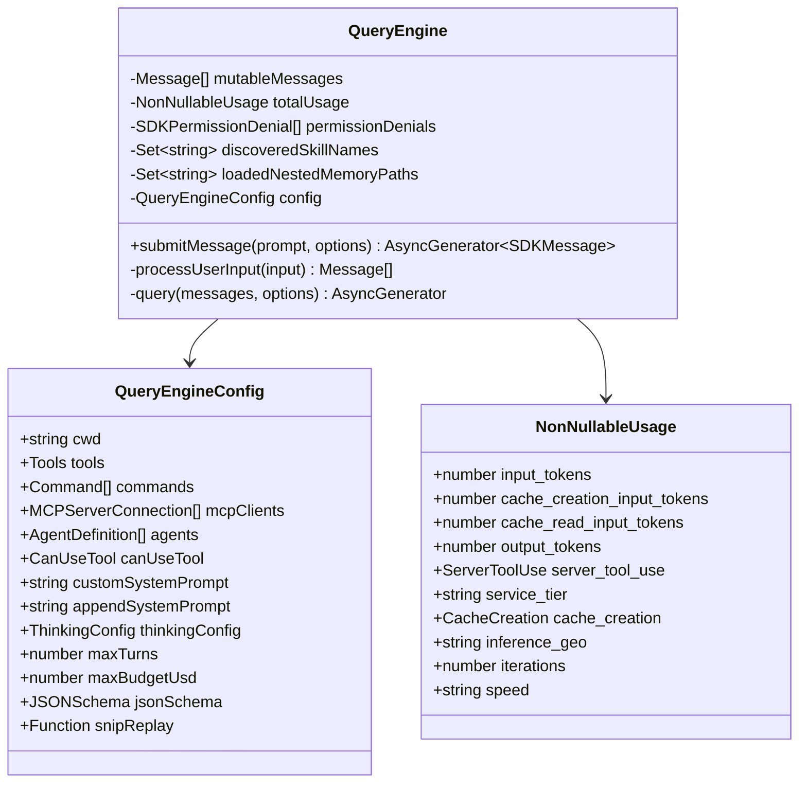

### Class Fields and Their Roles

The `QueryEngine` class maintains several private fields that persist across turns within a single conversation session:

- **`mutableMessages`** -- The authoritative message history for the session. Initialized from `config.initialMessages` (typically empty for new sessions, or pre-populated when resuming). Every assistant response, user input, tool result, compact boundary, and progress event gets pushed here. The array is mutated in-place; on compaction, messages before the boundary are spliced out to release memory (`src/QueryEngine.ts:926-933`).

- **`totalUsage`** -- Accumulates token usage across all API calls in the session. Initialized to `EMPTY_USAGE` (all zeros). Updated on each `message_stop` stream event via `accumulateUsage(totalUsage, currentMessageUsage)`. This tracks input tokens, output tokens, cache creation/read tokens, server tool use counts (web_search, web_fetch), service tier, inference geography, and iteration count.

- **`permissionDenials`** -- Collects every tool invocation that was denied by the permission system. The `canUseTool` callback is wrapped at `submitMessage` entry to intercept non-`allow` results and record them as `SDKPermissionDenial` objects (tool name, tool_use_id, input). These are included in the final result message for SDK callers.

- **`discoveredSkillNames`** -- Tracks which skills were discovered during the current turn (feeds `was_discovered` on skill invocation analytics). Cleared at the start of each `submitMessage()` call to prevent unbounded growth across many SDK turns.

- **`loadedNestedMemoryPaths`** -- Prevents duplicate loading of nested memory files. Persists across turns so the same memory file is not re-attached multiple times in a long session.

- **`readFileState`** -- A `FileStateCache` that tracks the last-known content of files read by tools. Used for detecting file modifications and for generating diffs. Survives across turns so subsequent tool calls can compare against previously-read state.

- **`config`** -- The immutable configuration passed at construction time. Contains tools, commands, MCP clients, agent definitions, permission callbacks, model overrides, budget limits, JSON schema for structured output, and the `snipReplay` callback for feature-gated history snipping.

### How Message State Is Maintained Across Turns

Each `submitMessage()` call represents one "turn" -- a user prompt followed by one or more API round-trips (the agentic loop). State flows across turns through the following mechanism:

1. **Entry:** `discoveredSkillNames` is cleared. The working directory is set via `setCwd(cwd)`.
2. **User input processing:** `processUserInput()` parses the prompt, handles slash commands, and produces `Message[]` which are pushed onto `mutableMessages`.
3. **Query loop:** The `query()` generator from `src/query.ts` receives a snapshot (`[...this.mutableMessages]`) and yields messages as they arrive. Each yielded message is also pushed to `mutableMessages`.
4. **Usage tracking:** Stream events update `currentMessageUsage` (per-message) and `totalUsage` (session-wide).
5. **Exit:** A `result` message is yielded containing final usage, cost, permission denials, and stop reason. The `mutableMessages` array now contains the full conversation history including the latest turn.

Because `mutableMessages` is never replaced (only mutated), subsequent `submitMessage()` calls see all prior messages and can continue the conversation seamlessly.

**Source references:**
- Constructor: `src/QueryEngine.ts:200-207`
- `submitMessage` entry: `src/QueryEngine.ts:209-238`
- Permission denial tracking wrapper: `src/QueryEngine.ts:244-271`
- Query loop consumption: `src/QueryEngine.ts:675-686`
- Usage accumulation: `src/QueryEngine.ts:810-816`
- Final result yield: `src/QueryEngine.ts:1135-1156`

---

## Message Flow

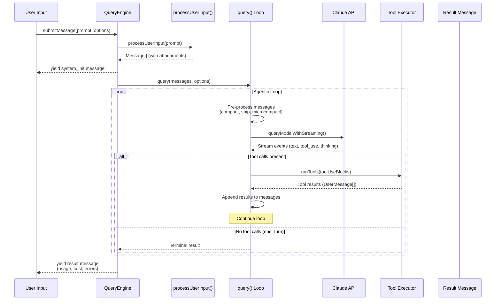

### Detailed Walk-Through: User Input to Response

**Step 1: submitMessage entry** (`src/QueryEngine.ts:209`)

The caller (SDK, REPL, or the one-shot `ask()` wrapper) invokes `submitMessage()` as an async generator. The method destructures the entire `QueryEngineConfig` and begins setup:

```typescript
async *submitMessage(
  prompt: string | ContentBlockParam[],
  options?: { uuid?: string; isMeta?: boolean },
): AsyncGenerator<SDKMessage, void, unknown> {
```

The prompt can be either a plain string or a pre-structured array of content blocks (for multi-modal input).

**Step 2: System prompt assembly** (`src/QueryEngine.ts:284-325`)

The system prompt is fetched and assembled from multiple sources in a deterministic order:
1. `fetchSystemPromptParts()` returns the default system prompt, user context (CLAUDE.md, etc.), and system context.
2. Coordinator context is merged if `COORDINATOR_MODE` is enabled.
3. Memory mechanics prompt is injected when a custom system prompt is set and `CLAUDE_COWORK_MEMORY_PATH_OVERRIDE` is active.
4. The `appendSystemPrompt` (if any) is appended last.

**Step 3: User input processing** (`src/QueryEngine.ts:410-428`)

`processUserInput()` is called with the prompt. This function:
- Parses slash commands (e.g., `/compact`, `/model`, `/clear`)
- Generates attachment messages (file contents, memory files)
- Determines whether an API query is needed (`shouldQuery`)
- Returns any tool allowance overrides (`allowedTools`)
- May return a different model (`modelFromUserInput`) if a `/model` command was run

**Step 4: System init message** (`src/QueryEngine.ts:540-551`)

Before entering the query loop, a `system_init` message is yielded to the caller. This contains the full tool manifest, MCP client list, resolved model, permission mode, commands, agents, skills, plugins, and fast mode state. SDK consumers use this to render their UI.

**Step 5: Local command short-circuit** (`src/QueryEngine.ts:556-639`)

If `shouldQuery` is false (the input was a local-only slash command like `/help` or `/clear`), the engine yields command output as synthetic messages and a `result` without ever calling the API.

**Step 6: The query loop** (`src/QueryEngine.ts:675-686`)

The heart of the engine. The `query()` generator from `src/query.ts` is invoked and consumed via `for await`:

```typescript
for await (const message of query({
  messages,
  systemPrompt,
  userContext,
  systemContext,
  canUseTool: wrappedCanUseTool,
  toolUseContext: processUserInputContext,
  fallbackModel,
  querySource: 'sdk',
  maxTurns,
  taskBudget,
})) {
  // ... dispatch on message.type
}
```

Each yielded message is dispatched through a `switch` statement that handles: `assistant`, `user`, `stream_event`, `attachment`, `system`, `progress`, `tool_use_summary`, `tombstone`, and `stream_request_start`.

**Step 7: Result extraction** (`src/QueryEngine.ts:1058-1156`)

After the query loop terminates, the engine extracts the final result from the last assistant or user message, checks for errors, flushes session storage, and yields the terminal `result` message with complete metrics.

---

## API Client Architecture

The API client (`src/services/api/client.ts`) supports multiple authentication providers:

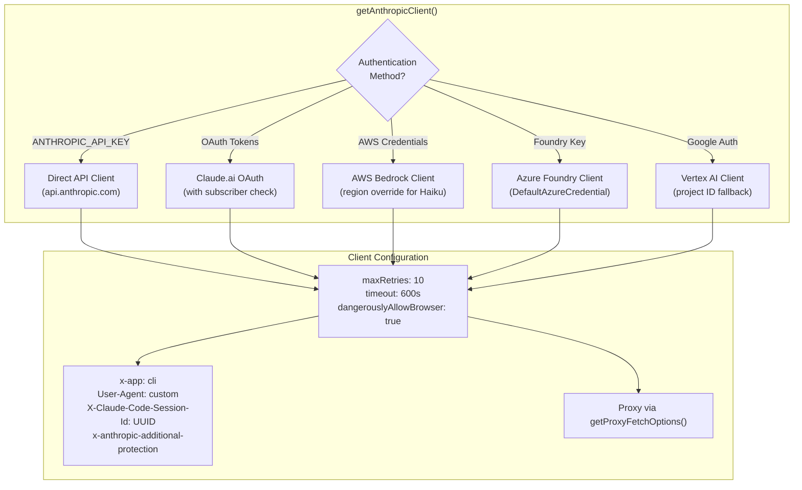

### Client Factory Details

The `getAnthropicClient()` function (`src/services/api/client.ts:88-250`) creates an `Anthropic` SDK instance configured for the detected provider. The provider is determined by environment variables in a priority order:

1. **`CLAUDE_CODE_USE_BEDROCK`** -- Creates an `AnthropicBedrock` client. Supports regional overrides (`ANTHROPIC_SMALL_FAST_MODEL_AWS_REGION` for Haiku), bearer token auth (`AWS_BEARER_TOKEN_BEDROCK`), and automatic credential refresh via `refreshAndGetAwsCredentials()`.

2. **`CLAUDE_CODE_USE_FOUNDRY`** -- Creates an `AnthropicFoundry` client for Azure. Supports API key auth (`ANTHROPIC_FOUNDRY_API_KEY`) and Azure AD token provider (`DefaultAzureCredential`).

3. **`CLAUDE_CODE_USE_VERTEX`** -- Creates an `AnthropicVertex` client. Uses `google-auth-library` for authentication with project ID from `ANTHROPIC_VERTEX_PROJECT_ID` and region-specific endpoints.

4. **Claude.ai OAuth** -- When `isClaudeAISubscriber()` returns true, the client authenticates via OAuth tokens managed by the keychain. OAuth token refresh is handled automatically.

5. **Direct API** -- Default path using `ANTHROPIC_API_KEY` or the API key helper subprocess.

Every client shares a common configuration:
- `maxRetries` is set to 0 at the SDK level (retries are handled by `withRetry` instead)
- `timeout` defaults to 600 seconds (overridable via `API_TIMEOUT_MS`)
- `dangerouslyAllowBrowser: true` because the CLI can run in browser-like environments
- Custom headers include session tracking, container ID for remote sessions, and optional additional protection headers

```typescript
const ARGS = {
  defaultHeaders,
  maxRetries,
  timeout: parseInt(process.env.API_TIMEOUT_MS || String(600 * 1000), 10),
  dangerouslyAllowBrowser: true,
  fetchOptions: getProxyFetchOptions({ forAnthropicAPI: true }),
  ...(resolvedFetch && { fetch: resolvedFetch }),
}
```

**Source reference:** `src/services/api/client.ts:88-250`

---

## Streaming Implementation

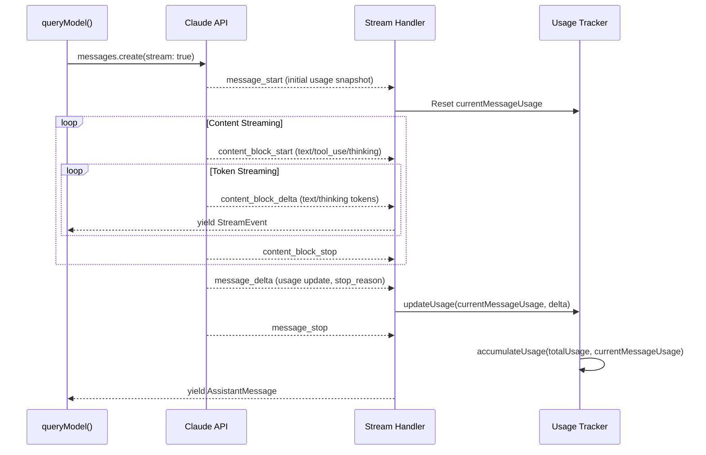

### Stream Event Types and UI Mapping

The streaming implementation (`src/services/api/claude.ts:1017-2200+`) uses the Anthropic SDK's raw streaming interface rather than `BetaMessageStream` to avoid O(n^2) partial JSON parsing overhead:

```typescript
const result = await anthropic.beta.messages
  .create(
    { ...params, stream: true },
    { signal, ...(clientRequestId && { headers: { ... } }) },
  )
  .withResponse()
```

The raw stream produces `BetaRawMessageStreamEvent` objects, which are handled in a `for await` loop with the following event types:

| Event Type | Action | UI Effect |
|---|---|---|
| `message_start` | Captures `partialMessage`, initializes usage from `message.usage`, records TTFB | Session metadata update |
| `content_block_start` | Creates entry in `contentBlocks[]` array. Handles `tool_use`, `server_tool_use`, `text`, `thinking`, `connector_text` | New block appears in output |
| `content_block_delta` | Appends to the appropriate content block: `text_delta` to text, `thinking_delta` to thinking, `input_json_delta` to tool input, `signature_delta` to thinking signature | Live text/thinking streaming |
| `content_block_stop` | Finalizes the block. Creates an `AssistantMessage` with `normalizeContentFromAPI()` applied. JSON tool inputs are parsed. The message is yielded. | Block finalization, tool input complete |
| `message_delta` | Updates usage via `updateUsage()`. Captures `stop_reason` and `stop_sequence`. Records cost via `addToTotalSessionCost()`. | Cost counter update |
| `message_stop` | Fires `logAPISuccessAndDuration()`. Extracts quota status from response headers. | Final metrics logging |

The content block accumulation is manual -- the code maintains a `contentBlocks[]` array indexed by `part.index`, and each delta appends to the corresponding block. Tool use inputs arrive as `input_json_delta` events containing `partial_json` fragments that are concatenated into a string, then parsed as JSON at `content_block_stop` time.

### Stream Idle Watchdog

A configurable watchdog detects hung streams when no chunks arrive within `CLAUDE_STREAM_IDLE_TIMEOUT_MS` (default 90 seconds). A warning fires at the halfway mark. The watchdog calls `releaseStreamResources()` to cancel the stream and release native TLS/socket buffers. This is critical because the SDK's request timeout only covers the initial fetch, not the streaming body.

```typescript
function resetStreamIdleTimer(): void {
  clearStreamIdleTimers()
  if (!streamWatchdogEnabled) return
  streamIdleWarningTimer = setTimeout(/* ... */, STREAM_IDLE_WARNING_MS)
  streamIdleTimer = setTimeout(() => {
    streamIdleAborted = true
    releaseStreamResources()
  }, STREAM_IDLE_TIMEOUT_MS)
}
```

**Source references:**
- `queryModel()`: `src/services/api/claude.ts:1017-1027`
- Stream event handling: `src/services/api/claude.ts:1979-2170`
- Watchdog: `src/services/api/claude.ts:1874-1928`

### Why AsyncGenerator for Streaming

The entire query pipeline -- from `QueryEngine.submitMessage()` through `query()` to `queryModel()` -- uses `AsyncGenerator` as its return type. This design choice is deliberate:

1. **Backpressure:** Generators naturally implement backpressure. The consumer controls the pace by calling `.next()`. If the SDK consumer slows down, the producer pauses at each `yield`.

2. **Lazy evaluation:** Stream events, assistant messages, tool results, and system messages are all yielded as they arrive. There is no buffering of the full response before delivery.

3. **Composability:** The `yield*` operator allows generators to delegate seamlessly. `QueryEngine.submitMessage()` delegates to `query()`, which delegates to `queryModelWithStreaming()`, which delegates to `withRetry()`. Each layer can inject its own yields (error messages, compact boundaries, progress updates) without breaking the pipeline.

4. **Resource cleanup:** When the consumer calls `.return()` (e.g., on abort), the generator's `finally` block runs, allowing resource cleanup (stream cancellation, timer clearing, file handle closing).

5. **Type safety across layers:** Each generator declares its yield type, allowing TypeScript to enforce that every producer yields compatible message types:

```typescript
// query.ts
async function* queryLoop(...): AsyncGenerator<
  StreamEvent | RequestStartEvent | Message | TombstoneMessage | ToolUseSummaryMessage,
  Terminal
>

// claude.ts
async function* queryModel(...): AsyncGenerator<
  StreamEvent | AssistantMessage | SystemAPIErrorMessage,
  void
>
```

---

## Tool Call Loop State Machine

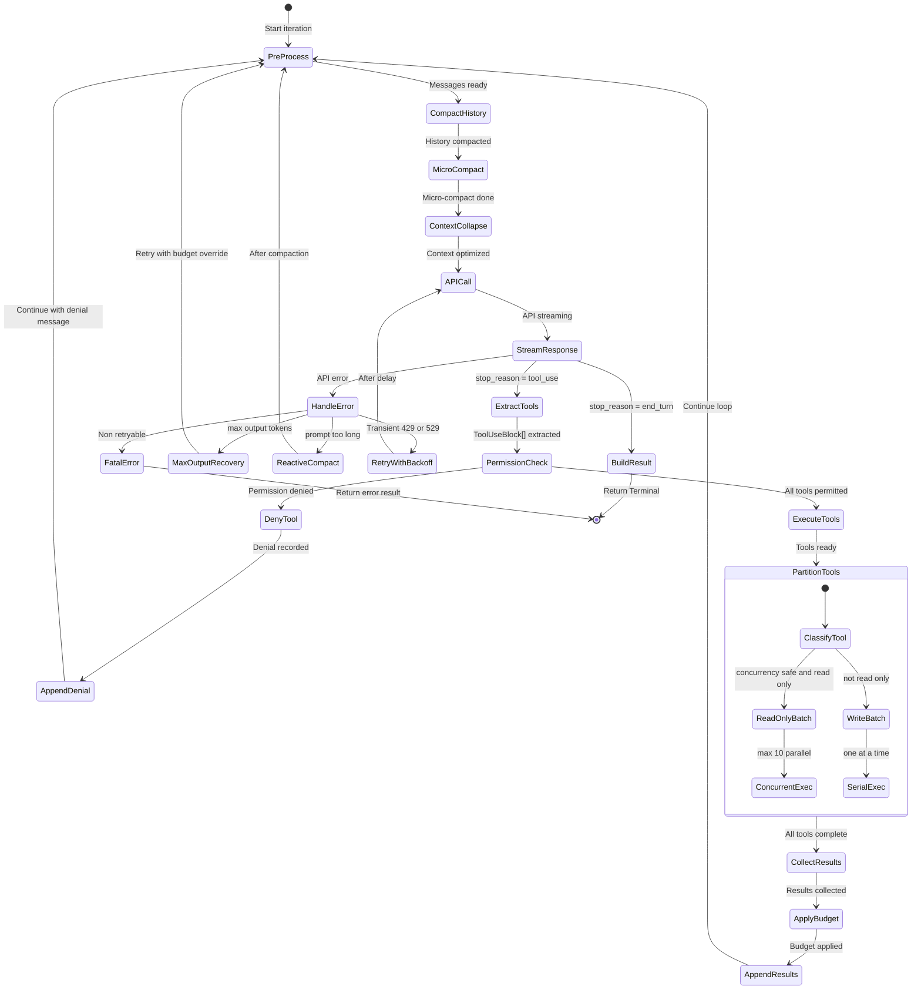

### State Machine Transitions in Detail

The agentic loop lives in `queryLoop()` (`src/query.ts:241`), an infinite `while (true)` loop with explicit `return` for terminal states and `state = { ... }` assignments at each `continue` site. The loop carries mutable state in a `State` object:

```typescript
type State = {
  messages: Message[]
  toolUseContext: ToolUseContext
  autoCompactTracking: AutoCompactTrackingState | undefined
  maxOutputTokensRecoveryCount: number
  hasAttemptedReactiveCompact: boolean
  maxOutputTokensOverride: number | undefined
  pendingToolUseSummary: Promise<ToolUseSummaryMessage | null> | undefined
  stopHookActive: boolean | undefined
  turnCount: number
  transition: Continue | undefined
}
```

**PreProcess Phase:**

Each iteration begins with several context management passes applied in order:

1. **Tool result budget** -- `applyToolResultBudget()` enforces per-message size limits on tool results. Runs before microcompact because cached MC operates purely by `tool_use_id`.

2. **Snip compaction** (`HISTORY_SNIP` feature) -- `snipCompactIfNeeded()` removes old messages based on token thresholds. Returns `tokensFreed` for downstream threshold adjustments.

3. **Microcompact** -- `deps.microcompact()` summarizes old tool results in-place to reduce token count without losing the message structure. Operates per-message rather than across the whole history.

4. **Context collapse** (`CONTEXT_COLLAPSE` feature) -- `applyCollapsesIfNeeded()` projects a collapsed view of the history using a commit-log architecture. Runs before autocompact so that if collapse brings tokens below threshold, autocompact is skipped and granular context is preserved.

5. **Autocompact** -- `deps.autocompact()` triggers full conversation summarization when token usage exceeds `effective_window - 13K`. See the Context Compaction section for details.

**API Call Phase:**

The prepared messages are passed to `queryModelWithStreaming()` via `deps.callModel()`. The call includes user context (prepended via `prependUserContext()`), the assembled system prompt, thinking config, tools, and the abort signal.

**Tool Extraction and Partition:**

When the streaming response contains `tool_use` blocks, they are collected into `toolUseBlocks[]`. After streaming completes, the `runTools()` generator from `src/services/tools/toolOrchestration.ts` handles execution.

The partitioning algorithm (`partitionToolCalls()` at `src/services/tools/toolOrchestration.ts:91-116`) splits tool calls into batches:

```typescript
function partitionToolCalls(
  toolUseMessages: ToolUseBlock[],
  toolUseContext: ToolUseContext,
): Batch[] {
  return toolUseMessages.reduce((acc: Batch[], toolUse) => {
    const tool = findToolByName(toolUseContext.options.tools, toolUse.name)
    const parsedInput = tool?.inputSchema.safeParse(toolUse.input)
    const isConcurrencySafe = parsedInput?.success
      ? (() => {
          try {
            return Boolean(tool?.isConcurrencySafe(parsedInput.data))
          } catch {
            return false
          }
        })()
      : false
    if (isConcurrencySafe && acc[acc.length - 1]?.isConcurrencySafe) {
      acc[acc.length - 1]!.blocks.push(toolUse)
    } else {
      acc.push({ isConcurrencySafe, blocks: [toolUse] })
    }
    return acc
  }, [])
}
```

Each tool defines an `isConcurrencySafe(input)` method. If the parsed input validates and the method returns true, the tool is batched with other consecutive concurrency-safe tools for parallel execution. Otherwise, it gets its own serial batch.

**Concurrent Execution** (`runToolsConcurrently` at `src/services/tools/toolOrchestration.ts:152-177`):

Read-only tools run in parallel using the `all()` utility with a configurable concurrency limit (default 10, overridable via `CLAUDE_CODE_MAX_TOOL_USE_CONCURRENCY`):

```typescript
async function* runToolsConcurrently(...) {
  yield* all(
    toolUseMessages.map(async function* (toolUse) {
      yield* runToolUse(toolUse, assistantMessage, canUseTool, toolUseContext)
      markToolUseAsComplete(toolUseContext, toolUse.id)
    }),
    getMaxToolUseConcurrency(),
  )
}
```

Context modifiers from concurrent tools are queued and applied after all tools in the batch complete, preserving deterministic context state.

**Serial Execution** (`runToolsSerially` at `src/services/tools/toolOrchestration.ts:118-150`):

Write tools execute one at a time. Each tool's context modifiers are applied immediately, so subsequent tools in the serial batch see the updated context.

**Error Recovery Transitions:**

- **max_output_tokens**: The `maxOutputTokensRecoveryCount` is incremented (capped at `MAX_OUTPUT_TOKENS_RECOVERY_LIMIT = 3`). The loop continues with `ESCALATED_MAX_TOKENS` override.
- **prompt_too_long**: Reactive compact is attempted (if enabled and not yet tried). On success, the loop continues with compacted messages. On failure, a fatal error is returned.
- **429/529**: Handled by `withRetry` inside `queryModel()`. The loop itself only sees the final result or a `CannotRetryError`.

**Source references:**
- `queryLoop()`: `src/query.ts:241-307`
- Partitioning: `src/services/tools/toolOrchestration.ts:91-116`
- Concurrent execution: `src/services/tools/toolOrchestration.ts:152-177`
- Serial execution: `src/services/tools/toolOrchestration.ts:118-150`
- `runTools()` orchestration: `src/services/tools/toolOrchestration.ts:19-82`

---

## Retry Logic

The retry system (`src/services/api/withRetry.ts`) handles transient failures with provider-specific strategies:

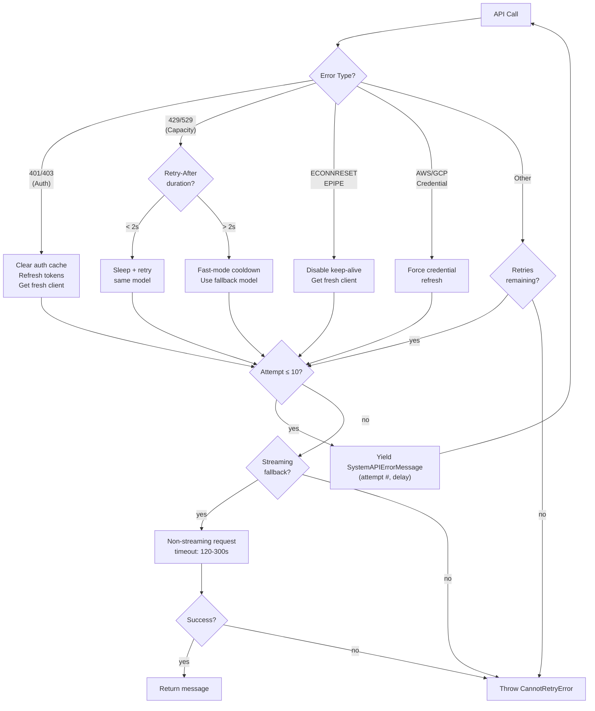

### Error Classification and Recovery Strategies

The `withRetry()` function (`src/services/api/withRetry.ts:170-517`) is an async generator that wraps each API call attempt. It classifies errors and applies specific recovery strategies:

**Authentication Errors (401/403):**

```typescript
if (
  client === null ||
  (lastError instanceof APIError && lastError.status === 401) ||
  isOAuthTokenRevokedError(lastError) ||
  isBedrockAuthError(lastError) ||
  isVertexAuthError(lastError) ||
  isStaleConnection
) {
  if ((lastError instanceof APIError && lastError.status === 401) ||
      isOAuthTokenRevokedError(lastError)) {
    const failedAccessToken = getClaudeAIOAuthTokens()?.accessToken
    if (failedAccessToken) {
      await handleOAuth401Error(failedAccessToken)
    }
  }
  client = await getClient()
}
```

On 401 or "token revoked" 403, the system forces an OAuth token refresh, clears cached API keys, then creates a fresh client. For Bedrock, both credential provider errors and 403s trigger AWS credential refresh. For Vertex, GCP credential refresh is attempted.

**Capacity Errors (429/529):**

The system distinguishes between foreground and background query sources. Background tasks (summaries, titles, memory extraction) bail immediately on 529 to avoid amplifying capacity cascades:

```typescript
const FOREGROUND_529_RETRY_SOURCES = new Set<QuerySource>([
  'repl_main_thread', 'sdk', 'agent:custom', 'agent:default',
  'agent:builtin', 'compact', 'hook_agent', 'hook_prompt',
  'verification_agent', 'side_question', 'auto_mode', /* ... */
])
```

For foreground sources with fast mode active, the system checks the `Retry-After` header:
- **Short delay (< 2 seconds):** Sleep and retry with fast mode still active to preserve the prompt cache (same model name on retry).
- **Long delay (>= 2 seconds) or unknown:** Enter fast-mode cooldown (switches to standard speed model) with a minimum floor to avoid flip-flopping.

After `MAX_529_RETRIES = 3` consecutive 529 errors, a `FallbackTriggeredError` is thrown if a fallback model is configured. This allows the caller to retry with a different model (typically Sonnet when Opus is overloaded).

**Connection Errors (ECONNRESET/EPIPE):**

Stale keep-alive sockets are detected via `extractConnectionErrorDetails()`. When found, `disableKeepAlive()` is called to prevent connection pooling, and a fresh client is created.

**Context Overflow (400):**

A special parser (`parseMaxTokensContextOverflowError()`) extracts the input token count and context limit from the error message. The retry context's `maxTokensOverride` is adjusted to `contextLimit - inputTokens - 1000 (safety buffer)`, floored at `FLOOR_OUTPUT_TOKENS = 3000`.

**Backoff Calculation:**

```typescript
export function getRetryDelay(
  attempt: number,
  retryAfterHeader?: string | null,
  maxDelayMs = 32000,
): number {
  if (retryAfterHeader) {
    const seconds = parseInt(retryAfterHeader, 10)
    if (!isNaN(seconds)) return seconds * 1000
  }
  const baseDelay = Math.min(BASE_DELAY_MS * Math.pow(2, attempt - 1), maxDelayMs)
  const jitter = Math.random() * 0.25 * baseDelay
  return baseDelay + jitter
}
```

The delay uses exponential backoff (base 500ms, doubling each attempt, max 32 seconds) with 25% jitter. Server-provided `Retry-After` headers override the calculated delay.

**Persistent Retry Mode:**

For unattended sessions (`CLAUDE_CODE_UNATTENDED_RETRY`), 429/529 errors are retried indefinitely with higher backoff (max 5 minutes) and periodic keep-alive yields every 30 seconds so the host does not mark the session idle. Long waits are chunked so the host sees periodic stdout activity:

```typescript
let remaining = delayMs
while (remaining > 0) {
  if (options.signal?.aborted) throw new APIUserAbortError()
  yield createSystemAPIErrorMessage(error, remaining, reportedAttempt, maxRetries)
  const chunk = Math.min(remaining, HEARTBEAT_INTERVAL_MS)
  await sleep(chunk, options.signal, { abortError })
  remaining -= chunk
}
```

**Source references:**
- `withRetry()`: `src/services/api/withRetry.ts:170-517`
- `getRetryDelay()`: `src/services/api/withRetry.ts:530-548`
- `CannotRetryError`: `src/services/api/withRetry.ts:144-158`
- `FallbackTriggeredError`: `src/services/api/withRetry.ts:160-168`
- Foreground source set: `src/services/api/withRetry.ts:62-82`

### The Retry-by-Source Strategy Rationale

The decision to differentiate retry behavior by query source is a deliberate capacity-protection measure. During an overload event (529), every retry from a background task amplifies the load on the API gateway. Since background tasks like title generation, memory extraction, and conversation summaries are non-blocking for the user, immediately dropping them on 529 reduces gateway amplification by an estimated 3-10x per retry. Foreground tasks (user-initiated queries, sub-agents, security classifiers) receive full retry treatment because the user is actively waiting and the failure would be visible.

### Retry by Query Source

| Query Source | Retries 529? | Background? | Notes |
|-------------|-------------|-------------|-------|
| `repl_main_thread*` | Yes | No | User-blocking, full retry |
| `sdk` | Yes | No | Programmatic, full retry |
| `agent:*` | Yes | No | Sub-agent work |
| `verification_agent` | Yes | No | Critical verification |
| `auto_mode` | Yes | No | Security classifier |
| `summaries` | No | Yes | Non-critical background |
| `titles` | No | Yes | Non-critical background |
| `extract_memories` | No | Yes | Non-critical background |

---

## API Request Construction

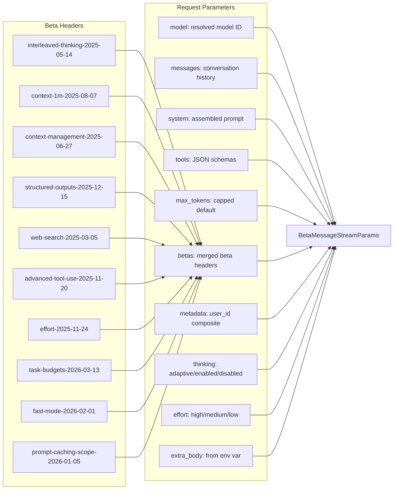

### Request Parameter Assembly

The `paramsFromContext()` closure (`src/services/api/claude.ts:1538-1729`) builds the final `BetaMessageStreamParams` for each API call attempt. It receives a `RetryContext` containing the current model, thinking config, and any max-tokens override from a previous failure:

**Model Resolution:** The model string is normalized for the API via `normalizeModelStringForAPI()`. For Bedrock inference profiles, the backing model is resolved asynchronously.

**Messages:** The conversation history is passed through `addCacheBreakpoints()` which inserts `cache_control` markers on the last content block of the last two messages (user and assistant). These markers enable prompt caching so the API can skip re-processing unchanged prefix tokens.

**System Prompt:** The system prompt is split into an array of `TextBlockParam` blocks. The last block receives a `cache_control` marker for prompt caching. A `scope: 'global'` annotation is added when global cache is eligible (no MCP tools that would make it user-specific).

**Tools:** Tool schemas are built via `toolToAPISchema()` and include `defer_loading: true` for tools that should not be loaded until discovered via `ToolSearchTool`. Extra tool schemas (like the advisor server tool) are appended after the main tool list to minimize cache churn.

**Beta Headers:** Beta headers are session-sticky ("latched"). Once a beta header is first sent, it continues being sent for the rest of the session to avoid changing the server-side cache key. Latching state is stored in `src/bootstrap/state.ts`. The latching logic for each header:

- **Fast mode:** Latched on first fast-mode request. The `speed='fast'` parameter remains dynamic so cooldown can suppress it without changing the cache key.
- **AFK mode:** Latched when auto mode is first activated (transcript classifier). Only sent on agentic queries.
- **Cache editing:** Latched when cached microcompact is first enabled. Only for first-party main-thread queries.
- **Thinking clear:** Latched when the last API completion was more than 1 hour ago (to clear stale thinking caches).

**Thinking Configuration:**

```typescript
if (hasThinking && modelSupportsThinking(options.model)) {
  if (!isEnvTruthy(process.env.CLAUDE_CODE_DISABLE_ADAPTIVE_THINKING) &&
      modelSupportsAdaptiveThinking(options.model)) {
    thinking = { type: 'adaptive' }
  } else {
    let thinkingBudget = getMaxThinkingTokensForModel(options.model)
    // ...
    thinking = { budget_tokens: thinkingBudget, type: 'enabled' }
  }
}
```

Models that support adaptive thinking (Claude 4.6+) use `type: 'adaptive'` which lets the model decide when to think. Older models use `type: 'enabled'` with an explicit budget.

**Source reference:** `src/services/api/claude.ts:1538-1729`

### Why Separate query() and submitMessage()

The separation between `QueryEngine.submitMessage()` and the `query()` generator in `src/query.ts` serves distinct architectural purposes:

- **`submitMessage()`** owns the session lifecycle: user input parsing, transcript persistence, message acknowledgment, usage tracking, budget enforcement, structured output retries, and the final result message. It is the SDK/REPL-facing interface.

- **`query()`** owns the agentic loop: context management (compact, snip, microcompact, collapse), API call orchestration, tool execution, error recovery, and the streaming tool executor. It is a pure generator with no knowledge of SDK protocols or session storage.

This separation means `query()` can be tested in isolation, reused by different entry points (SDK headless, REPL interactive, one-shot `ask()`), and composed with different session management strategies. The `QueryEngine` wraps it with session semantics.

---

## Thinking Mode Configuration

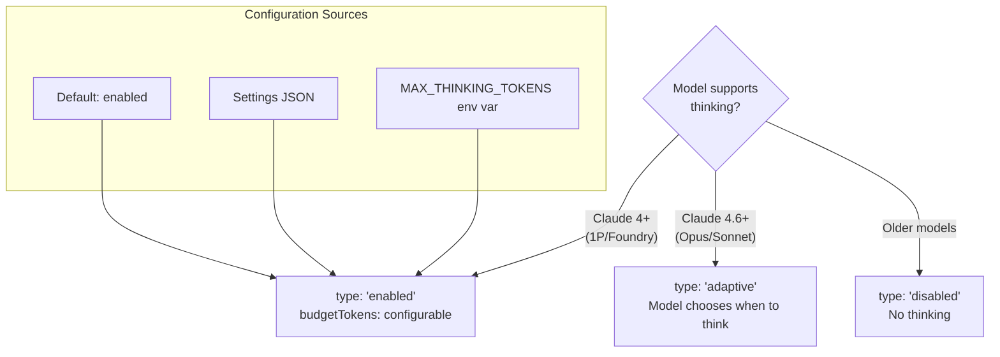

### Thinking Mode Details

The thinking configuration follows a strict selection hierarchy (`src/services/api/claude.ts:1596-1630`):

1. If thinking is globally disabled (`CLAUDE_CODE_DISABLE_THINKING` env var), `thinking` is not set.
2. If the model does not support thinking (`modelSupportsThinking()` returns false), `thinking` is not set.
3. If the model supports adaptive thinking and it is not disabled via `CLAUDE_CODE_DISABLE_ADAPTIVE_THINKING`, the mode is `{ type: 'adaptive' }` with no budget -- the model decides autonomously.
4. Otherwise, `{ type: 'enabled', budget_tokens: N }` is used where N comes from (in priority order):
   - `ThinkingConfig.budgetTokens` if explicitly set
   - `getMaxThinkingTokensForModel(model)` default for the model
   - Clamped to `maxOutputTokens - 1` to ensure at least 1 output token

The comment in source is notably cautious: "IMPORTANT: Do not change the adaptive-vs-budget thinking selection below without notifying the model launch DRI and research. This is a sensitive setting that can greatly affect model quality and bashing."

---

## Token Counting and Cost Tracking

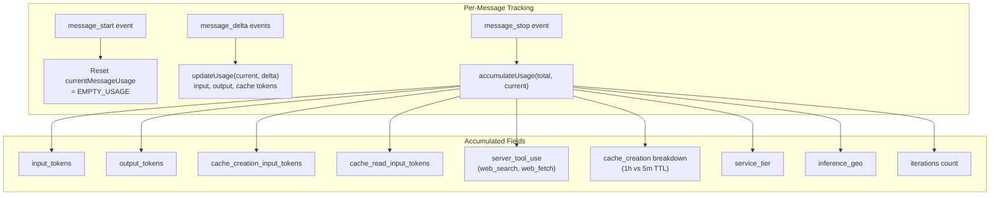

### Token Counting Architecture

Token counting operates at two levels:

**Per-message level** (inside `QueryEngine.submitMessage()` at `src/QueryEngine.ts:788-816`):

The `currentMessageUsage` variable is reset on each `message_start` event and updated on `message_delta`. The `updateUsage()` function (`src/services/api/claude.ts:2924-2990`) performs a "last-wins" merge: each field from the delta replaces the current value only if the delta value is non-null and greater than zero:

```typescript
export function updateUsage(
  usage: Readonly<NonNullableUsage>,
  partUsage: BetaMessageDeltaUsage | undefined,
): NonNullableUsage {
  if (!partUsage) return { ...usage }
  return {
    input_tokens:
      partUsage.input_tokens !== null && partUsage.input_tokens > 0
        ? partUsage.input_tokens
        : usage.input_tokens,
    // ... same pattern for all fields
  }
}
```

This "last-wins" approach is necessary because the API sends usage snapshots, not deltas. The `message_start` event contains the initial input token count, and `message_delta` contains the final counts including output tokens.

**Session level** (inside `QueryEngine.submitMessage()` at `src/QueryEngine.ts:810-816`):

On `message_stop`, the per-message usage is accumulated into `totalUsage` via `accumulateUsage()` (`src/services/api/claude.ts:2993-3040`), which performs additive merging:

```typescript
export function accumulateUsage(
  totalUsage: Readonly<NonNullableUsage>,
  messageUsage: Readonly<NonNullableUsage>,
): NonNullableUsage {
  return {
    input_tokens: totalUsage.input_tokens + messageUsage.input_tokens,
    output_tokens: totalUsage.output_tokens + messageUsage.output_tokens,
    // ... additive for all token fields
    service_tier: messageUsage.service_tier, // Use the most recent
    inference_geo: messageUsage.inference_geo || totalUsage.inference_geo,
    iterations: totalUsage.iterations + messageUsage.iterations,
  }
}
```

Non-additive fields (`service_tier`, `inference_geo`, `speed`) use the most recent value. The `iterations` count tracks how many API round-trips have occurred (useful for rate limiting and analytics).

**Cost Tracking:**

USD cost is computed per-message in `queryModel()` via `calculateUSDCost()` and accumulated via `addToTotalSessionCost()` in the cost-tracker module (`src/cost-tracker.ts`). The final cost is reported in the result message as `total_cost_usd`.

---

## Message Types

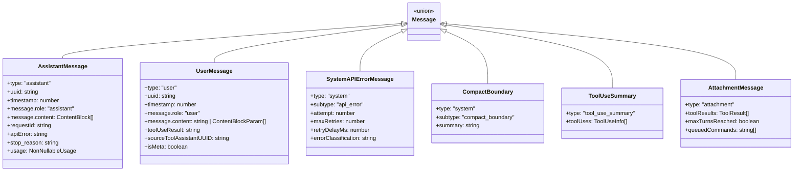

### Message Type Details

The `Message` union type (`src/types/message.ts`) represents every possible message in the conversation array. Key subtleties:

- **UserMessage** has several boolean flags: `isMeta` marks synthetic messages (caveats, tool discovery announcements) that should not be displayed as user input. `toolUseResult` contains the text result of a tool execution. `sourceToolAssistantUUID` links back to the assistant message that requested the tool call.

- **AssistantMessage** carries both the API response content and metadata. The `requestId` links to the server-side request for debugging. `apiError` is set when the message represents an error (e.g., `'max_output_tokens'`, `'invalid_request'`). Content blocks can be `text`, `tool_use`, `thinking`, `redacted_thinking`, `server_tool_use`, or `connector_text`.

- **SystemAPIErrorMessage** is yielded by `withRetry` on each retry attempt. It carries the attempt number, max retries, delay in milliseconds, and the classified error. These messages appear in the SDK stream as `api_retry` events so consumers can show retry status.

- **CompactBoundary** marks the point in history where compaction occurred. Messages before this boundary are discarded. The `compactMetadata` includes the summary text, preserved segment info, and the pre/post token counts.

- **TombstoneMessage** is a control signal emitted when messages must be removed (e.g., orphaned streaming fragments after a non-streaming fallback). The UI removes the referenced message from display.

- **AttachmentMessage** carries file attachments, memory content, structured output results, max-turns-reached signals, and queued command prompts.

---

## Context Compaction

When the conversation approaches the context window limit, automatic compaction kicks in:

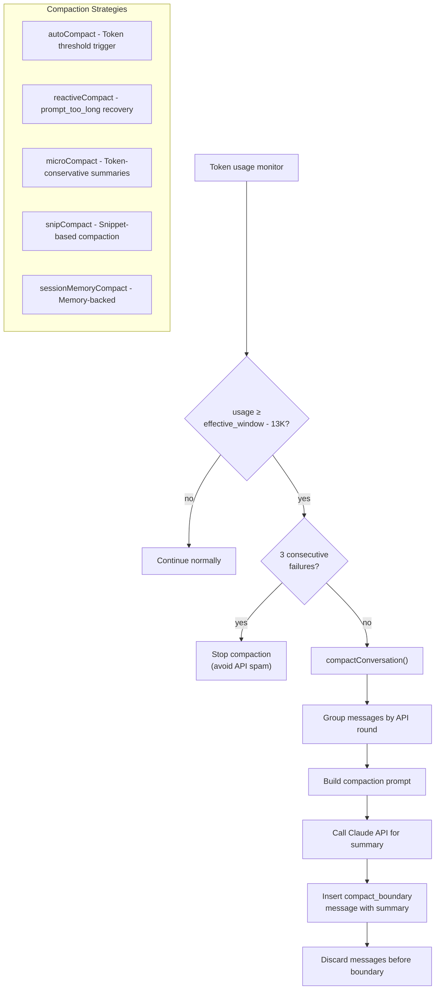

### Compaction Strategies in Detail

**1. autoCompact** (`src/services/compact/autoCompact.ts`)

The primary proactive compaction strategy. Fires when token usage exceeds the autocompact threshold:

```typescript
export const AUTOCOMPACT_BUFFER_TOKENS = 13_000

export function getAutoCompactThreshold(model: string): number {
  const effectiveContextWindow = getEffectiveContextWindowSize(model)
  return effectiveContextWindow - AUTOCOMPACT_BUFFER_TOKENS
}
```

The effective context window is `contextWindowForModel - min(maxOutputTokens, 20000)`. The 13K buffer ensures there is room for the model to respond after compaction.

`shouldAutoCompact()` (`src/services/compact/autoCompact.ts:160-239`) has several guard clauses:
- Never fires for `session_memory` or `compact` query sources (would deadlock)
- Never fires for the context-collapse agent (`marble_origami`)
- Respects `DISABLE_COMPACT` and `DISABLE_AUTO_COMPACT` env vars
- Respects user config `autoCompactEnabled`
- Suppressed when reactive-only mode is active (`tengu_cobalt_raccoon` GrowthBook flag)
- Suppressed when context-collapse is enabled (collapse owns the headroom problem)

`autoCompactIfNeeded()` (`src/services/compact/autoCompact.ts:241`) first tries session memory compaction (experimental), then falls through to `compactConversation()`.

**2. reactiveCompact** (`src/services/compact/reactiveCompact.ts`)

A recovery strategy triggered when the API returns a `prompt_too_long` error. Rather than failing, it compacts the conversation and retries. This is feature-gated behind `REACTIVE_COMPACT` and only attempts once per query loop iteration (`hasAttemptedReactiveCompact` flag in the state machine).

**3. microCompact** (`src/services/compact/microCompact.ts`)

A token-conservative approach that summarizes individual tool results rather than the entire conversation. Operates per-message by replacing verbose tool output with shorter summaries. Runs on every loop iteration before autocompact, so it continuously reduces token overhead from growing tool result histories.

The cached variant (`cachedMicrocompact`) uses cache editing: instead of rewriting messages, it sends `cache_edits` directives to the API to delete specific cached blocks. This avoids prompt cache busting.

**4. snipCompact** (`src/services/compact/snipCompact.ts`)

A feature-gated strategy (`HISTORY_SNIP`) that removes old messages based on token thresholds. Unlike autocompact which summarizes, snip simply discards. It returns `tokensFreed` which downstream systems (autocompact threshold check) use to avoid redundant compaction.

**5. sessionMemoryCompact** (`src/services/compact/sessionMemoryCompact.ts`)

An experimental strategy that leverages the session memory system. Instead of generating a fresh summary, it uses previously extracted memories as the compacted representation. Tried first in `autoCompactIfNeeded()` before falling back to standard compaction.

### The Circuit Breaker Design

The circuit breaker (`src/services/compact/autoCompact.ts:256-265`) prevents sessions with irrecoverably large contexts from hammering the API with doomed compaction attempts:

```typescript
const MAX_CONSECUTIVE_AUTOCOMPACT_FAILURES = 3

if (
  tracking?.consecutiveFailures !== undefined &&
  tracking.consecutiveFailures >= MAX_CONSECUTIVE_AUTOCOMPACT_FAILURES
) {
  return { wasCompacted: false }
}
```

This was introduced after observing 1,279 sessions with 50+ consecutive failures (up to 3,272) in a single session, wasting approximately 250K API calls per day globally. The counter is tracked in `AutoCompactTrackingState.consecutiveFailures` and reset to 0 on any successful compaction. After 3 consecutive failures, autocompact stops entirely for that session -- the user must manually run `/compact` or `/clear`.

The tracking state persists across loop iterations via the `State` object in `queryLoop()`:

```typescript
type AutoCompactTrackingState = {
  compacted: boolean
  turnCounter: number
  turnId: string
  consecutiveFailures?: number
}
```

When compaction succeeds, the tracking is reset with a fresh `turnId` and `turnCounter: 0`. When it fails, only `consecutiveFailures` is incremented while preserving the rest of the tracking state.

**Source references:**
- `autoCompact.ts`: `src/services/compact/autoCompact.ts`
- `compact.ts`: `src/services/compact/compact.ts`
- `microCompact.ts`: `src/services/compact/microCompact.ts`
- `snipCompact.ts`: `src/services/compact/snipCompact.ts`
- `sessionMemoryCompact.ts`: `src/services/compact/sessionMemoryCompact.ts`
- Circuit breaker: `src/services/compact/autoCompact.ts:256-265`
- `groupMessagesByApiRound()`: `src/services/compact/grouping.ts`
