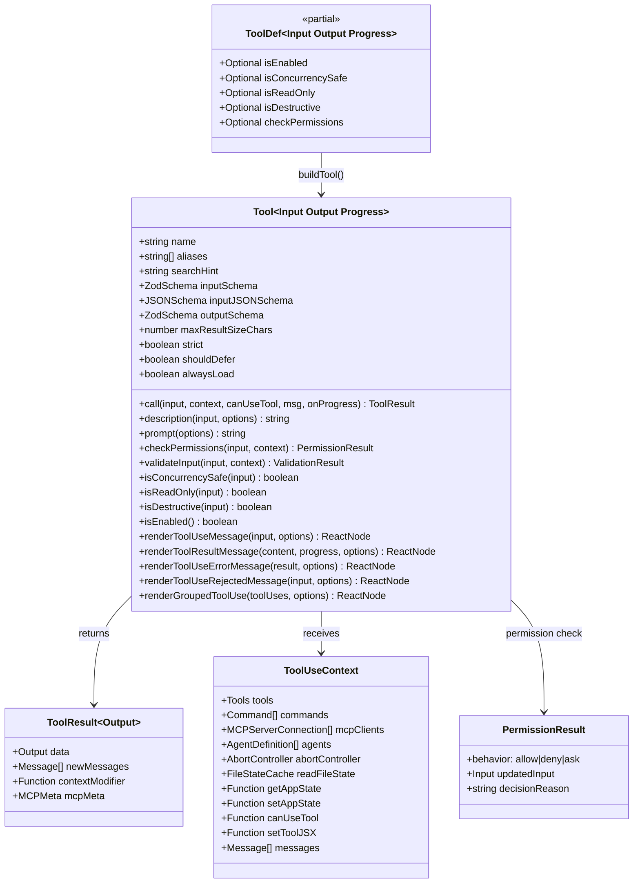
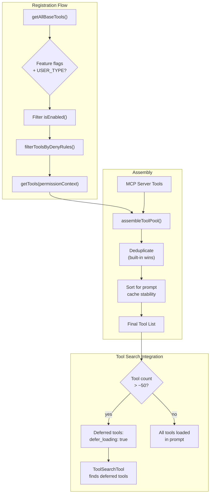
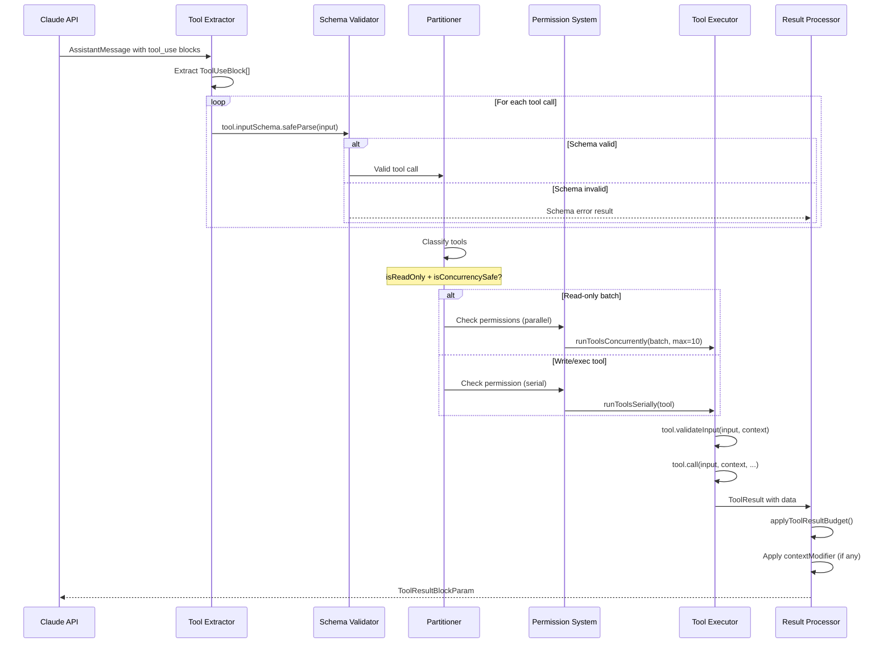
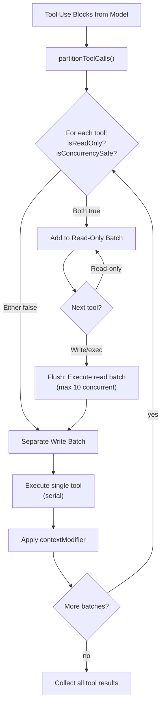
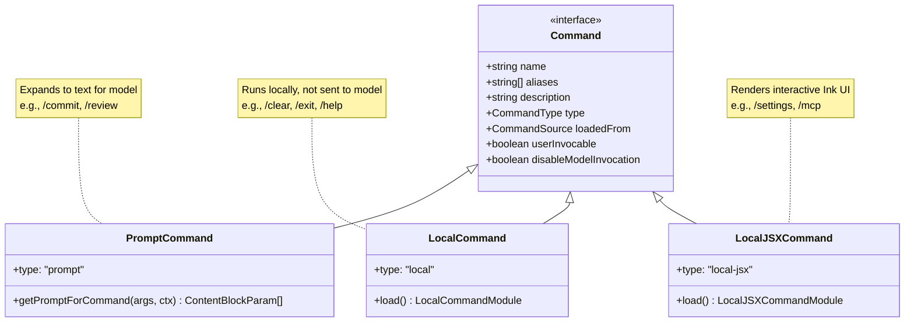
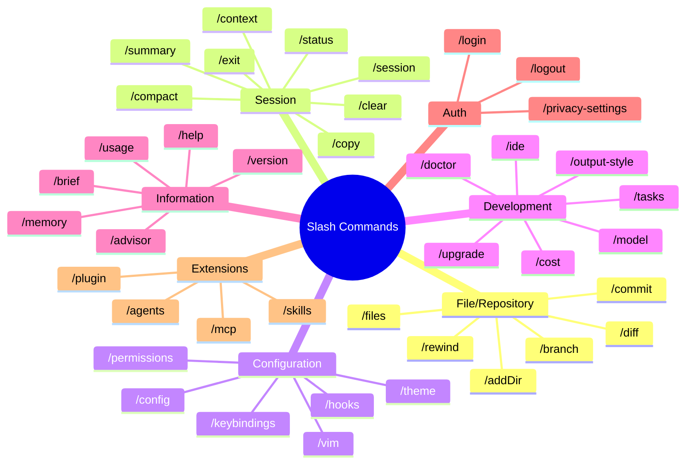
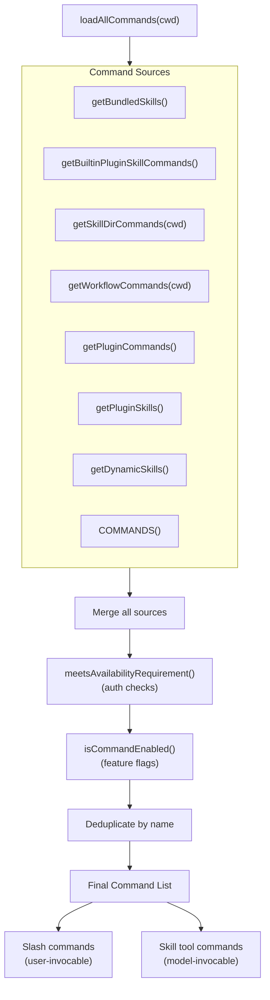
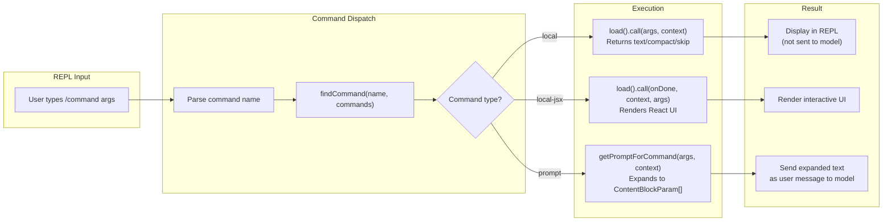

# Tools and Commands

## Tool Type System

Every tool in Claude Code implements the `Tool` interface defined in `src/Tool.ts`:



### The `Tool` Interface in Depth

The `Tool` type is parameterized over three generics: `Input` (a Zod object schema type), `Output` (the data payload returned by `call()`), and `P` (a progress event discriminated union). This generic structure allows each tool to be fully typed end-to-end: the schema validates raw JSON from the API, the `call()` method receives `z.infer<Input>` (a parsed TypeScript object), and the result handlers know the exact shape of `Output`.

```typescript
// src/Tool.ts
export type Tool<
  Input extends AnyObject = AnyObject,
  Output = unknown,
  P extends ToolProgressData = ToolProgressData,
> = {
  readonly name: string
  aliases?: string[]
  searchHint?: string
  readonly inputSchema: Input
  readonly inputJSONSchema?: ToolInputJSONSchema
  outputSchema?: z.ZodType<unknown>
  call(
    args: z.infer<Input>,
    context: ToolUseContext,
    canUseTool: CanUseToolFn,
    parentMessage: AssistantMessage,
    onProgress?: ToolCallProgress<P>,
  ): Promise<ToolResult<Output>>
  // ... (many more methods)
}
```

Key interface members serve distinct roles:

- **`name`** is the primary identifier the model uses in `tool_use` blocks. Must be unique across the entire tool pool (built-in and MCP combined).
- **`aliases`** provides backward compatibility when a tool is renamed. For example, `AgentTool` has the alias `"Task"` (its former name). The `findToolByName()` utility checks both the primary name and aliases, so old transcripts still resolve correctly.
- **`searchHint`** is a 3-10 word phrase used by `ToolSearchTool` for keyword matching when the tool is deferred. It should contain terms not already in the tool name (e.g., `"jupyter"` for `NotebookEditTool`).
- **`maxResultSizeChars`** controls tool result persistence. When a result exceeds this threshold, it is written to disk and the model receives a preview with a file path instead. Set to `Infinity` for tools like `FileReadTool` where persisting would create circular read loops.
- **`strict`** enables strict mode for the tool when the `tengu_tool_pear` beta is active, causing the API to more strictly enforce the parameter schema.

### Why Both `inputSchema` and `inputJSONSchema`?

Most tools define their input using Zod schemas (`inputSchema`). The runtime uses these for validation via `safeParse()`, and the build system converts them to JSON Schema for the API request. However, MCP tools arrive with their schemas already in JSON Schema format (as specified by the MCP protocol). Rather than round-tripping MCP schemas through Zod and back, the `inputJSONSchema` field allows MCP tools to pass their native JSON Schema directly to the API, avoiding lossy conversion.

```typescript
// src/Tool.ts
export type ToolInputJSONSchema = {
  [x: string]: unknown
  type: 'object'
  properties?: {
    [x: string]: unknown
  }
}
```

For built-in tools, `inputJSONSchema` is typically `undefined`, and the system converts `inputSchema` to JSON Schema at request time via `zodToJsonSchema()`. For MCP tools, `inputJSONSchema` is set and `inputSchema` is a permissive Zod schema that accepts `z.object({}).passthrough()`, so validation still runs but does not reject unknown properties.

### The `buildTool()` Pattern

Individual tools are never constructed directly as `Tool` objects. Instead, every tool module exports the result of `buildTool()`, a factory function that merges a partial definition (`ToolDef`) with safe defaults:

```typescript
// src/Tool.ts
const TOOL_DEFAULTS = {
  isEnabled: () => true,
  isConcurrencySafe: (_input?: unknown) => false,
  isReadOnly: (_input?: unknown) => false,
  isDestructive: (_input?: unknown) => false,
  checkPermissions: (
    input: { [key: string]: unknown },
    _ctx?: ToolUseContext,
  ): Promise<PermissionResult> =>
    Promise.resolve({ behavior: 'allow', updatedInput: input }),
  toAutoClassifierInput: (_input?: unknown) => '',
  userFacingName: (_input?: unknown) => '',
}

export function buildTool<D extends AnyToolDef>(def: D): BuiltTool<D> {
  return {
    ...TOOL_DEFAULTS,
    userFacingName: () => def.name,
    ...def,
  } as BuiltTool<D>
}
```

The defaults are intentionally **fail-closed** where safety matters:

- `isConcurrencySafe` defaults to `false` -- a tool is assumed unsafe for concurrent execution unless it explicitly opts in. This prevents a forgotten override from allowing parallel writes.
- `isReadOnly` defaults to `false` -- a tool is assumed to write unless it says otherwise.
- `isDestructive` defaults to `false` -- this is fail-open because destructive detection is additive (only relevant for UI warnings and the auto-mode classifier).
- `checkPermissions` defaults to `{ behavior: 'allow' }` -- tool-specific permission logic is optional; the general permission system (`src/hooks/toolPermission/`) handles most cases.
- `toAutoClassifierInput` defaults to `''` (empty string) -- which causes the auto-mode security classifier to skip the tool entirely. Security-relevant tools (like `BashTool`) must override this.

The `BuiltTool<D>` type uses advanced TypeScript conditional types to mirror the runtime `{ ...TOOL_DEFAULTS, ...def }` spread at the type level, preserving the concrete parameter types from the definition while filling in defaults for omitted keys.

### `ToolDef` vs `Tool`

A `ToolDef` is the same shape as `Tool` but with seven methods made optional (the "defaultable" keys). This is what a tool author writes:

```typescript
// src/Tool.ts
type DefaultableToolKeys =
  | 'isEnabled'
  | 'isConcurrencySafe'
  | 'isReadOnly'
  | 'isDestructive'
  | 'checkPermissions'
  | 'toAutoClassifierInput'
  | 'userFacingName'

export type ToolDef<...> = Omit<Tool<...>, DefaultableToolKeys> &
  Partial<Pick<Tool<...>, DefaultableToolKeys>>
```

After `buildTool()`, the resulting `Tool` always has all methods. Callers never need `tool.isConcurrencySafe?.() ?? false` -- they can call `tool.isConcurrencySafe(input)` directly.

### The `ToolUseContext` Object

`ToolUseContext` is the ambient environment passed to every tool invocation. It provides access to session state, abort signals, the file cache, and other shared infrastructure. Notable fields include:

- **`options.tools`** -- the complete tool pool visible to the model this turn.
- **`abortController`** -- signals cancellation (e.g., user interrupts with Ctrl+C).
- **`readFileState`** -- an LRU cache of recently read file contents, used for dedup and staleness detection.
- **`getAppState()` / `setAppState()`** -- access to the centralized mutable `AppState` store. For subagents, `setAppState` may be a no-op (to prevent cross-agent state interference), while `setAppStateForTasks` reaches the root store for infrastructure like background task registration.
- **`messages`** -- the full conversation history. Tools like `AgentTool` and `ToolSearchTool` inspect this to make decisions.
- **`contentReplacementState`** -- tracks the aggregate tool result budget for the conversation thread (see `toolResultStorage.ts`).

### The `ToolResult` Type

When a tool completes, it returns a `ToolResult<T>`:

```typescript
// src/Tool.ts
export type ToolResult<T> = {
  data: T
  newMessages?: (UserMessage | AssistantMessage | AttachmentMessage | SystemMessage)[]
  // contextModifier is only honored for tools that aren't concurrency safe.
  contextModifier?: (context: ToolUseContext) => ToolUseContext
  mcpMeta?: {
    _meta?: Record<string, unknown>
    structuredContent?: Record<string, unknown>
  }
}
```

The `contextModifier` field is the mechanism by which a tool can alter the `ToolUseContext` for subsequent tool calls in the same turn. For example, a `cd` command in `BashTool` would return a `contextModifier` that updates the working directory in the context. This modifier is **only honored for non-concurrent tools** -- concurrent tools queue their modifiers and apply them after the entire batch completes, in the order the tool calls were declared (not the order they finished).

### Concrete Tool Examples

**GlobTool** -- a simple read-only, concurrency-safe tool:

```typescript
// src/tools/GlobTool/GlobTool.ts
export const GlobTool = buildTool({
  name: GLOB_TOOL_NAME,
  searchHint: 'find files by name pattern or wildcard',
  maxResultSizeChars: 100_000,
  get inputSchema(): InputSchema {
    return inputSchema()
  },
  isConcurrencySafe() {
    return true    // Always safe -- reads filesystem, never writes
  },
  isReadOnly() {
    return true    // Never modifies files
  },
  // checkPermissions is omitted -- buildTool() provides the default 'allow'
  // isEnabled is omitted -- buildTool() provides the default 'true'
  // ...
})
```

**BashTool** -- a complex tool with input-dependent concurrency:

```typescript
// src/tools/BashTool/BashTool.tsx
export const BashTool = buildTool({
  name: BASH_TOOL_NAME,
  searchHint: 'execute shell commands',
  maxResultSizeChars: 30_000,
  strict: true,
  isConcurrencySafe(input) {
    return this.isReadOnly?.(input) ?? false  // Safe only when read-only
  },
  isReadOnly(input) {
    const compoundCommandHasCd = commandHasAnyCd(input.command)
    const result = checkReadOnlyConstraints(input, compoundCommandHasCd)
    return result.behavior === 'allow'        // Parses command to determine
  },
  toAutoClassifierInput(input) {
    return input.command                      // Security classifier sees the command
  },
  // ... (500+ lines of implementation)
})
```

Note how `BashTool.isConcurrencySafe()` delegates to `isReadOnly()`, which actually parses the shell command AST to determine if it only reads. A `grep` command returns `true` (concurrent), while `rm -rf /` returns `false` (serial). This is the key mechanism that allows safe parallel execution of read-only bash commands while serializing writes.

---

## Tool Registry

Tools are registered via `src/tools.ts` with conditional loading based on feature flags, environment, and user type:



### Registration Flow: `getAllBaseTools()`

The `getAllBaseTools()` function in `src/tools.ts` is the **single source of truth** for all tools that could be available in the current process. It returns a flat array of `Tool` objects, assembled with conditional includes:

```typescript
// src/tools.ts
export function getAllBaseTools(): Tools {
  return [
    AgentTool,
    TaskOutputTool,
    BashTool,
    // Ant-native builds have bfs/ugrep embedded in the bun binary
    ...(hasEmbeddedSearchTools() ? [] : [GlobTool, GrepTool]),
    ExitPlanModeV2Tool,
    FileReadTool,
    FileEditTool,
    FileWriteTool,
    // ... more tools ...
    ...(process.env.USER_TYPE === 'ant' ? [ConfigTool] : []),
    ...(process.env.USER_TYPE === 'ant' ? [TungstenTool] : []),
    ...(SuggestBackgroundPRTool ? [SuggestBackgroundPRTool] : []),
    ...(WebBrowserTool ? [WebBrowserTool] : []),
    // ... feature-gated tools ...
    ...(isToolSearchEnabledOptimistic() ? [ToolSearchTool] : []),
  ]
}
```

Three gating mechanisms are visible:

1. **Feature flags via `bun:bundle`** -- Feature-gated tools use conditional `require()` at the top of `tools.ts`. When the flag is `false`, the `require()` never executes and the variable is `null`, so the spread produces an empty array. This is a build-time dead-code elimination pattern: in production, Bun's bundler statically evaluates `feature('...')` calls and tree-shakes the unreachable `require()` branches.

```typescript
// src/tools.ts - Top-level conditional requires
const SleepTool =
  feature('PROACTIVE') || feature('KAIROS')
    ? require('./tools/SleepTool/SleepTool.js').SleepTool
    : null

const cronTools = feature('AGENT_TRIGGERS')
  ? [
      require('./tools/ScheduleCronTool/CronCreateTool.js').CronCreateTool,
      require('./tools/ScheduleCronTool/CronDeleteTool.js').CronDeleteTool,
      require('./tools/ScheduleCronTool/CronListTool.js').CronListTool,
    ]
  : []
```

2. **`process.env.USER_TYPE` checks** -- Ant-only tools (internal Anthropic tools) are gated on `process.env.USER_TYPE === 'ant'`. These include `REPLTool`, `ConfigTool`, `TungstenTool`, and `SuggestBackgroundPRTool`.

3. **Runtime environment checks** -- Some tools check environment variables (`ENABLE_LSP_TOOL`, `CLAUDE_CODE_VERIFY_PLAN`) or call utility functions (`isWorktreeModeEnabled()`, `isAgentSwarmsEnabled()`, `isTodoV2Enabled()`).

### Lazy Requires for Circular Dependencies

Several tools use a lazy `require()` pattern to break circular dependencies:

```typescript
// src/tools.ts
const getTeamCreateTool = () =>
  require('./tools/TeamCreateTool/TeamCreateTool.js')
    .TeamCreateTool as typeof import('./tools/TeamCreateTool/TeamCreateTool.js').TeamCreateTool

const getSendMessageTool = () =>
  require('./tools/SendMessageTool/SendMessageTool.js')
    .SendMessageTool as typeof import('./tools/SendMessageTool/SendMessageTool.js').SendMessageTool
```

These are functions rather than top-level constants, so the `require()` is deferred until the function is called. The `typeof import(...)` cast preserves full type information while avoiding the circular dependency at module evaluation time.

### Filtering: `getTools()` and `filterToolsByDenyRules()`

The `getTools()` function refines the raw tool list with three filter stages:

```typescript
// src/tools.ts
export const getTools = (permissionContext: ToolPermissionContext): Tools => {
  // 1. Simple mode: minimal toolset
  if (isEnvTruthy(process.env.CLAUDE_CODE_SIMPLE)) {
    const simpleTools: Tool[] = [BashTool, FileReadTool, FileEditTool]
    return filterToolsByDenyRules(simpleTools, permissionContext)
  }

  // 2. Remove special tools that get added conditionally elsewhere
  const tools = getAllBaseTools().filter(tool => !specialTools.has(tool.name))

  // 3. Apply deny rules
  let allowedTools = filterToolsByDenyRules(tools, permissionContext)

  // 4. REPL mode hides primitive tools (they're available inside the VM)
  if (isReplModeEnabled()) {
    // ... hide REPL_ONLY_TOOLS when REPL is enabled ...
  }

  // 5. Filter by isEnabled()
  const isEnabled = allowedTools.map(_ => _.isEnabled())
  return allowedTools.filter((_, i) => isEnabled[i])
}
```

The `filterToolsByDenyRules()` function checks blanket deny rules from the permission context. A tool is removed if there is a deny rule matching its name with no `ruleContent` (i.e., the entire tool is denied, not just specific inputs). This uses the same matcher as the runtime permission check, so MCP server-prefix rules like `mcp__server` strip all tools from that server before the model ever sees them.

```typescript
// src/tools.ts
export function filterToolsByDenyRules<T extends { name: string; mcpInfo?: ... }>(
  tools: readonly T[],
  permissionContext: ToolPermissionContext,
): T[] {
  return tools.filter(tool => !getDenyRuleForTool(permissionContext, tool))
}
```

### Assembly: `assembleToolPool()`

The `assembleToolPool()` function is the final assembly point that combines built-in tools with MCP tools:

```typescript
// src/tools.ts
export function assembleToolPool(
  permissionContext: ToolPermissionContext,
  mcpTools: Tools,
): Tools {
  const builtInTools = getTools(permissionContext)
  const allowedMcpTools = filterToolsByDenyRules(mcpTools, permissionContext)

  // Sort each partition for prompt-cache stability
  const byName = (a: Tool, b: Tool) => a.name.localeCompare(b.name)
  return uniqBy(
    [...builtInTools].sort(byName).concat(allowedMcpTools.sort(byName)),
    'name',
  )
}
```

Three critical design decisions are embedded here:

1. **Built-in tools win on name conflicts** -- `uniqBy(..., 'name')` preserves the first occurrence, and built-ins are placed before MCP tools in the concatenation.

2. **Sorted for prompt cache stability** -- The tool list is sorted alphabetically by name within each partition (built-in, then MCP). This ensures that adding or removing an MCP tool does not change the ordering of unrelated tools, which would invalidate the server-side prompt cache. Built-ins are kept as a contiguous prefix because the API's `claude_code_system_cache_policy` places a cache breakpoint after them.

3. **Two-partition sort** -- Rather than sorting all tools together, built-ins and MCP tools are sorted independently, then concatenated. A flat sort would interleave MCP tools into built-ins and bust the cache whenever any MCP tool sorts between existing built-ins.

### Deferred Tool Loading

When the tool count exceeds a threshold (approximately 50 tools, or when MCP tool descriptions consume more than 10% of the context window), the system activates **deferred loading**. Tools with `shouldDefer: true` or MCP tools (unless they have `alwaysLoad: true`) are sent to the API with `defer_loading: true` -- meaning only the tool name and a one-line description appear in the prompt. The model must call `ToolSearchTool` to "discover" a deferred tool's full schema before it can call it.

This optimization is essential for users with many MCP servers. Without it, 100+ MCP tools would each add their full JSON Schema to every prompt, consuming thousands of tokens per turn. With deferred loading, only the ~13 core built-in tools and any `alwaysLoad` tools send full schemas. The model uses `ToolSearchTool` with keyword queries to find relevant deferred tools on demand.

If the model calls a deferred tool without first discovering it via `ToolSearchTool`, the schema was never sent, so typed parameters (arrays, numbers, booleans) get emitted as strings and fail Zod validation. The `buildSchemaNotSentHint()` function in `toolExecution.ts` detects this case and appends a helpful hint to the error message:

```typescript
// src/services/tools/toolExecution.ts
export function buildSchemaNotSentHint(tool: Tool, messages: Message[], tools: readonly { name: string }[]): string | null {
  if (!isToolSearchEnabledOptimistic()) return null
  if (!isToolSearchToolAvailable(tools)) return null
  if (!isDeferredTool(tool)) return null
  const discovered = extractDiscoveredToolNames(messages)
  if (discovered.has(tool.name)) return null
  return `\n\nThis tool's schema was not sent to the API — ... Load the tool first: call ${TOOL_SEARCH_TOOL_NAME} with query "select:${tool.name}", then retry this call.`
}
```

---

## Complete Tool Inventory

### Core Tools (Always Available)

| Tool | Read-Only | Concurrent | Description |
|------|-----------|-----------|-------------|
| **BashTool** | No | No | Execute shell commands |
| **FileReadTool** | Yes | Yes | Read files (images, PDFs, notebooks) |
| **FileEditTool** | No | No | Diff-based file editing |
| **FileWriteTool** | No | No | Create/overwrite files |
| **GlobTool** | Yes | Yes | File pattern matching |
| **GrepTool** | Yes | Yes | Content search (ripgrep) |
| **AgentTool** | No | No | Spawn sub-agents |
| **WebFetchTool** | Yes | Yes | Fetch web pages |
| **WebSearchTool** | Yes | Yes | Web search (Bing) |
| **NotebookEditTool** | No | No | Jupyter cell editing |
| **SkillTool** | No | No | Invoke skills/workflows |
| **AskUserQuestionTool** | No | No | Prompt user for input |
| **ToolSearchTool** | Yes | Yes | Discover deferred tools |

### Task Management Tools

| Tool | Description |
|------|-------------|
| **TaskCreateTool** | Create tasks |
| **TaskGetTool** | Retrieve task details |
| **TaskUpdateTool** | Update task status |
| **TaskListTool** | List all tasks |
| **TaskStopTool** | Stop running tasks |
| **TaskOutputTool** | Get task output |
| **TodoWriteTool** | Update todo panel |

### Mode Tools

| Tool | Description |
|------|-------------|
| **EnterPlanModeTool** | Enter plan mode |
| **ExitPlanModeV2Tool** | Exit plan mode |
| **EnterWorktreeTool** | Create git worktree |
| **ExitWorktreeTool** | Exit worktree |

### MCP Integration Tools

| Tool | Description |
|------|-------------|
| **MCPTool** | Call MCP server tools |
| **ListMcpResourcesTool** | List MCP resources |
| **ReadMcpResourceTool** | Read MCP resources |
| **McpAuthTool** | Handle MCP auth |

### Feature-Gated Tools

| Tool | Feature Gate | Description |
|------|-------------|-------------|
| **SendMessageTool** | (lazy) | Message other agents |
| **CronCreateTool** | AGENT_TRIGGERS | Create scheduled tasks |
| **CronDeleteTool** | AGENT_TRIGGERS | Delete scheduled tasks |
| **CronListTool** | AGENT_TRIGGERS | List scheduled tasks |
| **RemoteTriggerTool** | AGENT_TRIGGERS_REMOTE | Remote execution |
| **SleepTool** | PROACTIVE/KAIROS | Wait/sleep |
| **WebBrowserTool** | WEB_BROWSER_TOOL | Browser automation |
| **LSPTool** | (plugins) | Language server protocol |
| **PowerShellTool** | (enabled) | PowerShell execution |
| **WorkflowTool** | WORKFLOW_SCRIPTS | Workflow execution |
| **SnipTool** | HISTORY_SNIP | History snipping |
| **MonitorTool** | MONITOR_TOOL | Resource monitoring |

### Internal/Ant-Only Tools

| Tool | Description |
|------|-------------|
| **REPLTool** | REPL/VM execution |
| **ConfigTool** | Modify settings.json |
| **TeamCreateTool** | Create agent teams |
| **TeamDeleteTool** | Delete agent teams |
| **TungstenTool** | Internal integration |
| **SuggestBackgroundPRTool** | Background PR suggestions |

---

## Tool Execution Lifecycle



### Detailed Execution Walkthrough

The execution lifecycle is implemented across two files: `src/services/tools/toolOrchestration.ts` (batching and concurrency) and `src/services/tools/toolExecution.ts` (per-tool validation, permission, and call). Here is the full sequence:

#### Step 1: Tool Resolution

When the model returns an `AssistantMessage` containing `tool_use` blocks, the `runToolUse()` function in `toolExecution.ts` first resolves the tool by name:

```typescript
// src/services/tools/toolExecution.ts
let tool = findToolByName(toolUseContext.options.tools, toolName)

// Fallback: check if it's a deprecated tool being called by alias
if (!tool) {
  const fallbackTool = findToolByName(getAllBaseTools(), toolName)
  if (fallbackTool && fallbackTool.aliases?.includes(toolName)) {
    tool = fallbackTool
  }
}
```

If the tool is not found even by alias, an error result is yielded immediately: `"No such tool available: {name}"`.

#### Step 2: Schema Validation (Zod)

The raw JSON input from the API is validated against the tool's Zod schema:

```typescript
// src/services/tools/toolExecution.ts (inside checkPermissionsAndCallTool)
const parsedInput = tool.inputSchema.safeParse(input)
if (!parsedInput.success) {
  let errorContent = formatZodValidationError(tool.name, parsedInput.error)
  // If deferred and not discovered, append schema-not-sent hint
  const schemaHint = buildSchemaNotSentHint(tool, toolUseContext.messages, toolUseContext.options.tools)
  if (schemaHint) errorContent += schemaHint
  // Return InputValidationError to model
}
```

This step catches type mismatches (the model is "not great at generating valid input", as the source code comments note), missing required fields, and extra properties (when `strictObject` is used).

#### Step 3: Input Validation (Tool-Specific)

If schema validation passes, the tool's optional `validateInput()` method runs:

```typescript
const isValidCall = await tool.validateInput?.(parsedInput.data, toolUseContext)
if (isValidCall?.result === false) {
  // Return error with isValidCall.message
}
```

This is tool-specific business logic. For example, `BashTool` checks read-only constraints and blocked commands; `FileReadTool` checks for blocked device paths like `/dev/zero` or `/dev/random`.

#### Step 4: Pre-Tool Hooks

Before permission checks, `runPreToolUseHooks()` executes any registered hooks. Hooks can:
- Modify the input (`hookUpdatedInput`)
- Make a permission decision (`hookPermissionResult`)
- Stop the tool entirely (`stop` / `preventContinuation`)
- Emit attachment messages for display

#### Step 5: Speculative Classifier (BashTool Only)

For `BashTool`, a speculative security classifier check is started in parallel with the permission flow:

```typescript
if (tool.name === BASH_TOOL_NAME && parsedInput.data && 'command' in parsedInput.data) {
  startSpeculativeClassifierCheck(
    (parsedInput.data as BashToolInput).command,
    appState.toolPermissionContext,
    toolUseContext.abortController.signal,
    toolUseContext.options.isNonInteractiveSession,
  )
}
```

This kicks off an async "side query" to determine if the command is safe, which runs concurrently with the pre-tool hooks and permission dialog setup. The result is available by the time the permission system needs it, avoiding a sequential delay.

#### Step 6: Permission Decision

The `resolveHookPermissionDecision()` function combines the hook permission result (if any) with the standard `canUseTool()` check:

```typescript
const resolved = await resolveHookPermissionDecision(
  hookPermissionResult, tool, processedInput,
  toolUseContext, canUseTool, assistantMessage, toolUseID,
)
```

The result is one of three behaviors:
- `'allow'` -- proceed to execution. The `updatedInput` field may carry a modified input (e.g., hooks can rewrite paths).
- `'deny'` -- return an error to the model with an explanatory message.
- `'ask'` -- in interactive mode, show a permission dialog to the user. In non-interactive mode (SDK/print), deny with the dialog text.

#### Step 7: Tool Execution

If permission is granted, the tool's `call()` method is invoked with the (possibly modified) input:

```typescript
const result = await tool.call(processedInput, toolUseContext, canUseTool, assistantMessage, onProgress)
```

Progress events are forwarded through `onProgress` callbacks and emitted as `ProgressMessage` entries in the message stream.

#### Step 8: Post-Tool Hooks and Result Processing

After execution, `runPostToolUseHooks()` runs. The tool result is then processed:
- `mapToolResultToToolResultBlockParam()` converts the typed output to the API's `ToolResultBlockParam` format.
- If the result exceeds `maxResultSizeChars`, it is persisted to disk via `processToolResultBlock()` and the model receives a preview with a file path.
- The `contextModifier` (if any) is applied to update `ToolUseContext` for subsequent tools.

---

## Tool Concurrency Model



### Partitioning Logic

The `partitionToolCalls()` function in `toolOrchestration.ts` groups consecutive tool calls into batches:

```typescript
// src/services/tools/toolOrchestration.ts
function partitionToolCalls(
  toolUseMessages: ToolUseBlock[],
  toolUseContext: ToolUseContext,
): Batch[] {
  return toolUseMessages.reduce((acc: Batch[], toolUse) => {
    const tool = findToolByName(toolUseContext.options.tools, toolUse.name)
    const parsedInput = tool?.inputSchema.safeParse(toolUse.input)
    const isConcurrencySafe = parsedInput?.success
      ? (() => {
          try {
            return Boolean(tool?.isConcurrencySafe(parsedInput.data))
          } catch {
            return false  // Parse failure = not safe (conservative)
          }
        })()
      : false
    if (isConcurrencySafe && acc[acc.length - 1]?.isConcurrencySafe) {
      acc[acc.length - 1]!.blocks.push(toolUse)  // Extend current batch
    } else {
      acc.push({ isConcurrencySafe, blocks: [toolUse] })  // New batch
    }
    return acc
  }, [])
}
```

Key details:

- **Input-dependent classification**: Whether a tool is concurrency-safe depends on the *specific input*, not just the tool type. `BashTool` with `grep` is safe; `BashTool` with `rm` is not. The input is parsed via `safeParse()` first so that `isConcurrencySafe()` receives typed data.
- **Conservative failure**: If the input fails schema parsing, or if `isConcurrencySafe()` throws, the tool is treated as not concurrency-safe. This is the fail-closed default.
- **Greedy batching**: Consecutive concurrency-safe tools are merged into a single batch. A non-safe tool forces a batch break.

### Why `isConcurrencySafe` Defaults to `false`

This is a deliberate safety decision. The consequence of incorrectly marking a tool as concurrency-safe is data corruption or race conditions (e.g., two concurrent file writes to the same path). The consequence of incorrectly marking it as non-safe is slightly slower execution (serial instead of parallel). The fail-closed default ensures that any new tool added without thinking about concurrency is automatically serial.

### Concurrent Execution

Concurrent batches are executed via the `all()` utility from `utils/generators.ts`, which runs up to `maxConcurrency` async generators in parallel:

```typescript
// src/services/tools/toolOrchestration.ts
async function* runToolsConcurrently(
  toolUseMessages: ToolUseBlock[],
  assistantMessages: AssistantMessage[],
  canUseTool: CanUseToolFn,
  toolUseContext: ToolUseContext,
): AsyncGenerator<MessageUpdateLazy, void> {
  yield* all(
    toolUseMessages.map(async function* (toolUse) {
      // ... per-tool execution ...
      yield* runToolUse(toolUse, ...)
      // ...
    }),
    getMaxToolUseConcurrency(),  // Default: 10
  )
}
```

The default concurrency limit of 10 is configurable via `CLAUDE_CODE_MAX_TOOL_USE_CONCURRENCY`. This caps the maximum number of simultaneous tool executions, preventing resource exhaustion when the model requests many parallel operations.

### Context Modifier Ordering

For concurrent batches, context modifiers are **queued** and applied after all tools in the batch complete, in the declared order (not execution completion order):

```typescript
// src/services/tools/toolOrchestration.ts (inside runTools)
const queuedContextModifiers: Record<string, ((context: ToolUseContext) => ToolUseContext)[]> = {}
for await (const update of runToolsConcurrently(blocks, ...)) {
  if (update.contextModifier) {
    const { toolUseID, modifyContext } = update.contextModifier
    queuedContextModifiers[toolUseID] ??= []
    queuedContextModifiers[toolUseID].push(modifyContext)
  }
  yield { message: update.message, newContext: currentContext }
}
// Apply queued modifiers in declaration order
for (const block of blocks) {
  const modifiers = queuedContextModifiers[block.id]
  if (!modifiers) continue
  for (const modifier of modifiers) {
    currentContext = modifier(currentContext)
  }
}
```

For serial batches, context modifiers are applied immediately after each tool completes, so each subsequent tool sees the updated context.

---

## Slash Command System

Commands are registered in `src/commands.ts` and come in three types:



### The Three Command Types

The command system uses a discriminated union on the `type` field. Each type has a fundamentally different execution path:

**1. `prompt` commands** expand to text (`ContentBlockParam[]`) that is sent to the model as a user message. The model then processes the expanded content and responds. Examples include `/commit` (which expands to a prompt asking the model to create a git commit), `/review` (which expands to instructions for code review), and all skill commands (which expand to their skill content). The `getPromptForCommand()` method receives the raw arguments string and the `ToolUseContext`:

```typescript
// src/types/command.ts
export type PromptCommand = {
  type: 'prompt'
  progressMessage: string
  contentLength: number  // For token estimation
  argNames?: string[]
  allowedTools?: string[]
  model?: string
  source: SettingSource | 'builtin' | 'mcp' | 'plugin' | 'bundled'
  context?: 'inline' | 'fork'  // 'fork' runs as sub-agent
  getPromptForCommand(args: string, context: ToolUseContext): Promise<ContentBlockParam[]>
}
```

**2. `local` commands** execute entirely on the client and return a `LocalCommandResult`. Their output is displayed in the REPL but never sent to the model. The three result types are:
- `{ type: 'text', value: string }` -- display text in the terminal
- `{ type: 'compact', compactionResult: CompactionResult }` -- trigger context compaction
- `{ type: 'skip' }` -- display nothing

Examples: `/clear` (clears the screen), `/exit` (terminates the session), `/cost` (shows token usage).

**3. `local-jsx` commands** render interactive React (Ink) UI components. They receive an `onDone` callback and return a React node. The REPL renders this node in place of the normal input, and the user interacts with it (e.g., selecting options, toggling settings). Examples: `/mcp` (MCP server management UI), `/settings` (settings editor), `/permissions` (permission rule editor).

```typescript
// src/types/command.ts
export type LocalJSXCommandCall = (
  onDone: LocalJSXCommandOnDone,
  context: ToolUseContext & LocalJSXCommandContext,
  args: string,
) => Promise<React.ReactNode>
```

### The `CommandBase` Interface

All three command types share a common base:

```typescript
// src/types/command.ts
export type CommandBase = {
  availability?: CommandAvailability[]  // Auth/provider gating
  description: string
  isEnabled?: () => boolean             // Feature flag gating
  isHidden?: boolean                     // Hidden from typeahead/help
  name: string
  aliases?: string[]
  whenToUse?: string                     // Skill spec: detailed usage scenarios
  disableModelInvocation?: boolean       // Block model from using this command
  userInvocable?: boolean                // Can users type /name to invoke
  loadedFrom?: 'commands_DEPRECATED' | 'skills' | 'plugin' | 'managed' | 'bundled' | 'mcp'
  kind?: 'workflow'                      // Badge in autocomplete
  immediate?: boolean                    // Execute immediately, bypass queue
}
```

The `availability` field declares which authentication environments a command requires. This is separate from `isEnabled()`: `availability` is a static auth requirement (e.g., "only for claude.ai subscribers"), while `isEnabled()` is a dynamic runtime check (e.g., "only when this GrowthBook flag is on").

### Command Categories



---

### Command Discovery Flow



### The Eight Command Sources

Commands are assembled from eight different sources, loaded in parallel where possible:

1. **`getBundledSkills()`** -- Skills shipped with the CLI binary. Registered synchronously at startup.

2. **`getBuiltinPluginSkillCommands()`** -- Skills provided by enabled built-in plugins. These are plugin skills that ship with the CLI but are treated as plugin-provided.

3. **`getSkillDirCommands(cwd)`** -- Skills discovered from `.claude/skills/` directories in the project hierarchy. Loaded from disk via dynamic imports.

4. **`getWorkflowCommands(cwd)`** -- Workflow-backed commands (gated on `WORKFLOW_SCRIPTS` feature flag). These are `.yml` workflow definitions converted to prompt commands.

5. **`getPluginCommands()`** -- Commands from installed plugins. Loaded via the plugin system.

6. **`getPluginSkills()`** -- Skills from installed plugins. Distinct from plugin commands; these are `prompt`-type entries that the model can invoke via `SkillTool`.

7. **`getDynamicSkills()`** -- Skills discovered dynamically during the session (e.g., when the model reads a file that triggers skill directory scanning). These are **not** part of the memoized `loadAllCommands()` -- they are merged in separately by `getCommands()`.

8. **`COMMANDS()`** -- The built-in command registry. This is a memoized function (not called at module load time, because some underlying functions read from config). Contains ~80 commands including all the `/slash` commands shown in the mindmap above.

### Merge Strategy and Ordering

The `loadAllCommands()` function concatenates sources in a specific order:

```typescript
// src/commands.ts
const loadAllCommands = memoize(async (cwd: string): Promise<Command[]> => {
  const [
    { skillDirCommands, pluginSkills, bundledSkills, builtinPluginSkills },
    pluginCommands,
    workflowCommands,
  ] = await Promise.all([
    getSkills(cwd),
    getPluginCommands(),
    getWorkflowCommands ? getWorkflowCommands(cwd) : Promise.resolve([]),
  ])

  return [
    ...bundledSkills,
    ...builtinPluginSkills,
    ...skillDirCommands,
    ...workflowCommands,
    ...pluginCommands,
    ...pluginSkills,
    ...COMMANDS(),           // Built-in commands go last
  ]
})
```

This ordering matters for the typeahead and skill discovery: user-defined skills and plugins appear before built-in commands, so if a user creates a `/commit` skill in their `.claude/skills/` directory, it shadows the built-in `/commit`.

Dynamic skills are inserted after plugin skills but before built-in commands by `getCommands()`:

```typescript
// src/commands.ts
const builtInNames = new Set(COMMANDS().map(c => c.name))
const insertIndex = baseCommands.findIndex(c => builtInNames.has(c.name))
return [
  ...baseCommands.slice(0, insertIndex),
  ...uniqueDynamicSkills,
  ...baseCommands.slice(insertIndex),
]
```

### Availability and Enablement Filtering

After merging, two filter passes run on every `getCommands()` call (not memoized, because auth state can change mid-session):

```typescript
// src/commands.ts
export function meetsAvailabilityRequirement(cmd: Command): boolean {
  if (!cmd.availability) return true  // No requirement = universal
  for (const a of cmd.availability) {
    switch (a) {
      case 'claude-ai':
        if (isClaudeAISubscriber()) return true
        break
      case 'console':
        if (!isClaudeAISubscriber() && !isUsing3PServices() && isFirstPartyAnthropicBaseUrl())
          return true
        break
    }
  }
  return false
}
```

The `isCommandEnabled()` check then evaluates the command's optional `isEnabled()` function, which may check feature flags, environment variables, or platform constraints.

### SkillTool vs Slash Commands

Not all commands are both user-invocable and model-invocable. The system maintains two filtered views:

- **`getSkillToolCommands(cwd)`** -- Commands the model can invoke via `SkillTool`. Filters to `type: 'prompt'` commands that are not `disableModelInvocation` and not `source: 'builtin'`, and that have a description or `whenToUse`.

- **`getSlashCommandToolSkills(cwd)`** -- Skill-type commands shown in the `/skills` listing. Filters similarly but also includes `disableModelInvocation` commands (which are user-only skills).

### Internal-Only Commands

The `INTERNAL_ONLY_COMMANDS` array lists commands that are stripped from the external (public) build. These are only included when `process.env.USER_TYPE === 'ant'` and `!process.env.IS_DEMO`:

```typescript
// src/commands.ts
...(process.env.USER_TYPE === 'ant' && !process.env.IS_DEMO
  ? INTERNAL_ONLY_COMMANDS
  : []),
```

This includes internal tooling like `/backfill-sessions`, `/break-cache`, `/bughunter`, `/teleport`, `/ant-trace`, and `/perf-issue`.

---

### Command-Tool Interaction



The `findCommand()` function resolves a command by checking the primary name, the display name (via `getCommandName()`), and any aliases:

```typescript
// src/commands.ts
export function findCommand(commandName: string, commands: Command[]): Command | undefined {
  return commands.find(
    _ =>
      _.name === commandName ||
      getCommandName(_) === commandName ||
      _.aliases?.includes(commandName),
  )
}
```

### Bridge and Remote Safety

Commands are further classified for safety in remote/bridge contexts. The `REMOTE_SAFE_COMMANDS` set lists commands safe for `--remote` mode (only affect local TUI state). The `BRIDGE_SAFE_COMMANDS` set lists `local` commands safe for execution when received over the Remote Control bridge (mobile/web client). The general rule is:
- `prompt` commands are always bridge-safe (they just expand to text).
- `local-jsx` commands are always bridge-unsafe (they render Ink UI that doesn't work remotely).
- `local` commands require explicit opt-in via `BRIDGE_SAFE_COMMANDS`.

---

## Source References

| File | Purpose |
|------|---------|
| `src/Tool.ts` | `Tool` interface, `ToolDef`, `buildTool()`, `ToolUseContext`, `ToolResult`, `ToolPermissionContext`, `ValidationResult` |
| `src/tools.ts` | `getAllBaseTools()`, `getTools()`, `assembleToolPool()`, `filterToolsByDenyRules()`, feature-gated imports |
| `src/commands.ts` | `COMMANDS()`, `getCommands()`, `loadAllCommands()`, `meetsAvailabilityRequirement()`, `findCommand()`, command source loading |
| `src/types/command.ts` | `Command` type union, `CommandBase`, `PromptCommand`, `LocalCommand`, `LocalJSXCommand`, `CommandAvailability` |
| `src/services/tools/toolOrchestration.ts` | `runTools()`, `partitionToolCalls()`, `runToolsConcurrently()`, `runToolsSerially()` |
| `src/services/tools/toolExecution.ts` | `runToolUse()`, `checkPermissionsAndCallTool()`, `buildSchemaNotSentHint()`, schema validation, hook execution |
| `src/utils/toolSearch.ts` | `isToolSearchEnabledOptimistic()`, deferred tool threshold logic, `extractDiscoveredToolNames()` |
| `src/tools/BashTool/BashTool.tsx` | BashTool definition, `isSearchOrReadBashCommand()`, input schema with `lazySchema()` |
| `src/tools/GlobTool/GlobTool.ts` | GlobTool definition, simple read-only concurrent tool example |
| `src/tools/AgentTool/AgentTool.tsx` | AgentTool definition, sub-agent spawning, team support |
| `src/tools/FileReadTool/FileReadTool.ts` | FileReadTool definition, blocked device paths, image/PDF/notebook handling |
| `src/tools/ToolSearchTool/prompt.ts` | `isDeferredTool()`, `formatDeferredToolLine()`, `TOOL_SEARCH_TOOL_NAME` |
