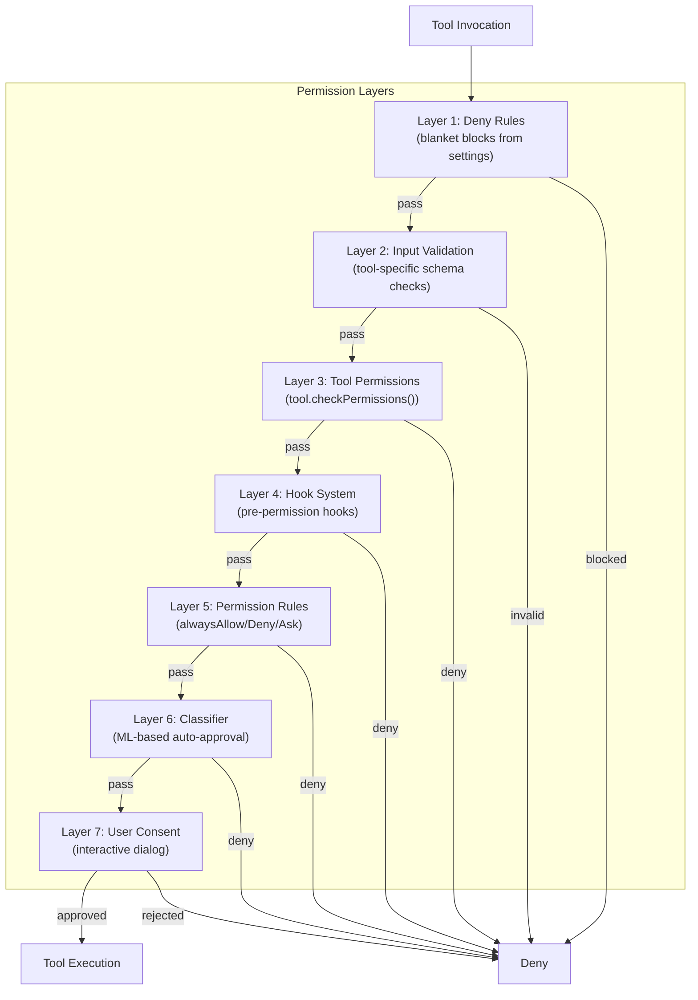
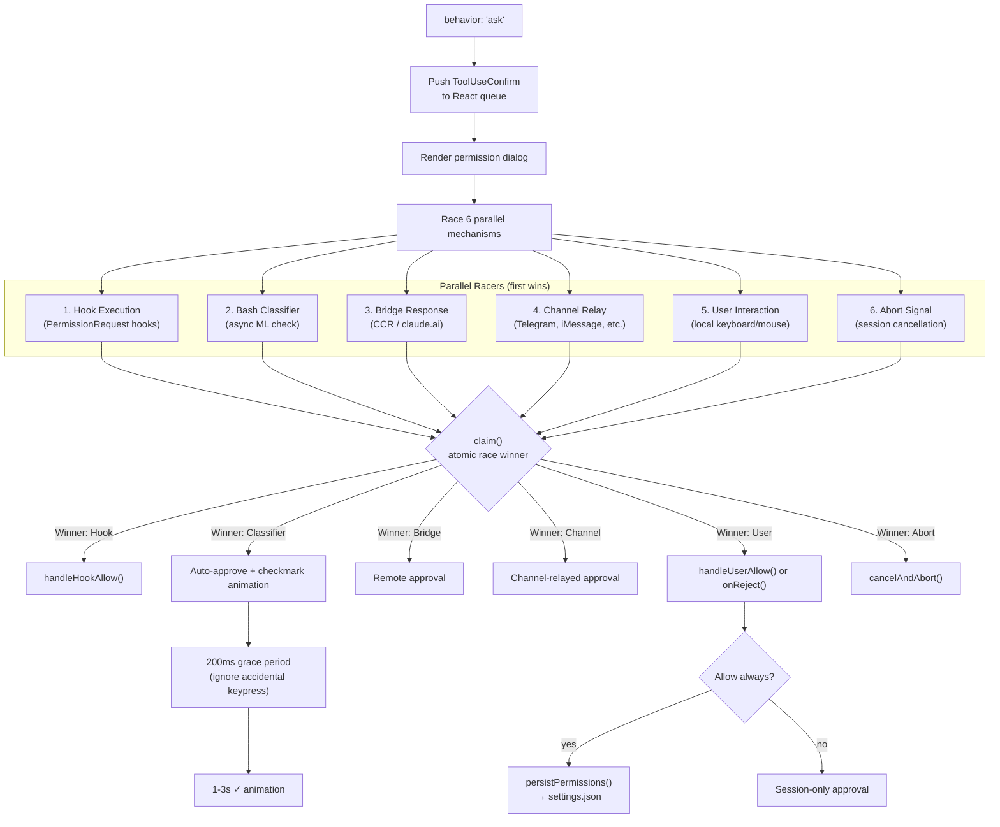
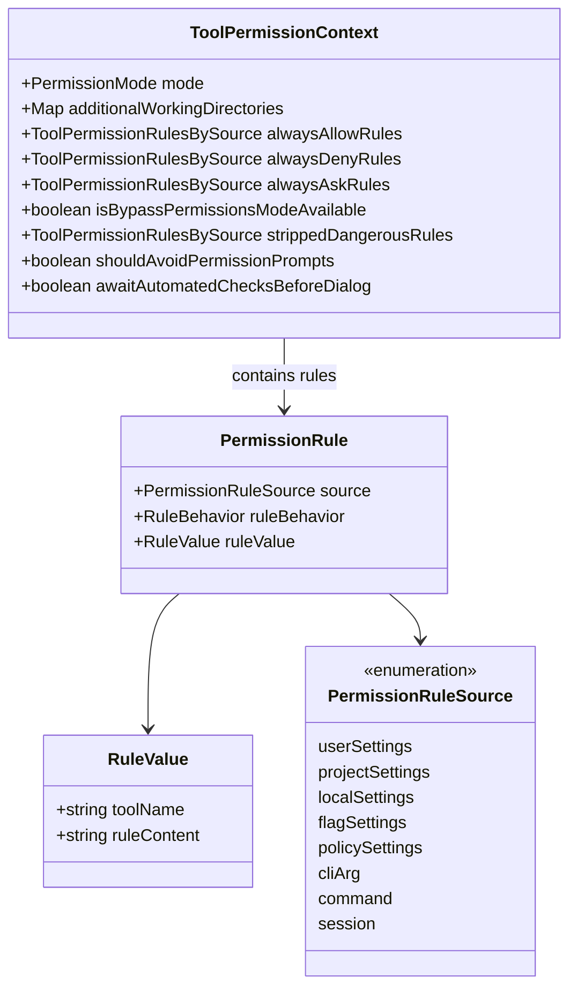
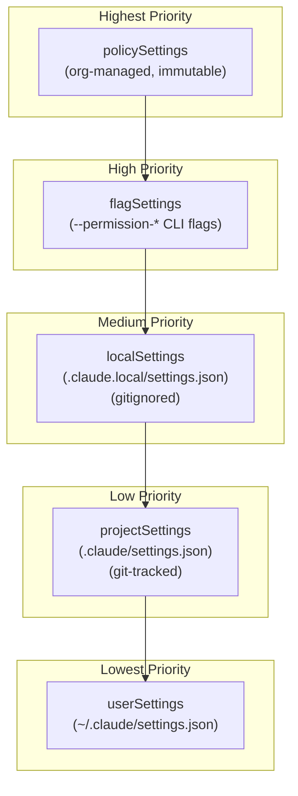
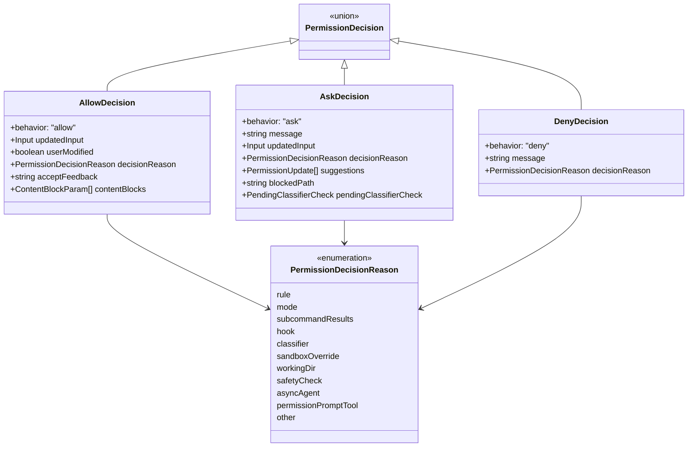
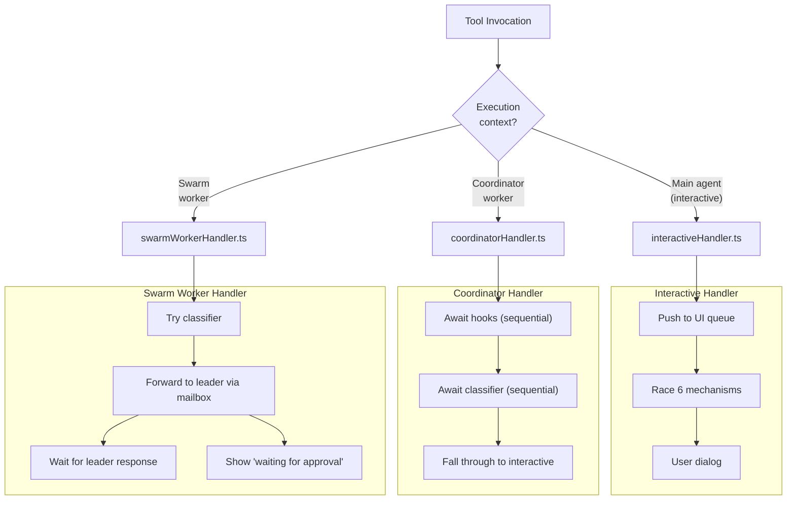
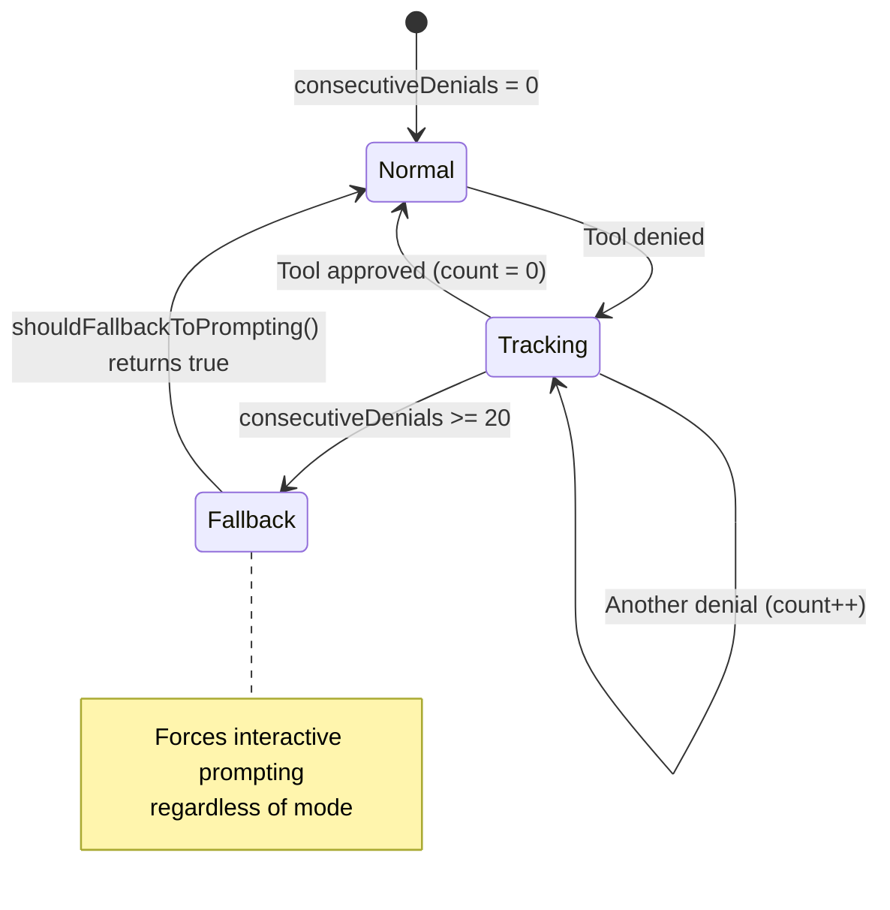
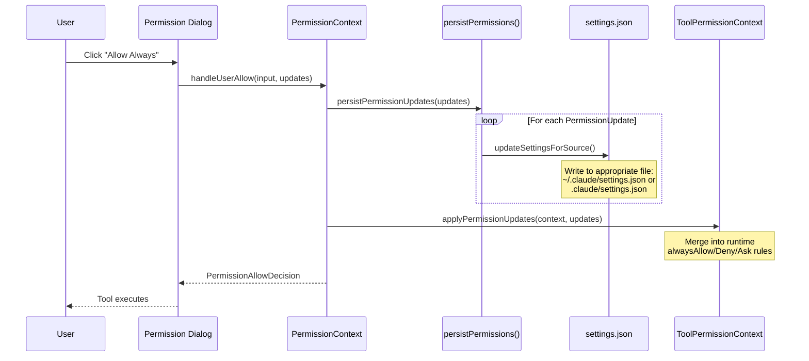

# Permission System

## Architecture Overview

The permission system (`src/hooks/toolPermission/`) is the security backbone of Claude Code. Every tool invocation passes through multi-layered permission checks before execution.

The system is designed around a principle of defense-in-depth: rather than relying on a single check, every tool call passes through up to seven distinct layers. Each layer has a narrower scope than the last, progressing from blanket organizational policy down to individual user consent. This design ensures that even if one layer is misconfigured or bypassed (e.g., a user running in `bypassPermissions` mode), safety-critical checks such as deny rules and path safety checks still fire.

The entry point for all permission checks is the `hasPermissionsToUseTool` function in `src/utils/permissions/permissions.ts`, which delegates to `hasPermissionsToUseToolInner` for the core pipeline. The result is then post-processed based on the current permission mode (auto, dontAsk, etc.) before being returned to the caller.



### Layer-by-Layer Explanation

**Layer 1 -- Deny Rules (Steps 1a/1b in source).** The very first check looks up whether the tool as a whole is listed in any `alwaysDeny` rule across all settings sources. This is a blanket block: if an organization's policy settings deny the `Bash` tool, no amount of user-level allow rules can override it. The `getDenyRuleForTool()` function in `permissions.ts` scans all rule sources in priority order and returns the first matching deny rule. Similarly, `alwaysAsk` rules are checked here -- if a tool has an ask rule and is not eligible for sandbox auto-allow, the pipeline returns `{behavior: 'ask'}` immediately.

```typescript
// src/utils/permissions/permissions.ts (Step 1a)
const denyRule = getDenyRuleForTool(appState.toolPermissionContext, tool)
if (denyRule) {
  return {
    behavior: 'deny',
    decisionReason: { type: 'rule', rule: denyRule },
    message: `Permission to use ${tool.name} has been denied.`,
  }
}
```

**Layer 2 -- Input Validation (Step 1c).** The tool's Zod input schema is parsed via `tool.inputSchema.parse(input)`. If the schema rejects the input (e.g., a malformed file path), the pipeline logs the error and falls through with a `passthrough` behavior rather than crashing.

**Layer 3 -- Tool-Specific Permissions (Steps 1c-1g).** Each tool implements a `checkPermissions(parsedInput, context)` method that returns a `PermissionResult`. This is where the Bash tool checks individual subcommands against prefix rules, the Edit tool validates target paths against the working directory, and safety checks for protected paths (`.git/`, `.claude/`, shell configs) are enforced. The tool can return `allow`, `deny`, `ask`, or `passthrough`. Critically, safety checks (step 1g) and content-specific ask rules (step 1f) are **bypass-immune** -- they fire even in `bypassPermissions` mode.

```typescript
// src/utils/permissions/permissions.ts (Step 1g)
// Safety checks are bypass-immune
if (
  toolPermissionResult?.behavior === 'ask' &&
  toolPermissionResult.decisionReason?.type === 'safetyCheck'
) {
  return toolPermissionResult
}
```

**Layer 4 -- Hook System.** `PermissionRequest` hooks are external processes configured in `settings.json` that can intercept permission decisions. They run asynchronously and can return allow (with optional updated permissions), deny (with optional interrupt), or no decision (fall through). Hooks are the primary extensibility point for CI/CD pipelines and custom approval workflows.

**Layer 5 -- Permission Rules (Steps 2a-2b).** After bypass-immune checks pass, the pipeline checks `bypassPermissions` mode (step 2a) and then looks for tool-wide allow rules via `toolAlwaysAllowedRule()` (step 2b). If neither applies, the tool's `passthrough` result is converted to an `ask` decision (step 3).

**Layer 6 -- Classifier.** When the `TRANSCRIPT_CLASSIFIER` feature flag is enabled and the user is in `auto` mode, an ML classifier evaluates the action. The classifier is a separate LLM API call (via `classifyYoloAction` in `yoloClassifier.ts`) that examines the conversation transcript and the pending tool invocation to decide if it is safe. For the `BASH_CLASSIFIER` feature, a lighter-weight check runs specifically on bash commands.

**Layer 7 -- User Consent.** If nothing above resolved the decision, the interactive permission dialog is shown to the user. This layer is handled by one of three context-specific handlers (interactive, coordinator, or swarm worker).

### Why Seven Layers Instead of a Simpler System

The seven-layer architecture exists because Claude Code operates across radically different trust boundaries:

1. **Organizational control** (policySettings deny rules) must be absolute -- an IT department needs tools blocked regardless of user preference.
2. **Safety invariants** (protected paths, shell configs) must hold even when users opt into risky modes like `bypassPermissions`.
3. **User convenience** (allow rules, mode-based auto-approval) should minimize friction for trusted operations.
4. **Extensibility** (hooks) allows custom approval workflows without modifying the core pipeline.
5. **Intelligence** (classifiers) can approve routine operations without user interruption.
6. **User agency** (interactive dialog) remains the fallback for everything else.

A simpler two-layer system (rules + user prompt) would fail to provide organizational override, safety invariants in bypass mode, or intelligent auto-approval. Each layer serves a distinct trust stakeholder.

## Permission Modes

The permission mode determines the system's behavior when no explicit rule matches a tool invocation. Modes are set via settings, CLI flags, or slash commands and stored in `ToolPermissionContext.mode`.

```mermaid
stateDiagram-v2
    [*] --> Default : Normal startup
    [*] --> Auto : TRANSCRIPT_CLASSIFIER enabled
    [*] --> BypassPermissions : bypass permissions flag

    Default --> Plan : /plan command
    Plan --> Default : ExitPlanMode

    Default --> AcceptEdits : User switches mode
    Default --> DontAsk : User switches mode
    AcceptEdits --> Default : User switches back
    DontAsk --> Default : User switches back

    state Default {
        [*] --> D_CheckRules
        D_CheckRules --> D_Allow : alwaysAllow match
        D_CheckRules --> D_Deny : alwaysDeny match
        D_CheckRules --> D_AskUser : No matching rule
        D_AskUser --> D_Allow : User approves
        D_AskUser --> D_Deny : User rejects
    }

    state Auto {
        [*] --> A_ClassifierCheck
        A_ClassifierCheck --> A_Allow : Classified safe
        A_ClassifierCheck --> A_AskUser : Uncertain
        A_AskUser --> A_Allow : User approves
        A_AskUser --> A_Deny : User rejects
    }

    state BypassPermissions {
        [*] --> BP_AllowAll : All tools auto approved
    }

    state Plan {
        [*] --> P_ReadOnly : Read only tools only
    }

    state AcceptEdits {
        [*] --> AE_AutoEdits : File edits auto approved
        AE_AutoEdits --> AE_AskOther : Non edit tools prompt
    }

    state DontAsk {
        [*] --> DA_DenyUnknown : Deny unless explicitly allowed
    }
```

| Mode | Behavior | Risk Level |
|------|----------|-----------|
| `default` | Ask user when no rule matches | Low |
| `plan` | Read-only tools only, explicit approval | Lowest |
| `acceptEdits` | Auto-allow file edits, ask for others | Medium |
| `bypassPermissions` | Allow everything | Highest |
| `dontAsk` | Deny unless explicitly allowed | Low |
| `auto` | ML classifier decides (ant-only) | Medium |

### Mode Use Cases and Interactions

**`default`** is the standard interactive mode. Every tool invocation that is not covered by an allow or deny rule prompts the user. This is the safest mode for general development work.

**`plan`** restricts Claude to read-only tools. When a user enters plan mode via the `/plan` command, the `ToolPermissionContext.mode` is set to `'plan'`. Tools that require write access return `{behavior: 'ask'}` from their `checkPermissions()`. If the user originally started in `bypassPermissions` mode and switches to plan, the `isBypassPermissionsModeAvailable` flag remains set, so switching back restores full bypass.

**`acceptEdits`** is a productivity mode that auto-approves file edit operations (Edit, Write, NotebookEdit) within the working directory while still prompting for shell commands and other tools. In `auto` mode, the system uses `acceptEdits` as a fast-path heuristic: before invoking the expensive classifier API call, it checks whether the action would be allowed under `acceptEdits` semantics and, if so, skips the classifier entirely.

```typescript
// src/utils/permissions/permissions.ts -- acceptEdits fast-path in auto mode
const acceptEditsResult = await tool.checkPermissions(parsedInput, {
  ...context,
  getAppState: () => {
    const state = context.getAppState()
    return {
      ...state,
      toolPermissionContext: {
        ...state.toolPermissionContext,
        mode: 'acceptEdits' as const,
      },
    }
  },
})
if (acceptEditsResult.behavior === 'allow') {
  // Skip classifier -- action is safe under acceptEdits semantics
  return { behavior: 'allow', updatedInput: ... }
}
```

**`bypassPermissions`** auto-allows everything except safety-check paths and content-specific ask rules (steps 1f and 1g). This mode is intended for trusted automated workflows. Deny rules from settings still fire (step 1a), and protected-path safety checks still prompt (step 1g).

**`dontAsk`** is the inverse of `bypassPermissions`: any tool invocation that would normally prompt the user is instead automatically denied. This is useful for non-interactive/headless sessions where user interaction is impossible. The transformation happens as post-processing in `hasPermissionsToUseTool`:

```typescript
// src/utils/permissions/permissions.ts -- dontAsk mode transformation
if (appState.toolPermissionContext.mode === 'dontAsk') {
  return {
    behavior: 'deny',
    decisionReason: { type: 'mode', mode: 'dontAsk' },
    message: DONT_ASK_REJECT_MESSAGE(tool.name),
  }
}
```

**`auto`** (internal, ant-only, gated on `TRANSCRIPT_CLASSIFIER`) uses an ML classifier to decide whether to approve or block an action without user interaction. The classifier is invoked via `classifyYoloAction()`, which makes a separate LLM API call with the conversation transcript and the pending action. Before reaching the classifier, three fast-paths are checked: (1) safe-tool allowlist (`isAutoModeAllowlistedTool`), (2) `acceptEdits` simulation, and (3) PowerShell guard. The mode also includes denial tracking to detect runaway loops.

**`bubble`** is an internal mode (not user-addressable) used in specific coordination contexts.

Modes interact with rules through a strict ordering: deny rules and safety checks always win over any mode, while modes only affect the fallback behavior for unmatched tools.

## Permission Decision Flow

The following diagram traces the exact path through `hasPermissionsToUseToolInner` and the post-processing in `hasPermissionsToUseTool`. Step numbers correspond to comments in the source code.

```mermaid
flowchart TD
    Start["canUseTool(tool, input, context)"] --> DenyRules{"Step 1:<br/>Deny rules match?"}

    DenyRules -->|yes| Denied["Return DENY<br/>(blanket block)"]
    DenyRules -->|no| Validate{"Step 2:<br/>validateInput()?"}

    Validate -->|invalid| Denied
    Validate -->|valid| ToolCheck{"Step 3:<br/>tool.checkPermissions()"}

    ToolCheck -->|deny| Denied
    ToolCheck -->|allow| Allowed["Return ALLOW"]
    ToolCheck -->|ask| Hooks{"Step 4:<br/>Permission hooks?"}

    Hooks -->|hook resolves| HookDecision{"Hook decision?"}
    HookDecision -->|allow| Allowed
    HookDecision -->|deny| Denied
    Hooks -->|no hook| Rules{"Step 5:<br/>Permission rules match?"}

    Rules -->|alwaysAllow| Allowed
    Rules -->|alwaysDeny| Denied
    Rules -->|alwaysAsk| AskUser
    Rules -->|no match| ModeCheck{"Step 6:<br/>Permission mode?"}

    ModeCheck -->|default| AskUser["Show interactive dialog"]
    ModeCheck -->|bypass| Allowed
    ModeCheck -->|acceptEdits| EditCheck{"Is file edit?"}
    ModeCheck -->|dontAsk| Denied
    ModeCheck -->|auto| Classifier["Step 6b:<br/>Run classifier"]

    EditCheck -->|yes| Allowed
    EditCheck -->|no| AskUser

    Classifier -->|safe| Allowed
    Classifier -->|unsafe| AskUser
    Classifier -->|uncertain| AskUser

    AskUser --> UserDecision{"User response?"}
    UserDecision -->|Allow once| Allowed
    UserDecision -->|Allow always| PersistAllow["Persist rule + ALLOW"]
    UserDecision -->|Reject| Denied
    UserDecision -->|Abort (Ctrl+C)| Denied
```

### Walkthrough: A Bash Command Example

Consider a user running `git push origin main` in default mode with no pre-existing rules:

1. **Step 1a:** `getDenyRuleForTool()` checks all `alwaysDeny` rules -- no match for `Bash`.
2. **Step 1b:** `getAskRuleForTool()` checks all `alwaysAsk` rules -- no match.
3. **Step 1c:** `tool.checkPermissions()` is called on BashTool. It parses the command, splits subcommands, and checks each against prefix/wildcard/exact allow rules. `git push` has no matching allow rule, so it returns `{behavior: 'passthrough', decisionReason: {type: 'subcommandResults', ...}}`.
4. **Step 1d-1g:** Not a deny, not a requiresUserInteraction tool, not a content-specific ask rule, not a safety check. Falls through.
5. **Step 2a:** Mode is `default`, not `bypassPermissions`. Falls through.
6. **Step 2b:** No tool-wide allow rule for `Bash`. Falls through.
7. **Step 3:** The `passthrough` result is converted to `{behavior: 'ask'}`.
8. Post-processing: Mode is `default`, not `dontAsk` or `auto`. The `ask` result is returned.
9. The caller (`useCanUseTool`) displays the interactive permission dialog.

If the user clicks "Allow always" with a suggestion of `Bash(git *)`, the rule `git *` is persisted to `.claude.local/settings.json` under `permissions.allow`. Next time `git push` runs, step 1c's BashTool `checkPermissions` will match the wildcard rule and return `{behavior: 'allow'}`.

## Interactive Permission Handler

When the decision is `ask`, the interactive handler races multiple approval mechanisms:



### The 6-Way Race Mechanism

The interactive handler in `src/hooks/toolPermission/handlers/interactiveHandler.ts` uses a race pattern rather than sequential checks for a critical reason: **latency optimization under uncertainty**.

When a permission prompt appears, the system does not know which approval source will respond first. A PermissionRequest hook might respond in 10ms (local script), the bash classifier might take 500ms (LLM API call), a bridge response from claude.ai might take 2 seconds, a channel relay via Telegram might take minutes, or the user might respond immediately or walk away. Sequential checking would force the user to wait for each automated mechanism to complete before being shown the prompt.

Instead, all mechanisms start simultaneously. The dialog is rendered immediately (so the user can respond at any time), while hooks, classifiers, bridge, and channels run concurrently in the background. The `createResolveOnce` utility provides the atomic race resolution:

```typescript
// src/hooks/toolPermission/PermissionContext.ts
function createResolveOnce<T>(resolve: (value: T) => void): ResolveOnce<T> {
  let claimed = false
  let delivered = false
  return {
    resolve(value: T) {
      if (delivered) return
      delivered = true
      claimed = true
      resolve(value)
    },
    isResolved() {
      return claimed
    },
    claim() {
      if (claimed) return false
      claimed = true
      return true
    },
  }
}
```

The `claim()` method is critical: it atomically checks and marks the race as won. Every callback (onAllow, onReject, onAbort, hook completion, classifier completion, bridge response, channel response) calls `claim()` first. Only the caller that gets `true` from `claim()` proceeds to resolve the promise; all others silently exit. This prevents double-resolution even when multiple async paths complete near-simultaneously.

### Why the 200ms Grace Period

When the classifier auto-approves a bash command, the handler shows a brief checkmark animation (1-3 seconds depending on terminal focus). But there is a subtlety: between the dialog rendering and the classifier responding, the user may have already started pressing keys (e.g., arrow keys to navigate the options). The 200ms grace period in `onUserInteraction()` prevents these early, reflexive keypresses from canceling the classifier's auto-approval:

```typescript
// src/hooks/toolPermission/handlers/interactiveHandler.ts
onUserInteraction() {
  const GRACE_PERIOD_MS = 200
  if (Date.now() - permissionPromptStartTimeMs < GRACE_PERIOD_MS) {
    return
  }
  userInteracted = true
  clearClassifierChecking(ctx.toolUseID)
  clearClassifierIndicator()
},
```

After the grace period, any user interaction is treated as intentional engagement with the dialog. The `userInteracted` flag is set, and the classifier's `shouldContinue` callback returns `false`, preventing the classifier from overriding the user's in-progress interaction.

### Cleanup and Cross-Race Cancellation

When one racer wins, it must clean up all other racers to prevent stale prompts and resource leaks:

- **Bridge cleanup:** The winner calls `bridgeCallbacks.cancelRequest(bridgeRequestId)` to dismiss the prompt on claude.ai.
- **Channel cleanup:** The winner calls `channelUnsubscribe?.()` to remove the reply listener and abort-signal handler.
- **Queue cleanup:** The winner calls `ctx.removeFromQueue()` to remove the dialog from the React render queue.
- **Classifier cleanup:** The winner calls `clearClassifierChecking(ctx.toolUseID)` and `clearClassifierIndicator()` to stop the spinner.

The `channelUnsubscribe` pattern is noteworthy: it wraps both the map-entry deletion and the abort-listener teardown into a single function, ensuring both cleanups happen at every call site. Without this, dead closures would remain registered on the session-scoped abort signal, holding references alive for the session duration.

## Permission Rules



### Rule Format

Rules follow the pattern `ToolName[(content)]`:

| Rule | Meaning |
|------|---------|
| `Bash` | All bash commands |
| `Bash(python:*)` | Bash commands starting with `python:` |
| `Bash(git *)` | Bash commands starting with `git ` |
| `Edit(/path/to/file.ts)` | Edit a specific file |
| `FileRead` | All file reads |
| `mcp__server__tool` | Specific MCP tool |

The rule format is parsed by `permissionRuleValueFromString()` in `src/utils/permissions/permissionRuleParser.ts`. The parser handles escaped parentheses to support commands containing literal parentheses (e.g., `python -c "print(1)"`):

```typescript
// src/utils/permissions/permissionRuleParser.ts
export function permissionRuleValueFromString(ruleString: string): PermissionRuleValue {
  const openParenIndex = findFirstUnescapedChar(ruleString, '(')
  if (openParenIndex === -1) {
    return { toolName: normalizeLegacyToolName(ruleString) }
  }
  const closeParenIndex = findLastUnescapedChar(ruleString, ')')
  // ...parse and unescape content...
  const ruleContent = unescapeRuleContent(rawContent)
  return { toolName: normalizeLegacyToolName(toolName), ruleContent }
}
```

**Legacy tool name normalization.** When tools are renamed (e.g., `Task` to `Agent`, `KillShell` to `TaskStop`), the `LEGACY_TOOL_NAME_ALIASES` map in `permissionRuleParser.ts` ensures old rule strings still match their canonical tools. The normalization runs during both parsing and serialization.

**Rule content matching for shell tools** uses three strategies, defined in `src/utils/permissions/shellRuleMatching.ts`:

1. **Exact match:** `npm install` matches only the literal command `npm install`.
2. **Prefix match (legacy `:*` syntax):** `npm:*` matches any command starting with `npm`.
3. **Wildcard match (`*` syntax):** `git * --force` matches `git push --force`, `git reset --force`, etc. Wildcards are converted to regex patterns. A single trailing `*` after a space (e.g., `git *`) is made optional so `git *` matches both `git add` and bare `git`.

```typescript
// src/utils/permissions/shellRuleMatching.ts
export function parsePermissionRule(permissionRule: string): ShellPermissionRule {
  const prefix = permissionRuleExtractPrefix(permissionRule) // legacy :*
  if (prefix !== null) return { type: 'prefix', prefix }
  if (hasWildcards(permissionRule)) return { type: 'wildcard', pattern: permissionRule }
  return { type: 'exact', command: permissionRule }
}
```

**MCP tool matching** supports both fully-qualified names (`mcp__server1__tool1`) and server-level wildcards (`mcp__server1` or `mcp__server1__*`) via `mcpInfoFromString()`. A rule targeting `mcp__server1` matches all tools from that server.

### Settings File Hierarchy (Priority Order)

Rules are loaded from multiple sources and merged. Higher-priority sources take precedence. The `PERMISSION_RULE_SOURCES` array defines the evaluation order:

```typescript
// src/utils/permissions/permissions.ts
const PERMISSION_RULE_SOURCES = [
  ...SETTING_SOURCES,  // policySettings, flagSettings, localSettings, projectSettings, userSettings
  'cliArg',
  'command',
  'session',
] as const
```



**policySettings** are managed by organizations via MDM (Mobile Device Management). When `allowManagedPermissionRulesOnly` is set in policy settings, all other rule sources are ignored -- only policy rules apply. This is enforced in `loadAllPermissionRulesFromDisk()`:

```typescript
// src/utils/permissions/permissionsLoader.ts
export function loadAllPermissionRulesFromDisk(): PermissionRule[] {
  if (shouldAllowManagedPermissionRulesOnly()) {
    return getPermissionRulesForSource('policySettings')
  }
  // Otherwise, load from all enabled sources
  const rules: PermissionRule[] = []
  for (const source of getEnabledSettingSources()) {
    rules.push(...getPermissionRulesForSource(source))
  }
  return rules
}
```

**localSettings** (`.claude.local/settings.json`) is the default destination for user-persisted rules. It is gitignored, so per-developer preferences do not leak into the repository. When a user clicks "Allow always" in the permission dialog, the rule is written here.

**projectSettings** (`.claude/settings.json`) is git-tracked and shared across team members. Teams use this to pre-approve common operations (e.g., `Bash(npm test:*)`).

**session** and **command** sources are transient -- they exist only in memory for the current session or command invocation and are never persisted to disk.

### Why Permission Persistence Is Per-Source

Each permission rule carries its source (where it came from), and persistence operations target the appropriate settings file based on the `destination` field of the `PermissionUpdate`. The `supportsPersistence()` function restricts disk writes to the three editable sources:

```typescript
// src/utils/permissions/PermissionUpdate.ts
export function supportsPersistence(
  destination: PermissionUpdateDestination,
): destination is EditableSettingSource {
  return (
    destination === 'localSettings' ||
    destination === 'userSettings' ||
    destination === 'projectSettings'
  )
}
```

This prevents accidental writes to policy or flag settings (which are read-only from the CLI's perspective) and avoids persisting session-only approvals that should expire when the session ends.

## Permission Decision Types



The `PermissionDecisionReason` discriminated union is used throughout the system to provide context about why a particular decision was made. This serves both the user-facing UI (which uses it to generate explanatory messages via `createPermissionRequestMessage()`) and analytics (which logs the reason type to track classifier accuracy, rule coverage, and user override rates).

The `AskDecision` type carries two notable fields:

- **`suggestions`**: An array of `PermissionUpdate` objects that the dialog can offer as "Allow always" options. For example, when a `git push` command prompts, the suggestion might be `{type: 'addRules', rules: [{toolName: 'Bash', ruleContent: 'git *'}], behavior: 'allow', destination: 'localSettings'}`.
- **`pendingClassifierCheck`**: A handle to an in-flight classifier check (bash classifier) that the interactive handler can race against user interaction.

## Three Permission Handlers

Different execution contexts use different permission handlers:



### Why Different Contexts Need Different Handlers

The three handlers exist because each execution context has fundamentally different constraints on user interaction:

**Interactive handler** (`src/hooks/toolPermission/handlers/interactiveHandler.ts`) is the main-agent handler for terminal sessions. It has full access to the terminal UI and can render permission dialogs, receive keyboard input, and display animations. This is the only handler that pushes items to the React render queue via `ctx.pushToQueue()`. It races all six mechanisms in parallel because it can display the dialog immediately while awaiting automated responses.

**Coordinator handler** (`src/hooks/toolPermission/handlers/coordinatorHandler.ts`) is used when `awaitAutomatedChecksBeforeDialog` is set in the permission context. This flag is set for coordinator workers in multi-agent orchestration. These workers run automated checks (hooks, then classifier) sequentially before falling through to the interactive dialog. The sequential approach avoids showing a dialog that might be immediately dismissed by a hook -- in coordinator mode, automated checks should resolve most permissions without user interruption.

```typescript
// src/hooks/toolPermission/handlers/coordinatorHandler.ts
async function handleCoordinatorPermission(params): Promise<PermissionDecision | null> {
  const { ctx, updatedInput, suggestions, permissionMode } = params
  try {
    // 1. Try permission hooks first (fast, local)
    const hookResult = await ctx.runHooks(permissionMode, suggestions, updatedInput)
    if (hookResult) return hookResult
    // 2. Try classifier (slow, inference -- bash only)
    const classifierResult = feature('BASH_CLASSIFIER')
      ? await ctx.tryClassifier?.(params.pendingClassifierCheck, updatedInput)
      : null
    if (classifierResult) return classifierResult
  } catch (error) {
    logError(error instanceof Error ? error : new Error(`Automated permission check failed: ${String(error)}`))
  }
  // 3. Neither resolved -- fall through to interactive dialog
  return null
}
```

**Swarm worker handler** (`src/hooks/toolPermission/handlers/swarmWorkerHandler.ts`) is used when the agent is running as a swarm worker -- a sub-agent in a multi-agent swarm. Swarm workers cannot display local permission dialogs (they have no terminal). Instead, they: (1) attempt classifier auto-approval for bash commands, (2) forward the permission request to the swarm leader via a filesystem-based mailbox, (3) register a callback for the leader's response, and (4) display a "waiting for approval" indicator. The leader agent aggregates permission requests from all workers and presents them in its own interactive UI.

```typescript
// src/hooks/toolPermission/handlers/swarmWorkerHandler.ts (key sequence)
// Register callback BEFORE sending request to avoid race condition
registerPermissionCallback({
  requestId: request.id,
  toolUseId: ctx.toolUseID,
  async onAllow(allowedInput, permissionUpdates, feedback, contentBlocks) {
    if (!claim()) return
    clearPendingRequest()
    resolveOnce(await ctx.handleUserAllow(finalInput, permissionUpdates, ...))
  },
  onReject(feedback, contentBlocks) {
    if (!claim()) return
    clearPendingRequest()
    resolveOnce(ctx.cancelAndAbort(feedback, undefined, contentBlocks))
  },
})
// Now send the request
void sendPermissionRequestViaMailbox(request)
```

The handler selection logic is in `useCanUseTool.tsx`. On an `ask` result, the flow is:
1. If `awaitAutomatedChecksBeforeDialog` is set, try coordinator handler first.
2. If coordinator returns null (or was not tried), try swarm worker handler.
3. If swarm worker returns null (not a swarm worker or swarms disabled), fall through to interactive handler.

## Denial Tracking

The denial tracking system prevents runaway loops in `auto` mode where the classifier repeatedly blocks actions, causing the agent to retry indefinitely.



### The Denial Tracking Fallback Mechanism

Denial tracking is implemented in `src/utils/permissions/denialTracking.ts` with two thresholds:

```typescript
// src/utils/permissions/denialTracking.ts
export const DENIAL_LIMITS = {
  maxConsecutive: 3,   // 3 consecutive denials triggers fallback
  maxTotal: 20,        // 20 total denials in session triggers fallback
} as const

export function shouldFallbackToPrompting(state: DenialTrackingState): boolean {
  return (
    state.consecutiveDenials >= DENIAL_LIMITS.maxConsecutive ||
    state.totalDenials >= DENIAL_LIMITS.maxTotal
  )
}
```

The `consecutiveDenials` counter resets to zero on any successful tool execution (even one auto-allowed by rules). The `totalDenials` counter accumulates across the session and resets only when the total limit is hit and the user is prompted.

When the fallback triggers, the behavior depends on the execution context:

- **Interactive (CLI) mode:** The system converts the `deny` into an `ask`, showing the user the classifier's reason along with a warning message. This lets the user review the transcript and manually approve or reject. The `totalDenials` counter resets after the prompt to prevent infinite looping.
- **Headless mode:** The system throws an `AbortError` to terminate the agent, since no user is available to review the blocked actions.

```typescript
// src/utils/permissions/permissions.ts -- handleDenialLimitExceeded
if (isHeadless) {
  throw new AbortError('Agent aborted: too many classifier denials in headless mode')
}
// ...interactive fallback returns {behavior: 'ask', ...warning}
```

The denial state is persisted differently depending on context: for normal agents it goes through `context.setAppState()` (React state), while for async subagents with `localDenialTracking`, the state is mutated in-place via `Object.assign` since `setAppState` is a no-op for subagents.

## Permission Persistence Flow



### Persistence Implementation Details

The `handleUserAllow()` method in `PermissionContext.ts` orchestrates the persistence flow:

```typescript
// src/hooks/toolPermission/PermissionContext.ts
async handleUserAllow(
  updatedInput, permissionUpdates, feedback,
  permissionPromptStartTimeMs, contentBlocks, decisionReason,
): Promise<PermissionAllowDecision> {
  const acceptedPermanentUpdates = await this.persistPermissions(permissionUpdates)
  this.logDecision(
    { decision: 'accept', source: { type: 'user', permanent: acceptedPermanentUpdates } },
    { input: updatedInput, permissionPromptStartTimeMs },
  )
  const userModified = tool.inputsEquivalent
    ? !tool.inputsEquivalent(input, updatedInput)
    : false
  return this.buildAllow(updatedInput, { userModified, decisionReason, ... })
}
```

The `persistPermissions()` method calls `persistPermissionUpdates()` (which writes to the settings file) and then `applyPermissionUpdates()` (which updates the in-memory `ToolPermissionContext` so subsequent permission checks reflect the new rules without a restart). The `supportsPersistence()` check ensures only editable destinations (`localSettings`, `userSettings`, `projectSettings`) trigger disk writes.

The `persistPermissionUpdate()` function in `src/utils/permissions/PermissionUpdate.ts` handles six update types: `addRules`, `removeRules`, `replaceRules`, `addDirectories`, `removeDirectories`, and `setMode`. For `addRules`, it uses a lenient settings loader that falls back to raw JSON parsing if the schema validator fails on unrelated fields (e.g., malformed hooks), preventing permission persistence from being blocked by unrelated configuration errors.

When `allowManagedPermissionRulesOnly` is enabled in policy settings, `addPermissionRulesToSettings()` returns `false` without writing -- organizations can completely lock down rule creation.

## Analytics and Telemetry

All permission decisions flow through `logPermissionDecision()` in `src/hooks/toolPermission/permissionLogging.ts`, which fans out to three telemetry sinks:

1. **Statsig analytics events** (e.g., `tengu_tool_use_granted_by_classifier`) for funnel analysis.
2. **OpenTelemetry counters** for real-time monitoring.
3. **Code-edit tool OTel counters** enriched with language metadata (derived from the target file path) for Edit/Write/NotebookEdit tools.

Permission decisions are also stored on the `toolUseContext.toolDecisions` map, allowing downstream code to inspect what happened for each tool invocation.

### Analytics Events

| Event | Trigger |
|-------|---------|
| `tengu_tool_use_granted_in_config` | Auto-approved by allowlist |
| `tengu_tool_use_granted_by_classifier` | Classifier auto-approved |
| `tengu_tool_use_granted_in_prompt_permanent` | User approved "always" |
| `tengu_tool_use_granted_in_prompt_temporary` | User approved "once" |
| `tengu_tool_use_granted_by_permission_hook` | Hook auto-approved |
| `tengu_tool_use_denied_in_config` | Denied by denylist |
| `tengu_tool_use_rejected_in_prompt` | User rejected |
| `tengu_tool_use_cancelled` | Tool use cancelled (abort) |
| `tengu_auto_mode_decision` | Auto mode classifier decision (allowed/blocked/unavailable) |
| `tengu_auto_mode_denial_limit_exceeded` | Denial tracking fallback triggered |

## Source References

| File | Purpose |
|------|---------|
| `src/hooks/toolPermission/PermissionContext.ts` | Core permission context factory: `createPermissionContext()`, `createResolveOnce()`, `handleUserAllow()`, `handleHookAllow()`, `persistPermissions()`, `cancelAndAbort()`, `tryClassifier()`, `runHooks()` |
| `src/hooks/toolPermission/permissionLogging.ts` | Centralized analytics/telemetry: `logPermissionDecision()`, `logApprovalEvent()`, `logRejectionEvent()`, code-edit OTel counters |
| `src/hooks/toolPermission/handlers/interactiveHandler.ts` | Main-agent interactive handler: 6-way race, bridge/channel relay, classifier auto-approve with checkmark animation, 200ms grace period |
| `src/hooks/toolPermission/handlers/coordinatorHandler.ts` | Coordinator worker handler: sequential hook + classifier, fall through to interactive |
| `src/hooks/toolPermission/handlers/swarmWorkerHandler.ts` | Swarm worker handler: classifier, mailbox forwarding to leader, pending indicator |
| `src/hooks/useCanUseTool.tsx` | React hook: handler selection logic (coordinator -> swarm -> interactive), speculative classifier check |
| `src/utils/permissions/permissions.ts` | Main permission pipeline: `hasPermissionsToUseTool()`, `hasPermissionsToUseToolInner()`, `checkRuleBasedPermissions()`, rule matching (`toolMatchesRule`, `toolAlwaysAllowedRule`, `getDenyRuleForTool`, `getAskRuleForTool`, `getRuleByContentsForTool`), auto mode classifier orchestration, denial limit handling |
| `src/utils/permissions/permissionRuleParser.ts` | Rule string parsing: `permissionRuleValueFromString()`, `permissionRuleValueToString()`, `escapeRuleContent()`, `unescapeRuleContent()`, legacy tool name normalization |
| `src/utils/permissions/PermissionRule.ts` | Zod schemas for `PermissionBehavior` and `PermissionRuleValue` |
| `src/utils/permissions/PermissionMode.ts` | Mode definitions, config, display strings: `permissionModeTitle()`, `isExternalPermissionMode()`, `permissionModeFromString()` |
| `src/utils/permissions/PermissionUpdate.ts` | Persistence logic: `applyPermissionUpdate()`, `applyPermissionUpdates()`, `persistPermissionUpdate()`, `persistPermissionUpdates()`, `supportsPersistence()` |
| `src/utils/permissions/PermissionResult.ts` | Type re-exports for `PermissionDecision`, `PermissionAllowDecision`, `PermissionDenyDecision`, `PermissionAskDecision` |
| `src/utils/permissions/permissionsLoader.ts` | Settings file I/O: `loadAllPermissionRulesFromDisk()`, `addPermissionRulesToSettings()`, `deletePermissionRuleFromSettings()`, `shouldAllowManagedPermissionRulesOnly()` |
| `src/utils/permissions/shellRuleMatching.ts` | Shell command matching: `parsePermissionRule()`, `matchWildcardPattern()`, `permissionRuleExtractPrefix()`, `hasWildcards()` |
| `src/utils/permissions/denialTracking.ts` | Denial tracking: `createDenialTrackingState()`, `recordDenial()`, `recordSuccess()`, `shouldFallbackToPrompting()`, `DENIAL_LIMITS` |
| `src/utils/permissions/classifierDecision.ts` | Safe-tool allowlist for auto mode: `isAutoModeAllowlistedTool()`, `SAFE_YOLO_ALLOWLISTED_TOOLS` |
| `src/utils/permissions/yoloClassifier.ts` | Auto mode ML classifier: `classifyYoloAction()`, `formatActionForClassifier()`, prompts from `yolo-classifier-prompts/` |
| `src/types/permissions.ts` | Pure type definitions: `PermissionMode`, `ExternalPermissionMode`, `PermissionBehavior`, `PermissionRule`, `PermissionRuleSource`, `PermissionDecisionReason`, `ToolPermissionContext` |
