# Services

The `src/services/` directory contains the largest and most architecturally significant subsystems in Claude Code. These services handle everything from external tool server integration (MCP) and authentication (OAuth) to context management (compact), telemetry (analytics), language intelligence (LSP), and enterprise policy enforcement. Each service is designed as an isolated module with well-defined boundaries, but they interconnect through shared patterns: fail-open defaults, layered caching, background polling, and event-driven decoupling.

## Services Directory Map

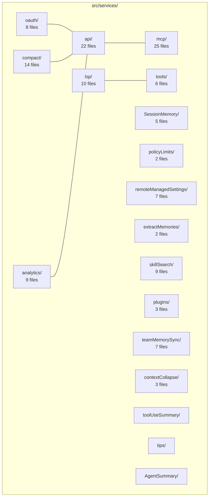

## MCP (Model Context Protocol)

MCP is the largest service subsystem (25 files, 12,238 LOC), managing integration with external tool servers. It is responsible for discovering server configurations from multiple sources, establishing and maintaining connections over several transport types, authenticating with remote servers via OAuth, and exposing discovered tools to the LLM as first-class tool-use blocks.

### MCP Architecture

The MCP subsystem is organized into three major phases: configuration discovery, connection management, and tool exposure. Configuration is loaded from up to seven sources, merged with a strict precedence hierarchy, deduplicated by content signature, filtered by enterprise policy, and then handed to the connection manager. The connection manager creates transport-specific connections, handles authentication challenges, and manages reconnection with exponential backoff. Once connected, tools are discovered via the `listTools()` RPC, normalized for API compatibility, and wrapped as `MCPTool` instances.

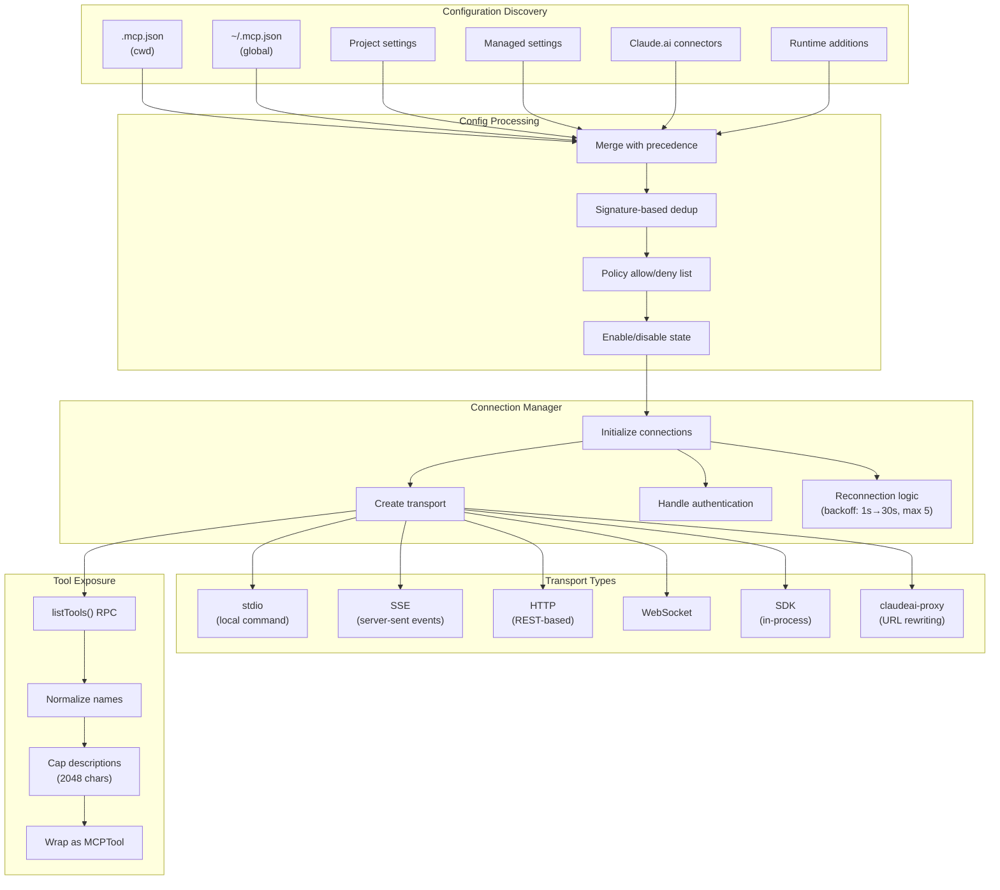

#### Configuration Discovery Precedence

The function `getClaudeCodeMcpConfigs()` in `src/services/mcp/config.ts` orchestrates the merge. Configurations are loaded from six scopes defined by the `ConfigScope` enum: `local`, `user`, `project`, `dynamic`, `enterprise`, `claudeai`, and `managed`. The merge order determines which scope wins when server names collide:

1. **Enterprise** (`managed-mcp.json`) -- If an enterprise MCP config file exists, it takes **exclusive control**. All other scopes are ignored entirely. This allows enterprises to lock down MCP server access.
2. **Plugin servers** -- Loaded from enabled plugins via `loadAllPluginsCacheOnly()`. Plugin server keys are namespaced as `plugin:<pluginName>:<serverName>` to avoid key collisions with manual configs.
3. **User** (`~/.config/claude/settings.json` `mcpServers` section) -- Global user configuration.
4. **Project** (`.mcp.json` files traversed from CWD up to filesystem root) -- Files closer to CWD override parent directories. Only servers with `approved` status are included.
5. **Local** (project-specific config in `.claude/settings.local.json`) -- Highest precedence among non-enterprise sources.

The final merge uses `Object.assign()` in precedence order so later sources overwrite earlier ones:

```typescript
// From src/services/mcp/config.ts — getClaudeCodeMcpConfigs()
const configs = Object.assign(
  {},
  dedupedPluginServers,  // lowest precedence
  userServers,
  approvedProjectServers,
  localServers,          // highest precedence
)
```

Claude.ai connectors are fetched separately and merged with the lowest precedence of all. The `getAllMcpConfigs()` function kicks off the claude.ai fetch in parallel with plugin loading so the two overlap rather than serialize.

#### Signature-Based Deduplication

When multiple configuration sources point at the same underlying MCP server (e.g., a plugin and a manual `.mcp.json` entry both launching the same command), the system detects this through content-based signatures rather than relying on name matching. The `getMcpServerSignature()` function in `src/services/mcp/config.ts` computes a canonical key:

```typescript
// From src/services/mcp/config.ts
export function getMcpServerSignature(config: McpServerConfig): string | null {
  const cmd = getServerCommandArray(config)
  if (cmd) {
    return `stdio:${jsonStringify(cmd)}`
  }
  const url = getServerUrl(config)
  if (url) {
    return `url:${unwrapCcrProxyUrl(url)}`
  }
  return null  // SDK servers have no external identity
}
```

For stdio servers, the signature is the JSON-serialized command array (command + args). For remote servers, it is the URL, with CCR proxy URLs unwrapped to their original vendor URL via `unwrapCcrProxyUrl()`. This ensures that a plugin's raw vendor URL matches a connector's rewritten proxy URL when both point at the same MCP server. Environment variables and headers are intentionally excluded -- same command or URL means same server regardless of auth configuration.

Two dedup functions enforce this: `dedupPluginMcpServers()` (manual wins over plugin; first-loaded plugin wins between plugins) and `dedupClaudeAiMcpServers()` (manual wins over claude.ai connector; only enabled manual servers count as dedup targets).

#### Policy Filtering (Allow/Deny Lists)

After merging, every server is checked against enterprise policy through `isMcpServerAllowedByPolicy()`. The system supports three matching dimensions: server name, command array (for stdio), and URL pattern with wildcards (for remote servers). The denylist always takes absolute precedence -- if a server matches any deny entry, it is blocked regardless of the allowlist. The allowlist uses different matching depending on the server type: stdio servers must match a `serverCommand` entry if any exist, remote servers must match a `serverUrl` entry with wildcard support (e.g., `https://*.example.com/*`).

#### Transport Selection Logic

The `connectToServer()` function in `src/services/mcp/client.ts` selects the transport based on the config's `type` field. The six transport types exist to serve fundamentally different deployment scenarios:

| Transport | Use Case | Key Detail |
|---|---|---|
| `stdio` | Local command-line tools | Spawns a subprocess with `StdioClientTransport`; stderr piped and logged |
| `sse` | Legacy server-sent events | Uses `SSEClientTransport` with OAuth auth provider; long-lived EventSource excluded from timeout |
| `http` | Modern Streamable HTTP (MCP 2025-03-26 spec) | Uses `StreamableHTTPClientTransport`; Accept header enforced per spec |
| `ws` | WebSocket servers | Uses `WebSocketTransport` with proxy and mTLS support |
| `sdk` | In-process SDK servers | Handled by the SDK layer in `print.ts`, not by `client.ts` directly |
| `claudeai-proxy` | Claude.ai connectors | Routes through Anthropic's MCP proxy with OAuth bearer token and session ID |

Two additional internal types exist for IDE integration: `sse-ide` and `ws-ide`, used for VS Code and JetBrains connections respectively. These bypass authentication since the IDE provides its own trust mechanism.

Special cases exist for in-process servers: the Chrome MCP server and Computer Use MCP server are detected by name and run in-process via `createLinkedTransportPair()` to avoid spawning heavyweight subprocesses (the Chrome MCP server would otherwise be ~325 MB).

### MCP Server Configuration Schema

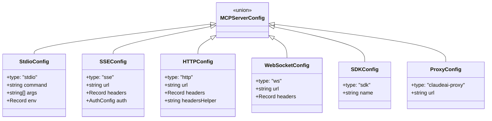

All config types are validated at parse time via Zod v4 schemas defined in `src/services/mcp/types.ts`. The `McpServerConfigSchema` is a union of all eight concrete schemas (including `sse-ide` and `ws-ide` for internal use). The `ScopedMcpServerConfig` type extends any config with a `scope` field (the `ConfigScope` enum) and an optional `pluginSource` for attribution.

Environment variable expansion is applied to stdio commands, args, env values, and remote server URLs/headers via `expandEnvVars()` in `config.ts`. Missing variables are collected and reported as warnings rather than errors, allowing partial expansion.

#### Tool Name Normalization

MCP server names may contain characters incompatible with the Claude API's tool name pattern `^[a-zA-Z0-9_-]{1,64}$`. The `normalizeNameForMCP()` function in `src/services/mcp/normalization.ts` replaces invalid characters with underscores. For claude.ai servers (whose names start with `"claude.ai "`), consecutive underscores are also collapsed and leading/trailing underscores stripped to prevent interference with the `__` delimiter used in MCP tool names (format: `mcp__<server>__<tool>`).

```typescript
// From src/services/mcp/normalization.ts
export function normalizeNameForMCP(name: string): string {
  let normalized = name.replace(/[^a-zA-Z0-9_-]/g, '_')
  if (name.startsWith(CLAUDEAI_SERVER_PREFIX)) {
    normalized = normalized.replace(/_+/g, '_').replace(/^_|_$/g, '')
  }
  return normalized
}
```

Tool descriptions from MCP servers are capped at 2,048 characters (`MAX_MCP_DESCRIPTION_LENGTH`). This is necessary because OpenAPI-generated MCP servers have been observed dumping 15-60 KB of endpoint docs into `tool.description`, which wastes context window budget.

### MCP Connection Lifecycle

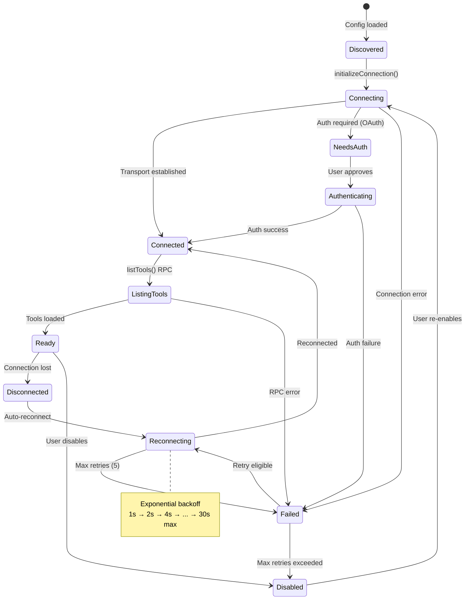

#### Connection Batching

Server connections are established in batches to avoid overwhelming the system. Local servers (stdio and sdk) use a batch size of 3 (configurable via `MCP_SERVER_CONNECTION_BATCH_SIZE`), while remote servers use a larger batch size of 20 (configurable via `MCP_REMOTE_SERVER_CONNECTION_BATCH_SIZE`). The split recognizes that remote connections are I/O-bound (waiting on network) while local connections are CPU-bound (spawning processes).

#### Reconnection Backoff Algorithm

When a remote transport disconnects, the `useManageMCPConnections` hook in `src/services/mcp/useManageMCPConnections.ts` triggers automatic reconnection with exponential backoff. The parameters are:

```typescript
// From src/services/mcp/useManageMCPConnections.ts
const MAX_RECONNECT_ATTEMPTS = 5
const INITIAL_BACKOFF_MS = 1000
const MAX_BACKOFF_MS = 30000
```

The backoff sequence is: 1s, 2s, 4s, 8s, 16s (capped at 30s). Only remote transports (SSE, HTTP, WebSocket, claudeai-proxy) attempt reconnection -- stdio servers (local processes) and SDK servers (internal) do not support it because a crashed local process typically cannot recover without user intervention.

During reconnection, the server state transitions to `pending` with a `reconnectAttempt` counter visible in the UI. If the server is disabled during the backoff window (e.g., user toggles it off), the reconnection loop exits early. After `MAX_RECONNECT_ATTEMPTS` failures, the server transitions to `failed` and the user must manually reconnect.

For HTTP transports specifically, there is also an in-connection error tracking mechanism (`MAX_ERRORS_BEFORE_RECONNECT = 3`) that detects repeated terminal errors (like session expiration) and triggers a full reconnection by closing and re-establishing the transport.

#### Session Expiry Detection

The MCP Streamable HTTP spec requires servers to return HTTP 404 with JSON-RPC error code `-32001` when a session ID is no longer valid. The `isMcpSessionExpiredError()` function checks for both signals to avoid false positives from generic 404s. On detection, the memoization cache is cleared and the next operation triggers a fresh connection with a new session ID.

#### Connection Memoization

The `connectToServer()` function is memoized using lodash's `memoize()` with a cache key derived from `getServerCacheKey(name, serverRef)` -- the server name concatenated with the JSON-serialized config. This means reconnection happens automatically when config changes (the new config produces a different cache key), but repeated calls with the same config reuse the existing connection.

### MCP Authentication

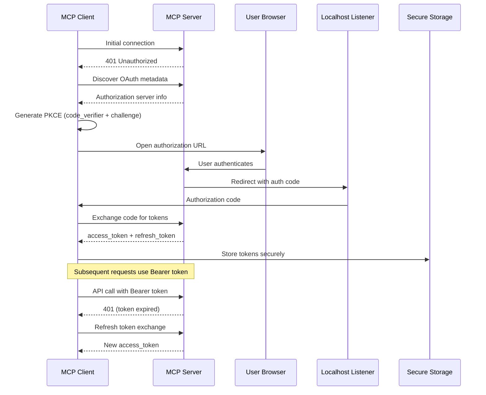

The MCP OAuth implementation lives in `src/services/mcp/auth.ts` and uses the `ClaudeAuthProvider` class which implements the MCP SDK's `OAuthClientProvider` interface. Key design details:

- **Token storage** uses the platform's secure storage (macOS Keychain, Linux Secret Service) via `getSecureStorage()`, with a 15-minute needs-auth cache (`MCP_AUTH_CACHE_TTL_MS`) to avoid repeatedly prompting for servers that are known to need authentication.
- **Lock contention** is handled via a file-based lockfile (`lockfile.ts`) with up to 5 retries (`MAX_LOCK_RETRIES`) to prevent concurrent OAuth flows from racing each other.
- **Token refresh** for `claudeai-proxy` connections has a retry-on-401 pattern: the `createClaudeAiProxyFetch()` wrapper in `client.ts` calls `handleOAuth401Error()` to force-refresh the token if it changed underneath (another connector may have refreshed it concurrently).
- **Cross-App Access (XAA)** is supported via a per-server boolean flag in the OAuth config. The IdP connection details come from a shared `settings.xaaIdp` configuration.

## OAuth Service

The OAuth service (`src/services/oauth/`) handles authentication for both the main Claude API and MCP server connections. It implements the Authorization Code flow with PKCE (Proof Key for Code Exchange) as defined in RFC 7636.

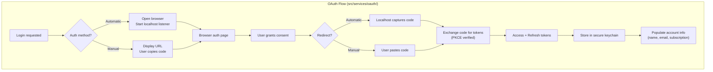

### PKCE Flow Implementation

The PKCE implementation lives in `src/services/oauth/crypto.ts` and follows the S256 method:

```typescript
// From src/services/oauth/crypto.ts
export function generateCodeVerifier(): string {
  return base64URLEncode(randomBytes(32))
}

export function generateCodeChallenge(verifier: string): string {
  const hash = createHash('sha256')
  hash.update(verifier)
  return base64URLEncode(hash.digest())
}
```

The `buildAuthUrl()` function in `src/services/oauth/client.ts` constructs the authorization URL with the PKCE challenge, scope selection, and optional parameters like `orgUUID`, `login_hint` (pre-populated email), and `login_method` (e.g., 'sso', 'magic_link', 'google'). The `code_challenge_method` is always `S256`.

Scopes are selected based on the authentication purpose:
- **Inference-only**: Uses only `CLAUDE_AI_INFERENCE_SCOPE` for long-lived inference tokens.
- **Full access**: Uses `ALL_OAUTH_SCOPES` which includes profile, organization, and inference scopes.

### Token Refresh Strategy

The `refreshOAuthToken()` function in `src/services/oauth/client.ts` implements an intelligent refresh strategy:

1. **Scope expansion on refresh**: The refresh request always requests the full `CLAUDE_AI_OAUTH_SCOPES` set. The backend's refresh-token grant allows scope expansion beyond what the initial authorize granted (via `ALLOWED_SCOPE_EXPANSIONS`), making it safe even for tokens issued before new scopes were added.

2. **Expiry detection**: `isOAuthTokenExpired()` uses a 5-minute buffer (`bufferTime = 5 * 60 * 1000`) -- tokens are considered expired when `now + bufferTime >= expiresAt`, ensuring refresh happens before the actual expiry.

3. **Profile round-trip optimization**: On routine refreshes, the system skips the extra `/api/oauth/profile` round-trip when it already has both the global-config profile fields and the secure-storage subscription data. This optimization eliminates approximately 7 million requests per day fleet-wide.

4. **Cascading fallback for subscription type**: When computing the stored subscription type, the system uses a cascading fallback: `profileInfo?.subscriptionType ?? existing?.subscriptionType ?? null`. This handles the re-login path where `performLogout()` wipes secure storage after the refresh returns.

### Keychain Storage

OAuth tokens are stored in the platform's secure storage via `getSecureStorage()` (macOS Keychain, Linux Secret Service via libsecret, Windows Credential Manager). Account metadata (UUID, email, organization, subscription type) is stored separately in the global config file (`~/.config/claude/settings.json`) as the `oauthAccount` object, which can be read synchronously without keychain access.

The `storeOAuthAccountInfo()` function performs content comparison before writing to avoid unnecessary disk I/O -- if all fields match the existing config, the write is skipped entirely.

## LSP Integration

The LSP (Language Server Protocol) integration provides language intelligence capabilities (diagnostics, hover, go-to-definition, find references) by managing connections to external language server processes. Unlike MCP, LSP servers are only sourced from plugins -- there is no user/project configuration for LSP servers.

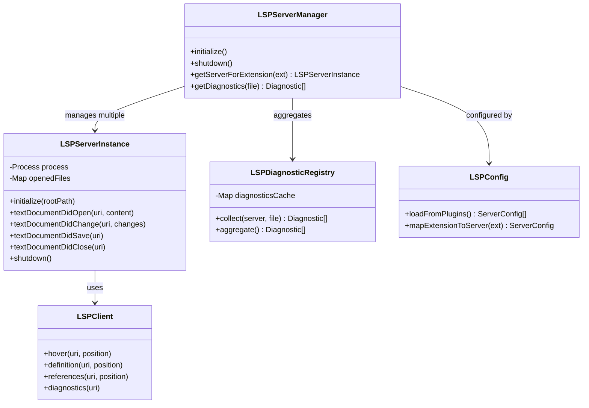

### Extension Routing

The `createLSPServerManager()` factory function in `src/services/lsp/LSPServerManager.ts` uses a closure-based pattern (avoiding classes) to encapsulate three maps of private state:

- `servers: Map<string, LSPServerInstance>` -- All instantiated server instances keyed by name.
- `extensionMap: Map<string, string[]>` -- File extension to server name mapping, built from each server's `extensionToLanguage` config.
- `openedFiles: Map<string, string>` -- URI to server name tracking, preventing duplicate `didOpen` notifications.

When a file operation arrives, `getServerForFile()` extracts the lowercase extension, looks up the server names in `extensionMap`, and returns the first registered server. If multiple servers handle the same extension, first-registered wins (priority can be added later per the TODO in the code).

```typescript
// From src/services/lsp/LSPServerManager.ts
function getServerForFile(filePath: string): LSPServerInstance | undefined {
  const ext = path.extname(filePath).toLowerCase()
  const serverNames = extensionMap.get(ext)
  if (!serverNames || serverNames.length === 0) return undefined
  const serverName = serverNames[0]
  return servers.get(serverName!)
}
```

### Lazy Startup

LSP servers are started lazily -- `ensureServerStarted()` checks the server's state and only calls `server.start()` if it is in `stopped` or `error` state. This avoids spawning language server processes until a file of the corresponding type is actually accessed. The `sendRequest()` method calls `ensureServerStarted()` automatically, so callers do not need to manage server lifecycle.

### Diagnostic Aggregation and File Tracking

The manager tracks which files are open on which servers via the `openedFiles` map. This ensures:
- `didOpen` is not sent twice for the same file on the same server.
- `didChange` falls back to `didOpen` if the file has not been opened yet (LSP protocol requires `didOpen` before `didChange`).
- Language ID is derived from the server's `extensionToLanguage` mapping rather than hardcoded.

A workspace/configuration handler is registered for each server to satisfy protocol requests from servers (like TypeScript) that send these even when the client declares no support -- the handler returns null for each requested item.

Shutdown uses `Promise.allSettled()` to stop all servers in parallel, collecting errors but not short-circuiting on individual failures.

### LSP Communication

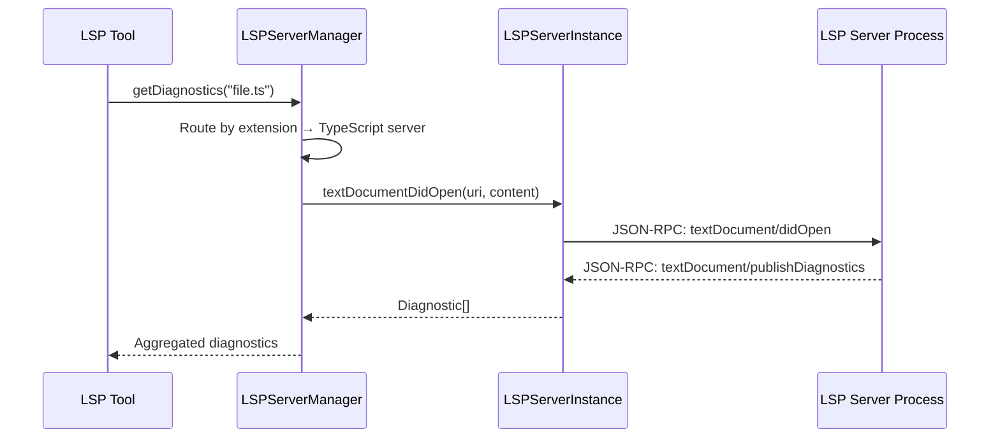

### Plugin-Only Configuration

The `getAllLspServers()` function in `src/services/lsp/config.ts` loads LSP server configurations exclusively from plugins. Unlike MCP, there is no user-facing `.lsp.json` or settings entry. Plugins are loaded via `loadAllPluginsCacheOnly()` and processed in parallel with `Promise.all()`. Each plugin's LSP servers are loaded independently -- if one plugin throws, the error is logged but results from other plugins are preserved.

## Context Compaction

Context compaction is the system that keeps conversations within the model's context window by summarizing older messages. It has evolved into a sophisticated multi-strategy system with five distinct approaches, a circuit breaker for failure resilience, and tight integration with session memory.

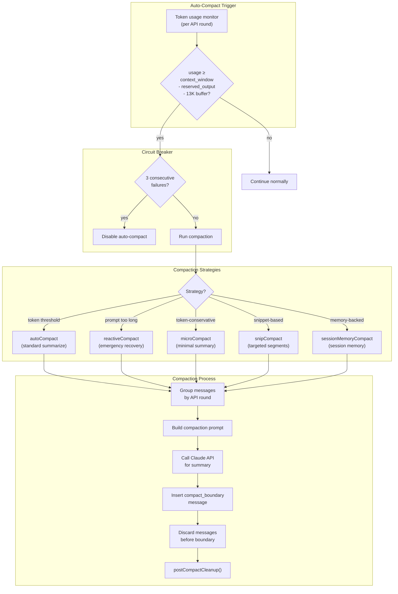

### The 5 Compaction Strategies

Each strategy addresses a different scenario in context window management:

**1. autoCompact (standard summarization)** -- Defined in `src/services/compact/autoCompact.ts`, this is the primary proactive strategy. It triggers when token usage exceeds `context_window - reserved_output - 13K buffer`. The threshold formula is:

```typescript
// From src/services/compact/autoCompact.ts
export const AUTOCOMPACT_BUFFER_TOKENS = 13_000

export function getAutoCompactThreshold(model: string): number {
  const effectiveContextWindow = getEffectiveContextWindowSize(model)
  return effectiveContextWindow - AUTOCOMPACT_BUFFER_TOKENS
}
```

The effective context window subtracts the model's max output tokens (capped at 20,000 for summary output) from the total context window. An override via `CLAUDE_AUTOCOMPACT_PCT_OVERRIDE` allows percentage-based thresholds for testing.

**2. reactiveCompact (emergency recovery)** -- Triggers when the API returns a `prompt_too_long` error. This is the last-resort path that fires only after the proactive auto-compact fails or is disabled. It lives in `src/services/compact/reactiveCompact.ts` (stub in this snapshot).

**3. microCompact (tool result clearing)** -- Defined in `src/services/compact/microCompact.ts`, this is a lightweight strategy that does not call the API for summarization. Instead, it clears the content of old tool results (file reads, shell outputs, grep results, etc.) while preserving the tool_use/tool_result structure. It operates in two modes:
   - **Time-based**: When the gap since the last assistant message exceeds a threshold (cache is cold anyway), clear old tool results to shrink the rewrite.
   - **Cache-editing (cached microcompact)**: Uses the API's `cache_edits` feature to remove tool results from the server-side cache without invalidating the cached prefix. This path does NOT modify local message content.

Only specific tools are eligible for microcompact: `FileRead`, shell tools, `Grep`, `Glob`, `WebSearch`, `WebFetch`, `FileEdit`, and `FileWrite`.

**4. snipCompact (targeted segments)** -- Lives in `src/services/compact/snipCompact.ts` (stub in this snapshot). Removes specific message segments rather than summarizing the entire history.

**5. sessionMemoryCompact (memory-backed)** -- Defined in `src/services/compact/sessionMemoryCompact.ts`, this is an experimental strategy that uses the persistent session memory as the conversation summary instead of calling the API. It has three advantages: no API call needed (zero latency), the summary is continuously maintained by the session memory extraction system, and recent messages are preserved with configurable thresholds:

```typescript
// From src/services/compact/sessionMemoryCompact.ts
export const DEFAULT_SM_COMPACT_CONFIG: SessionMemoryCompactConfig = {
  minTokens: 10_000,        // Minimum tokens to preserve
  minTextBlockMessages: 5,  // Minimum messages with text blocks to keep
  maxTokens: 40_000,        // Hard cap on preserved tokens
}
```

The `calculateMessagesToKeepIndex()` function walks backward from the last summarized message, expanding the kept range until both minimums are met or the max is reached. It includes an `adjustIndexToPreserveAPIInvariants()` function that ensures tool_use/tool_result pairs and streaming message fragments (multiple assistant messages with the same `message.id`) are never split.

### Strategy Selection and Priority

In `autoCompactIfNeeded()`, the strategies are tried in order:
1. Session memory compaction is attempted first (if the `tengu_session_memory` and `tengu_sm_compact` feature flags are both enabled).
2. If session memory compaction returns null (not available, empty template, or post-compact tokens still over threshold), traditional `compactConversation()` runs.

Several conditions suppress auto-compact entirely:
- Forked agent contexts (`session_memory`, `compact`, `marble_origami`) to prevent deadlocks.
- Reactive-only mode (the `tengu_cobalt_raccoon` GrowthBook flag).
- Context-collapse mode, where autocompact would race with the collapse system's own 90%/95% commit/blocking thresholds.

### Circuit Breaker Pattern

The circuit breaker prevents runaway API calls when context is irrecoverably over the limit. It is tracked via `consecutiveFailures` in `AutoCompactTrackingState`:

```typescript
// From src/services/compact/autoCompact.ts
const MAX_CONSECUTIVE_AUTOCOMPACT_FAILURES = 3
```

After 3 consecutive failures, auto-compact is disabled for the remainder of the session. Analysis showed 1,279 sessions with 50+ consecutive failures (up to 3,272 per session), wasting approximately 250,000 API calls per day fleet-wide before this circuit breaker was introduced.

On success, the failure counter resets to 0. The counter is threaded through `autoCompactTracking` in the query loop so the state persists across turns.

### Post-Compaction Cleanup

After any successful compaction, `runPostCompactCleanup()` resets various subsystem states that depend on the conversation history (sent skill names, context collapse state, etc.). The compact boundary message includes metadata about pre-compact discovered tools, token counts, and optional `preservedSegment` information for the session storage loader to reconstruct the message chain.

## Analytics System

The analytics system is designed around a key architectural principle: **complete decoupling between event producers and the event sink**. Events can be logged from the very first line of startup code, long before the analytics backend is initialized. This is achieved through an in-memory queue that buffers events until the sink attaches.

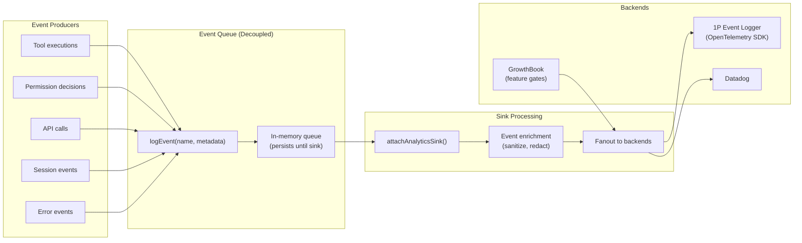

### Event Queue Decoupling

The analytics module (`src/services/analytics/index.ts`) is deliberately dependency-free to avoid import cycles. This is documented in the module header:

```typescript
// From src/services/analytics/index.ts
/**
 * DESIGN: This module has NO dependencies to avoid import cycles.
 * Events are queued until attachAnalyticsSink() is called during app initialization.
 * The sink handles routing to Datadog and 1P event logging.
 */
```

The queue is a simple array of `QueuedEvent` objects. The `logEvent()` function checks whether a sink is attached; if not, the event is pushed to the queue:

```typescript
// From src/services/analytics/index.ts
export function logEvent(eventName: string, metadata: LogEventMetadata): void {
  if (sink === null) {
    eventQueue.push({ eventName, metadata, async: false })
    return
  }
  sink.logEvent(eventName, metadata)
}
```

Events are queued before sink attachment because many subsystems (MCP connection, OAuth token refresh, config loading) emit analytics events during startup, before the analytics sink is initialized. Without the queue, these events would be silently dropped.

### Sink Attachment and Queue Drain

The `attachAnalyticsSink()` function is idempotent -- if a sink is already attached, subsequent calls are no-ops. This allows calling from both the `preAction` hook (for subcommands) and `setup()` (for the default command) without coordination.

Queue draining happens asynchronously via `queueMicrotask()` to avoid adding latency to the startup path:

```typescript
// From src/services/analytics/index.ts
queueMicrotask(() => {
  for (const event of queuedEvents) {
    if (event.async) {
      void sink!.logEventAsync(event.eventName, event.metadata)
    } else {
      sink!.logEvent(event.eventName, event.metadata)
    }
  }
})
```

### Backend Fanout

The `sink.ts` module routes events to two backends:

1. **First-party event logging** (OpenTelemetry SDK) -- Always receives events. Uses `BatchLogRecordProcessor` for efficient batching. Configuration (batch delay, max batch size, max queue size) comes from the GrowthBook dynamic config `tengu_1p_event_batch_config`. Events include PII-tagged `_PROTO_*` keys that are hoisted to proto fields by the exporter.

2. **Datadog** -- Gated by the `tengu_log_datadog_events` GrowthBook feature gate. Early events use a cached gate value from the previous session to avoid data loss during initialization. `_PROTO_*` keys are stripped via `stripProtoFields()` before Datadog fanout since Datadog is a general-access backend.

Event sampling is configured per-event via the `tengu_event_sampling_config` GrowthBook config. Each event name maps to a `sample_rate` (0-1). Events not in the config are logged at 100%. The `shouldSampleEvent()` function returns the sample rate if sampled (added to metadata as `sample_rate`), or 0 if the event was not selected.

### Metadata Safety Type System

The analytics module uses a novel type-safety pattern for sensitive data. The `AnalyticsMetadata_I_VERIFIED_THIS_IS_NOT_CODE_OR_FILEPATHS` type is `never`, requiring an explicit cast at every call site. This forces developers to consciously verify that string values do not contain code snippets, file paths, or other sensitive information. A separate `AnalyticsMetadata_I_VERIFIED_THIS_IS_PII_TAGGED` type exists for values destined for PII-tagged proto columns with restricted access.

### GrowthBook Feature Gates

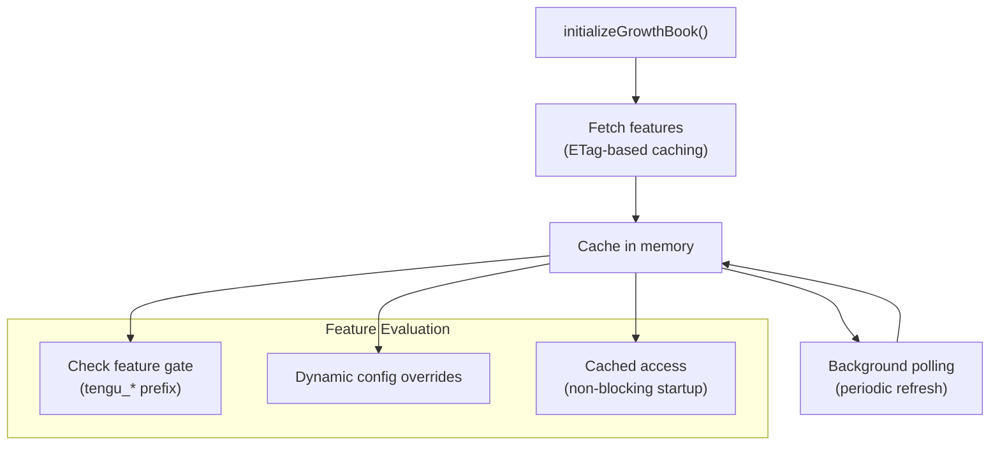

The GrowthBook integration (`src/services/analytics/growthbook.ts`) uses remote evaluation with disk-cached fallback. Key design decisions:

- **Non-blocking startup**: The `getFeatureValue_CACHED_MAY_BE_STALE()` function returns immediately from cache (disk or memory) without waiting for network. This is critical because GrowthBook gates are checked in hot paths like render loops and tool execution.
- **Refresh listeners**: A signal-based subscription system (`onGrowthBookRefresh()`) notifies systems that bake feature values into long-lived objects (e.g., the 1P event logger's `LoggerProvider`). Listeners fire on every refresh; change detection is the subscriber's responsibility.
- **Environment overrides**: The `CLAUDE_INTERNAL_FC_OVERRIDES` env var (ant-only) allows JSON overrides for eval harnesses that need specific flag configurations.
- **Experiment exposure tracking**: Deduplicated per-session via `loggedExposures` to prevent firing duplicate exposure events in hot paths.

## Policy Limits

The policy limits service (`src/services/policyLimits/`) enforces organization-level restrictions fetched from the Anthropic API. It follows a **fail-open** philosophy: if the fetch fails and no cache exists, the CLI continues without restrictions. The exception is **essential-traffic-only mode** (for HIPAA organizations), where specific policies fail closed on cache miss.

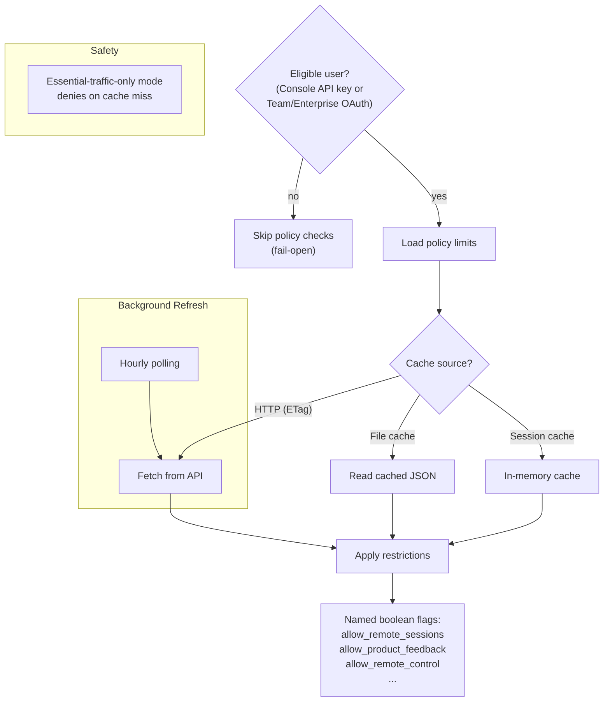

### Eligibility Check

The `isPolicyLimitsEligible()` function in `src/services/policyLimits/index.ts` determines whether the user should be subject to policy checks:

1. Must be using a first-party Anthropic provider (not third-party).
2. Must be using a first-party Anthropic base URL (not custom).
3. Console users (API key) are always eligible.
4. OAuth users must have the Claude.ai inference scope AND be either Team or Enterprise subscribers -- these are the organization types that have admin-configurable policy restrictions.

Importantly, this function must NOT call `getSettings()` or any function that calls it, to avoid circular dependencies during settings loading.

### Cache Hierarchy

The system uses a three-level cache hierarchy:

1. **Session cache** (`sessionCache` module-level variable) -- In-memory, fastest access. Used by `isPolicyAllowed()` which must be synchronous.
2. **File cache** (`~/.config/claude/policy-limits.json`) -- Persists across sessions. Read synchronously via `fsReadFileSync` when session cache is empty. Written with `mode: 0o600` for security.
3. **HTTP fetch** -- Uses content-based checksums (SHA-256 of sorted, stringified restrictions) as ETags for conditional GET requests. Returns 304 Not Modified when the cache is current.

The `getRestrictionsFromCache()` function cascades through these levels: session cache first, then file cache (promoting to session cache on read), then null (triggering fail-open behavior).

### Fail-Open vs Essential-Traffic-Only

The default behavior is fail-open: `isPolicyAllowed()` returns `true` when restrictions are unavailable. The exception is the `ESSENTIAL_TRAFFIC_DENY_ON_MISS` set:

```typescript
// From src/services/policyLimits/index.ts
const ESSENTIAL_TRAFFIC_DENY_ON_MISS = new Set(['allow_product_feedback'])

export function isPolicyAllowed(policy: string): boolean {
  const restrictions = getRestrictionsFromCache()
  if (!restrictions) {
    if (isEssentialTrafficOnly() && ESSENTIAL_TRAFFIC_DENY_ON_MISS.has(policy)) {
      return false  // fail closed for HIPAA orgs
    }
    return true  // fail open for everyone else
  }
  const restriction = restrictions[policy]
  if (!restriction) return true  // unknown policy = allowed
  return restriction.allowed
}
```

### Background Polling

After initial load, `startBackgroundPolling()` sets up an hourly interval (`POLLING_INTERVAL_MS = 60 * 60 * 1000`) to detect mid-session policy changes. The interval is `unref()`'d so it does not prevent the process from exiting. The polling callback compares the new restrictions to the previous cache and logs changes for visibility.

A loading promise (`loadingCompletePromise`) with a 30-second timeout prevents deadlocks if `loadPolicyLimits()` is never called -- systems that await `waitForPolicyLimitsToLoad()` will resolve either when loading completes or when the timeout fires.

### Retry Logic

`fetchWithRetry()` uses the shared `getRetryDelay()` function from `src/services/api/withRetry.ts` for exponential backoff, with up to 5 retries. Auth errors (`skipRetry: true`) are not retried since they indicate a fundamental authentication problem rather than a transient failure.

## Tool Execution Orchestration

The tool orchestration layer (`src/services/tools/toolOrchestration.ts`) coordinates how tool calls from the LLM are executed. Its central responsibility is partitioning tool calls into concurrent-safe batches versus serial batches, then managing the execution of each.

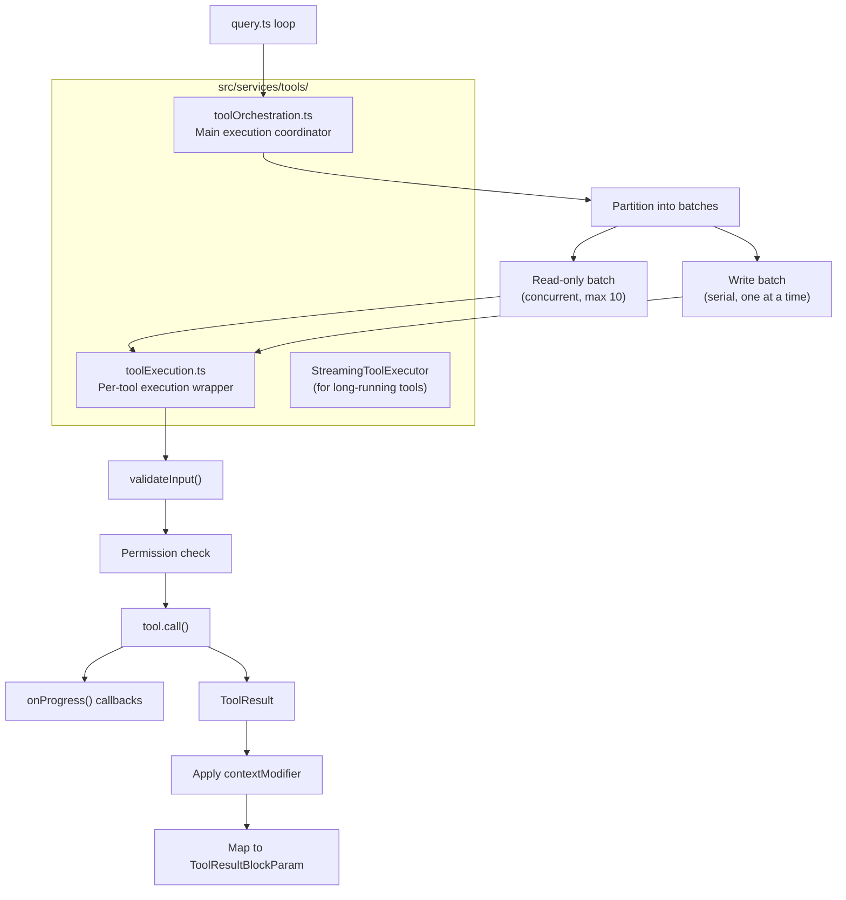

### Batch Partitioning

The `partitionToolCalls()` function in `toolOrchestration.ts` groups tool calls into alternating batches of two types:

```typescript
// From src/services/tools/toolOrchestration.ts
function partitionToolCalls(
  toolUseMessages: ToolUseBlock[],
  toolUseContext: ToolUseContext,
): Batch[] {
  return toolUseMessages.reduce((acc: Batch[], toolUse) => {
    const tool = findToolByName(toolUseContext.options.tools, toolUse.name)
    const parsedInput = tool?.inputSchema.safeParse(toolUse.input)
    const isConcurrencySafe = parsedInput?.success
      ? Boolean(tool?.isConcurrencySafe(parsedInput.data))
      : false
    if (isConcurrencySafe && acc[acc.length - 1]?.isConcurrencySafe) {
      acc[acc.length - 1]!.blocks.push(toolUse)
    } else {
      acc.push({ isConcurrencySafe, blocks: [toolUse] })
    }
    return acc
  }, [])
}
```

Each tool's `isConcurrencySafe()` method (from the `Tool` interface) determines whether it can run in parallel. Read-only tools like `FileRead`, `Grep`, `Glob`, and `WebSearch` return `true`; write tools like `FileWrite`, `FileEdit`, and `Bash` return `false`. Consecutive concurrency-safe tools are merged into a single batch for parallel execution.

When `isConcurrencySafe()` throws (e.g., due to a `shell-quote` parse failure for bash commands), the tool is conservatively treated as not concurrency-safe to prevent data races.

### Concurrent Execution

Read-only batches are executed via `runToolsConcurrently()`, which uses the `all()` utility (a concurrent async generator merger) with a configurable concurrency limit:

```typescript
// From src/services/tools/toolOrchestration.ts
function getMaxToolUseConcurrency(): number {
  return parseInt(process.env.CLAUDE_CODE_MAX_TOOL_USE_CONCURRENCY || '', 10) || 10
}
```

The default concurrency is 10, overridable via environment variable. Context modifiers from concurrent tools are queued (not applied immediately) and applied in order after the entire batch completes, ensuring deterministic state transitions.

### Serial Execution

Write batches are executed via `runToolsSerially()`, processing one tool at a time. Context modifiers are applied immediately after each tool completes, so each subsequent tool in the batch sees the state changes from its predecessor.

### In-Progress Tracking

Both execution paths manage `inProgressToolUseIDs` via `setInProgressToolUseIDs()`, adding the tool's ID before execution and removing it after. This set is used by the UI to show which tools are currently running.

## Service Initialization Order

The initialization order is carefully staged to minimize startup latency while ensuring dependencies are met. The timeline below shows the three phases: module loading (parallel async prefetches), `init()` (sequential configuration steps), and the action handler (parallel service initialization).

```mermaid
gantt
    title Service Initialization Timeline
    dateFormat X
    axisFormat %L

    section Phase 1 - Module Load
    MDM subprocess (async)          : 0, 5
    Keychain prefetch (async)       : 0, 5

    section Phase 2 - init()
    enableConfigs()                 : 5, 10
    applySafeConfigEnvVars()        : 10, 12
    applyExtraCACerts()             : 12, 14
    setupGracefulShutdown()         : 14, 16
    configureGlobalMTLS()           : 16, 18
    configureGlobalAgents()         : 18, 20
    preconnectAnthropicApi()        : 20, 25
    attachAnalyticsSink()           : 25, 27

    section Phase 3 - Action Handler
    GrowthBook init                 : 30, 35
    AWS/GCP credential prefetch     : 35, 45
    MCP resource prefetch           : 35, 45
    Model capabilities refresh      : 35, 45
    LSP server init (async)         : 35, 50
    Remote settings load            : 35, 50
    Policy limits load              : 35, 50
```

### Initialization Order Rationale

The staging reflects dependency relationships and performance optimization:

**Phase 1** fires the slowest operations first. The MDM (Mobile Device Management) subprocess and keychain prefetch run before any heavy module evaluation. These complete in ~5ms typically but could take longer on first run.

**Phase 2** runs sequentially because each step depends on the previous: config must be loaded before env vars are applied, env vars must be set before TLS certificates are configured, and TLS must be configured before the API preconnect fires. The analytics sink is attached last in this phase so it can receive events from all previous steps.

**Phase 3** parallelizes everything that does not depend on the others. GrowthBook initialization happens first (it gates many features), then all remaining services launch concurrently. MCP connections, LSP servers, remote settings, and policy limits all run in parallel, overlapping their network I/O. The `populateOAuthAccountInfoIfNeeded()` call waits for any in-flight token refresh to complete first, since `refreshOAuthToken()` already fetches and stores profile info -- this avoids a redundant profile API call.

## Source References

| File | Description |
|---|---|
| `src/services/mcp/client.ts` | MCP connection manager, transport creation, tool discovery, reconnection logic |
| `src/services/mcp/config.ts` | Config loading, merge precedence, dedup, policy filtering, env var expansion |
| `src/services/mcp/types.ts` | Transport type definitions, Zod schemas, connection state types |
| `src/services/mcp/normalization.ts` | Tool name normalization for API compatibility |
| `src/services/mcp/auth.ts` | MCP OAuth provider, PKCE flow, token storage, lock contention handling |
| `src/services/mcp/useManageMCPConnections.ts` | React hook for connection lifecycle, reconnection backoff |
| `src/services/oauth/client.ts` | Main OAuth client: auth URL construction, token exchange, refresh, profile fetch |
| `src/services/oauth/crypto.ts` | PKCE code verifier/challenge generation |
| `src/services/lsp/LSPServerManager.ts` | LSP server manager factory, extension routing, file tracking |
| `src/services/lsp/config.ts` | Plugin-only LSP server configuration loading |
| `src/services/compact/autoCompact.ts` | Auto-compact trigger logic, threshold calculation, circuit breaker |
| `src/services/compact/compact.ts` | Core compaction: message grouping, API summarization, boundary creation |
| `src/services/compact/microCompact.ts` | Lightweight tool result clearing, time-based and cached paths |
| `src/services/compact/sessionMemoryCompact.ts` | Session memory-backed compaction, message preservation |
| `src/services/analytics/index.ts` | Event queue, sink interface, metadata safety types |
| `src/services/analytics/sink.ts` | Sink implementation: Datadog gate, 1P routing, event sampling |
| `src/services/analytics/growthbook.ts` | GrowthBook integration, remote eval, disk cache, refresh signals |
| `src/services/analytics/firstPartyEventLogger.ts` | OpenTelemetry-based 1P event logging, batch config |
| `src/services/policyLimits/index.ts` | Policy limits: eligibility, cache hierarchy, fail-open, background polling |
| `src/services/policyLimits/types.ts` | Policy limits Zod schemas and fetch result types |
| `src/services/tools/toolOrchestration.ts` | Tool execution: batch partitioning, concurrent/serial execution |
