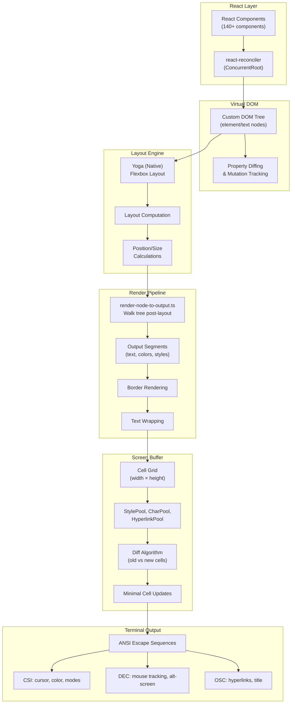
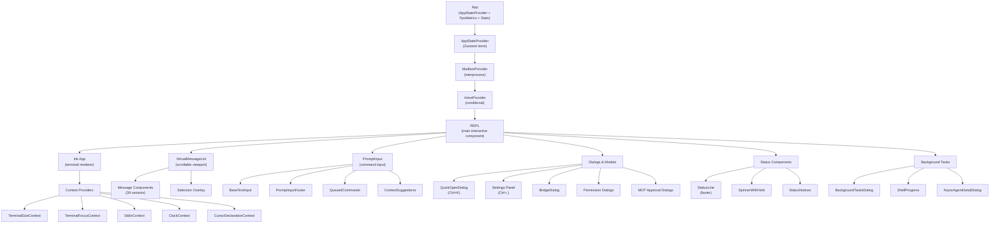
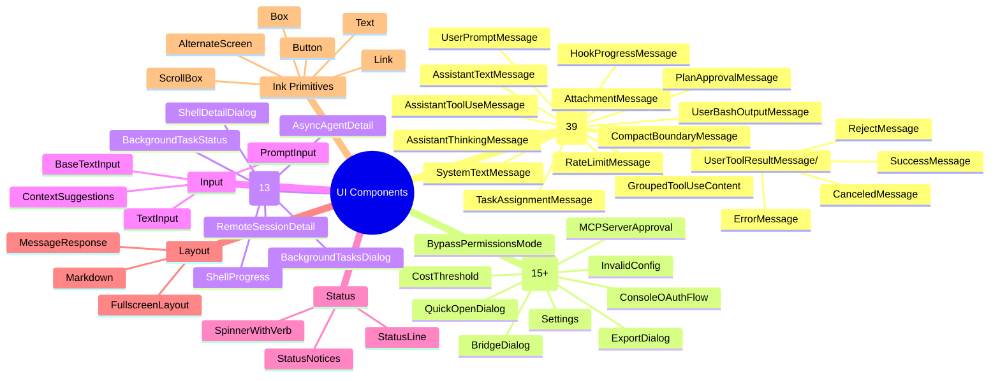
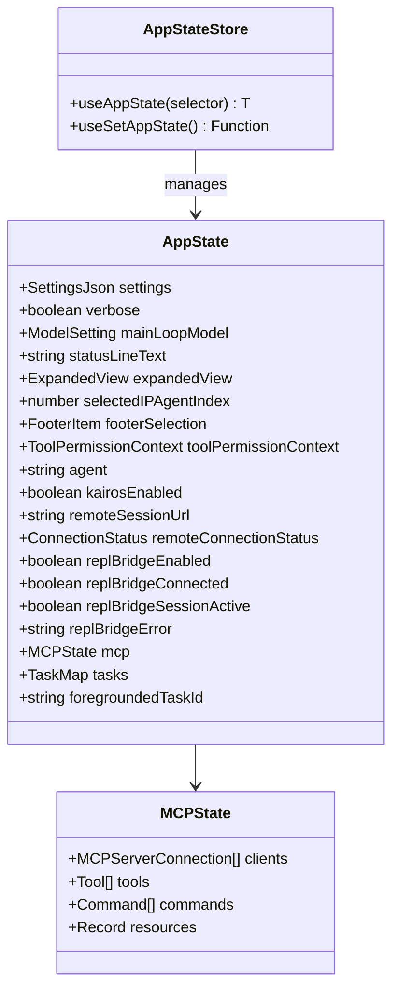
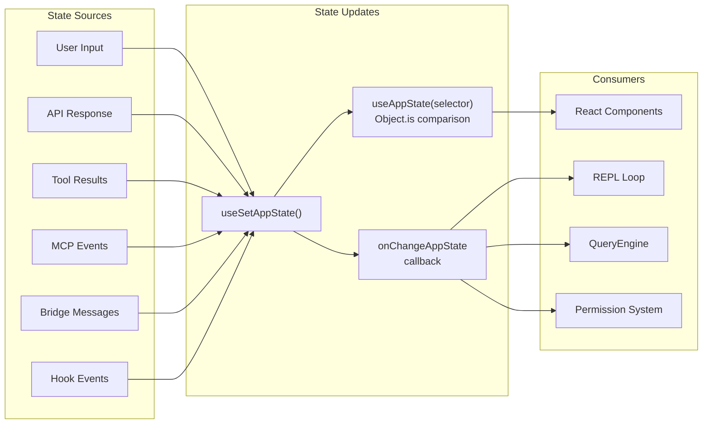
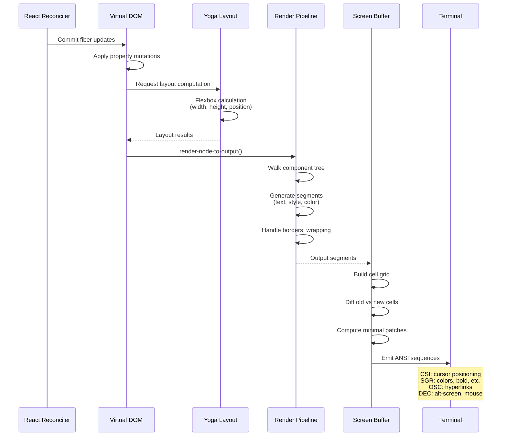
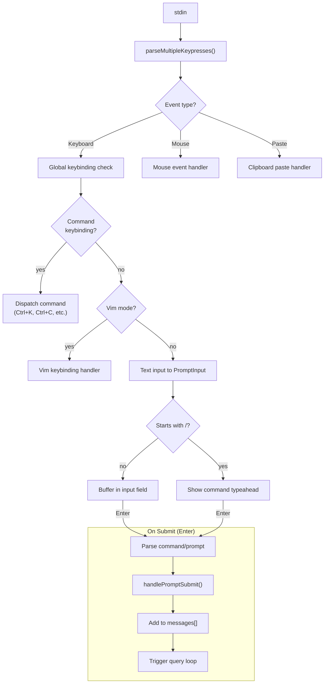
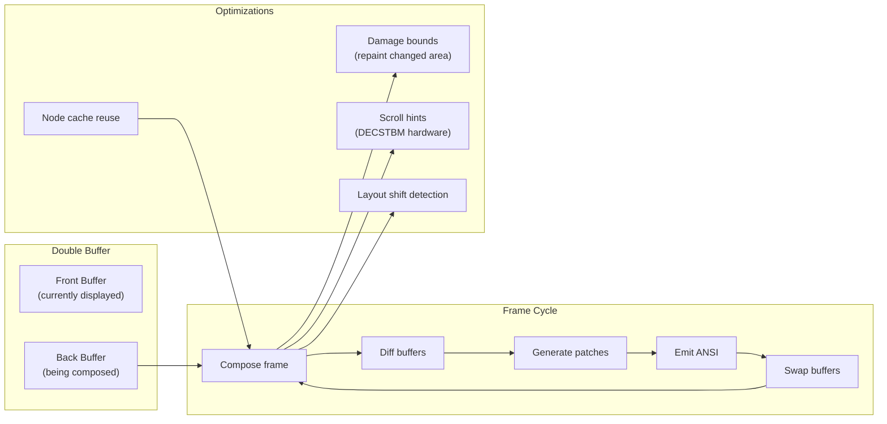
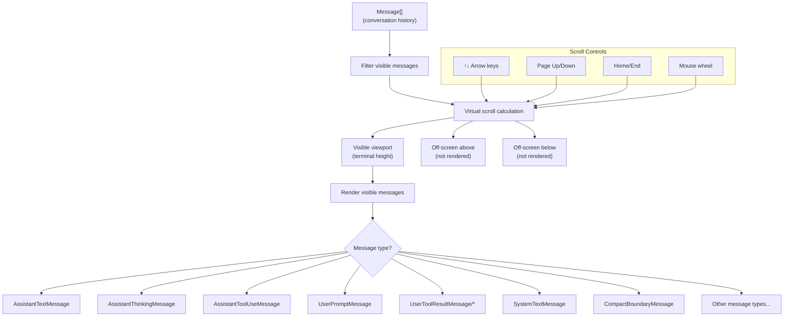
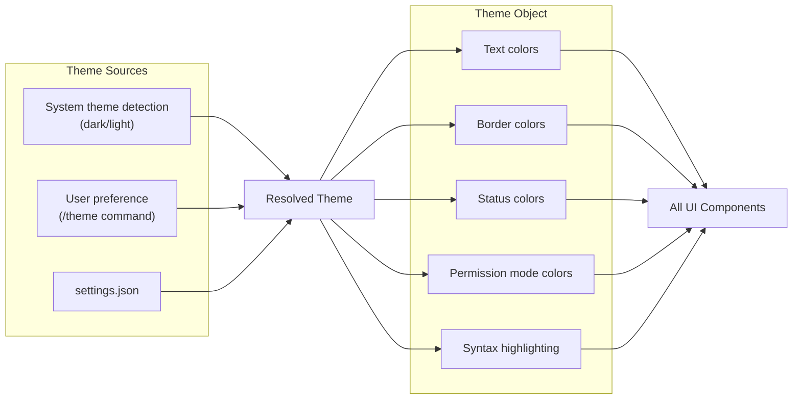

# UI Architecture

## Terminal Rendering Stack

Claude Code uses a custom fork of Ink (React for terminals) with Yoga for flexbox layout. The rendering pipeline converts a React component tree into optimized ANSI terminal output.

The key insight driving this architecture is that terminal UIs face a unique constraint: there is no browser compositor to handle partial repaints. Every character written to stdout is a visible operation, so the system must compute the minimal set of changes between frames and emit only those bytes. The pipeline below achieves this through six distinct layers, each with a clear responsibility boundary.



### React Reconciler and Custom DOM

The reconciler is configured in **`src/ink/reconciler.ts`** using `react-reconciler` with `ConcurrentRoot` mode (React 19). Rather than targeting browser DOM nodes, it targets a custom virtual DOM defined in **`src/ink/dom.ts`**. The element types are limited to a small set of terminal-specific node names:

```typescript
// src/ink/dom.ts
export type ElementNames =
  | 'ink-root'
  | 'ink-box'
  | 'ink-text'
  | 'ink-virtual-text'
  | 'ink-link'
  | 'ink-progress'
  | 'ink-raw-ansi'
```

Each `DOMElement` node carries a `yogaNode` (for layout), a `style` object, `attributes`, and `childNodes`. Critically, each node also carries a `dirty` flag. When any property changes, `markDirty()` walks from the mutated node up to the root, setting `dirty = true` on every ancestor. This is the foundation of the incremental rendering optimization: the render tree walk can skip entire clean subtrees.

```typescript
// src/ink/dom.ts - markDirty propagates upward
export const markDirty = (node?: DOMNode): void => {
  let current: DOMNode | undefined = node
  let markedYoga = false
  while (current) {
    if (current.nodeName !== '#text') {
      ;(current as DOMElement).dirty = true
      if (!markedYoga && (current.nodeName === 'ink-text' ||
          current.nodeName === 'ink-raw-ansi') && current.yogaNode) {
        current.yogaNode.markDirty()
        markedYoga = true
      }
    }
    current = current.parentNode
  }
}
```

The reconciler's `commitUpdate` method (React 19 style, receiving old and new props directly) performs shallow diffing of props and styles. It avoids unnecessary dirty marking by comparing style objects property-by-property rather than by reference -- React creates new style objects on every render even when unchanged:

```typescript
// src/ink/dom.ts - Shallow equality avoids spurious dirty marks
export const setStyle = (node: DOMNode, style: Styles): void => {
  if (stylesEqual(node.style, style)) {
    return
  }
  node.style = style
  markDirty(node)
}
```

The reconciler also integrates with a custom event `Dispatcher` for priority scheduling. React 19's `resolveUpdatePriority` and `setCurrentUpdatePriority` are wired to `dispatcher.resolveEventPriority()` so that discrete events (clicks, keypresses) get higher scheduling priority than continuous updates (scroll, animation).

### Yoga Layout Computation

Layout runs during React's commit phase, triggered by `rootNode.onComputeLayout()` in the reconciler's `resetAfterCommit`. This is a deliberate design choice: by computing layout in the commit phase, `useLayoutEffect` hooks have access to fresh geometry data.

```typescript
// src/ink/ink.tsx - Layout in commit phase
this.rootNode.onComputeLayout = () => {
  if (this.isUnmounted) return;
  if (this.rootNode.yogaNode) {
    const t0 = performance.now();
    this.rootNode.yogaNode.setWidth(this.terminalColumns);
    this.rootNode.yogaNode.calculateLayout(this.terminalColumns);
    const ms = performance.now() - t0;
    recordYogaMs(ms);
  }
};
```

The root Yoga node's width is set to `terminalColumns` on each layout pass. The layout engine computes flexbox positions for all nodes in the tree. Text nodes have custom measure functions that account for terminal string width (handling CJK double-width characters, emoji, ANSI escape codes) and text wrapping:

```typescript
// src/ink/dom.ts - Text measurement with wrapping
const measureTextNode = function (node, width, widthMode) {
  const rawText = node.nodeName === '#text' ? node.nodeValue : squashTextNodes(node)
  const text = expandTabs(rawText)
  const dimensions = measureText(text, width)
  if (dimensions.width <= width) return dimensions
  // For pre-wrapped content in Undefined mode, use natural width
  if (text.includes('\n') && widthMode === LayoutMeasureMode.Undefined) {
    return measureText(text, Math.max(width, dimensions.width))
  }
  const textWrap = node.style?.textWrap ?? 'wrap'
  const wrappedText = wrapText(text, width, textWrap)
  return measureText(wrappedText, width)
}
```

### Screen Buffer Diff Algorithm

The screen buffer (`src/ink/screen.ts`) is a cell grid where each cell stores a character ID, a style ID, a width flag, and a hyperlink ID. All three pools (`CharPool`, `StylePool`, `HyperlinkPool`) are interning pools that assign integer IDs to strings and style arrays, enabling integer comparison in the diff hot path instead of string comparison:

```typescript
// src/ink/screen.ts - CharPool with ASCII fast-path
export class CharPool {
  private strings: string[] = [' ', '']  // Index 0 = space, 1 = empty
  private ascii: Int32Array = initCharAscii()  // charCode -> index

  intern(char: string): number {
    if (char.length === 1) {
      const code = char.charCodeAt(0)
      if (code < 128) {
        const cached = this.ascii[code]!
        if (cached !== -1) return cached
        // ... assign new index
      }
    }
    // Fall back to Map for non-ASCII
  }
}
```

The diff engine in `LogUpdate` (`src/ink/log-update.ts`) compares the front buffer (displayed) against the back buffer (newly rendered) cell by cell. It emits patches -- cursor moves, style transitions, and character writes -- that represent the minimal terminal output. Style transitions use `diffAnsiCodes` from `@alcalzone/ansi-tokenize` which computes the minimal SGR sequence to move from one style state to another, avoiding redundant resets.

When content overflows the viewport (scrollback), the diff must detect whether changed cells are reachable. Unreachable cells (in terminal scrollback) trigger a full-screen reset because cursor-relative moves cannot reach them. This is the primary source of flicker in terminal UIs.

## Component Tree Structure



### Provider Nesting Pattern

The component tree has two layers of providers: an outer React-level layer and an inner Ink-level layer. Each provider exists for a specific reason:

**Outer providers** (in `src/components/App.tsx` and `src/state/AppState.tsx`):

- **`FpsMetricsProvider`** -- Exposes frame rate metrics to the component tree for the `/stats` command. Wraps everything because it needs to be accessible from REPL and its children.
- **`StatsProvider`** -- Provides session statistics (token counts, costs). Optional store injected from the CLI entry point.
- **`AppStateProvider`** -- The core Zustand-like store. Creates the store instance via `useState` (so it survives re-renders but not remounts). Nesting prevention: throws if a second `AppStateProvider` is detected via `HasAppStateContext`.
- **`MailboxProvider`** -- Interprocess communication for swarm mode (team leader/worker message passing).
- **`VoiceProvider`** -- Conditionally loaded (feature flag `VOICE_MODE`). External builds get a passthrough component that just renders children.

```typescript
// src/components/App.tsx - Provider nesting order
export function App({ getFpsMetrics, stats, initialState, children }) {
  return (
    <FpsMetricsProvider getFpsMetrics={getFpsMetrics}>
      <StatsProvider store={stats}>
        <AppStateProvider initialState={initialState}
          onChangeAppState={onChangeAppState}>
          {children}
        </AppStateProvider>
      </StatsProvider>
    </FpsMetricsProvider>
  )
}
```

**Inner providers** (in `src/ink/components/App.tsx`, the Ink-level root):

- **`TerminalSizeContext`** -- Provides `terminalColumns` and `terminalRows`. Updated synchronously on resize (no debounce, to avoid dimension mismatch flicker).
- **`TerminalFocusContext`** -- Tracks whether the terminal window has focus (DEC focus events `CSI I` / `CSI O`). Used to pause animations and suppress notifications when unfocused.
- **`StdinContext`** -- Exposes `setRawMode`, `isRawModeSupported`, and an internal mode flag. Components that need raw stdin access (e.g., for vim-style input) use this.
- **`ClockContext`** -- A global animation tick. Rather than each component running its own `setInterval`, a single clock emits ticks that subscribers consume, reducing timer overhead.
- **`CursorDeclarationContext`** -- Allows one component (typically the text input) to "declare" where the terminal cursor should be parked. This enables IME composition (CJK input) at the correct position and accessibility tool tracking.

## Component Categories



### Message Component Architecture

The 39 message components in `src/components/messages/` are the most performance-critical part of the UI. Each maps to a specific `Message` type from the conversation history. The `VirtualMessageList` dispatches rendering based on message type, and each component is responsible for its own layout.

Key message components include:

- **`AssistantTextMessage`** -- Renders streaming markdown with syntax highlighting. Markdown is rendered through a custom marked-based renderer that produces Ink `<Text>` and `<Box>` elements.
- **`AssistantToolUseMessage`** -- Displays tool invocations with collapsible input/output. Uses `GroupedToolUseContent` to batch sequential tool calls.
- **`UserBashOutputMessage`** -- Renders shell command output with ANSI passthrough (`ink-raw-ansi` nodes). Uses pre-measured dimensions to skip the expensive `stringWidth` calculation.
- **`CompactBoundaryMessage`** -- Visual separator inserted after context compaction, showing how many messages were compressed.

## State Management (Zustand)



### Why Zustand Over React Context for Global State

The state store (`src/state/store.ts`) is a minimal Zustand-like implementation -- just 34 lines of code. It was chosen over React Context for two critical reasons:

1. **Selector-based subscriptions**: React Context re-renders every consumer when the context value changes. With 50+ fields on `AppState`, a context-based approach would re-render the entire tree on every state change. The custom store supports selectors via `useSyncExternalStore`, so components only re-render when their selected slice changes (compared via `Object.is`).

2. **External access**: Non-React code (the query engine, tool executors, hook callbacks) needs to read and write state. A store with `getState()`/`setState()` is callable from anywhere, while React Context is only accessible inside the render tree.

```typescript
// src/state/store.ts - The entire store implementation
export function createStore<T>(initialState: T, onChange?: OnChange<T>): Store<T> {
  let state = initialState
  const listeners = new Set<Listener>()
  return {
    getState: () => state,
    setState: (updater: (prev: T) => T) => {
      const prev = state
      const next = updater(prev)
      if (Object.is(next, prev)) return
      state = next
      onChange?.({ newState: next, oldState: prev })
      for (const listener of listeners) listener()
    },
    subscribe: (listener: Listener) => {
      listeners.add(listener)
      return () => listeners.delete(listener)
    },
  }
}
```

### Selector-Based Re-renders

The `useAppState` hook wraps `useSyncExternalStore` with a selector pattern. Components subscribe to specific slices of state, and only re-render when that slice changes:

```typescript
// src/state/AppState.tsx - Selector-based subscriptions
export function useAppState(selector) {
  const store = useAppStore()
  const get = () => {
    const state = store.getState()
    return selector(state)
  }
  return useSyncExternalStore(store.subscribe, get, get)
}
```

The documentation in the source explicitly warns against returning new objects from selectors, since `Object.is` compares by reference:

```typescript
// Good: select an existing sub-object reference
const { text, promptId } = useAppState(s => s.promptSuggestion)
// Bad: creates a new object every time, defeating memoization
// const state = useAppState(s => ({ text: s.promptSuggestion.text }))
```

For write-only access (dispatching updates without subscribing), `useSetAppState()` returns a stable reference that never changes, so components using only this hook never re-render from state changes.

### State Flow



### onChangeAppState Side Effects

The `onChangeAppState` callback (`src/state/onChangeAppState.ts`) is the single choke point for synchronizing state changes with external systems. It fires on every `setState` call and diffs specific fields to trigger side effects:

- **Permission mode changes**: Syncs the mode to Claude Code Runtime (CCR) via `notifySessionMetadataChanged` and to the SDK status stream via `notifyPermissionModeChanged`. Before this centralized handler, 8+ mutation paths existed (Shift+Tab cycling, ExitPlanMode dialog, /plan command, rewind, bridge handler, etc.), and most forgot to notify CCR, leaving external metadata stale.
- **Model changes**: Persists `mainLoopModel` to user settings and updates the bootstrap state override.
- **View toggles**: Persists `expandedView` state to global config for backwards compatibility.
- **Settings changes**: Clears auth-related caches (API key helper, AWS/GCP credentials) and re-applies environment variables when `settings.env` changes.

```typescript
// src/state/onChangeAppState.ts - Centralized side effects
export function onChangeAppState({ newState, oldState }) {
  const prevMode = oldState.toolPermissionContext.mode
  const newMode = newState.toolPermissionContext.mode
  if (prevMode !== newMode) {
    const prevExternal = toExternalPermissionMode(prevMode)
    const newExternal = toExternalPermissionMode(newMode)
    if (prevExternal !== newExternal) {
      notifySessionMetadataChanged({ permission_mode: newExternal })
    }
    notifyPermissionModeChanged(newMode)
  }
  // ... model, view, settings sync
}
```

## Ink Rendering Pipeline



### Detailed Pipeline Walkthrough

**Step 1: React Commit.** The reconciler commits fiber updates to the custom DOM. `resetAfterCommit` fires `rootNode.onComputeLayout()` (Yoga) then `rootNode.onRender()` (the throttled render scheduler).

**Step 2: Render Scheduling.** `onRender` is wrapped in lodash `throttle` at `FRAME_INTERVAL_MS` (16ms, targeting ~60fps) with `leading: true, trailing: true`. The actual render is deferred to a microtask via `queueMicrotask(this.onRender)` so that React's layout effects (including `useDeclaredCursor` for IME cursor positioning) have committed before the terminal frame is produced.

**Step 3: Frame Rendering.** `createRenderer()` in `src/ink/renderer.ts` produces a `Frame` containing a screen buffer, viewport dimensions, a cursor position, and optional scroll hints. It reuses an `Output` object across frames so the character cache (tokenized grapheme clusters per line) persists.

**Step 4: Render Tree Walk.** `renderNodeToOutput()` in `src/ink/render-node-to-output.ts` performs a depth-first walk of the DOM tree, converting each node's Yoga-computed geometry into `Output` operations (write, clip, blit, clear, shift). The blit optimization is central: if a node is not dirty and its position/size match the cached values from the previous frame, the renderer copies the region directly from `prevScreen` instead of re-rendering the subtree. This makes steady-state frames (spinner tick, clock update) extremely cheap.

**Step 5: Screen Diff.** `LogUpdate.render()` in `src/ink/log-update.ts` diffs the old and new screen buffers cell by cell. It produces a `Diff` (array of `Patch` objects) representing cursor moves, style transitions, and character writes. The diff is aware of scrollback reachability -- cells in terminal scrollback cannot be reached by cursor-relative moves, so changes there trigger a full-screen reset.

**Step 6: Optimization and Output.** The `optimize()` pass merges adjacent patches. `writeDiffToTerminal()` serializes patches to ANSI escape sequences and writes them to stdout. On terminals supporting DEC 2026 (synchronized output), writes are wrapped in BSU/ESU (Begin/End Synchronized Update) to eliminate tearing.

### Why a Custom Ink Fork

The custom Ink fork in `src/ink/` diverges from upstream Ink in several critical ways:

1. **Cell-level screen buffer**: Upstream Ink uses string-based output comparison. The fork uses a cell grid with integer IDs for styles and characters, enabling O(1) per-cell comparison and avoiding string allocation in the diff hot path.

2. **Blit optimization**: The `nodeCache` + dirty flag system enables subtree skipping during render. Unchanged regions are copied directly from the previous screen buffer (`blitRegion`), making steady-state frames O(changed cells) instead of O(all cells).

3. **DECSTBM hardware scrolling**: When a `ScrollBox`'s `scrollTop` changes, the fork emits a hardware scroll region command (`CSI top;bottom r` + `CSI n S`) instead of rewriting the entire viewport. Combined with `shiftRows` on the previous screen buffer, the diff naturally finds only the newly revealed rows.

4. **Mouse tracking and text selection**: Full SGR mouse event parsing, multi-click word/line selection, drag-to-scroll, and selection overlay (cell-level style inversion). None of this exists in upstream Ink.

5. **Event dispatch system**: A DOM-like capture/bubble event dispatcher (`src/ink/events/dispatcher.ts`) with hit testing, enabling onClick/onMouseEnter/onMouseLeave on individual components.

6. **Concurrent React 19**: The fork uses `ConcurrentRoot` mode and React 19's new reconciler API (direct old/new props in `commitUpdate` instead of update payloads).

## Input Handling



### Keypress Parsing

The keypress parser (`src/ink/parse-keypress.ts`) handles the complexity of terminal input encoding. Raw stdin bytes can represent:

- **Simple characters**: Single bytes (ASCII) or multi-byte UTF-8 sequences.
- **Escape sequences**: CSI sequences for function keys, arrow keys, modifiers.
- **Kitty keyboard protocol** (`CSI u`): Modern protocol that unambiguously encodes modifier keys. Enabled via `ENABLE_KITTY_KEYBOARD` on terminals that support it.
- **modifyOtherKeys** (`CSI 27;mod;code~`): Alternative protocol for terminals like Ghostty/xterm over SSH.
- **SGR mouse events** (`CSI < button;col;row M/m`): Button press/release, wheel, and motion.
- **Bracketed paste** (`CSI 200~ ... CSI 201~`): Multi-line paste content.
- **Terminal responses**: Device attribute queries (DA1/DA2), DECRPM mode responses, XTVERSION, cursor position reports.

The parser uses a `Tokenizer` (`src/ink/termio/tokenize.ts`) for escape sequence boundary detection, then interprets the sequences into `ParsedKey`, `ParsedMouse`, or `ParsedTerminalResponse` objects:

```typescript
// src/ink/parse-keypress.ts - CSI u (Kitty) pattern
const CSI_U_RE = /^\x1b\[(\d+)(?:;(\d+))?u/
// SGR mouse pattern
const SGR_MOUSE_RE = /^\x1b\[<(\d+);(\d+);(\d+)([Mm])$/
```

A single stdin chunk may contain multiple events (rapid typing, mouse drag events). `parseMultipleKeypresses()` iterates through the buffer, splitting it into individual events before dispatching.

### Input Dispatch in Ink App

The Ink-level `App` component (`src/ink/components/App.tsx`) owns stdin handling. It attaches a `data` listener to stdin and dispatches parsed events through multiple paths:

1. **Terminal responses** (DA1, XTVERSION, etc.) are consumed by `TerminalQuerier` for capability detection.
2. **Focus events** (CSI I/O) update `TerminalFocusContext`.
3. **Mouse events** are routed to selection handling (drag, multi-click) or `onClick`/`onHover` dispatch through DOM hit testing.
4. **Keyboard events** are dispatched through the DOM event system (capture/bubble) and simultaneously emitted on the legacy `EventEmitter` for `useInput` hook consumers.

A stdin silence detection mechanism (`STDIN_RESUME_GAP_MS = 5000`) handles tmux detach/attach and SSH reconnect: after 5 seconds of silence, the next input triggers re-assertion of terminal modes (mouse tracking, extended key reporting).

### Slash Command Typeahead

When the input buffer starts with `/`, the `ContextSuggestions` component activates a typeahead dropdown showing matching commands from the command registry (`src/commands.ts`). The command registry holds ~50 slash commands, each with a name, description, and enabled-check function. Arrow keys navigate the suggestions, and Enter executes the selected command.

## Frame Management



### The Double Buffer Optimization

The Ink instance maintains two `Frame` objects: `frontFrame` (currently displayed on screen) and `backFrame` (being composed). Each frame contains a `Screen` (cell grid), viewport dimensions, and a cursor position. The double buffer is essential for two reasons:

1. **Diff correctness**: The diff algorithm needs to compare the current screen state against the new one. Without a separate back buffer, in-place mutations would corrupt the diff baseline.

2. **Selection overlay**: Text selection works by mutating cell styles (inverting colors) in the screen buffer. This "contaminates" the front buffer -- if it were used as the diff baseline for the next frame, inverted cells would be treated as the "correct" state. The `prevFrameContaminated` flag forces a full re-render on the frame after selection changes.

```typescript
// src/ink/ink.tsx - Frame construction and pool management
this.frontFrame = emptyFrame(this.terminalRows, this.terminalColumns,
  this.stylePool, this.charPool, this.hyperlinkPool);
this.backFrame = emptyFrame(this.terminalRows, this.terminalColumns,
  this.stylePool, this.charPool, this.hyperlinkPool);
```

The `CharPool` and `HyperlinkPool` are shared across both buffers and reset periodically (every 5 minutes) via `migrateScreenPools` to prevent unbounded memory growth from interned strings in long sessions. The `StylePool` is session-lived (never reset) because style IDs are cached in `Output`'s character cache.

### Damage Bounds and Layout Shift Detection

Not every frame needs a full-screen diff. The `layoutShifted` flag in `render-node-to-output.ts` tracks whether any node's Yoga position or size differs from its `nodeCache` entry. When no layout shift occurred (steady-state: spinner tick, text append into a fixed-height box), the diff engine can narrow its comparison to only the damaged region rather than scanning all `rows * cols` cells.

```typescript
// src/ink/render-node-to-output.ts - Layout shift tracking
let layoutShifted = false
export function resetLayoutShifted(): void { layoutShifted = false }
export function didLayoutShift(): boolean { return layoutShifted }
```

### DECSTBM Hardware Scroll

When a `ScrollBox`'s `scrollTop` changes between frames and nothing else has moved, the renderer emits a `ScrollHint` containing the scroll region bounds and delta. The `LogUpdate` converts this to DECSTBM commands:

```typescript
// src/ink/log-update.ts - Hardware scroll optimization
if (altScreen && next.scrollHint && decstbmSafe) {
  const { top, bottom, delta } = next.scrollHint
  shiftRows(prev.screen, top, bottom, delta)  // Simulate shift for diff
  scrollPatch = [{
    type: 'stdout',
    content: setScrollRegion(top + 1, bottom + 1) +
      (delta > 0 ? csiScrollUp(delta) : csiScrollDown(-delta)) +
      RESET_SCROLL_REGION + CURSOR_HOME,
  }]
}
```

The `shiftRows` call on the previous screen buffer simulates what the terminal's hardware scroll will do, so the diff loop naturally finds only the newly revealed rows as differences. This is safe because `prev.screen` is about to become the back buffer (reused in the next render).

The `decstbmSafe` flag gates this optimization: without DEC 2026 (BSU/ESU synchronized output), the scroll + diff sequence cannot be made atomic, and the terminal renders the intermediate state -- a visible vertical jump. Terminals without DEC 2026 fall through to the full diff path (more bytes, but no intermediate state).

### Scroll Drain Animation

Fast mouse wheel scrolling produces scroll deltas larger than one viewport. Rather than applying the full delta immediately (which would jump over content), the renderer drains `pendingScrollDelta` incrementally across multiple frames. Two strategies exist depending on the terminal:

- **Native terminals (iTerm2, Ghostty)**: Proportional drain. `step = max(4, floor(abs * 3/4))`, capped at `innerHeight - 1` so the DECSTBM hint fires. This catches up in `log4` frames while the tail decelerates smoothly.

- **xterm.js (VS Code)**: Adaptive drain. Low pending (5 or fewer rows) drains all at once for crisp single-notch scrolls. Higher pending drains at a small fixed step (2-3 rows). Excess beyond 30 rows snaps immediately.

```typescript
// src/ink/render-node-to-output.ts - Adaptive xterm.js drain
function drainAdaptive(node, pending, innerHeight) {
  const sign = pending > 0 ? 1 : -1
  let abs = Math.abs(pending)
  if (abs > SCROLL_MAX_PENDING) { /* snap excess */ }
  const step = abs <= SCROLL_INSTANT_THRESHOLD ? abs
    : abs < SCROLL_HIGH_PENDING ? SCROLL_STEP_MED : SCROLL_STEP_HIGH
  // ...
}
```

When `pendingScrollDelta` remains after a frame, the Ink instance schedules a drain timer to trigger the next frame, ensuring the animation continues even without new React commits.

### Node Cache and Blit

The `nodeCache` (`src/ink/node-cache.ts`) is a `WeakMap<DOMElement, CachedLayout>` that stores the screen-space bounding rectangle of each node from the previous render. During the render tree walk, if a node is not dirty and its current Yoga position/size matches the cache, `renderNodeToOutput` copies the region directly from `prevScreen` via `blitRegion` instead of descending into the subtree:

```typescript
// src/ink/node-cache.ts
export type CachedLayout = {
  x: number; y: number; width: number; height: number;
  top?: number  // Yoga-local top for ScrollBox culling
}
export const nodeCache = new WeakMap<DOMElement, CachedLayout>()
```

When a node is removed, `collectRemovedRects` records its cached rectangle as a `pendingClear`. If the removed node was `position: absolute`, the `absoluteNodeRemoved` flag is set, which forces the next frame to skip all blits (an absolute node may have painted over unrelated siblings, so their blit regions in `prevScreen` contain stale overlay pixels).

## Ink Components (Primitives)

| Component | Purpose |
|-----------|---------|
| `App.tsx` | Root with stdin/stdout context, Ctrl+C handler |
| `AlternateScreen.tsx` | Fullscreen mode (alt-screen buffer) |
| `Box.tsx` | Flex container (flexDirection, margin, padding) |
| `Text.tsx` | Styled text node (colors, bold, etc.) |
| `ScrollBox.tsx` | Scrolling viewport with keyboard navigation |
| `Button.tsx` | Clickable button (mouse support) |
| `Link.tsx` | Hyperlink (OSC 8 protocol) |
| `NoSelect.tsx` | Exclude region from text selection |
| `RawAnsi.tsx` | Pass-through ANSI sequences |
| `Spacer.tsx` | Flexible space |
| `Newline.tsx` | Line break |

### ScrollBox in Detail

`ScrollBox` (`src/ink/components/ScrollBox.tsx`) is the most complex primitive. It provides a scrollable viewport with an imperative API exposed via `ScrollBoxHandle`:

- **`scrollTo(y)`**: Jump to absolute position.
- **`scrollBy(dy)`**: Relative scroll (accumulates into `pendingScrollDelta` for animated drain).
- **`scrollToElement(el, offset)`**: Deferred scroll -- stores a reference to the target element and reads its `yogaNode.getComputedTop()` at render time (same Yoga pass as scrollHeight), avoiding stale position values.
- **`scrollToBottom()`**: Pins scroll to the bottom (sets `stickyScroll`).
- **`setClampBounds(min, max)`**: Sets render-time clamp bounds for virtual scroll, preventing blank screens when `scrollTo` races past React's async re-render.

ScrollBox uses `overflow: 'scroll'` styling and stores scroll state directly on the DOM node (`scrollTop`, `pendingScrollDelta`, `scrollHeight`, `scrollViewportHeight`). At render time, only children intersecting the visible window are rendered (viewport culling). Content is translated by `-scrollTop` and clipped to the box bounds.

## Virtual Message List

The message list uses virtual scrolling for performance with large conversations:



### Why Virtual Scrolling is Needed

A typical Claude Code session can accumulate hundreds of messages, many containing large tool outputs (file contents, shell output, multi-file diffs). Rendering all messages simultaneously would mean:

1. **O(n) React fiber allocation**: Each message creates 20-50 React elements (markdown nodes, styled text, borders). At 500 messages, that is 10,000-25,000 fibers.
2. **O(n) Yoga layout**: Every element needs a Yoga node. `calculateLayout` cost scales with node count.
3. **O(n) screen buffer writes**: Even with viewport culling in ScrollBox, all nodes must be laid out to know their heights for scroll math.

Virtual scrolling solves this by only mounting a window of messages around the viewport, replacing off-screen messages with height-matched spacer boxes.

### The useVirtualScroll Hook

The hook (`src/hooks/useVirtualScroll.ts`) computes which items to mount based on scroll position, measured heights, and overscan:

```typescript
// Key constants from useVirtualScroll
const DEFAULT_ESTIMATE = 3      // Estimated rows for unmeasured items (intentionally low)
const OVERSCAN_ROWS = 80        // Extra rows above/below viewport
const COLD_START_COUNT = 30     // Items rendered before first layout
const SCROLL_QUANTUM = 40       // Quantized scrollTop for useSyncExternalStore
const PESSIMISTIC_HEIGHT = 1    // Worst-case height for coverage calculation
const MAX_MOUNTED_ITEMS = 300   // Cap to bound fiber allocation
const SLIDE_STEP = 25           // Max new items per commit (progressive mounting)
```

The height estimation strategy is deliberately asymmetric: `DEFAULT_ESTIMATE = 3` is intentionally low because overestimating causes blank space (mounting stops too early), while underestimating just mounts a few extra items into the overscan buffer.

The `SCROLL_QUANTUM` of 40 rows is critical for performance. Without it, every wheel tick (3-5 per mouse notch) would trigger a full React commit + Yoga layout + diff cycle. The quantum ensures React only re-renders when the mounted range needs to shift. Visual scrolling stays smooth regardless because `ScrollBox.scrollBy` fires Ink's `forceRender` on every tick, and Ink reads the real `scrollTop` from the DOM node independently of React's snapshot.

### Progressive Mounting (SLIDE_STEP)

Scrolling into a fresh range would mount up to 194 items at once (`OVERSCAN_ROWS * 2 + viewportHeight`). At ~1.5ms per fresh `MessageRow` render (marked lexer + formatToken + ~11 `createInstance` calls), that is a ~290ms synchronous block. The `SLIDE_STEP = 25` limit caps new items per commit, sliding the range toward the target over multiple commits. The render-time clamp (`scrollClampMin`/`scrollClampMax`) holds the viewport at the edge of mounted content during catch-up, preventing blank space.

### VirtualMessageList Component

`VirtualMessageList` (`src/components/VirtualMessageList.tsx`) is the integration layer. It:

1. Takes the full `messages` array and rendering callbacks.
2. Calls `useVirtualScroll` to get the visible range and spacer heights.
3. Renders a `topSpacer` Box, the visible message slice, and a `bottomSpacer` Box inside the ScrollBox.
4. Provides `measureRef` callback refs that cache each item's rendered height after Yoga layout.
5. Implements transcript search: `setSearchQuery` scans the lowered text of all messages, `nextMatch`/`prevMatch` navigate matches, and `scanPositions` feeds position-based highlighting to the Ink render pipeline.
6. Tracks the "sticky prompt" -- the last user prompt above the viewport -- for display in a fixed header, enabling context awareness while scrolling through long assistant responses.

## Theme System



## Source References

| File | Purpose |
|------|---------|
| `src/ink/reconciler.ts` | React reconciler configuration (ConcurrentRoot, React 19 API) |
| `src/ink/dom.ts` | Custom DOM implementation (DOMElement, TextNode, markDirty, node manipulation) |
| `src/ink/render-node-to-output.ts` | Render tree walk, blit optimization, scroll drain, DECSTBM hints |
| `src/ink/renderer.ts` | Frame production from DOM + Yoga layout, back buffer management |
| `src/ink/screen.ts` | Cell grid, CharPool/StylePool/HyperlinkPool interning, blitRegion, diffEach |
| `src/ink/log-update.ts` | Screen diff algorithm, DECSTBM scroll patch, full-reset detection |
| `src/ink/output.ts` | Operation collector (write/blit/clip/clear/shift), character cache |
| `src/ink/frame.ts` | Frame type definitions, Patch types, shouldClearScreen logic |
| `src/ink/node-cache.ts` | CachedLayout WeakMap, pendingClears for removed nodes |
| `src/ink/ink.tsx` | Ink class: frame lifecycle, resize/resume handling, selection overlay, onRender |
| `src/ink/parse-keypress.ts` | Terminal input parser (CSI u, SGR mouse, bracketed paste, XTVERSION) |
| `src/ink/constants.ts` | FRAME_INTERVAL_MS (16ms, ~60fps target) |
| `src/ink/components/App.tsx` | Ink-level root: stdin dispatch, context providers, multi-click, focus events |
| `src/ink/components/ScrollBox.tsx` | Scrollable viewport with imperative API and viewport culling |
| `src/components/App.tsx` | React-level root: FpsMetrics + Stats + AppState providers |
| `src/state/store.ts` | Minimal Zustand-like store (34 lines) |
| `src/state/AppState.tsx` | AppStateProvider, useAppState (selector + useSyncExternalStore), useSetAppState |
| `src/state/AppStateStore.ts` | AppState type definition (~450 fields), getDefaultAppState |
| `src/state/onChangeAppState.ts` | Side effect handler for state changes (CCR sync, settings persistence) |
| `src/state/selectors.ts` | Pure selector functions (getViewedTeammateTask, getActiveAgentForInput) |
| `src/screens/REPL.tsx` | Main interactive screen (~2000 lines): query loop, message management, command dispatch |
| `src/hooks/useVirtualScroll.ts` | Virtual scroll computation (range, spacers, measurement, progressive mounting) |
| `src/components/VirtualMessageList.tsx` | Virtual message list with search, sticky prompt, and position-based highlighting |
| `src/components/messages/` | 31 message type components (AssistantText, ToolUse, BashOutput, etc.) |
| `src/ink/events/dispatcher.ts` | DOM-like capture/bubble event dispatch with priority scheduling |
| `src/ink/selection.ts` | Text selection state machine (start, extend, finish, shift, capture) |
| `src/ink/optimizer.ts` | Patch merging and deduplication |
| `src/ink/terminal.ts` | Terminal capability detection, writeDiffToTerminal, DEC 2026 support |
