# Bridge System, Coordinator, and Skills

## Bridge System (IDE Communication)

The bridge system (`src/bridge/`) enables bidirectional communication between the CLI and IDEs (VS Code, JetBrains) or the claude.ai web interface. It implements a two-phase connection model: an HTTP polling phase for work discovery, and a persistent WebSocket/SSE phase for real-time message exchange once a session is established. The design prioritizes resilience over simplicity -- the system can recover from network drops, expired JWTs, server-side environment reaping, and even process crashes (via a crash-recovery pointer written to disk).

The bridge has two transport generations. **V1** uses a WebSocket connection to Session-Ingress with HTTP POST writes through a `HybridTransport`. **V2** (CCR v2) replaces this with SSE for reads and a `CCRClient` HTTP POST path for writes, adding delivery tracking (`received`/`processing`/`processed` status per event) and server-controlled epoch-based worker registration. The server determines which version to use per-session via the `use_code_sessions` field in the work secret; an environment variable override (`CLAUDE_BRIDGE_USE_CCR_V2`) exists for Anthropic developer testing.

### Bridge Architecture

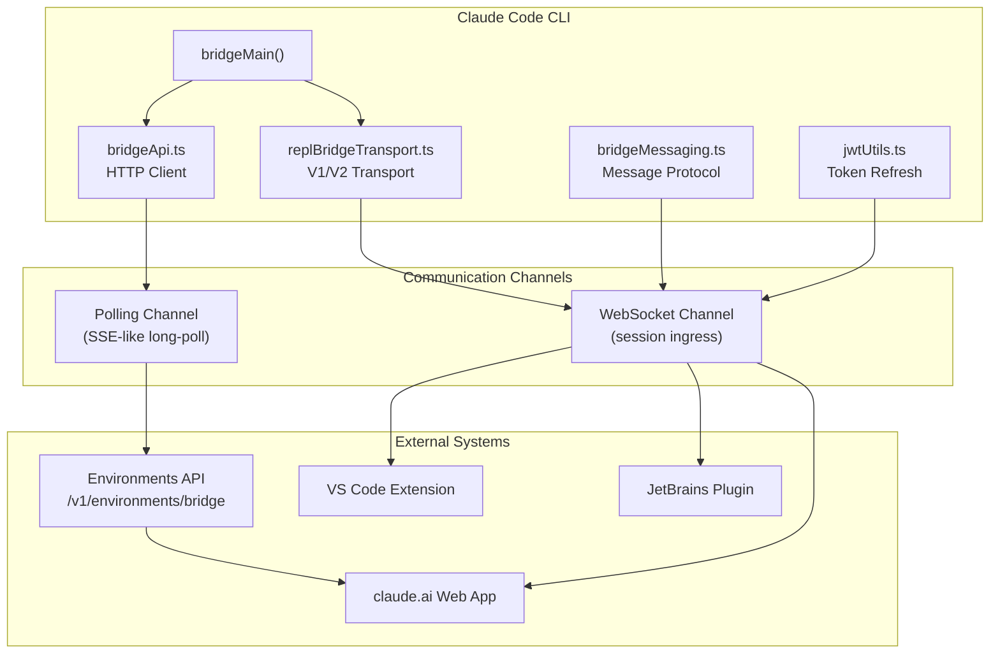

#### HTTP Polling vs WebSocket: A Hybrid Transport Strategy

The bridge uses a hybrid transport model rather than a pure WebSocket approach. The **polling channel** is an HTTP long-poll (`GET /v1/environments/{id}/work/poll` with a 10-second timeout) used exclusively for work discovery -- it tells the CLI when a user has started an interaction on claude.ai or an IDE. Once work is discovered, the **WebSocket/SSE channel** carries the actual conversation messages bidirectionally.

This separation exists for practical infrastructure reasons. The polling endpoint is stateless on the server: any replica can respond, and the client can resume polling after network interruptions without losing its place. The session ingress channel, by contrast, is stateful and bound to a specific session. Separating them means the CLI maintains presence (via polling) even when no session is active, and can pick up new work within 2 seconds of it being dispatched.

The poll interval adapts to the CLI's capacity state:

```
Not at capacity (no active transport): 2 seconds
At capacity (transport connected):     10 minutes (liveness signal only)
Heartbeat (when enabled):              60 seconds (5x headroom on 300s TTL)
```

These intervals are tunable at runtime via GrowthBook feature flags (`tengu_bridge_poll_interval_config`), allowing operations to adjust fleet-wide without deployments. The defaults are defined in `src/bridge/pollConfigDefaults.ts`.

#### Bridge API Client

The HTTP client in `src/bridge/bridgeApi.ts` wraps all Environments API calls behind a `BridgeApiClient` interface. It handles:

- **OAuth retry on 401**: When a request returns 401, the client attempts to refresh the OAuth token via an injected `onAuth401` callback, then retries once. This mirrors the retry pattern in the main API client (`withRetry.ts`).
- **Trusted device tokens**: The `X-Trusted-Device-Token` header is conditionally attached for elevated-security sessions (CCR v2).
- **Path traversal prevention**: All server-provided IDs interpolated into URL paths are validated against a strict `^[a-zA-Z0-9_-]+$` pattern to prevent injection.
- **Fatal vs retryable errors**: 401/403/404/410 errors throw `BridgeFatalError` (not retried); 429 throws a retryable error; 5xx responses are not reached (axios `validateStatus` filters `< 500`).

Key API endpoints:

| Method | Endpoint | Purpose |
|--------|----------|---------|
| POST | `/v1/environments/bridge` | Register environment (idempotent with `reuseEnvironmentId`) |
| GET | `/v1/environments/{id}/work/poll` | Long-poll for work items |
| POST | `/v1/environments/{id}/work/{workId}/ack` | Acknowledge work receipt |
| POST | `/v1/environments/{id}/work/{workId}/stop` | Release/stop work (force or soft) |
| POST | `/v1/environments/{id}/work/{workId}/heartbeat` | Extend work lease |
| POST | `/v1/environments/{id}/bridge/reconnect` | Reconnect existing session to env |
| DELETE | `/v1/environments/bridge/{id}` | Deregister environment |
| POST | `/v1/sessions/{id}/archive` | Archive a session (idempotent, 409 = already done) |
| POST | `/v1/sessions/{id}/events` | Send permission response events |

### Bridge Connection Flow

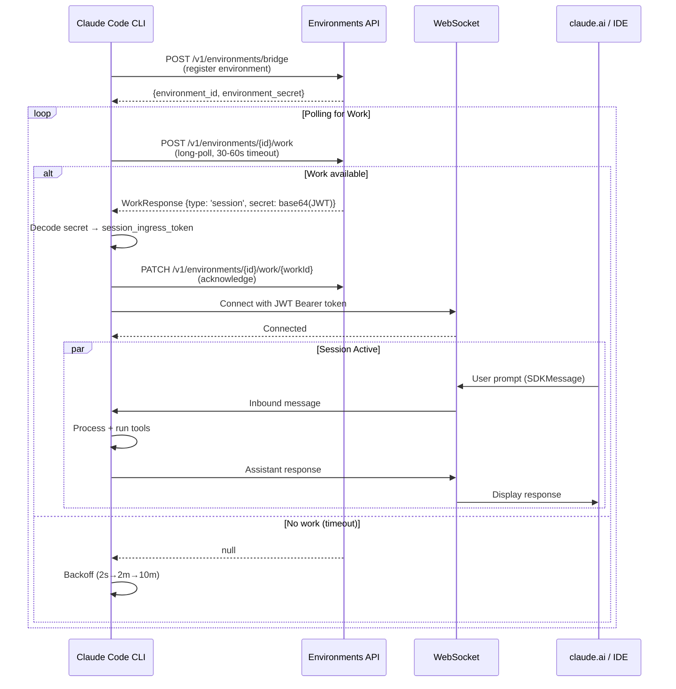

#### Registration to Session Establishment Walkthrough

The full lifecycle of a bridge connection proceeds through these stages:

**1. Environment Registration** (`initBridgeCore` in `src/bridge/replBridge.ts`):

The CLI calls `POST /v1/environments/bridge` with the machine name, working directory, git branch, git repo URL, max session capacity, and worker type metadata. It receives back an `environment_id` and `environment_secret`. If a prior crash-recovery pointer exists (perpetual mode), the CLI passes `reuseEnvironmentId` to attempt idempotent re-registration.

```typescript
// From replBridge.ts — environment registration
const bridgeConfig: BridgeConfig = {
  dir,
  machineName,
  branch,
  gitRepoUrl,
  maxSessions: 1,
  spawnMode: 'single-session',
  sandbox: false,
  bridgeId: randomUUID(),
  workerType,
  environmentId: randomUUID(),
  reuseEnvironmentId: prior?.environmentId,
  apiBaseUrl: baseUrl,
  sessionIngressUrl,
}
const reg = await api.registerBridgeEnvironment(bridgeConfig)
environmentId = reg.environment_id
environmentSecret = reg.environment_secret
```

**2. Session Creation**:

The CLI creates a session via an injected `createSession` callback (dependency-injected to avoid pulling the entire auth/model/OAuth dependency tree into daemon callers). The session ID is stored in a crash-recovery pointer file on disk.

**3. Poll Loop**:

The poll loop (`runWorkPollLoop`, driven by the `pollOpts` configuration) alternates between fast polling (2s when no transport is connected) and slow polling (10 minutes when at capacity). The poll uses the `environment_secret` for auth. When work arrives, the response contains a base64url-encoded work secret that embeds the session ingress JWT, the API base URL, and transport version hints.

**4. Work Secret Decoding** (`src/bridge/workSecret.ts`):

```typescript
export function decodeWorkSecret(secret: string): WorkSecret {
  const json = Buffer.from(secret, 'base64url').toString('utf-8')
  const parsed = jsonParse(json)
  // Validates version === 1, non-empty session_ingress_token, and api_base_url
  return parsed as WorkSecret
}
```

**5. Transport Construction**:

Based on whether the server indicates CCR v2 (via `use_code_sessions` in the work secret) or the `CLAUDE_BRIDGE_USE_CCR_V2` env var is set, the CLI constructs either a v1 `HybridTransport` or a v2 `SSETransport + CCRClient` pair. The v1 path uses OAuth tokens; the v2 path requires the JWT from the work secret (which contains a `session_id` claim validated by the server).

**6. Initial Message Flush**:

On first connect, the CLI flushes the current conversation history to the transport so the web UI shows the existing context. Messages are capped to the most recent N (default 200, tunable via GrowthBook `tengu_bridge_initial_history_cap`) and filtered for eligibility. A `FlushGate` mechanism queues any new messages arriving during the flush to prevent interleaving.

#### Reconnection and Recovery

The bridge implements a two-strategy reconnection path when the environment is lost (poll returns 404):

- **Strategy 1 (Reconnect-in-place)**: Re-register with the same `reuseEnvironmentId`. If the server returns the same environment ID, call `reconnectSession` to re-queue the existing session. The session ID stays the same, the web URL remains valid, and previously flushed UUIDs are preserved.

- **Strategy 2 (Fresh session)**: If the server returns a different environment ID (original TTL-expired), archive the old session and create a new one. The SSE sequence number is reset to 0, inbound UUID dedup is cleared, and the crash-recovery pointer is rewritten.

A reentrancy guard (`reconnectPromise`) ensures only one reconnection attempt runs at a time. The system also handles the case where the poll loop recovers on its own during a reconnection attempt (concurrent `onWorkReceived` during the `stopWork` await).

### Bridge Message Protocol

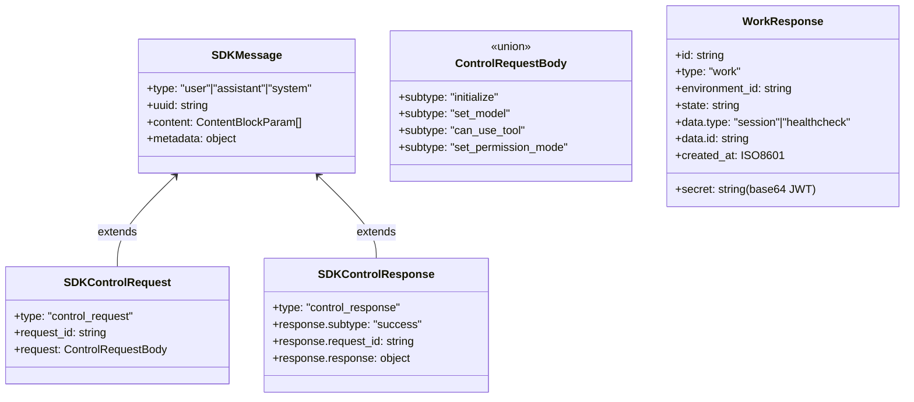

#### SDKMessage Types and Routing

The bridge messaging layer in `src/bridge/bridgeMessaging.ts` implements message parsing, routing, and deduplication. Incoming WebSocket/SSE frames are parsed and routed through `handleIngressMessage()`:

1. **`control_response`**: Routed to `onPermissionResponse` callback. Not an SDKMessage -- checked first via `isSDKControlResponse()`.
2. **`control_request`**: Routed to `onControlRequest` callback for server-initiated actions (initialize, set_model, interrupt, set_permission_mode, set_max_thinking_tokens). The server kills the WebSocket after ~10-14 seconds if no response is sent.
3. **`user`** SDKMessage: Forwarded to the REPL via `onInboundMessage`. Only user-type messages are forwarded; assistant/system messages from the server are ignored.
4. **All other types**: Silently dropped with a debug log.

#### Control Request/Response Pattern

The server sends `control_request` messages for session lifecycle events. The CLI must respond promptly or the WebSocket is terminated. The handler in `handleServerControlRequest()` supports:

```typescript
// From bridgeMessaging.ts
switch (request.request.subtype) {
  case 'initialize':
    // Respond with minimal capabilities
    response = { type: 'control_response', response: {
      subtype: 'success', request_id: request.request_id,
      response: { commands: [], output_style: 'normal',
        available_output_styles: ['normal'], models: [], account: {}, pid: process.pid }
    }}
    break
  case 'set_model':
    onSetModel?.(request.request.model)
    // respond success
    break
  case 'set_permission_mode':
    // Returns policy verdict to emit error control_response without
    // importing policy checks (bootstrap-isolation constraint)
    const verdict = onSetPermissionMode?.(request.request.mode)
    // respond success or error based on verdict
    break
  case 'interrupt':
    onInterrupt?.()
    // respond success
    break
  case 'set_max_thinking_tokens':
    onSetMaxThinkingTokens?.(request.request.max_thinking_tokens)
    // respond success
    break
}
```

For **outbound-only** bridge mode (mirror-mode attachments), all mutable requests (`interrupt`, `set_model`, `set_permission_mode`) receive an error response instead of a false success. The `initialize` request still succeeds because the server kills the connection otherwise.

#### Message Eligibility Filtering

Not all internal REPL messages are forwarded to the bridge. The `isEligibleBridgeMessage()` function filters:

```typescript
export function isEligibleBridgeMessage(m: Message): boolean {
  // Virtual messages (REPL inner calls) are display-only
  if ((m.type === 'user' || m.type === 'assistant') && m.isVirtual) {
    return false
  }
  return (
    m.type === 'user' ||
    m.type === 'assistant' ||
    (m.type === 'system' && m.subtype === 'local_command')
  )
}
```

This means tool results, progress events, and internal REPL chatter are excluded. The bridge/SDK consumers only see user/assistant turns and slash-command system events; the REPL `tool_use`/`tool_result` cycle is summarized in the assistant message.

#### UUID-Based Deduplication

The bridge uses two `BoundedUUIDSet` instances (ring buffers of capacity 2000) for deduplication:

- **`recentPostedUUIDs`**: Tracks UUIDs of messages the CLI has sent. Used for **echo filtering** -- when the server bounces the CLI's own messages back on the WebSocket, they are recognized and ignored.
- **`recentInboundUUIDs`**: Tracks UUIDs of inbound user prompts already forwarded to the REPL. Defensive **re-delivery dedup** for cases where SSE sequence-number negotiation fails and the server replays history.

```typescript
export class BoundedUUIDSet {
  private readonly ring: (string | undefined)[]
  private readonly set = new Set<string>()
  private writeIdx = 0
  // FIFO eviction: oldest entry is removed when capacity is reached
  add(uuid: string): void {
    if (this.set.has(uuid)) return
    const evicted = this.ring[this.writeIdx]
    if (evicted !== undefined) this.set.delete(evicted)
    this.ring[this.writeIdx] = uuid
    this.set.add(uuid)
    this.writeIdx = (this.writeIdx + 1) % this.capacity
  }
}
```

**Why UUID-based dedup (reconnection resilience)**: During transport swaps or reconnections, the server may replay session history from the beginning (if the `from_sequence_num` negotiation fails). Without UUID dedup, every historical prompt would be re-injected into the REPL as a new user message. The SSE sequence-number carryover (`lastTransportSequenceNum`) is the primary fix; UUID dedup is the safety net. The choice of UUIDs over sequence numbers for the safety net is deliberate: UUIDs are transport-independent and survive session-level events (reconnection with a new environment ID, fresh session creation), whereas sequence numbers are scoped to a single event stream.

#### Result Batching and Session Archival

When a session ends, the CLI sends a minimal `SDKResultSuccess` message before closing the WebSocket. This signals the server to trigger session archival:

```typescript
export function makeResultMessage(sessionId: string): SDKResultSuccess {
  return {
    type: 'result', subtype: 'success',
    duration_ms: 0, duration_api_ms: 0, is_error: false,
    num_turns: 0, result: '', stop_reason: null,
    total_cost_usd: 0, usage: { ...EMPTY_USAGE }, modelUsage: {},
    permission_denials: [], session_id: sessionId, uuid: randomUUID(),
  }
}
```

For message writes, the transport layer supports batching. The V1 `HybridTransport` writes are awaited per-write via POST. The V2 `CCRClient` uses a `SerialBatchEventUploader` internally (max batch size 100) that coalesces sequential `writeEvent` calls. The `writeBatch` method on the transport iterates messages sequentially (preserving order) while letting the uploader coalesce them into fewer HTTP requests.

### JWT Token Refresh

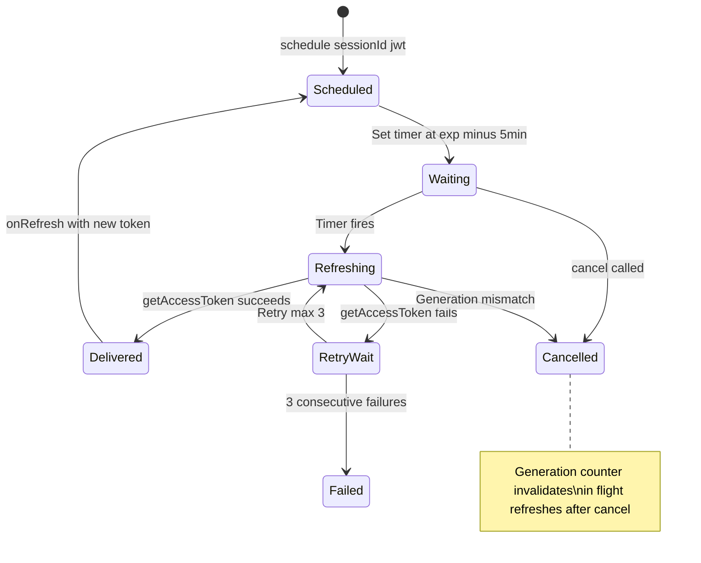

#### Proactive Refresh Strategy

The token refresh scheduler (`src/bridge/jwtUtils.ts`) implements a proactive refresh strategy that requests new tokens **before** expiry to avoid gaps in authentication. The key constants:

```typescript
const TOKEN_REFRESH_BUFFER_MS = 5 * 60 * 1000    // 5 minutes before expiry
const FALLBACK_REFRESH_INTERVAL_MS = 30 * 60 * 1000  // 30 min follow-up
const MAX_REFRESH_FAILURES = 3
const REFRESH_RETRY_DELAY_MS = 60_000              // 1 min between retries
```

When a token is scheduled, the scheduler decodes the JWT's `exp` claim (without signature verification -- the `sk-ant-si-` prefix is stripped first), computes `exp - now - 5min`, and sets a timer. If the token is already within the buffer window (or expired), refresh fires immediately.

After a successful refresh, a follow-up timer is always scheduled at the 30-minute fallback interval. This ensures long-running sessions maintain continuous authentication even if the new token's expiry cannot be decoded.

#### Generation Counter for Cancellation

The generation counter is the critical correctness mechanism for the refresh scheduler. Each session has a monotonically increasing generation number that is bumped on every `schedule()` and `cancel()` call. The async `doRefresh()` function captures the generation at invocation time and checks it after the `await getAccessToken()` resolves:

```typescript
async function doRefresh(sessionId: string, gen: number): Promise<void> {
  let oauthToken = await getAccessToken()

  // If the session was cancelled or rescheduled while we were awaiting,
  // the generation will have changed -- bail out to avoid orphaned timers.
  if (generations.get(sessionId) !== gen) {
    logForDebugging(`doRefresh stale (gen ${gen} vs ${generations.get(sessionId)}), skipping`)
    return
  }
  // ... proceed with refresh
}
```

**Why a generation counter**: Without it, a cancel-then-reschedule sequence could leave orphaned timers from the cancelled generation. The `cancel()` call clears the timer, but an already-running `doRefresh()` (awaiting the OAuth token) would complete, call `onRefresh`, and schedule a follow-up timer -- creating a parallel refresh chain that duplicates work and may deliver stale tokens. The generation counter eliminates this race by letting the in-flight refresh detect that its generation has been superseded.

### Bridge Transport Versions

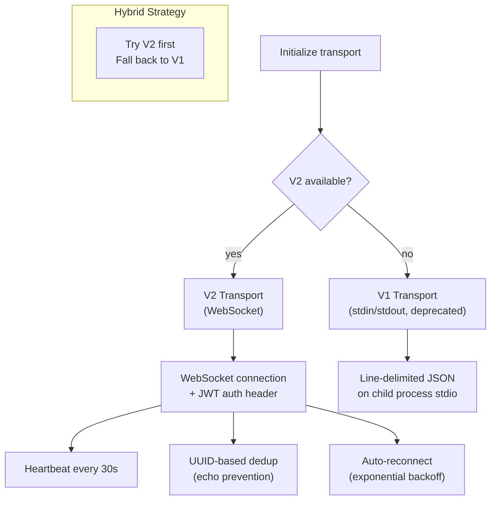

#### V1 Transport (HybridTransport)

The V1 transport wraps `HybridTransport`, which combines WebSocket reads with HTTP POST writes to Session-Ingress. Auth uses OAuth tokens (not JWTs). The `createV1ReplTransport` adapter in `src/bridge/replBridgeTransport.ts` is a thin pass-through that adds no-op implementations for V2-specific features (`reportState`, `reportMetadata`, `reportDelivery`, `flush`). Sequence numbers always return 0 since Session-Ingress uses a different replay mechanism.

#### V2 Transport (SSETransport + CCRClient)

The V2 transport splits reads and writes across two components:

- **SSETransport**: Opens an SSE stream at `{sessionUrl}/worker/events/stream` for inbound events. Supports `from_sequence_num` / `Last-Event-ID` for replay resumption.
- **CCRClient**: Handles outbound writes via `POST /worker/events`, worker state reporting (`PUT /worker`), heartbeats, and delivery tracking.

```typescript
// V2 construction in replBridgeTransport.ts
export async function createV2ReplTransport(opts: {
  sessionUrl: string
  ingressToken: string     // JWT with session_id claim
  sessionId: string
  initialSequenceNum?: number  // Carried from previous transport
  epoch?: number              // Worker epoch from /bridge response
  // ...
}): Promise<ReplBridgeTransport> {
  const epoch = opts.epoch ?? (await registerWorker(sessionUrl, ingressToken))
  // SSE for reads, CCRClient for writes
  const sse = new SSETransport(sseUrl, {}, sessionId, undefined, initialSequenceNum, getAuthHeaders)
  const ccr = new CCRClient(sse, new URL(sessionUrl), { getAuthHeaders, onEpochMismatch: () => { /* close + throw */ } })
  // Immediately ACK events as 'processed' alongside 'received'
  sse.setOnEvent(event => {
    ccr.reportDelivery(event.event_id, 'received')
    ccr.reportDelivery(event.event_id, 'processed')
  })
}
```

The V2 transport's `onEpochMismatch` handler (triggered by a 409 response) closes both the SSE stream and CCRClient, fires the `onClose` callback with code 4090, and throws to unwind the calling request. This triggers the poll loop to re-acquire work with a fresh epoch.

**Initialization is deferred to `connect()`**: The construction order is `newTransport -> setOnConnect -> setOnData -> setOnClose -> connect()`. Both `sse.connect()` (opens the SSE stream) and `ccr.initialize()` (registers the worker epoch) need the callbacks wired first. The `onConnect` callback fires when `ccr.initialize()` resolves; SSE opens in parallel.

### Bridge Configuration

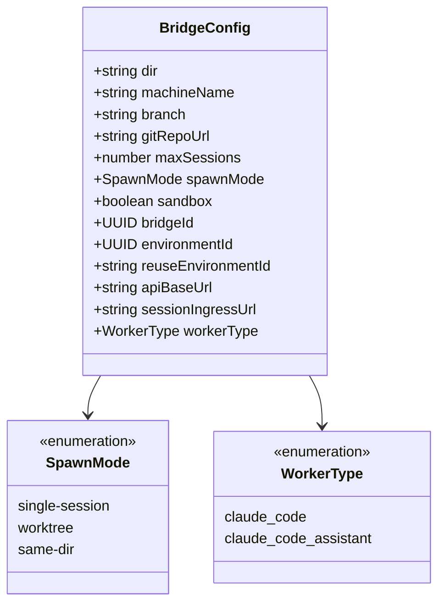

The `BridgeConfig` controls how the bridge registers with the server and spawns sessions:

- **`spawnMode`**: Determines how multiple sessions share the filesystem. `single-session` (REPL bridge) allows one session at a time. `worktree` creates git worktrees for concurrent sessions. `same-dir` runs multiple sessions in the same directory (risk of file conflicts).
- **`reuseEnvironmentId`**: When set, the server attempts to reattach to an existing environment rather than creating a new one. Used for crash recovery and perpetual-mode reconnection.
- **`workerType`**: Metadata filter for claude.ai. The desktop cowork app sends `"cowork"`; Claude Code sends a distinct value so the web picker can filter.

## Coordinator (Multi-Agent Orchestration)

The coordinator (`src/coordinator/`) enables multi-agent workflows where a coordinator agent dispatches work to specialized workers. Unlike a simple function-call delegation pattern, the coordinator acts as an intelligent orchestrator: it plans work distribution, synthesizes research findings into implementation specs, and manages worker lifecycles. Workers are full Claude Code instances with access to standard tools, but they operate within a restricted context and cannot see the coordinator's conversation.

### Coordinator Architecture

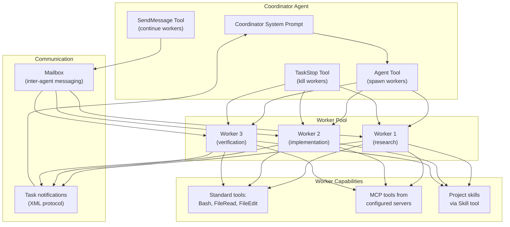

#### How the Coordinator Dispatches Work

The coordinator mode is activated by a combination of feature flag and environment variable checks in `src/coordinator/coordinatorMode.ts`:

```typescript
export function isCoordinatorMode(): boolean {
  if (feature('COORDINATOR_MODE')) {
    return isEnvTruthy(process.env.CLAUDE_CODE_COORDINATOR_MODE)
  }
  return false
}
```

When active, the coordinator injects a detailed system prompt (via `getCoordinatorSystemPrompt()`) and configures three tools: `Agent`, `SendMessage`, and `TaskStop`. Workers spawned via the Agent tool receive a restricted tool set. The coordinator provides workers with context about their available tools via `getCoordinatorUserContext()`:

```typescript
export function getCoordinatorUserContext(
  mcpClients: ReadonlyArray<{ name: string }>,
  scratchpadDir?: string,
): { [k: string]: string } {
  if (!isCoordinatorMode()) return {}

  const workerTools = isEnvTruthy(process.env.CLAUDE_CODE_SIMPLE)
    ? [BASH_TOOL_NAME, FILE_READ_TOOL_NAME, FILE_EDIT_TOOL_NAME].sort().join(', ')
    : Array.from(ASYNC_AGENT_ALLOWED_TOOLS)
        .filter(name => !INTERNAL_WORKER_TOOLS.has(name))
        .sort().join(', ')

  let content = `Workers spawned via the Agent tool have access to these tools: ${workerTools}`
  if (mcpClients.length > 0) {
    content += `\n\nWorkers also have access to MCP tools from connected MCP servers: ${mcpClients.map(c => c.name).join(', ')}`
  }
  if (scratchpadDir && isScratchpadGateEnabled()) {
    content += `\n\nScratchpad directory: ${scratchpadDir}`
  }
  return { workerToolsContext: content }
}
```

The `INTERNAL_WORKER_TOOLS` set (`TeamCreate`, `TeamDelete`, `SendMessage`, `SyntheticOutput`) is explicitly filtered out of the worker tool list -- these are coordinator-level primitives that workers should not have access to.

#### Worker Tool Restrictions

Workers receive a curated tool set from `ASYNC_AGENT_ALLOWED_TOOLS` (defined in `src/constants/tools.ts`) minus internal-only tools. In "simple" mode (`CLAUDE_CODE_SIMPLE=1`), workers get only Bash, FileRead, and FileEdit. In normal mode, workers get the full set including MCP tools from configured servers and project skills via the Skill tool. The coordinator's system prompt explicitly instructs it to delegate skill invocations (e.g., `/commit`, `/verify`) to workers rather than trying to run them directly.

#### Why Coordinator vs Direct Multi-Agent

A direct multi-agent approach (where the user spawns agents themselves) lacks the synthesis step that is critical for code quality. The coordinator pattern enforces a discipline: research findings are always synthesized into specific, self-contained implementation specs before any code is written. The coordinator's system prompt devotes significant space to this principle:

> "Never write 'based on your findings' or 'based on the research.' These phrases delegate understanding to the worker instead of doing it yourself."

This architecture also centralizes concurrency management. The coordinator knows which workers are modifying which files and can prevent conflicting writes, something that's impossible when agents operate independently.

### Coordinator Flow

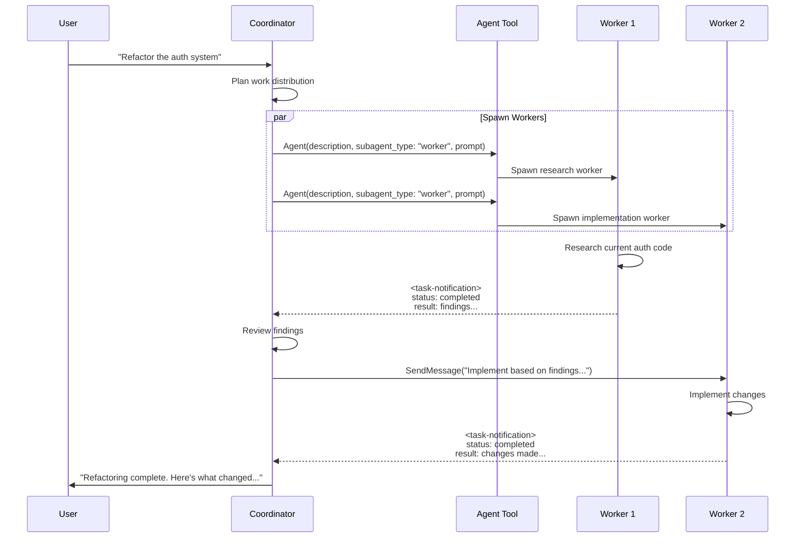

### Task Notification Protocol

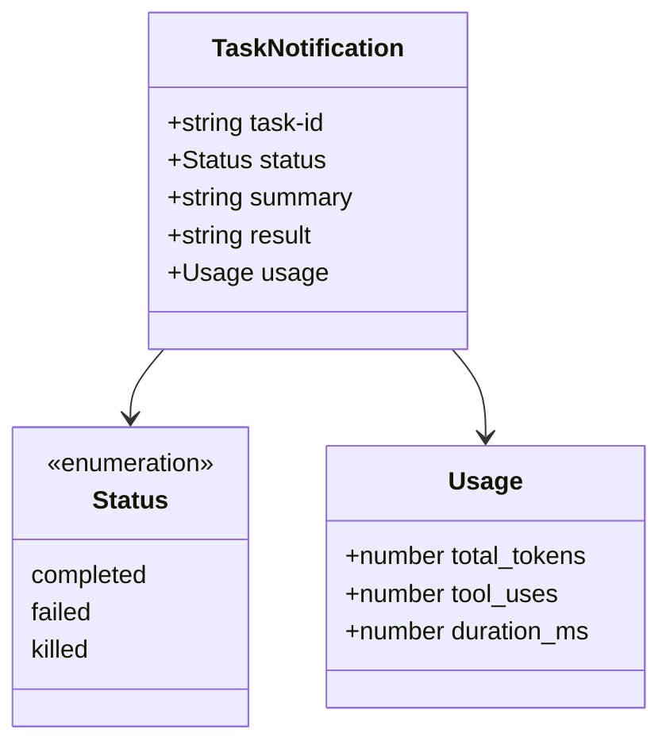

Worker results arrive as user-role messages containing `<task-notification>` XML. The coordinator's system prompt teaches it to distinguish these from actual user messages by looking for the `<task-notification>` opening tag. The notification includes:

- **`task-id`**: The agent ID from the spawn call. This is the value passed to `SendMessage`'s `to` parameter to continue the worker.
- **`status`**: One of `completed`, `failed`, or `killed` (the latter when stopped via `TaskStop`).
- **`summary`**: Human-readable status (e.g., `"Agent \"Investigate auth bug\" completed"`, `"failed: TypeError at validate.ts:42"`, or `"was stopped"`).
- **`result`** (optional): The worker's final text response.
- **`usage`** (optional): Token counts, tool use counts, and wall-clock duration for cost tracking.

### Coordinator Mode Activation

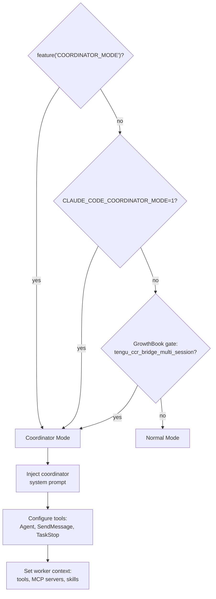

Session mode matching ensures that when resuming a session, the coordinator mode state matches what was stored. The `matchSessionMode()` function in `coordinatorMode.ts` flips the environment variable if there is a mismatch:

```typescript
export function matchSessionMode(
  sessionMode: 'coordinator' | 'normal' | undefined,
): string | undefined {
  const currentIsCoordinator = isCoordinatorMode()
  const sessionIsCoordinator = sessionMode === 'coordinator'
  if (currentIsCoordinator === sessionIsCoordinator) return undefined
  // Flip the env var -- isCoordinatorMode() reads it live
  if (sessionIsCoordinator) process.env.CLAUDE_CODE_COORDINATOR_MODE = '1'
  else delete process.env.CLAUDE_CODE_COORDINATOR_MODE
  return sessionIsCoordinator
    ? 'Entered coordinator mode to match resumed session.'
    : 'Exited coordinator mode to match resumed session.'
}
```

## Skills System

The skills system (`src/skills/`) provides reusable workflows that can be invoked as slash commands or by the model via the `SkillTool`. Skills are a generalization of the earlier "custom commands" concept, supporting five distinct sources, frontmatter-based configuration, tool restrictions, model overrides, and both inline and forked execution contexts.

### Skills Architecture

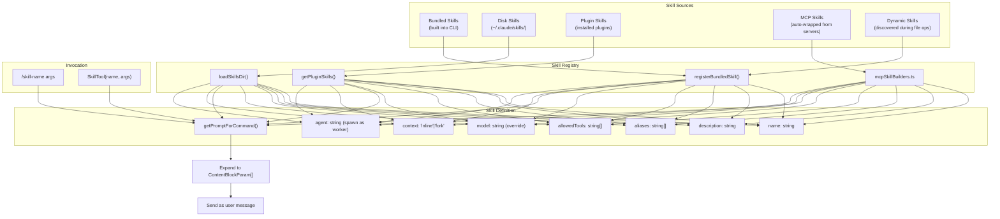

#### The Five Skill Sources

**1. Bundled Skills** (`src/skills/bundled/`): Compiled into the CLI binary and available to all users. Registered programmatically at startup via `registerBundledSkill()` in `src/skills/bundledSkills.ts`. The `initBundledSkills()` function in `src/skills/bundled/index.ts` registers all built-in skills, with some gated behind feature flags:

```typescript
export function initBundledSkills(): void {
  registerUpdateConfigSkill()
  registerKeybindingsSkill()
  registerVerifySkill()        // ant-only
  registerDebugSkill()
  registerLoremIpsumSkill()
  registerSkillifySkill()
  registerRememberSkill()
  registerSimplifySkill()
  registerBatchSkill()
  registerStuckSkill()
  if (feature('KAIROS') || feature('KAIROS_DREAM')) {
    const { registerDreamSkill } = require('./dream.js')
    registerDreamSkill()
  }
  if (feature('BUILDING_CLAUDE_APPS')) {
    const { registerClaudeApiSkill } = require('./claudeApi.js')
    registerClaudeApiSkill()
  }
  // ... more feature-gated skills
}
```

Bundled skills can optionally declare reference files (via the `files` property) that are extracted to disk on first invocation. This allows the model to `Read`/`Grep` supporting documentation on demand:

```typescript
export type BundledSkillDefinition = {
  name: string
  description: string
  aliases?: string[]
  allowedTools?: string[]
  model?: string
  context?: 'inline' | 'fork'
  agent?: string
  files?: Record<string, string>  // relPath -> content, extracted lazily
  getPromptForCommand: (args: string, context: ToolUseContext) => Promise<ContentBlockParam[]>
}
```

**2. Disk Skills** (`~/.claude/skills/`, `.claude/skills/`): Markdown files loaded from user-level, project-level, and policy-managed directories. Parsed by `loadSkillsDir.ts` which scans multiple directory hierarchies, parses YAML frontmatter, deduplicates via `realpath` (handling symlinks), and applies `.gitignore` rules. Skill directories are scanned from three sources based on `SettingSource`: `policySettings`, `userSettings`, and `projectSettings`.

**3. Plugin Skills**: Loaded from installed plugins via `getPluginSkills()` in `src/utils/plugins/loadPluginCommands.ts`. Plugin skills follow the same frontmatter contract as disk skills but are distributed through the plugin system.

**4. MCP Skills**: Automatically generated from MCP server prompts. The `mcpSkillBuilders.ts` module provides a write-once registry (to avoid circular dependencies) that bridges MCP prompt discovery with the skill loading system. Only MCP entries with `loadedFrom === 'mcp'` are included; plain MCP prompts are not reachable via `SkillTool`.

**5. Dynamic Skills**: Discovered during file operations (FileRead, FileEdit, FileWrite). When the model reads or edits files in certain paths, the skill change detector (`src/utils/skills/skillChangeDetector.ts`) can register new skills dynamically.

#### Frontmatter Parsing

Disk-based skills use YAML frontmatter to configure behavior. The `parseSkillFrontmatterFields()` function in `loadSkillsDir.ts` extracts:

| Field | Type | Purpose |
|-------|------|---------|
| `description` | string | Shown in skill listing and to the model |
| `allowed-tools` | string[] | Restricts which tools the model can use during this skill |
| `model` | string | Override the default model for this skill |
| `when-to-use` | string | Hint to the model about when to invoke this skill |
| `user-invocable` | boolean | Whether the user can invoke via slash command (default true) |
| `disable-model-invocation` | boolean | Prevent the model from invoking via SkillTool |
| `hooks` | HooksSettings | Pre/post execution hooks |
| `context` | 'fork' | Run in a separate sub-conversation instead of inline |
| `agent` | string | Spawn as a worker agent |
| `effort` | EffortValue | Control the model's reasoning effort level |
| `shell` | FrontmatterShell | Shell execution configuration for embedded commands |
| `paths` | string[] | Glob patterns limiting when the skill is suggested |
| `argument-hint` | string | Placeholder text for the argument input |

#### Why Skills Have Tool Restrictions

The `allowedTools` field on a skill definition serves two purposes:

1. **Safety**: A skill like `/commit` should only be able to run Bash (for git commands) and read files. Allowing it to spawn sub-agents or make arbitrary edits would violate the principle of least privilege.

2. **Cost control**: When a skill runs in fork context, the sub-conversation has its own tool budget. Restricting tools prevents the forked agent from spiraling into expensive tool chains that were not part of the skill's design.

### Skill Loading Flow

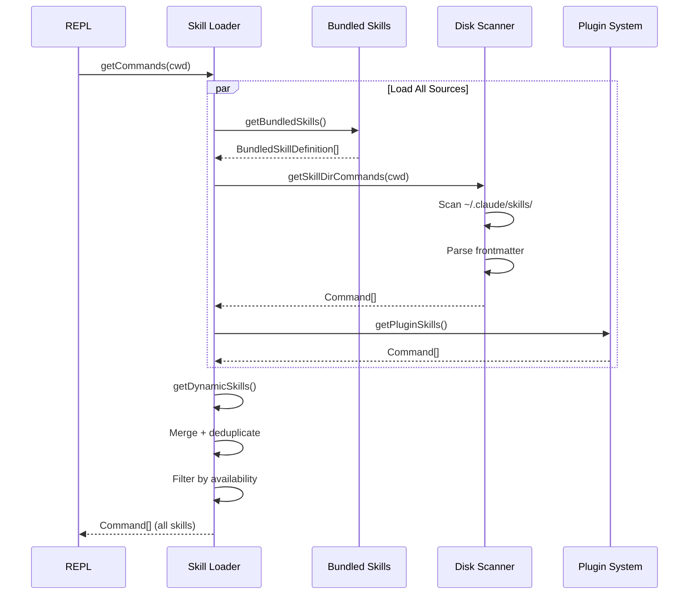

The `SkillTool` in `src/tools/SkillTool/SkillTool.ts` augments the local command list with MCP skills from the app state:

```typescript
async function getAllCommands(context: ToolUseContext): Promise<Command[]> {
  const mcpSkills = context.getAppState().mcp.commands.filter(
    cmd => cmd.type === 'prompt' && cmd.loadedFrom === 'mcp',
  )
  if (mcpSkills.length === 0) return getCommands(getProjectRoot())
  const localCommands = await getCommands(getProjectRoot())
  return uniqBy([...localCommands, ...mcpSkills], 'name')
}
```

### Skill Execution

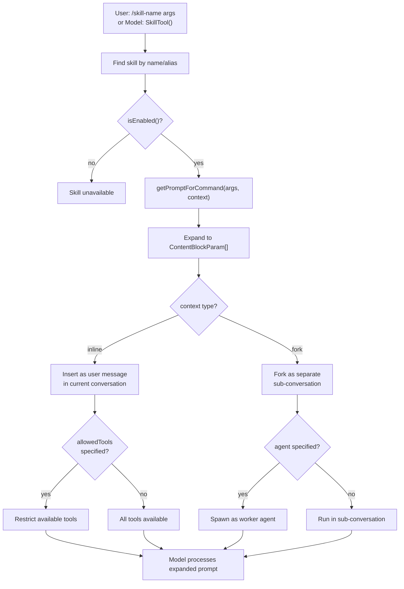

#### Inline vs Fork Context

When a skill's `context` is `'inline'` (or unset), its prompt is injected as a user message in the current conversation. The model processes it with full conversation context visible. This is appropriate for skills that need to reference prior discussion or whose output should appear naturally in the conversation flow.

When `context` is `'fork'`, the skill runs in a separate sub-conversation via `prepareForkedCommandContext()`. The forked conversation gets its own message history (seeded with the skill prompt) and its own tool budget. Results are extracted via `extractResultText()` and returned as a tool result in the parent conversation. This isolation prevents the skill from contaminating the main conversation's context window with intermediate tool calls.

The `agent` field takes forking further: instead of running in a sub-conversation within the same process, the skill spawns as a full worker agent via `runAgent()`. This is the most isolated execution mode and is used for skills that may need long-running autonomous execution.

#### Example: Bundled Skill Registration

The `verify` skill demonstrates the bundled skill pattern:

```typescript
// src/skills/bundled/verify.ts
const { frontmatter, content: SKILL_BODY } = parseFrontmatter(SKILL_MD)

export function registerVerifySkill(): void {
  if (process.env.USER_TYPE !== 'ant') return  // ant-only

  registerBundledSkill({
    name: 'verify',
    description: DESCRIPTION,
    userInvocable: true,
    files: SKILL_FILES,  // Reference files extracted to disk on first invocation
    async getPromptForCommand(args) {
      const parts: string[] = [SKILL_BODY.trimStart()]
      if (args) parts.push(`## User Request\n\n${args}`)
      return [{ type: 'text', text: parts.join('\n\n') }]
    },
  })
}
```

The skill's markdown content (`SKILL_MD`) is defined in a separate content file and parsed for frontmatter at module load time. The `files` property causes supporting reference files to be extracted to a deterministic directory under `getBundledSkillsRoot()` on first invocation, and the prompt is prefixed with a "Base directory for this skill" line so the model knows where to find them.

## Swarm System

For distributed agent work, the swarm system enables leader-worker collaboration. Unlike the coordinator (which is a single-process orchestration pattern), the swarm system operates across multiple processes -- potentially running in separate terminal panes (tmux, iTerm2) or as background tasks. Communication happens through a file-based mailbox system, with each teammate having an inbox at `~/.claude/teams/{team_name}/inboxes/{agent_name}.json`.

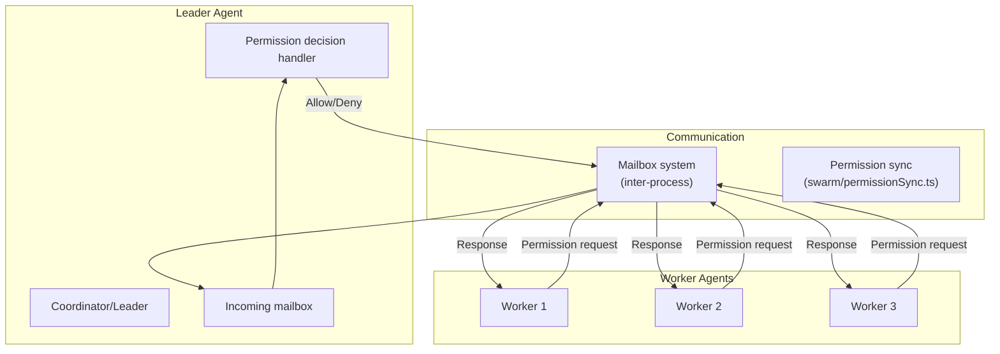

#### Mailbox-Based Communication

The teammate mailbox (`src/utils/teammateMailbox.ts`) is a file-based messaging system where each agent has a JSON inbox file. Messages include sender name, text content, timestamp, read status, and optional color (for UI display). Concurrent writes are serialized via file locking with retry backoff:

```typescript
const LOCK_OPTIONS = {
  retries: { retries: 10, minTimeout: 5, maxTimeout: 100 },
}
```

The mailbox doubles as both the general communication channel (for `SendMessage` tool interactions) and the permission synchronization channel. Permission-related messages use structured JSON payloads wrapped in the standard mailbox format.

#### Leader-Worker Permission Sync

The permission synchronization system in `src/utils/swarm/permissionSync.ts` enables workers to escalate permission decisions to the leader. This is necessary because workers are autonomous processes that may need to run commands requiring human approval, but the human only interacts with the leader's UI.

The system uses two complementary storage mechanisms:

1. **File-based directory structure** (`~/.claude/teams/{teamName}/permissions/`): Contains `pending/` and `resolved/` subdirectories where permission request JSON files are atomically moved on resolution. Used as the persistence layer.

2. **Mailbox-based messaging**: Permission requests and responses are also sent through the teammate mailbox for real-time notification. This ensures the leader's polling loop detects new requests promptly.

A permission request contains:

```typescript
type SwarmPermissionRequest = {
  id: string              // Unique request ID (perm-{timestamp}-{random})
  workerId: string        // Worker's CLAUDE_CODE_AGENT_ID
  workerName: string      // Worker's CLAUDE_CODE_AGENT_NAME
  workerColor: string     // For UI display
  teamName: string        // Team routing key
  toolName: string        // e.g., "Bash", "Edit"
  toolUseId: string       // Original tool_use ID from worker context
  description: string     // Human-readable description of the tool use
  input: Record<string, unknown>  // Serialized tool input
  permissionSuggestions: unknown[] // Suggested "always allow" rules
  status: 'pending' | 'approved' | 'rejected'
  resolvedBy?: 'worker' | 'leader'
  resolvedAt?: number
  feedback?: string       // Rejection reason
  updatedInput?: Record<string, unknown>  // Modified input from resolver
  permissionUpdates?: unknown[]  // "Always allow" rules applied
  createdAt: number
}
```

The resolution flow supports both leader resolution (user clicks approve/deny in the leader's terminal) and worker self-resolution (worker's local bash classifier auto-approves the command). Resolution moves the JSON file from `pending/` to `resolved/` atomically under a directory-level lock, then sends a response message to the worker's mailbox.

#### Sandbox Permission Extension

The swarm permission system extends to sandbox network access. When a worker running in a sandboxed environment needs to access a host, it sends a `SandboxPermissionRequest` to the leader via `sendSandboxPermissionRequestViaMailbox()`. The leader can approve or deny the network connection, and the response is routed back through the same mailbox infrastructure.

### Swarm Permission Flow

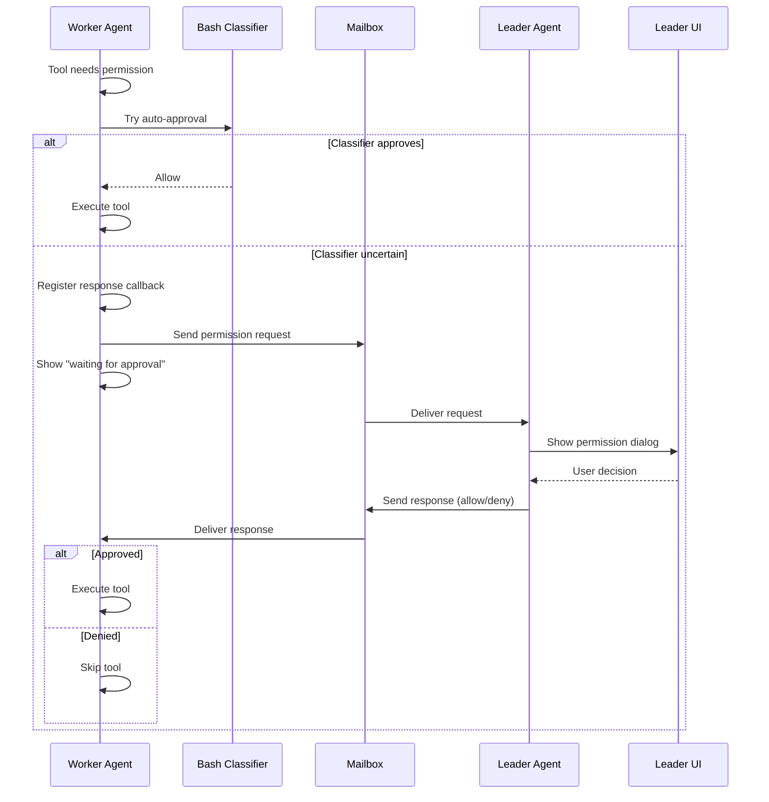

The worker-side permission handler (`src/hooks/toolPermission/handlers/swarmWorkerHandler.ts`) integrates with the standard permission system. When a tool invocation requires permission and the agent is identified as a swarm worker (`isSwarmWorker()` returns true based on the presence of `CLAUDE_CODE_TEAM_NAME` and `CLAUDE_CODE_AGENT_ID` environment variables), the handler routes the request through the mailbox system instead of showing a local permission prompt.

Periodic cleanup of old resolved permission files prevents file accumulation. The `cleanupOldResolutions()` function removes resolved request files older than a configurable threshold (default 1 hour).

## Source References

| File | Purpose |
|------|---------|
| `src/bridge/replBridge.ts` | Bridge orchestrator: env registration, poll loop, transport management, reconnection |
| `src/bridge/bridgeApi.ts` | HTTP client for Environments API with OAuth retry and path validation |
| `src/bridge/bridgeMessaging.ts` | Message parsing, routing, UUID dedup, control request handling |
| `src/bridge/replBridgeTransport.ts` | V1/V2 transport abstraction (HybridTransport vs SSE+CCRClient) |
| `src/bridge/jwtUtils.ts` | JWT decoding and proactive token refresh scheduler |
| `src/bridge/workSecret.ts` | Work secret decoding, SDK URL construction, session ID comparison |
| `src/bridge/types.ts` | Type definitions: BridgeConfig, WorkResponse, WorkSecret |
| `src/bridge/pollConfigDefaults.ts` | Default poll intervals and heartbeat configuration |
| `src/coordinator/coordinatorMode.ts` | Coordinator activation, session mode matching, worker context |
| `src/skills/bundledSkills.ts` | Bundled skill registration and file extraction |
| `src/skills/bundled/index.ts` | Skill initialization registry with feature-flag gating |
| `src/skills/bundled/verify.ts` | Example bundled skill implementation |
| `src/skills/loadSkillsDir.ts` | Disk-based skill scanning, frontmatter parsing, deduplication |
| `src/skills/mcpSkillBuilders.ts` | Write-once registry bridging MCP prompts to skill system |
| `src/tools/SkillTool/SkillTool.ts` | SkillTool implementation: command lookup, execution, forking |
| `src/utils/swarm/permissionSync.ts` | Swarm permission request/response lifecycle |
| `src/utils/teammateMailbox.ts` | File-based inter-agent messaging with lock serialization |
| `src/hooks/toolPermission/handlers/swarmWorkerHandler.ts` | Worker-side permission escalation to leader |
