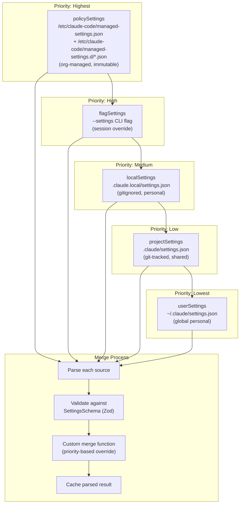
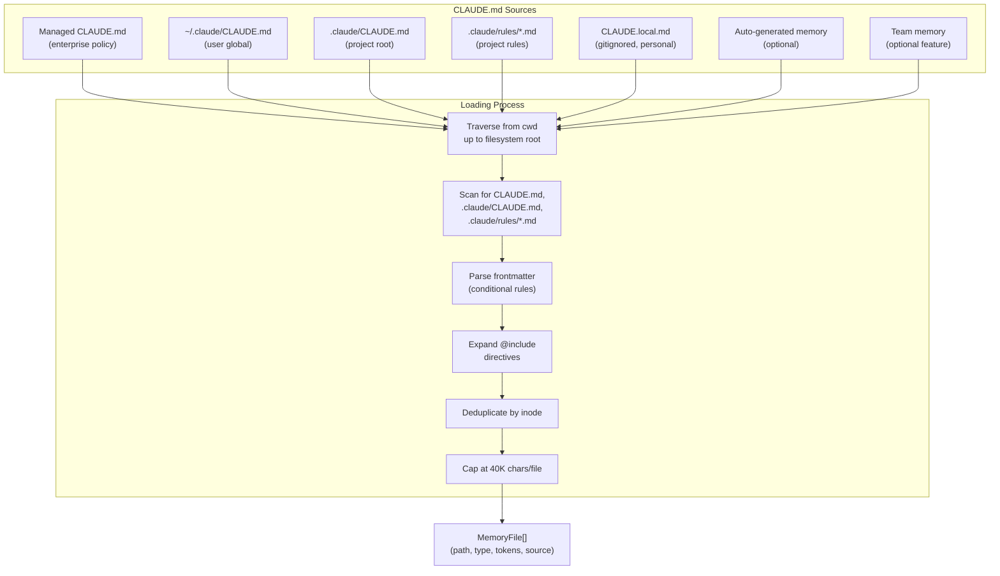
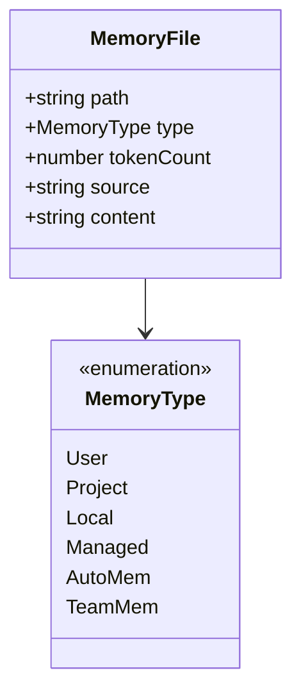
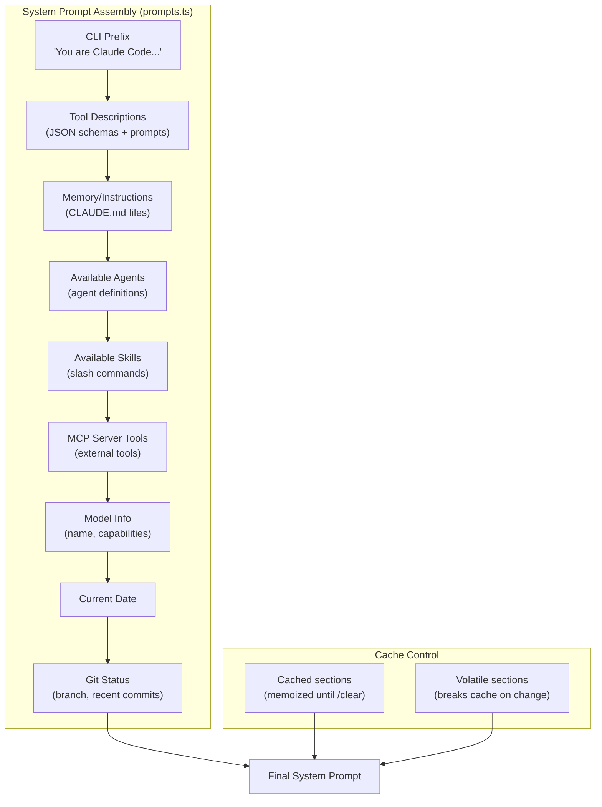
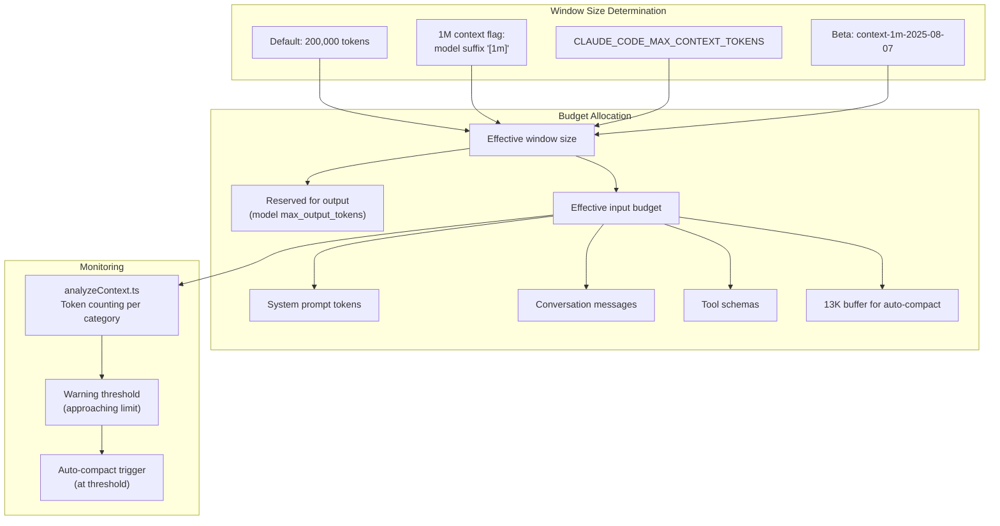
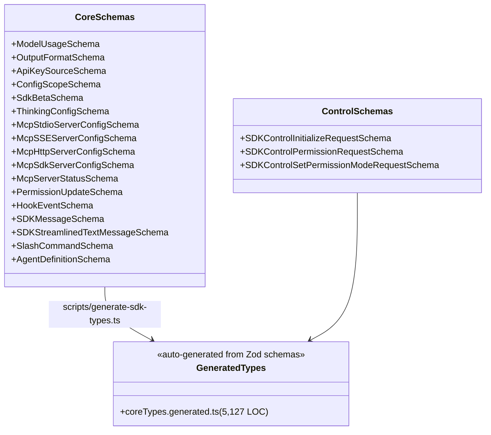
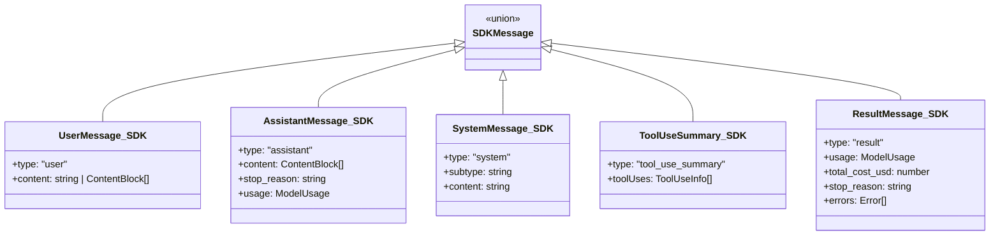
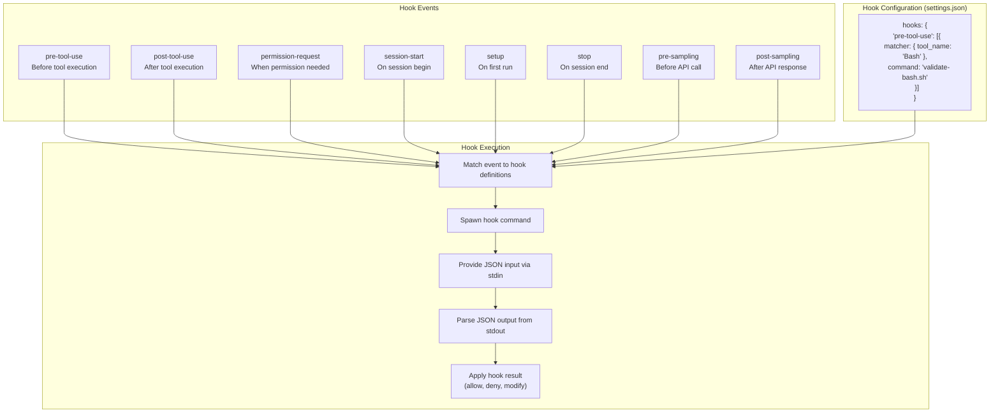
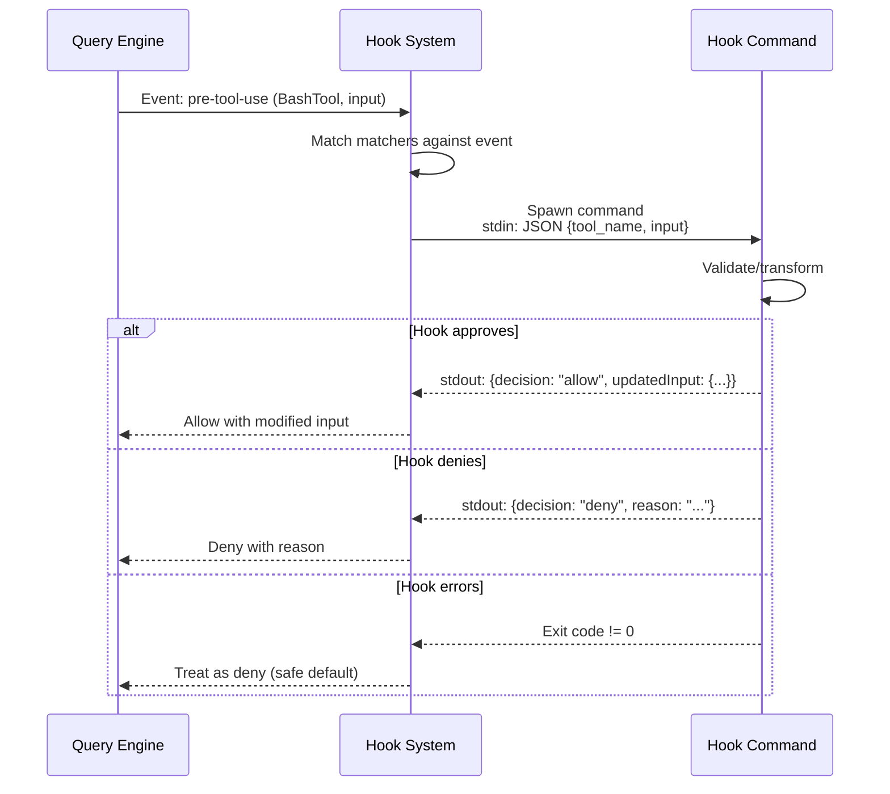
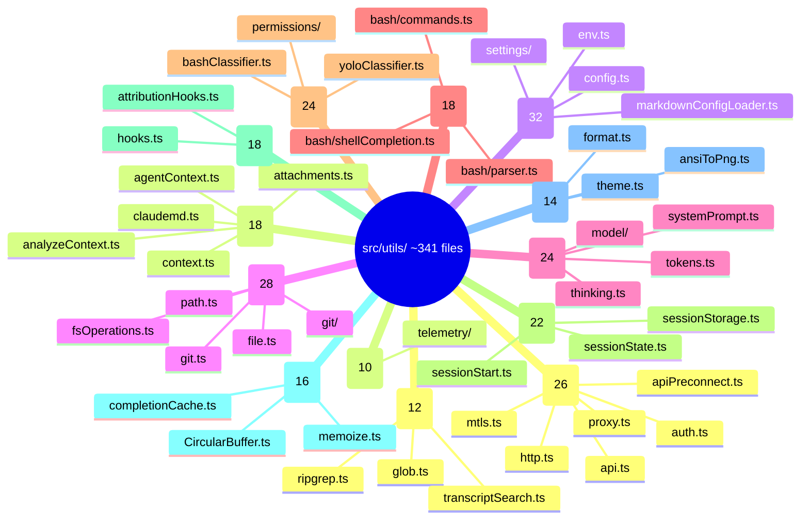

# Configuration and Context Assembly

This document covers the five major configuration and context subsystems in Claude Code: settings hierarchy, CLAUDE.md memory loading, system prompt assembly, context window management, SDK schemas, and the hook system. Together, these subsystems determine what instructions the model receives, how external commands integrate into the lifecycle, and how the finite context window is allocated.

---

## Settings Hierarchy

Claude Code loads configuration from 5+ sources with strict priority ordering:



### The Five Sources

The settings sources are defined in `src/utils/settings/constants.ts` as an ordered constant array. The order matters -- later sources override earlier ones during the merge:

```typescript
// src/utils/settings/constants.ts
export const SETTING_SOURCES = [
  'userSettings',      // ~/.claude/settings.json (global personal)
  'projectSettings',   // .claude/settings.json (git-tracked, shared)
  'localSettings',     // .claude/settings.local.json (gitignored)
  'flagSettings',      // --settings CLI flag (session override)
  'policySettings',    // managed-settings.json or remote API (org-managed)
] as const
```

Each source maps to a specific file path:

| Source | File Path | Scope |
|---|---|---|
| `userSettings` | `~/.claude/settings.json` | Global personal preferences |
| `projectSettings` | `$CWD/.claude/settings.json` | Checked into git, shared with team |
| `localSettings` | `$CWD/.claude/settings.local.json` | Automatically gitignored, personal per-project |
| `flagSettings` | Path from `--settings` CLI flag | Session-scoped override |
| `policySettings` | `/etc/claude-code/managed-settings.json` + drop-ins | Enterprise-managed, immutable |

The `policySettings` source is the most complex. It implements a "first source wins" cascade across four sub-sources, checked in this order:

1. **Remote managed settings** -- fetched from the API and cached locally
2. **MDM settings** -- macOS plist or Windows HKLM registry
3. **File-based settings** -- `/etc/claude-code/managed-settings.json` plus `managed-settings.d/*.json` drop-in files (sorted alphabetically, following the systemd convention)
4. **HKCU settings** -- Windows current-user registry (lowest priority, user-writable)

The `flagSettings` source also supports inline settings set via the SDK, which are merged on top of any file-based flag settings.

### Validation with Zod

Every settings file is validated against `SettingsSchema` (defined in `src/utils/settings/types.ts`) using Zod v4. The schema is wrapped in a `lazySchema()` helper for deferred evaluation. Before schema validation, the system pre-filters invalid permission rules so that one bad rule does not cause the entire file to be rejected:

```typescript
// src/utils/settings/settings.ts (parseSettingsFileUncached)
const ruleWarnings = filterInvalidPermissionRules(data, path)
const result = SettingsSchema().safeParse(data)
if (!result.success) {
  const errors = formatZodError(result.error, path)
  return { settings: null, errors: [...ruleWarnings, ...errors] }
}
return { settings: result.data, errors: ruleWarnings }
```

The schema uses `.passthrough()` on the permissions object and coercion (`z.coerce.string()`) for environment variables. Unknown fields are preserved in the file during writes, so that new fields added by a newer version of Claude Code are not silently deleted by an older version. The `SettingsSchema` documentation in the source code explicitly enumerates allowed and breaking changes to maintain backward compatibility.

### Merge Strategy

Settings are merged using `lodash-es/mergeWith` with a custom merge function (`settingsMergeCustomizer`). The customizer handles arrays specially -- instead of replacing, arrays are concatenated and deduplicated:

```typescript
// src/utils/settings/settings.ts
export function settingsMergeCustomizer(objValue: unknown, srcValue: unknown): unknown {
  if (Array.isArray(objValue) && Array.isArray(srcValue)) {
    return mergeArrays(objValue, srcValue)  // concat + uniq
  }
  return undefined  // let lodash handle default deep merge
}
```

When writing settings back via `updateSettingsForSource`, a different customizer is used: arrays are replaced wholesale (caller computes desired final state), and `undefined` values trigger deletion of the key.

The merge process in `loadSettingsFromDisk` starts with plugin settings as the lowest-priority base, then iterates through each enabled source in order. A `seenFiles` set prevents loading the same resolved file path twice (important when project root and CWD overlap). Policy settings use the "first source wins" sub-cascade described above rather than the standard file-based loading.

### Cache Invalidation

Settings use a three-layer caching strategy defined in `src/utils/settings/settingsCache.ts`:

1. **Parse file cache** (`parseFileCache: Map<string, ParsedSettings>`) -- keyed by file path, deduplicates disk reads and Zod parsing when multiple code paths request the same file
2. **Per-source cache** (`perSourceCache: Map<SettingSource, SettingsJson | null>`) -- stores the resolved settings for each individual source
3. **Session cache** (`sessionSettingsCache: SettingsWithErrors | null`) -- stores the fully merged result

All three caches are cleared atomically by `resetSettingsCache()`, which is called on settings writes, `--add-dir` operations, plugin initialization, and hook refresh events. The `parseSettingsFile` function always clones its return value so callers cannot mutate cached entries.

### Design Intent: Why Five Levels?

The five-level hierarchy balances organizational control with individual freedom:

- **policySettings** gives enterprises absolute control. Rules like `disableBypassPermissionsMode: "disable"` cannot be overridden by any lower-priority source. Critically, `projectSettings` is excluded from security-sensitive checks like `hasSkipDangerousModePermissionPrompt` and `hasAutoModeOptIn` to prevent a malicious repository from auto-bypassing the trust dialog (RCE risk).
- **flagSettings** enables SDK integrations and CI/CD pipelines to inject session-scoped overrides without modifying files.
- **localSettings** provides per-project personalization (API keys, custom models) that should never be committed to version control. The system automatically adds the file to `.gitignore`.
- **projectSettings** allows teams to share common configuration (permission rules, hooks, MCP servers) through version control.
- **userSettings** provides global defaults that apply everywhere unless overridden.

The `--setting-sources` CLI flag can selectively disable sources (e.g., `--setting-sources=user,local` to ignore project settings), but `policySettings` and `flagSettings` are always enabled and cannot be disabled.

---

## CLAUDE.md Loading System

Memory/instruction files are loaded from multiple scopes with `@include` directive support:



### Memory File Types



### Traversal Algorithm

The core loading logic lives in `getMemoryFiles()` (in `src/utils/claudemd.ts`), a memoized async function. The traversal follows a precise order designed so that later-loaded files have higher priority (the model pays more attention to content that appears later in the system prompt):

1. **Managed memory** -- loaded first (lowest priority in terms of model attention). Reads from `/etc/claude-code/CLAUDE.md` and `/etc/claude-code/.claude/rules/*.md`.

2. **User memory** -- `~/.claude/CLAUDE.md` and `~/.claude/rules/*.md`. Only loaded if `userSettings` source is enabled. User memory files can always include external files (outside the project directory).

3. **Project and Local memory** -- discovered by walking the directory tree from CWD upward to the filesystem root. At each directory, the system checks three file locations:
   - `$DIR/CLAUDE.md` (Project type)
   - `$DIR/.claude/CLAUDE.md` (Project type)
   - `$DIR/.claude/rules/*.md` (Project type, recursing into subdirectories)
   - `$DIR/CLAUDE.local.md` (Local type, only if `localSettings` enabled)

The directory list is built by walking upward, then **reversed** so files are processed from root downward to CWD. This means files closer to CWD are loaded last and thus have higher priority:

```typescript
// src/utils/claudemd.ts (getMemoryFiles)
let currentDir = originalCwd
while (currentDir !== parse(currentDir).root) {
  dirs.push(currentDir)
  currentDir = dirname(currentDir)
}
// Process from root downward to CWD
for (const dir of dirs.reverse()) { ... }
```

A special case handles git worktrees nested inside their main repository. When working in `.claude/worktrees/<name>/`, the upward walk passes through both the worktree root and the main repo root, which would cause the same checked-in CLAUDE.md to be loaded twice. The system detects this situation by comparing `findGitRoot()` with `findCanonicalGitRoot()` and skips Project-type files from directories above the worktree but within the main repo.

4. **Additional directories** -- if `CLAUDE_CODE_ADDITIONAL_DIRECTORIES_CLAUDE_MD` is set, CLAUDE.md files from `--add-dir` paths are also loaded.

5. **Auto-generated memory** (`AutoMem`) and **Team memory** (`TeamMem`) -- feature-gated, loaded last if enabled.

### Frontmatter Conditionals

CLAUDE.md files can include YAML frontmatter with a `paths` field that makes the rule conditional on the file being worked on:

```typescript
// src/utils/claudemd.ts (parseFrontmatterPaths)
const { frontmatter, content } = parseFrontmatter(rawContent)
if (!frontmatter.paths) {
  return { content }
}
const patterns = splitPathInFrontmatter(frontmatter.paths)
  .map(pattern => pattern.endsWith('/**') ? pattern.slice(0, -3) : pattern)
  .filter((p: string) => p.length > 0)
```

If all patterns are `**` (match-all), the file is treated as unconditional. The `processMdRules` function uses a `conditionalRule` flag to separate files into those with frontmatter paths (conditional) and those without.

### @include Expansion

Memory files can include other files using `@` notation. The syntax supports `@path`, `@./relative/path`, `@~/home/path`, and `@/absolute/path`. The `@` directive is parsed from the markdown AST (using the `marked` lexer) to ensure it only operates on leaf text nodes -- `@` references inside code blocks and code spans are ignored. Block-level HTML comments (`<!-- ... -->`) are also stripped before the content is used, and any `@` references inside comments are ignored.

Key constraints on `@include`:
- **Maximum depth** of 5 levels to prevent runaway recursion
- **Circular reference prevention** via a `processedPaths` set (normalized for case-insensitive filesystems)
- **Symlink resolution** to prevent the same file from being loaded through different paths
- **Text file extensions only** -- a hardcoded allowlist of ~130 extensions (`.md`, `.ts`, `.py`, etc.) prevents binary files from being included
- **External file restriction** -- files outside the CWD are only included if the user has approved external includes in the project config, or if the including file is a User-type memory file
- **Exclusion patterns** -- the `claudeMdExcludes` setting allows glob patterns to exclude specific files. Patterns are matched with picomatch, and symlink-resolved versions of absolute patterns are also tested

### Deduplication and the 40K Cap

Deduplication happens via the `processedPaths` set, which tracks normalized file paths (including symlink-resolved versions). If a file has already been processed through any path, it is skipped.

Each individual memory file has a recommended maximum of 40,000 characters (`MAX_MEMORY_CHARACTER_COUNT`). For `AutoMem` and `TeamMem` types, the content is explicitly truncated by `truncateEntrypointContent()`.

### Design Intent: Why Traverse from CWD to Root?

The upward traversal mirrors how git itself discovers `.gitignore` and configuration. For monorepo setups, a root `CLAUDE.md` can provide repository-wide instructions while subdirectory-specific `CLAUDE.md` files add context for individual packages. Because files closer to CWD are loaded later (and thus appear later in the system prompt where the model pays more attention), the most specific instructions naturally take precedence over general ones. The `MEMORY_INSTRUCTION_PROMPT` constant makes this explicit: "These instructions OVERRIDE any default behavior and you MUST follow them exactly as written."

---

## System Prompt Assembly

The system prompt is built from multiple layers with a priority hierarchy:

```mermaid
flowchart TD
    subgraph "Prompt Priority"
        Override{"Override<br/>system prompt?"}
        Override -->|yes| UseOverride["Use override<br/>(loop mode)"]
        Override -->|no| CoordCheck{"Coordinator mode<br/>and no agent?"}
        CoordCheck -->|yes| UseCoord["Use coordinator prompt"]
        CoordCheck -->|no| AgentCheck{"Agent defined?"}
        AgentCheck -->|yes| ProactiveCheck{"Proactive mode?"}
        ProactiveCheck -->|yes| AppendAgent["Default + agent prompt"]
        ProactiveCheck -->|no| UseAgent["Agent prompt only"]
        AgentCheck -->|no| CustomCheck{"Custom prompt?"}
        CustomCheck -->|yes| UseCustom["Use custom prompt"]
        CustomCheck -->|no| UseDefault["Use default prompt"]
    end

    subgraph "Append"
        Append["+ appendSystemPrompt<br/>(always appended if specified)"]
    end

    UseOverride & UseCoord & AppendAgent & UseAgent & UseCustom & UseDefault --> Append
```

### Priority Resolution

The `buildEffectiveSystemPrompt()` function in `src/utils/systemPrompt.ts` implements the priority cascade:

```typescript
// src/utils/systemPrompt.ts
export function buildEffectiveSystemPrompt({ ... }): SystemPrompt {
  // Priority 0: Override replaces everything
  if (overrideSystemPrompt) {
    return asSystemPrompt([overrideSystemPrompt])
  }
  // Priority 1: Coordinator mode (no agent defined)
  if (feature('COORDINATOR_MODE') && isEnvTruthy(process.env.CLAUDE_CODE_COORDINATOR_MODE)
      && !mainThreadAgentDefinition) {
    return asSystemPrompt([getCoordinatorSystemPrompt(), ...(appendSystemPrompt ? [appendSystemPrompt] : [])])
  }
  // Priority 2: Agent prompt (replaces default, or appends in proactive mode)
  if (agentSystemPrompt && isProactiveActive_SAFE_TO_CALL_ANYWHERE()) {
    return asSystemPrompt([...defaultSystemPrompt, `\n# Custom Agent Instructions\n${agentSystemPrompt}`, ...])
  }
  // Priority 3/4: Agent replaces default; custom replaces default; or use default
  return asSystemPrompt([
    ...(agentSystemPrompt ? [agentSystemPrompt]
      : customSystemPrompt ? [customSystemPrompt]
      : defaultSystemPrompt),
    ...(appendSystemPrompt ? [appendSystemPrompt] : []),
  ])
}
```

The key distinction is that in proactive mode, agent instructions are **appended** to the default prompt rather than replacing it. This is because the proactive default prompt contains the autonomous agent identity and environment context, and agents add domain-specific behavior on top -- the same pattern used by teammates.

### Default System Prompt Components



The `getSystemPrompt()` function in `src/constants/prompts.ts` orchestrates assembly. The prompt is returned as a `string[]` where each element becomes a separate text block in the API request. The function assembles sections in two groups separated by a `SYSTEM_PROMPT_DYNAMIC_BOUNDARY` marker:

**Static sections** (before boundary, cross-org cacheable):
- `getSimpleIntroSection()` -- identity framing, cyber-risk instruction
- `getSimpleSystemSection()` -- tool execution rules, system reminders, hooks notice
- `getSimpleDoingTasksSection()` -- software engineering guidelines, code style rules
- `getActionsSection()` -- action patterns
- `getUsingYourToolsSection()` -- tool-specific guidance
- `getSimpleToneAndStyleSection()` -- formatting, emoji, link conventions
- `getOutputEfficiencySection()` -- conciseness rules

**Dynamic sections** (after boundary, session-specific):
- `session_guidance` -- context-sensitive tool usage guidance
- `memory` -- loaded CLAUDE.md content
- `ant_model_override` -- internal model-specific suffix
- `env_info_simple` -- CWD, OS, shell, git status
- `language` -- language preference
- `output_style` -- custom output style
- `mcp_instructions` -- MCP server instructions (volatile)
- `scratchpad` -- scratchpad directory instructions
- `frc` -- function result clearing instructions
- `summarize_tool_results` -- tool result summarization rules

### Cache Control Strategy

The system prompt uses a two-tier caching mechanism built on `src/constants/systemPromptSections.ts`:

```typescript
// src/constants/systemPromptSections.ts
export function systemPromptSection(name: string, compute: ComputeFn): SystemPromptSection {
  return { name, compute, cacheBreak: false }  // Memoized: computed once per session
}

export function DANGEROUS_uncachedSystemPromptSection(
  name: string, compute: ComputeFn, _reason: string,
): SystemPromptSection {
  return { name, compute, cacheBreak: true }  // Recomputed every turn
}
```

Most sections use `systemPromptSection` and are computed once, then cached in `getSystemPromptSectionCache()` until `/clear` or `/compact` clears the state. The MCP instructions section is the notable exception -- it uses `DANGEROUS_uncachedSystemPromptSection` because MCP servers can connect and disconnect between turns.

The `SYSTEM_PROMPT_DYNAMIC_BOUNDARY` marker (defined as `'__SYSTEM_PROMPT_DYNAMIC_BOUNDARY__'`) splits the prompt for the API's prompt caching. Everything before the boundary receives `cacheScope: 'global'` and can be cached across organizations (the Blake2b hash of this prefix is shared). Everything after is session-specific and receives `cacheScope: 'org'`. The `splitSysPromptPrefix()` function in `src/utils/api.ts` implements this split, producing `SystemPromptBlock[]` with appropriate cache scopes.

### Design Intent: Why Cache Control Sections?

The Anthropic API charges for cache creation tokens and rewards cache hits with lower pricing. By splitting the system prompt at the `SYSTEM_PROMPT_DYNAMIC_BOUNDARY`, the static portion (identity, guidelines, tool descriptions -- roughly the first 50% of the prompt) can be cached at the global level and shared across all users. This is cost-effective because the static content is identical for all sessions using the same model and Claude Code version. Dynamic content (CLAUDE.md, MCP instructions, environment info) changes per-session and is cached at the organization level. Session-variant sections that would fragment the global cache hash (like `getSessionSpecificGuidanceSection`, which depends on which tools are enabled) are deliberately placed after the boundary marker.

---

## Context Window Management



### Window Size Resolution

The `getContextWindowForModel()` function in `src/utils/context.ts` determines the effective context window through a multi-step resolution:

```typescript
// src/utils/context.ts
export function getContextWindowForModel(model: string, betas?: string[]): number {
  // 1. Environment variable override (ant-only, takes absolute precedence)
  if (process.env.USER_TYPE === 'ant' && process.env.CLAUDE_CODE_MAX_CONTEXT_TOKENS) { ... }
  // 2. Explicit [1m] suffix in model name
  if (has1mContext(model)) return 1_000_000
  // 3. Model capability registry (max_input_tokens)
  const cap = getModelCapability(model)
  if (cap?.max_input_tokens && cap.max_input_tokens >= 100_000) { ... }
  // 4. Beta header (context-1m-2025-08-07)
  if (betas?.includes(CONTEXT_1M_BETA_HEADER) && modelSupports1M(model)) return 1_000_000
  // 5. Default: 200,000 tokens
  return MODEL_CONTEXT_WINDOW_DEFAULT
}
```

The default is 200,000 tokens (`MODEL_CONTEXT_WINDOW_DEFAULT`). Models with the `[1m]` suffix in their name (e.g., `claude-opus-4-6[1m]`) get 1,000,000 tokens. The `CLAUDE_CODE_DISABLE_1M_CONTEXT` environment variable allows C4E admins to force the 200K limit for HIPAA compliance.

### Budget Allocation and Auto-Compact

The effective context budget is calculated in `src/services/compact/autoCompact.ts`. The system reserves tokens for output and maintains a buffer to trigger compaction before the window overflows:

```typescript
// src/services/compact/autoCompact.ts
export const AUTOCOMPACT_BUFFER_TOKENS = 13_000
export const WARNING_THRESHOLD_BUFFER_TOKENS = 20_000
const MAX_OUTPUT_TOKENS_FOR_SUMMARY = 20_000

export function getEffectiveContextWindowSize(model: string): number {
  const reservedTokensForSummary = Math.min(
    getMaxOutputTokensForModel(model), MAX_OUTPUT_TOKENS_FOR_SUMMARY)
  let contextWindow = getContextWindowForModel(model, getSdkBetas())
  // Optional override via CLAUDE_CODE_AUTO_COMPACT_WINDOW
  return contextWindow - reservedTokensForSummary
}

export function getAutoCompactThreshold(model: string): number {
  return getEffectiveContextWindowSize(model) - AUTOCOMPACT_BUFFER_TOKENS
}
```

The auto-compact trigger fires when total token usage exceeds `effectiveContextWindow - 13K`. A warning is shown at `effectiveContextWindow - 20K`. The circuit breaker stops retrying after 3 consecutive failures to prevent wasting API calls on irrecoverable situations.

For a 200K window model with 32K max output tokens:
- Effective input budget: 200K - min(32K, 20K) = 180K tokens
- Auto-compact threshold: 180K - 13K = 167K tokens
- Warning threshold: 180K - 20K = 160K tokens

### Token Counting

The `analyzeContext()` function in `src/utils/contextAnalysis.ts` provides detailed token breakdowns by category:

```typescript
// src/utils/contextAnalysis.ts
type TokenStats = {
  toolRequests: Map<string, number>   // tokens per tool name (requests)
  toolResults: Map<string, number>    // tokens per tool name (results)
  humanMessages: number
  assistantMessages: number
  localCommandOutputs: number
  other: number
  attachments: Map<string, number>
  duplicateFileReads: Map<string, { count: number; tokens: number }>
  total: number
}
```

Token counting uses `roughTokenCountEstimation` from the token estimation service. The function tracks duplicate file reads (the same file path read multiple times) and calculates the wasted tokens from those duplicates, which helps identify optimization opportunities during compaction.

### Design Intent: Why 13K Buffer for Auto-Compact?

The 13K buffer provides headroom for the model to complete its current response before the context window overflows. Based on observed output token distributions (p99.99 of compact summary output is 17,387 tokens), 13K is enough to accommodate a typical tool result plus the beginning of a compaction response. The separate 20K warning threshold gives the UI time to display a visual indicator before the auto-compact fires. The `CLAUDE_AUTOCOMPACT_PCT_OVERRIDE` environment variable allows testing with different thresholds.

---

## SDK Schemas (Zod v4)

The SDK types are defined as Zod schemas in `src/entrypoints/sdk/` and auto-generated to TypeScript:



### The Zod v4 to TypeScript Pipeline

The SDK type system follows a single-source-of-truth pattern: Zod schemas are the canonical definitions, and TypeScript types are derived from them. The file header in `src/entrypoints/sdk/coreSchemas.ts` makes this explicit:

```typescript
/**
 * SDK Core Schemas - Zod schemas for serializable SDK data types.
 *
 * These schemas are the single source of truth for SDK data types.
 * TypeScript types are generated from these schemas and committed for IDE support.
 *
 * @see scripts/generate-sdk-types.ts for type generation
 */
```

All schemas use the `lazySchema()` wrapper, which defers evaluation to break circular dependency chains during module initialization. This is critical because schemas reference each other (e.g., `PermissionUpdateSchema` references `PermissionRuleValueSchema` and `PermissionBehaviorSchema`).

The schema design is split across two files:
- **`coreSchemas.ts`** -- data types consumed by SDK users: model usage, MCP server configurations, permission updates, hook events, message types, and slash commands
- **`controlSchemas.ts`** -- protocol types used by SDK implementations (Python SDK, IDE bridges) to communicate with the CLI process

Key schema examples that demonstrate the design patterns:

```typescript
// Union types for flexible configuration
export const ThinkingConfigSchema = lazySchema(() =>
  z.union([ThinkingAdaptiveSchema(), ThinkingEnabledSchema(), ThinkingDisabledSchema()])
)

// Discriminated unions for protocol messages
export const PermissionUpdateSchema = lazySchema(() =>
  z.discriminatedUnion('type', [
    z.object({ type: z.literal('addRules'), rules: z.array(PermissionRuleValueSchema()), ... }),
    z.object({ type: z.literal('replaceRules'), ... }),
    z.object({ type: z.literal('removeRules'), ... }),
    z.object({ type: z.literal('setMode'), mode: z.lazy(() => PermissionModeSchema()), ... }),
    ...
  ])
)
```

### SDK Message Schema



The generated types are committed to the repository (in `coreTypes.generated.ts`, approximately 5,127 lines) so that IDE tooling works without running the generation script. The generation is performed by `scripts/generate-sdk-types.ts` using Zod's `z.toJSONSchema()` as an intermediate step, then converting to TypeScript interfaces.

---

## Hook System

Hooks allow external commands to run in response to Claude Code events:



### The Hook Events

Claude Code defines 27 hook events (as of this version), enumerated in `src/entrypoints/sdk/coreSchemas.ts`:

```typescript
export const HOOK_EVENTS = [
  'PreToolUse', 'PostToolUse', 'PostToolUseFailure',
  'Notification', 'UserPromptSubmit',
  'SessionStart', 'SessionEnd', 'Stop', 'StopFailure',
  'SubagentStart', 'SubagentStop',
  'PreCompact', 'PostCompact',
  'PermissionRequest', 'PermissionDenied',
  'Setup',
  'TeammateIdle', 'TaskCreated', 'TaskCompleted',
  'Elicitation', 'ElicitationResult',
  'ConfigChange', 'WorktreeCreate', 'WorktreeRemove',
  'InstructionsLoaded', 'CwdChanged', 'FileChanged',
] as const
```

Each event has a specific input schema (defined via `BaseHookInputSchema.and(...)` in `coreSchemas.ts`). All hook inputs share a common base structure containing `session_id`, `transcript_path`, `cwd`, `permission_mode`, `agent_id`, and `agent_type`.

### Hook Command Types

Hooks support four command types, defined in `src/schemas/hooks.ts` as a discriminated union:

1. **`command`** -- shell commands executed via bash or PowerShell. Supports `shell`, `timeout`, `async`, `asyncRewake`, and `once` options.
2. **`prompt`** -- LLM prompts evaluated with a small fast model. Use `$ARGUMENTS` placeholder for hook input.
3. **`http`** -- HTTP POST requests to a URL with optional headers and environment variable interpolation.
4. **`agent`** -- agentic verifier hooks that spawn a sub-agent to perform verification tasks.

Each type supports an `if` condition field using permission rule syntax (e.g., `"Bash(git *)"`) to filter when the hook runs, avoiding unnecessary spawns.

### Matcher Logic

The `getMatchingHooks()` function in `src/utils/hooks.ts` performs event-to-hook matching. Each hook event determines its match query differently:

```typescript
// src/utils/hooks.ts (getMatchingHooks)
switch (hookInput.hook_event_name) {
  case 'PreToolUse': case 'PostToolUse': case 'PermissionRequest':
    matchQuery = hookInput.tool_name      // Match against tool name
    break
  case 'SessionStart':
    matchQuery = hookInput.source         // Match against start source
    break
  case 'Notification':
    matchQuery = hookInput.notification_type
    break
  case 'FileChanged':
    matchQuery = basename(hookInput.file_path)  // Match against filename
    break
  // ...
}
```

The `matchesPattern()` function supports three matching modes:

```typescript
function matchesPattern(matchQuery: string, matcher: string): boolean {
  if (!matcher || matcher === '*') return true                    // Wildcard
  if (/^[a-zA-Z0-9_|]+$/.test(matcher)) {
    if (matcher.includes('|')) {                                  // Pipe-separated exact matches
      return matcher.split('|').map(p => normalizeLegacyToolName(p.trim()))
        .includes(matchQuery)
    }
    return matchQuery === normalizeLegacyToolName(matcher)        // Simple exact match
  }
  const regex = new RegExp(matcher)                               // Full regex
  return regex.test(matchQuery)
}
```

After matching, hooks are deduplicated by command identity (namespaced by plugin/skill root to prevent cross-plugin collisions). Callback and function hooks skip the dedup path entirely as an optimization.

### JSON stdin/stdout Protocol

Hook commands receive their input as JSON via stdin and return results as JSON via stdout. The `createBaseHookInput()` function assembles the common fields:

```typescript
// src/utils/hooks.ts
export function createBaseHookInput(permissionMode?, sessionId?, agentInfo?): {
  session_id: string
  transcript_path: string
  cwd: string
  permission_mode?: string
  agent_id?: string
  agent_type?: string
}
```

Each hook event extends this base with event-specific fields (e.g., `PreToolUse` adds `tool_name`, `tool_input`, `tool_use_id`).

The output is validated against `hookJSONOutputSchema()` using Zod. The expected structure supports both synchronous and asynchronous responses:

**Synchronous output fields:**
- `continue` (boolean) -- whether to continue execution
- `stopReason` (string) -- reason for stopping
- `decision` (`"approve"` | `"block"`) -- permission decision
- `reason` (string) -- explanation for the decision
- `systemMessage` (string) -- message to inject into conversation
- `hookSpecificOutput` -- event-specific fields (e.g., `updatedInput` for PreToolUse, `additionalContext` for PostToolUse)

If stdout does not start with `{`, it is treated as plain text (non-JSON) output. If JSON parsing succeeds but validation fails, the validation error is logged and the output is treated as plain text.

### Hook Input/Output Flow



### Result Application

The `processHookJSONOutput()` function translates the JSON output into a `HookResult` structure. Key behaviors:

- A `decision: "block"` maps to `permissionBehavior: 'deny'` with a blocking error
- `hookSpecificOutput.hookEventName` must match the expected event name, or an error is thrown
- `PreToolUse` hooks can return `updatedInput` to modify the tool's input before execution
- `PostToolUse` hooks can inject `additionalContext` into the conversation
- `SessionStart` hooks can set `initialUserMessage` and `watchPaths`
- Async hooks (with `async: true`) register with the `AsyncHookRegistry` and run in the background
- Hooks with `asyncRewake: true` run in the background and enqueue a notification if they exit with code 2

### Security: Workspace Trust

All hooks require workspace trust before execution. The `shouldSkipHookDueToTrust()` function enforces this:

```typescript
export function shouldSkipHookDueToTrust(): boolean {
  const isInteractive = !getIsNonInteractiveSession()
  if (!isInteractive) return false   // SDK mode: trust is implicit
  return !checkHasTrustDialogAccepted()
}
```

Historical vulnerabilities (SessionEnd hooks executing when user declines trust, SubagentStop hooks before trust dialog) prompted this defense-in-depth check on every hook invocation. The hooks configuration is captured via `captureHooksConfigSnapshot()` before the trust dialog, but execution is gated on trust acceptance.

### Design Intent: Why Spawned Processes?

Hooks use spawned processes (not in-process callbacks) for three reasons:

1. **Language-agnostic** -- hooks can be written in any language (Python, Node.js, Go, shell scripts). The JSON stdin/stdout protocol is universal.
2. **Isolation** -- a misbehaving hook cannot crash the Claude Code process. The timeout mechanism (`TOOL_HOOK_EXECUTION_TIMEOUT_MS = 10 minutes` for tool hooks, `SESSION_END_HOOK_TIMEOUT_MS_DEFAULT = 1.5 seconds` for session-end hooks) prevents hangs.
3. **Security boundary** -- hooks run in their own process with a controlled environment. The `subprocessEnv()` function filters which environment variables are exposed. On Windows, hooks run via Git Bash (not cmd.exe), and PowerShell hooks use `-NoProfile -NonInteractive` to prevent profile-based injection.

---

## Utility Module Categories



---

## Source References

| File | Purpose |
|---|---|
| `src/utils/settings/settings.ts` | Settings loading, merging, writing, and cache management |
| `src/utils/settings/types.ts` | `SettingsSchema` Zod definition, `PermissionsSchema`, `EnvironmentVariablesSchema` |
| `src/utils/settings/constants.ts` | `SETTING_SOURCES` array, source display names, `getEnabledSettingSources()` |
| `src/utils/settings/settingsCache.ts` | Three-layer cache: parse file, per-source, and session-level |
| `src/utils/settings/validation.ts` | Zod error formatting, `filterInvalidPermissionRules`, file content validation |
| `src/utils/settings/managedPath.ts` | Platform-specific managed settings paths |
| `src/utils/settings/mdm/settings.ts` | MDM (macOS plist / Windows registry) settings reader |
| `src/utils/claudemd.ts` | CLAUDE.md loading, traversal, `@include` expansion, frontmatter parsing |
| `src/utils/systemPrompt.ts` | `buildEffectiveSystemPrompt()` priority cascade |
| `src/constants/prompts.ts` | `getSystemPrompt()` assembly, `SYSTEM_PROMPT_DYNAMIC_BOUNDARY` |
| `src/constants/systemPromptSections.ts` | `systemPromptSection()` / `DANGEROUS_uncachedSystemPromptSection()` cache primitives |
| `src/utils/api.ts` | `splitSysPromptPrefix()` -- cache scope assignment for prompt blocks |
| `src/utils/context.ts` | `getContextWindowForModel()`, `MODEL_CONTEXT_WINDOW_DEFAULT`, 1M context detection |
| `src/services/compact/autoCompact.ts` | `AUTOCOMPACT_BUFFER_TOKENS`, `getAutoCompactThreshold()`, circuit breaker |
| `src/utils/contextAnalysis.ts` | `analyzeContext()` token counting, `TokenStats` type |
| `src/utils/hooks.ts` | Hook execution, `getMatchingHooks()`, `matchesPattern()`, trust checks |
| `src/schemas/hooks.ts` | `HookCommandSchema`, `HookMatcherSchema`, `HooksSchema` Zod definitions |
| `src/entrypoints/sdk/coreSchemas.ts` | SDK Zod schemas, `HOOK_EVENTS`, `HookEventSchema`, `BaseHookInputSchema` |
| `src/entrypoints/sdk/controlSchemas.ts` | Control protocol schemas for SDK implementations |
