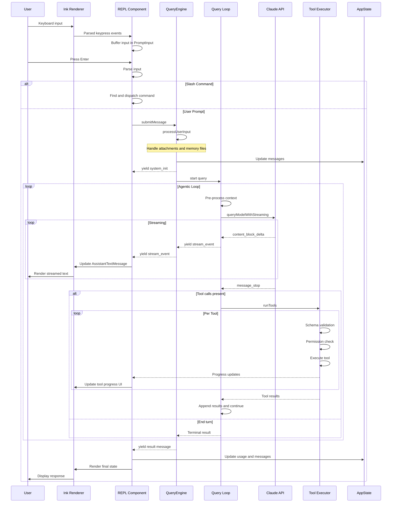
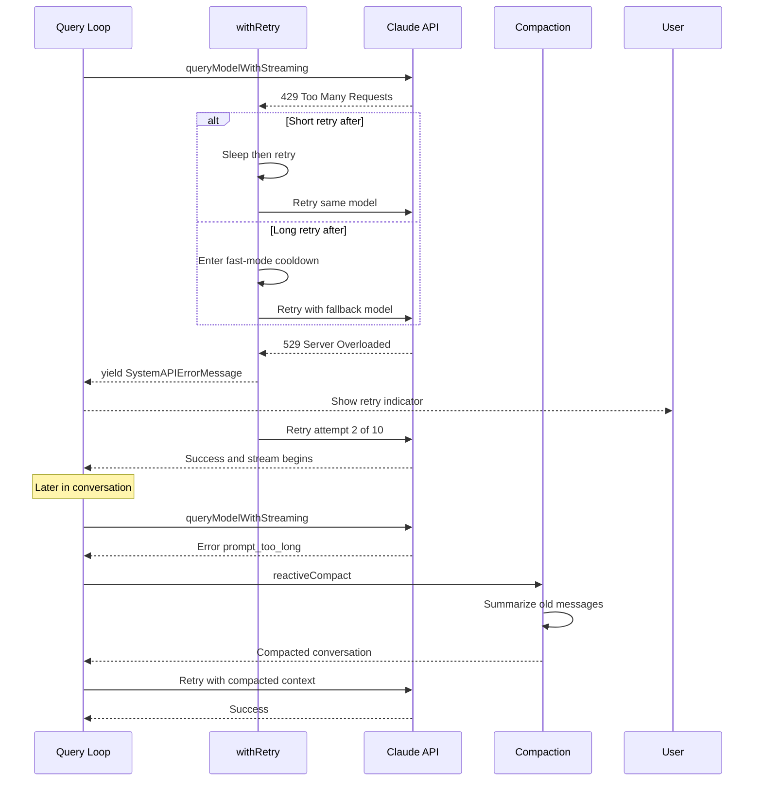
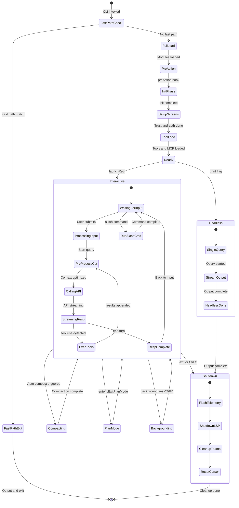
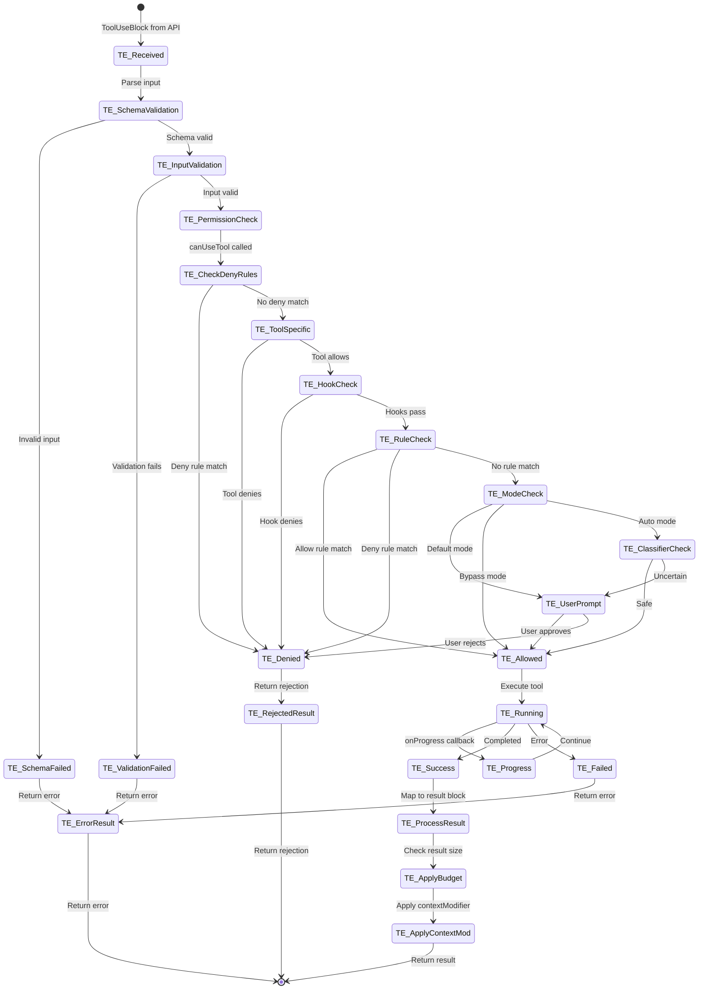
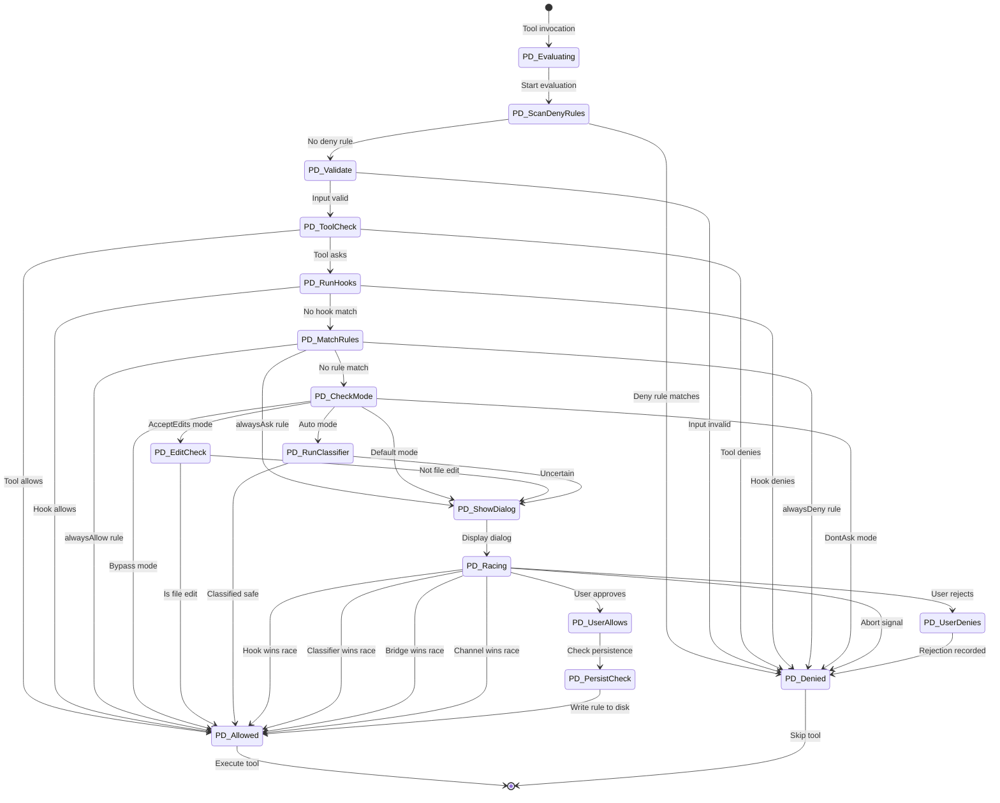
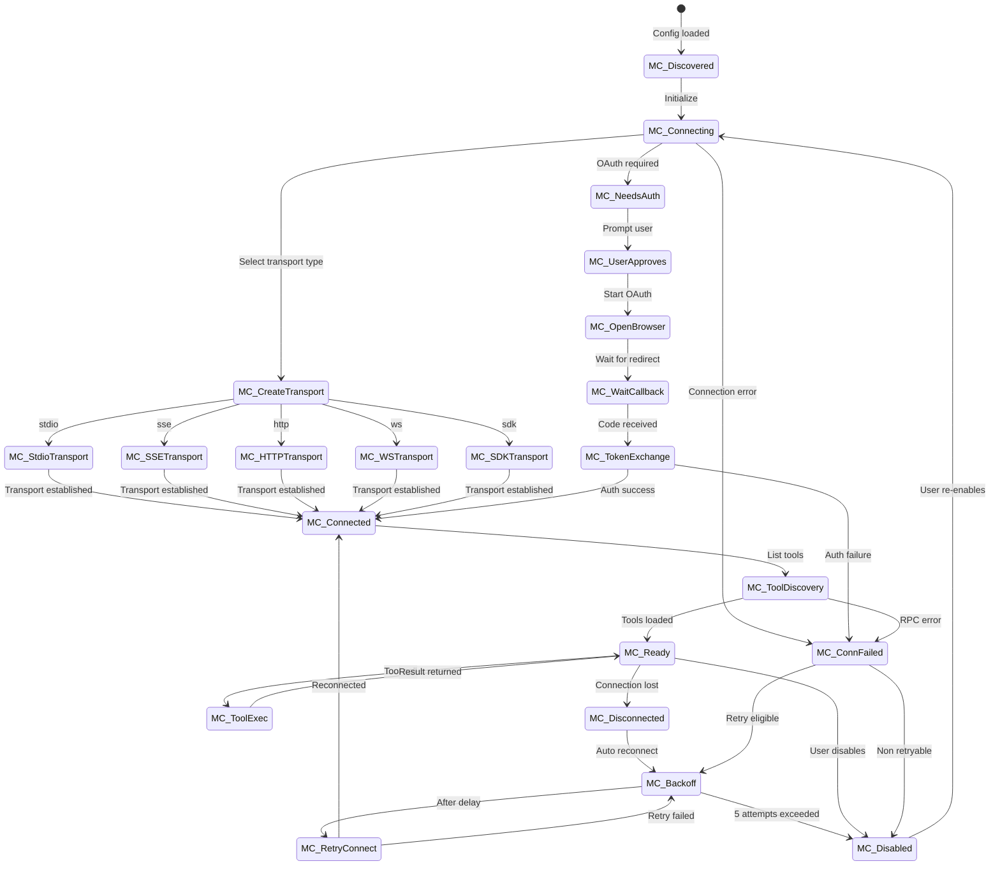
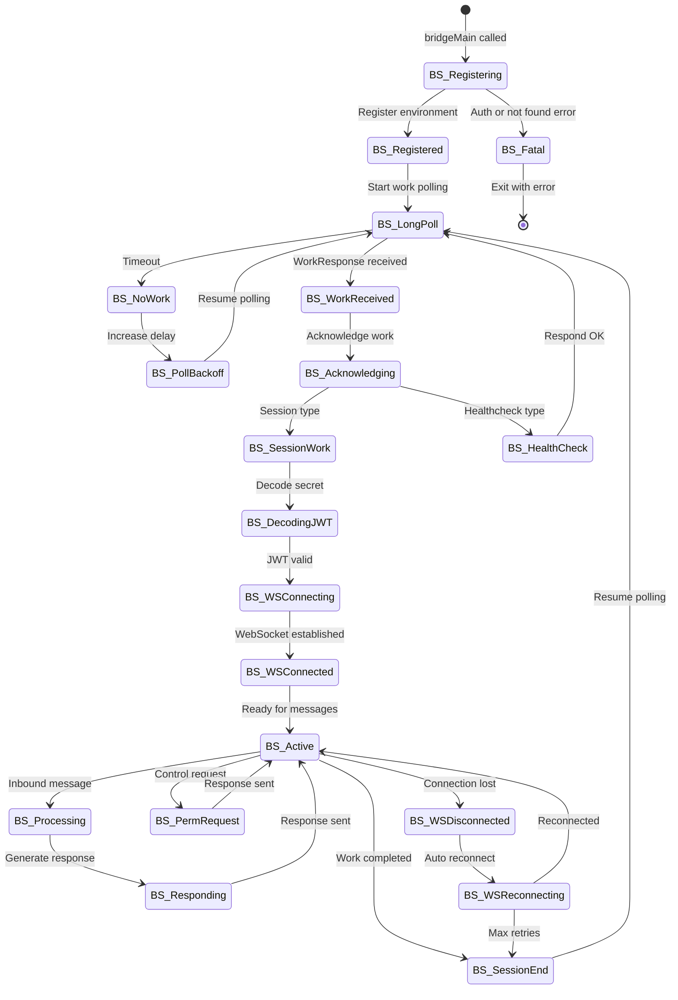
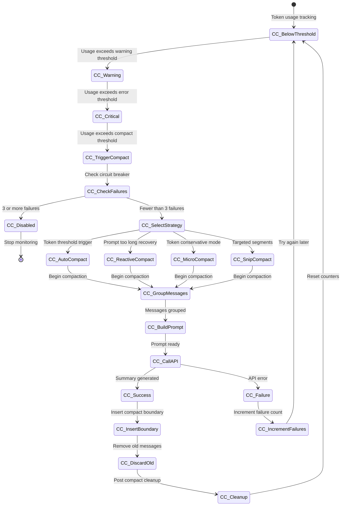
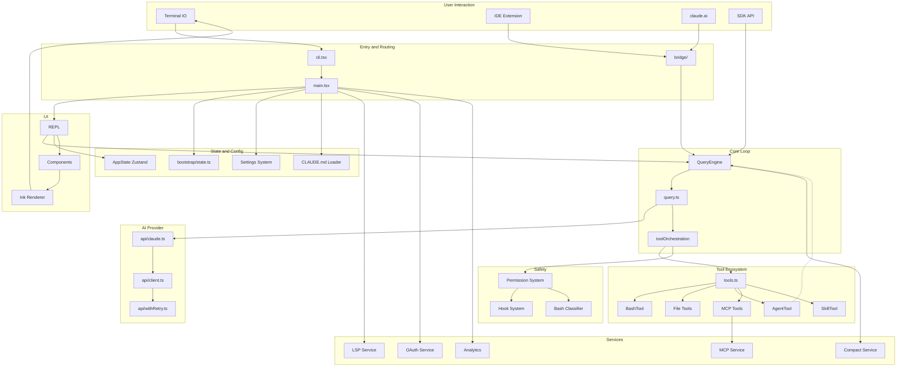

# Data Flow and State Machines

This document traces the end-to-end data flow through Claude Code CLI and documents the state machines that govern its major subsystems. Each diagram is accompanied by a walk-through of every state and transition, identifying happy paths, error recovery strategies, and cross-cutting concerns.

---

## End-to-End Data Flow

### Happy Path: User Prompt to Response



#### Participant Roles

| Participant | Codebase Location | Role |
|---|---|---|
| **User** | Terminal / stdin | The human operator providing keyboard input |
| **Ink Renderer** | `src/ink.js` + React 19/Ink framework | Renders the TUI, dispatches keypress events to React components |
| **REPL Component** | `src/components/REPL.tsx` | Orchestrates the interactive session: manages prompt input, dispatches slash commands, coordinates with the QueryEngine |
| **QueryEngine** | `src/QueryEngine.ts` | Owns the query lifecycle and session state for a conversation. One instance per conversation; each `submitMessage()` call starts a new turn |
| **Query Loop** | `src/query.ts` (the `query()` and `queryLoop()` generators) | The inner agentic loop that iterates between API calls and tool execution until the model ends its turn |
| **Claude API** | `src/services/api/claude.ts` + `src/services/api/withRetry.ts` | Manages the HTTP streaming connection to the Anthropic API, including retry logic |
| **Tool Executor** | `src/services/tools/toolOrchestration.ts` + `src/services/tools/toolExecution.ts` | Partitions tool calls into concurrent/serial batches and executes them |
| **AppState** | `src/state/AppState.ts` (Zustand store) | Centralized mutable state: messages, permission context, usage, MCP clients, file history |

#### Step-by-Step Walk-through

**1. Input Capture (User to REPL)**

The Ink framework captures raw keypresses and delivers them to the `PromptInput` component inside REPL. Characters accumulate in a buffer until the user presses Enter.

**2. Input Routing (REPL)**

When Enter is pressed, the REPL parses the input. If it begins with `/`, it is routed to the slash command registry (`src/commands.ts`). Otherwise, it proceeds as a user prompt to the QueryEngine.

**3. User Input Processing (QueryEngine.submitMessage)**

`QueryEngine.submitMessage()` in `src/QueryEngine.ts` is the main entry point. It:

- Clears turn-scoped state (`discoveredSkillNames`)
- Calls `processUserInput()` to parse attachments, handle `/model` switches, and create the `UserMessage` objects
- Pushes the new messages onto `mutableMessages`
- Persists the transcript to disk (important for `--resume` after crash)
- Fetches the system prompt via `fetchSystemPromptParts()`, which collects CLAUDE.md files, tool descriptions, and MCP instructions

```typescript
// src/QueryEngine.ts ~line 416
const {
  messages: messagesFromUserInput,
  shouldQuery,
  allowedTools,
  model: modelFromUserInput,
  resultText,
} = await processUserInput({
  input: prompt,
  mode: 'prompt',
  ...
})
this.mutableMessages.push(...messagesFromUserInput)
```

**4. Query Loop Entry (query.ts)**

The `query()` generator in `src/query.ts` wraps `queryLoop()`. It tracks consumed command UUIDs and notifies command lifecycle on completion. The inner `queryLoop()` is a `while (true)` loop with explicit `State` management:

```typescript
// src/query.ts ~line 268
let state: State = {
  messages: params.messages,
  toolUseContext: params.toolUseContext,
  maxOutputTokensOverride: params.maxOutputTokensOverride,
  autoCompactTracking: undefined,
  maxOutputTokensRecoveryCount: 0,
  hasAttemptedReactiveCompact: false,
  turnCount: 1,
  pendingToolUseSummary: undefined,
  transition: undefined,
}
```

Each iteration of the loop: (a) applies context optimizations (snip, microcompact, context collapse, autocompact), (b) calls the API, (c) processes streaming events, (d) executes any requested tools, and (e) decides whether to loop (tool results to feed back) or terminate.

**5. Context Optimization Pipeline**

Before calling the API, the query loop runs a pipeline of context-reduction strategies in order:

1. **Tool result budget** -- Enforces per-message size limits on large tool results via `applyToolResultBudget()`
2. **Snip compact** -- Removes old, low-value message segments (feature-gated behind `HISTORY_SNIP`)
3. **Microcompact** -- Collapses tool results that are no longer relevant (e.g., file reads superseded by later edits)
4. **Context collapse** -- Projects a collapsed view over the conversation history (feature-gated behind `CONTEXT_COLLAPSE`)
5. **Autocompact** -- If token usage exceeds the threshold, runs full conversation compaction via a forked agent call

**6. API Streaming**

The `deps.callModel()` invocation (backed by `queryModelWithStreaming` in `src/services/api/claude.ts`) opens a streaming connection to the Claude API. As chunks arrive:

- `content_block_delta` events are yielded through the generator chain: `queryLoop` to `query` to `QueryEngine.submitMessage` to the REPL, which renders them live
- `assistant` messages are accumulated in `assistantMessages[]`
- Any `tool_use` blocks are collected in `toolUseBlocks[]` and `needsFollowUp` is set to `true`
- Certain error messages (prompt-too-long, max-output-tokens) are _withheld_ from the yield stream to allow recovery before surfacing to the user

**7. Tool Execution**

When `needsFollowUp` is true after streaming ends, the loop calls `runTools()` from `src/services/tools/toolOrchestration.ts`. This function:

- Partitions tool calls into batches: consecutive read-only (concurrency-safe) tools run in parallel; write tools run serially
- For each tool, calls `runToolUse()` which: validates the schema, runs permission checks via `canUseTool`, executes the tool, and yields progress/result messages
- Context modifiers from tools are applied to update the `ToolUseContext`

```typescript
// src/services/tools/toolOrchestration.ts ~line 26
for (const { isConcurrencySafe, blocks } of partitionToolCalls(
  toolUseMessages, currentContext,
)) {
  if (isConcurrencySafe) {
    // Run read-only batch concurrently (up to MAX_TOOL_USE_CONCURRENCY)
    for await (const update of runToolsConcurrently(...)) { ... }
  } else {
    // Run non-read-only batch serially
    for await (const update of runToolsSerially(...)) { ... }
  }
}
```

**8. Loop or Terminate**

After tool results are collected and attachment messages are gathered, the new state is assembled and the loop continues. If no tools were requested (`needsFollowUp` is false), stop hooks are evaluated and the loop returns `{ reason: 'completed' }`.

**9. Result Propagation**

The QueryEngine yields the final result messages to the REPL, which updates AppState (usage counters, message history) and triggers a final Ink render.

#### Key Timing and Ordering Constraints

- The transcript must be persisted _before_ the query loop starts, so that `--resume` can recover from a crash mid-API-call
- Tool results must all be yielded before the next API call (the API rejects interleaved `tool_result` and regular `user` messages)
- Attachment messages (memory files, queued commands, skill discovery) are gathered _after_ tool execution completes to ensure they reflect the post-tool state
- The autocompact threshold check happens _every_ iteration, not just at turn boundaries

---

### Error Recovery Flow



#### Retry Mechanism Details

The retry logic lives in `src/services/api/withRetry.ts`. The `withRetry()` async generator wraps each API call attempt in a loop with configurable behavior:

**Rate Limiting (429)**

When the API returns HTTP 429, the retry handler inspects the `Retry-After` header:

- **Short retry-after** (under the `SHORT_RETRY_THRESHOLD_MS`): Sleep for the indicated duration and retry immediately with the same model. This preserves prompt cache locality.
- **Long retry-after**: Enter "fast-mode cooldown" -- the system switches from the fast/cheap model to the standard model. The cooldown duration is at least `MIN_COOLDOWN_MS` to avoid flip-flopping.

```typescript
// src/services/api/withRetry.ts ~line 285
const retryAfterMs = getRetryAfterMs(error)
if (retryAfterMs !== null && retryAfterMs < SHORT_RETRY_THRESHOLD_MS) {
  await sleep(retryAfterMs, options.signal, { abortError })
  continue
}
triggerFastModeCooldown(Date.now() + cooldownMs, cooldownReason)
```

**Server Overload (529)**

For 529 errors, the system tracks consecutive failures. After `MAX_529_RETRIES` (3) consecutive 529s on a non-custom Opus model, a `FallbackTriggeredError` is thrown, which the query loop catches to switch to the configured fallback model. Between retries, `SystemAPIErrorMessage` objects are yielded so the user sees the retry indicator in the UI.

Non-foreground query sources (title generation, suggestions, classifiers) do _not_ retry on 529 -- they bail immediately to avoid amplifying capacity cascades.

**Persistent Retry Mode**

For unattended sessions (`CLAUDE_CODE_UNATTENDED_RETRY`), the system retries 429/529 indefinitely with higher backoff caps (up to 5 minutes between attempts, resetting after 6 hours) and periodic keep-alive yields.

**Authentication Errors**

On 401 or "token revoked" errors, the retry loop forces an OAuth token refresh via `handleOAuth401Error()` and creates a fresh API client before the next attempt.

**Prompt Too Long Recovery**

When the API returns a `prompt_too_long` error, the query loop (not `withRetry`) handles it through a multi-stage recovery pipeline:

1. **Context collapse drain** -- If context collapse is active and the previous transition was not already a drain, commit all staged collapses
2. **Reactive compact** -- Summarize the conversation via a forked agent call, replacing old messages with a summary. Guarded by `hasAttemptedReactiveCompact` to prevent infinite retry loops
3. **Surface the error** -- If recovery fails, the withheld error message is finally yielded to the user

**Max Output Tokens Recovery**

When the model hits its output token limit mid-response, the system first tries escalating the cap (from the default 8K to 64K). If that also fills, it injects a meta-message asking the model to resume and continue, retrying up to `MAX_OUTPUT_TOKENS_RECOVERY_LIMIT` (3) times.

---

## Session Lifecycle State Machine



### State-by-State Walk-through

#### FastPathCheck

The entry point in `src/entrypoints/cli.tsx` checks `process.argv` for special flags before loading any heavy modules. This is a critical performance optimization -- the full CLI loads ~800K lines of code across 135ms of module evaluation.

**Fast path matches and their handlers:**

| Flag | Handler | Modules Loaded |
|---|---|---|
| `--version` / `-v` | Inline `console.log(MACRO.VERSION)` | Zero imports |
| `--dump-system-prompt` | `getSystemPrompt()` | Config + model + prompts only |
| `--daemon-worker` | `runDaemonWorker()` | Worker registry only |
| `remote-control` / `rc` | `bridgeMain()` | Bridge subsystem + config |
| `daemon` | `daemonMain()` | Daemon supervisor |
| `ps` / `logs` / `attach` / `kill` / `--bg` | `bg.ts` handlers | Background session registry |

```typescript
// src/entrypoints/cli.tsx ~line 37
if (args.length === 1 && (args[0] === '--version' || args[0] === '-v')) {
  console.log(`${MACRO.VERSION} (Claude Code)`)
  return  // Zero module loading
}
```

#### FullLoad

When no fast path matches, `src/main.tsx` is loaded. This triggers parallel prefetches at the module level:

1. `startMdmRawRead()` -- Fires MDM subprocess (plutil/reg query) for managed device settings
2. `startKeychainPrefetch()` -- Fires macOS keychain reads for OAuth and legacy API keys in parallel (saves ~65ms on macOS)
3. GrowthBook initialization -- Feature flag service

#### PreAction to InitPhase

The Commander.js `preAction` hook runs `init()` from `src/entrypoints/init.ts`, which:

- Enables config loading (`enableConfigs()`)
- Initializes analytics sinks
- Applies managed environment variables
- Validates authentication

#### SetupScreens

Interactive dialogs for first-time setup:

- Trust dialog acceptance (`checkHasTrustDialogAccepted`)
- Authentication (API key or OAuth)
- Invalid settings detection

#### ToolLoad

Tools are loaded from `src/tools.ts` with conditional gating on feature flags and `USER_TYPE`. MCP servers are connected in batches (default batch size: 3 for local, 20 for remote) via `getMcpToolsCommandsAndResources()`.

#### Interactive Mode: Inner States

- **WaitingForInput** -- The REPL renders the prompt and awaits keyboard input. The `PromptInput` component buffers characters.
- **ProcessingInput** -- `processUserInput()` parses the input, resolves file attachments, handles image pastes, and creates message objects.
- **PreProcessCtx** -- The context optimization pipeline runs (snip, microcompact, collapse, autocompact). This is where stale tool results are removed and conversation history is trimmed.
- **CallingAPI** -- The streaming API request is initiated. The system is blocked on network I/O.
- **StreamingResp** -- Content blocks arrive and are rendered live. Tool use blocks are accumulated.
- **ExecTools** -- Tool calls are executed (possibly concurrently). Permission checks may block here waiting for user input.
- **RespComplete** -- The turn is complete. Stop hooks are evaluated. Usage stats are updated.

The transition from **ExecTools** back to **PreProcessCtx** is the agentic loop -- the model's tool results feed back as context for the next API call, without returning control to the user.

#### Headless Mode

When the `--print` / `-p` flag is set, the system runs a single query through the QueryEngine SDK path (`submitMessage`), streams output to stdout, and exits. No REPL is launched, no interactive permission prompts are shown (the system uses `--allowedTools` or auto mode).

#### Compacting (External Transition)

Auto-compaction can trigger at the start of any query loop iteration when token usage exceeds the threshold. It is an "interruption" of the interactive flow -- the system runs a forked agent to summarize old messages, inserts a compact boundary, and resumes the query.

#### Shutdown Sequence

Shutdown runs in order:

1. **FlushTelemetry** -- Flush analytics events and session telemetry
2. **ShutdownLSP** -- Close any active LSP connections
3. **CleanupTeams** -- Clean up agent swarm state (if active)
4. **ResetCursor** -- Restore terminal cursor visibility (`SHOW_CURSOR` escape sequence)

---

## Tool Execution State Machine



### State-by-State Walk-through

The tool execution state machine is primarily implemented in `src/services/tools/toolExecution.ts`, with orchestration in `src/services/tools/toolOrchestration.ts`.

#### TE_Received

A `ToolUseBlock` arrives from the API response. The block contains the tool name, a unique ID, and the JSON input. The system looks up the tool in two places:

1. The available tools list (`toolUseContext.options.tools`) -- what the model currently sees
2. The full base tools list (`getAllBaseTools()`) -- catches deprecated tool names via aliases (e.g., "KillShell" aliased to "TaskStop")

If neither lookup succeeds, an error result is returned immediately.

```typescript
// src/services/tools/toolExecution.ts ~line 345
let tool = findToolByName(toolUseContext.options.tools, toolName)
if (!tool) {
  const fallbackTool = findToolByName(getAllBaseTools(), toolName)
  if (fallbackTool && fallbackTool.aliases?.includes(toolName)) {
    tool = fallbackTool
  }
}
```

#### TE_SchemaValidation

The tool's Zod input schema (`tool.inputSchema`) is used to validate the JSON input from the API. If the schema parse fails, a formatted error message is returned to the model.

#### TE_InputValidation

Some tools implement additional validation beyond the schema (e.g., file path resolution, command parsing). This is tool-specific logic.

#### TE_PermissionCheck through TE_ModeCheck

This is the full permission decision pipeline, detailed in the Permission Decision State Machine section below. The key entry point is `canUseTool()`, which is a React hook (`useCanUseTool` in `src/hooks/useCanUseTool.tsx`) that creates a `PermissionContext` and runs through the decision tree.

#### TE_Running

The tool's `call()` method is invoked. During execution:

- **Progress callbacks** (`onProgress`) yield `ProgressMessage` objects to the UI, showing real-time updates (e.g., command output lines, file diffs)
- **Session activity tracking** (`startSessionActivity` / `stopSessionActivity`) marks the session as active for heartbeat purposes
- **OTel tracing** spans are created (`startToolExecutionSpan` / `endToolExecutionSpan`)

#### TE_ProcessResult through TE_ApplyContextMod

After successful execution:

1. **Map to result block** -- The tool output is converted to a `ToolResultBlockParam`
2. **Apply budget** -- Large results are checked against `tool.maxResultSizeChars` and may be truncated or persisted to disk
3. **Apply contextModifier** -- Some tools modify the `ToolUseContext` (e.g., `setCwd` after a directory change, updating the file state cache after a file edit)

The context modifier is the mechanism by which tool execution feeds state changes back to the query loop:

```typescript
// src/services/tools/toolOrchestration.ts ~line 141
if (update.contextModifier) {
  currentContext = update.contextModifier.modifyContext(currentContext)
}
```

#### Concurrency Model

Tool orchestration (`runTools`) partitions tool calls into batches:

- **Concurrency-safe tools** (read-only operations like file reads, grep) run in parallel up to `MAX_TOOL_USE_CONCURRENCY` (default: 10). Whether a tool is concurrency-safe is determined by `tool.isConcurrencySafe(parsedInput)`, which can inspect the actual input (e.g., a Bash command that only reads is safe, one that writes is not).
- **Non-concurrency-safe tools** (writes, bash commands with side effects) run one at a time.

Consecutive read-only tools are batched together; a write tool always starts a new serial batch. Context modifiers from concurrent tools are queued and applied in order after the batch completes.

#### Error Handling

Tool execution errors are classified by `classifyToolError()` for telemetry:

- `TelemetrySafeError` instances use their `telemetryMessage` (vetted for PII safety)
- Node.js filesystem errors use their `code` (ENOENT, EACCES, etc.)
- Known error types use their stable `name` property
- Everything else falls back to "Error" or "UnknownError"

When a tool fails, the error message is returned to the model as a `tool_result` with `is_error: true`, allowing the model to recover (e.g., retry with corrected input).

---

## Permission Decision State Machine



### State-by-State Walk-through

The permission system is implemented across several files:

- `src/hooks/useCanUseTool.tsx` -- React hook that creates the permission context and dispatches to handlers
- `src/hooks/toolPermission/PermissionContext.ts` -- Creates the immutable permission context object
- `src/utils/permissions/permissions.ts` -- Rule evaluation (`hasPermissionsToUseTool`)
- `src/hooks/toolPermission/handlers/` -- Mode-specific handlers (interactive, coordinator, swarm worker)

#### PD_Evaluating and PD_ScanDenyRules

The entry point is `useCanUseTool()`, which creates a `PermissionContext` via `createPermissionContext()` and first checks if the abort signal is already fired. Then it calls `hasPermissionsToUseTool()` which scans deny rules:

```typescript
// src/utils/permissions/permissions.ts ~line 213
export function getDenyRules(context: ToolPermissionContext): PermissionRule[] {
  return PERMISSION_RULE_SOURCES.flatMap(source =>
    (context.alwaysDenyRules[source] || []).map(ruleString => ({
      source,
      ruleBehavior: 'deny',
      ruleValue: permissionRuleValueFromString(ruleString),
    })),
  )
}
```

Rules are aggregated from all sources in priority order: `cliArg`, `command`, `session`, `localSettings`, `userSettings`, `projectSettings`, `policySettings`, `flagSettings`.

#### PD_Validate

Input validation is tool-specific. For the Bash tool, this includes parsing the command with `shell-quote` to extract subcommands and output redirections.

#### PD_ToolCheck

Each tool implements a `permissionCheck()` method that returns one of three behaviors:

- `allow` -- Tool is intrinsically safe (e.g., reading its own help text)
- `deny` -- Tool is explicitly disallowed (e.g., Bash tool in sandbox-override mode)
- `ask` -- Defer to the broader permission system

#### PD_RunHooks

The `executePermissionRequestHooks()` function runs any registered hooks. Hooks can:

- **Allow** the operation (with optional permission updates to persist)
- **Deny** the operation (with optional interrupt to abort the entire turn)
- **Pass** (no decision) -- fall through to the next stage

```typescript
// src/hooks/toolPermission/PermissionContext.ts ~line 222
async runHooks(permissionMode, suggestions, updatedInput, permissionPromptStartTimeMs) {
  for await (const hookResult of executePermissionRequestHooks(
    tool.name, toolUseID, input, toolUseContext,
    permissionMode, suggestions, toolUseContext.abortController.signal,
  )) {
    if (hookResult.permissionRequestResult) {
      const decision = hookResult.permissionRequestResult
      if (decision.behavior === 'allow') { ... }
      else if (decision.behavior === 'deny') { ... }
    }
  }
  return null
}
```

#### PD_MatchRules

Rules are pattern-matched against the tool name and input. Rules use the format `ToolName(content)`, where content can be:

- A prefix match: `Bash(prefix:git *)` -- allows git commands
- An exact match: `Bash(npm test)` -- allows exactly `npm test`
- A tool-wide match: `Bash` -- matches all Bash invocations
- An MCP server match: `mcp__server1` -- matches all tools from that server

#### PD_CheckMode

Permission modes control the default behavior when no rule matches:

| Mode | Behavior | Use Case |
|---|---|---|
| **Default** | Show dialog, ask user | Normal interactive use |
| **Bypass** (`--dangerously-skip-permissions`) | Allow all | CI/automated scripts |
| **AcceptEdits** | Allow file edits, ask for everything else | Conservative editing mode |
| **DontAsk** | Deny silently | Non-interactive sessions without explicit allows |
| **Auto** (yolo mode) | Run classifier, allow if safe | `--auto` flag for experienced users |

#### PD_RunClassifier (Auto Mode)

In auto mode, the bash classifier runs the command against a set of rules to determine safety. The classifier can:

- Approve the command with high confidence (allow immediately)
- Flag as uncertain (fall through to dialog)
- Deny with explanation (deny immediately with notification)

Denial tracking prevents spirals: after repeated denials, the system falls back to prompting the user instead of running the classifier.

#### PD_ShowDialog and PD_Racing

When a dialog is shown, multiple resolution sources race to provide a decision:

1. **Hook** -- A permission request hook fires (e.g., from an IDE extension)
2. **Classifier** -- The bash classifier resolves with high confidence (started speculatively before the dialog appeared)
3. **Bridge** -- The IDE bridge (VS Code, JetBrains) sends a permission response
4. **Channel** -- A Kairos channel provides a decision
5. **User** -- The human presses Y/N in the terminal
6. **Abort** -- The abort controller fires (Ctrl+C)

The race is implemented with a `ResolveOnce` pattern that ensures exactly one resolution wins:

```typescript
// src/hooks/toolPermission/PermissionContext.ts ~line 75
function createResolveOnce<T>(resolve: (value: T) => void): ResolveOnce<T> {
  let claimed = false
  let delivered = false
  return {
    resolve(value: T) {
      if (delivered) return
      delivered = true; claimed = true
      resolve(value)
    },
    claim() {
      if (claimed) return false
      claimed = true
      return true
    },
  }
}
```

#### PD_PersistCheck

When the user approves with "Always allow", the permission update is persisted to the appropriate settings file and applied to the in-memory `ToolPermissionContext`:

```typescript
// src/hooks/toolPermission/PermissionContext.ts ~line 139
async persistPermissions(updates: PermissionUpdate[]) {
  if (updates.length === 0) return false
  persistPermissionUpdates(updates)
  const appState = toolUseContext.getAppState()
  setToolPermissionContext(
    applyPermissionUpdates(appState.toolPermissionContext, updates),
  )
  return updates.some(update => supportsPersistence(update.destination))
}
```

---

## MCP Connection State Machine



### State-by-State Walk-through

MCP connection management is implemented in `src/services/mcp/client.ts`. Server connections are memoized via `connectToServer = memoize(...)`.

#### MC_Discovered

MCP server configurations are loaded from `getAllMcpConfigs()`, which aggregates configs from:

- Project `.claude/settings.json` (scoped to the project)
- User `~/.claude/settings.json` (global settings)
- Managed/policy settings (enterprise)

Each config entry specifies a server name, transport type, and connection parameters. Disabled servers (via `isMcpServerDisabled()`) are skipped.

#### MC_Connecting and MC_CreateTransport

Connection batching controls parallelism:

- **Local servers** (stdio, sdk): Batch size 3 (`getMcpServerConnectionBatchSize()`)
- **Remote servers** (sse, http, ws): Batch size 20 (`getRemoteMcpServerConnectionBatchSize()`)

Transport selection and creation:

```typescript
// src/services/mcp/client.ts ~line 620
if (serverRef.type === 'sse') {
  const authProvider = new ClaudeAuthProvider(name, serverRef)
  transport = new SSEClientTransport(new URL(serverRef.url), transportOptions)
} else if (serverRef.type === 'http') {
  transport = new StreamableHTTPClientTransport(...)
} else if (serverRef.type === 'ws') {
  const ws = await createNodeWsClient(url, options)
  transport = new WebSocketTransport(ws)
} else if (serverRef.type === 'sdk') {
  transport = new SdkControlClientTransport(...)
} else {
  // Default: stdio
  transport = new StdioClientTransport({ command, args, env })
}
```

All remote transports wrap their fetch with `wrapFetchWithTimeout()` which applies a 60-second per-request timeout (but explicitly excludes GET requests, which are long-lived SSE streams).

#### MC_NeedsAuth

Remote servers may require OAuth authentication. The system uses `ClaudeAuthProvider` which implements the MCP auth protocol. Auth failures are cached for 15 minutes (`MCP_AUTH_CACHE_TTL_MS`) to avoid repeated prompts. The cache is serialized through a promise chain to prevent concurrent read-modify-write races.

For claude.ai proxy connections, a retry-on-401 wrapper (`createClaudeAiProxyFetch`) handles token staleness.

#### MC_Connected to MC_Ready

After transport establishment, the MCP `Client` performs tool discovery via `client.listTools()`. Tools are wrapped in `MCPTool` instances that adapt the MCP tool schema to Claude Code's internal `Tool` interface. Tool descriptions are capped at `MAX_MCP_DESCRIPTION_LENGTH` (2048 chars) to prevent prompt bloat from auto-generated API docs.

#### MC_ToolExec

Tool calls go through `callMcpTool()` which:

1. Validates the tool call against the server's capabilities
2. Sends the JSON-RPC call with a configurable timeout (`getMcpToolTimeoutMs()`, default ~27.8 hours)
3. Handles elicitation requests (`ElicitRequestSchema`) -- interactive prompts from MCP servers
4. Processes the result, handling images, binary content, and large outputs

**Session expiry detection**: If the server returns HTTP 404 with JSON-RPC error code -32001, the system recognizes this as a session-expired error (`isMcpSessionExpiredError()`), clears the connection cache, and retries with a fresh client.

#### MC_Disconnected and MC_Backoff

When a connection is lost, the system enters an exponential backoff loop. After 5 failed reconnection attempts, the server transitions to `MC_Disabled` state. The user can re-enable it via the `/mcp` command.

---

## Bridge Session State Machine



### State-by-State Walk-through

The bridge subsystem enables Claude Code to serve as a "remote control" for IDE extensions and web clients. The implementation is in `src/bridge/bridgeMain.ts`.

#### BS_Registering

`bridgeMain()` validates authentication, checks GrowthBook feature gates, and verifies minimum version requirements before registering the environment with the bridge API.

Prerequisites checked at `src/entrypoints/cli.tsx`:

1. OAuth tokens exist (`getClaudeAIOAuthTokens()`)
2. Bridge is not disabled by feature gate (`getBridgeDisabledReason()`)
3. Minimum version check passes (`checkBridgeMinVersion()`)
4. Policy allows remote control (`isPolicyAllowed('allow_remote_control')`)

#### BS_Registered and BS_LongPoll

The `runBridgeLoop()` function manages the poll loop. It maintains several tracking structures:

```typescript
// src/bridge/bridgeMain.ts ~line 163
const activeSessions = new Map<string, SessionHandle>()
const sessionStartTimes = new Map<string, number>()
const sessionWorkIds = new Map<string, string>()
const sessionCompatIds = new Map<string, string>()
const sessionIngressTokens = new Map<string, string>()
```

The loop polls the bridge API for work. During idle periods, backoff is applied (configurable, default: 2s initial, 120s cap, 10min give-up). A `capacityWake` signal allows immediate wake-up when a session completes.

#### BS_WorkReceived and BS_SessionWork

When work arrives, it is acknowledged to the server. Session work carries a JWT secret that is decoded (`decodeWorkSecret`) to extract WebSocket connection parameters and the session ingress token.

#### BS_Active

Active sessions spawn child Claude processes via `SessionSpawner`. The bridge supports multiple concurrent sessions (up to `config.maxSessions`, default 32 for spawn mode). Each session has:

- A heartbeat timer that periodically calls `api.heartbeatWork()` to keep the session alive
- A proactive token refresh scheduler (`createTokenRefreshScheduler`) that refreshes JWT tokens 5 minutes before expiry
- Per-session worktrees (optional, via `createAgentWorktree()`) for Git isolation

#### Heartbeat and Token Refresh

The `heartbeatActiveWorkItems()` function keeps sessions alive. On 401/403 (JWT expired), it triggers server-side re-dispatch via `api.reconnectSession()` -- without this, work stays ACK'd in the Redis PEL and the poll returns empty indefinitely.

#### BS_WSDisconnected

Connection drops trigger automatic reconnection. The system detects system sleep/wake (via time gap exceeding `pollSleepDetectionThresholdMs`, which is 2x the connection backoff cap) and resets the error budget accordingly.

#### BS_Fatal

Fatal errors (environment expired, authentication permanently failed, sustained connection errors beyond the give-up threshold) cause the bridge to exit. The logger displays a resume command if applicable.

---

## Context Compaction State Machine



### State-by-State Walk-through

Context compaction is implemented across several files in `src/services/compact/`:

- `autoCompact.ts` -- Threshold monitoring and auto-compact triggering
- `compact.ts` -- Core compaction logic (message grouping, prompt building, API calling)
- `grouping.ts` -- Message grouping by API round
- `microCompact.ts` -- Lightweight compaction of stale tool results
- `snipCompact.ts` -- Targeted segment removal (feature-gated)
- `reactiveCompact.ts` -- Recovery from prompt-too-long errors (feature-gated, stub in this snapshot)

#### CC_BelowThreshold through CC_TriggerCompact

Token usage is tracked via `tokenCountWithEstimation()`. Thresholds are calculated relative to the effective context window:

```typescript
// src/services/compact/autoCompact.ts ~line 72
export function getAutoCompactThreshold(model: string): number {
  const effectiveContextWindow = getEffectiveContextWindowSize(model)
  return effectiveContextWindow - AUTOCOMPACT_BUFFER_TOKENS  // 13,000 token buffer
}
```

The `calculateTokenWarningState()` function computes multiple threshold levels:

| Threshold | Buffer | Purpose |
|---|---|---|
| **Warning** | 20,000 tokens from threshold | Show yellow warning indicator |
| **Error** | 20,000 tokens from threshold | Show red warning indicator |
| **Auto-compact** | 13,000 tokens below effective window | Trigger automatic compaction |
| **Blocking limit** | 3,000 tokens below effective window | Block new queries (manual compact only) |

#### CC_CheckFailures (Circuit Breaker)

After `MAX_CONSECUTIVE_AUTOCOMPACT_FAILURES` (3) consecutive failures, the circuit breaker trips and autocompact is disabled for the remainder of the session. This prevents sessions with irrecoverably large contexts from hammering the API with doomed compaction attempts.

```typescript
// src/services/compact/autoCompact.ts ~line 259
if (
  tracking?.consecutiveFailures !== undefined &&
  tracking.consecutiveFailures >= MAX_CONSECUTIVE_AUTOCOMPACT_FAILURES
) {
  return { wasCompacted: false }
}
```

The failure count resets to 0 on any successful compaction.

#### CC_SelectStrategy

Multiple compaction strategies exist, applied in different contexts:

- **AutoCompact** -- Proactive compaction triggered when token count exceeds threshold during normal query loop operation. Calls `compactConversation()` via a forked agent.
- **ReactiveCompact** -- Recovery strategy triggered after the API returns a `prompt_too_long` error. Unlike autocompact, it fires _after_ the API rejects the request.
- **MicroCompact** -- Lightweight, no-API-call compaction that removes stale tool results (e.g., file reads superseded by later edits). Runs every iteration.
- **SnipCompact** -- Removes targeted old message segments below a certain value threshold. Feature-gated behind `HISTORY_SNIP`.

Additionally, the system tries **session memory compaction** before the full compaction path -- this is a lighter-weight approach that prunes messages using session memory heuristics.

#### CC_GroupMessages

Messages are grouped by API round via `groupMessagesByApiRound()`:

```typescript
// src/services/compact/grouping.ts ~line 22
export function groupMessagesByApiRound(messages: Message[]): Message[][] {
  // A boundary fires when a NEW assistant response begins
  // (different message.id from the prior assistant)
  ...
}
```

This grouping is finer-grained than the previous human-turn grouping, enabling compaction in single-prompt agentic sessions (SDK/CCR/eval callers) where the entire workload is one human turn.

#### CC_BuildPrompt and CC_CallAPI

The compaction prompt is built by `getCompactPrompt()` and sent to the model via `runForkedAgent()`. The forked agent runs in a separate context with:

- `MAX_OUTPUT_TOKENS_FOR_SUMMARY` (20,000 tokens) reserved for the summary
- Images stripped from messages to avoid the compaction call itself hitting prompt-too-long
- Skill discovery and skill listing attachments stripped (they are re-injected post-compact)

If the compaction call itself hits prompt-too-long, `truncateHeadForPTLRetry()` drops the oldest message groups and retries up to `MAX_PTL_RETRIES` (3) times.

#### CC_Success: Post-Compaction Assembly

A successful compaction produces a `CompactionResult` containing:

```typescript
// src/services/compact/compact.ts ~line 299
export interface CompactionResult {
  boundaryMarker: SystemMessage          // Compact boundary marker
  summaryMessages: UserMessage[]         // The LLM-generated summary
  attachments: AttachmentMessage[]       // Re-injected context (tools, MCP, skills)
  hookResults: HookResultMessage[]       // Post-compact hook outputs
  messagesToKeep?: Message[]             // Recent messages preserved verbatim
  preCompactTokenCount?: number
  postCompactTokenCount?: number
  compactionUsage?: ReturnType<typeof getTokenUsage>
}
```

These are assembled by `buildPostCompactMessages()` in a specific order: boundary marker, summary messages, kept messages, attachments, hook results. This ordering is important because the API sees them as the conversation history.

Post-compact cleanup (`runPostCompactCleanup()`) resets various caches:

- Prompt cache break detection baseline
- Session memory last-summarized message ID
- Context collapse state (if active)

#### CC_Failure

On failure, the consecutive failure count is incremented. The error is logged, and the query loop continues with the original (uncompacted) messages. If the failure count reaches the circuit breaker threshold, all future autocompact attempts for this session are skipped.

---

## Complete Module Interaction Map



### Module Interaction Walk-through

#### Entry Layer

Three entry paths converge on the core loop:

1. **Terminal (Interactive)**: `cli.tsx` -> `main.tsx` -> `launchRepl()` -> REPL component -> `QueryEngine.submitMessage()`
2. **IDE / Web (Bridge)**: `cli.tsx` -> `bridgeMain()` -> Bridge poll loop -> Session spawner -> `QueryEngine`
3. **SDK API (Headless)**: Direct `QueryEngine` instantiation via the SDK entry points in `src/entrypoints/sdk/`

#### Core Loop Layer

The `QueryEngine` to `query.ts` relationship is one of ownership and delegation:

- `QueryEngine` owns session-level state (messages, file cache, usage tracking, permission denials)
- `query.ts` owns turn-level state (autocompact tracking, recovery counts, transition history)
- Communication is via async generators -- `query()` yields events that `QueryEngine.submitMessage()` re-yields to the caller

#### Tool Ecosystem Layer

Tool orchestration sits between the core loop and individual tools:

1. `query.ts` calls `runTools()` with the list of `ToolUseBlock` objects
2. `toolOrchestration.ts` partitions into batches and delegates to `runToolUse()` in `toolExecution.ts`
3. `toolExecution.ts` calls `canUseTool()` (permission check) then `tool.call()` (execution)
4. Results flow back through the generator chain, with context modifiers applied along the way

The `AgentTool` has a unique recursive relationship -- it creates a new `QueryEngine` instance for the sub-agent, which runs its own query loop with its own tool set. This is shown with the dashed arrow from AgentT back to QEngine.

#### Safety Layer

Every tool invocation passes through the permission system, which consults:

1. **Hook System** -- Pre-execution hooks, permission request hooks, and post-execution hooks
2. **Bash Classifier** -- Security classifier for bash commands (feature-gated)
3. **Permission Rules** -- Static rules from settings files and session state

The permission system is the primary safety boundary -- it ensures no tool can execute without either explicit user approval, a matching allow rule, or classifier clearance.

#### State Layer

State management uses a layered approach:

- **AppState (Zustand)** -- UI-facing reactive state used by React components
- **bootstrap/state.ts** -- Session-level mutable singletons (session ID, stats store, model overrides)
- **Settings System** -- Hierarchical settings from project, user, managed, and policy sources
- **CLAUDE.md Loader** -- Project instructions loaded from `.claude/CLAUDE.md` files at various directory levels

#### Services Layer

Services are initialized at startup and shared across the session:

- **MCP Service** -- Manages connections to MCP servers, batched at startup
- **Compact Service** -- Provides compaction strategies (auto, reactive, micro, snip)
- **OAuth Service** -- Token management, refresh scheduling, and auth flow
- **Analytics** -- Event logging via GrowthBook, Statsig, and first-party telemetry
- **LSP Service** -- Language intelligence (completion, diagnostics) from connected LSP servers

---

## Cross-Cutting Concerns

### State Machine Interactions

The state machines documented above do not operate in isolation. Key interaction patterns:

**Tool Execution triggers Permission Decision**: Every tool call in the Tool Execution state machine (TE_PermissionCheck) invokes the full Permission Decision state machine. The two are synchronous -- tool execution blocks until the permission decision resolves. This means a slow permission dialog (waiting for user input) blocks the entire tool batch.

**Query Loop triggers Compaction**: The query loop's context optimization pipeline (PreProcessCtx in the Session Lifecycle) runs the compaction state machine at the start of every iteration. If auto-compact fires, the query loop pauses while a forked agent summarizes the conversation. The query loop then resumes with the compacted messages.

**Bridge sessions spawn Session Lifecycle instances**: Each bridge work item spawns a new CLI child process, which goes through its own Session Lifecycle from FullLoad onwards. The bridge manages the lifecycle of these children and handles their shutdown.

**MCP tool execution routes through Tool Execution**: MCP tool calls follow the same Tool Execution state machine as built-in tools. The MCPTool adapter translates between the MCP protocol and Claude Code's internal tool interface. However, MCP connection failures can trigger the MCP Connection state machine's reconnection logic mid-tool-call.

### Data Flow Between State Machines

| From | To | Data | Mechanism |
|---|---|---|---|
| Session Lifecycle (StreamingResp) | Tool Execution (TE_Received) | `ToolUseBlock[]` | `runTools()` call from query loop |
| Tool Execution (TE_ApplyContextMod) | Session Lifecycle (PreProcessCtx) | Updated `ToolUseContext` | Context modifier propagation via `MessageUpdate.newContext` |
| Session Lifecycle (CallingAPI) | Compaction (CC_TriggerCompact) | Token count | `autoCompactIfNeeded()` call with current messages |
| Compaction (CC_Cleanup) | Session Lifecycle (PreProcessCtx) | Post-compact `Message[]` | `buildPostCompactMessages()` return value |
| Permission Decision (PD_ShowDialog) | Session Lifecycle (WaitingForInput) | UI state change | React state update via `setToolUseConfirmQueue` |
| Bridge (BS_Active) | Session Lifecycle (entire) | Session spawn | Child process with `--sdk-url` flag |

### Key Invariants

1. **Message ordering**: The API requires messages to alternate between `user` and `assistant` roles. Every `tool_use` must be followed by a matching `tool_result` before the next API call. The `normalizeMessagesForAPI()` function enforces this.

2. **Abort propagation**: The `abortController.signal` is threaded through every async operation. When the user presses Ctrl+C, it propagates to: the API streaming connection, all running tool executions, any pending permission dialogs, and the compaction forked agent.

3. **Context modifier ordering**: Context modifiers from concurrent tools are queued and applied _after_ the batch completes, preserving a deterministic ordering even though execution was parallel.

4. **Compact boundary integrity**: After compaction, the messages array starts with a `compact_boundary` system message. `getMessagesAfterCompactBoundary()` always returns only the messages after the most recent boundary, ensuring old (summarized) messages are never sent to the API.

5. **Permission persistence atomicity**: Permission updates are applied to in-memory state and persisted to disk in a single operation via `persistPermissionUpdates()`. The in-memory state is updated immediately; disk writes are best-effort (failures are logged but do not block the session).

---

## Source References

| File | Purpose |
|---|---|
| `src/entrypoints/cli.tsx` | Bootstrap entry point, fast-path routing |
| `src/main.tsx` | Full CLI setup, parallel prefetches, Commander.js configuration |
| `src/QueryEngine.ts` | Query lifecycle and session state management |
| `src/query.ts` | Inner agentic loop (`query()` and `queryLoop()` generators) |
| `src/services/tools/toolOrchestration.ts` | Tool call partitioning and batch execution |
| `src/services/tools/toolExecution.ts` | Individual tool execution (schema validation, permission, invocation) |
| `src/hooks/useCanUseTool.tsx` | Permission decision entry point (React hook) |
| `src/hooks/toolPermission/PermissionContext.ts` | Permission context factory and helper methods |
| `src/utils/permissions/permissions.ts` | Rule evaluation, deny/allow/ask rule matching |
| `src/services/mcp/client.ts` | MCP server connection, transport creation, tool discovery |
| `src/bridge/bridgeMain.ts` | Bridge poll loop, session spawning, heartbeat management |
| `src/services/compact/autoCompact.ts` | Auto-compact threshold calculation, circuit breaker |
| `src/services/compact/compact.ts` | Core compaction (message grouping, API call, result assembly) |
| `src/services/compact/grouping.ts` | Message grouping by API round boundaries |
| `src/services/api/withRetry.ts` | Retry logic for API calls (429, 529, auth errors) |
| `src/services/api/claude.ts` | Streaming API client, model configuration |
| `src/state/AppState.ts` | Zustand store for reactive UI state |
| `src/bootstrap/state.ts` | Session-level mutable singletons |
| `src/Tool.ts` | Base types and interfaces for all tools |
| `src/tools.ts` | Tool registry with conditional feature-flag loading |
