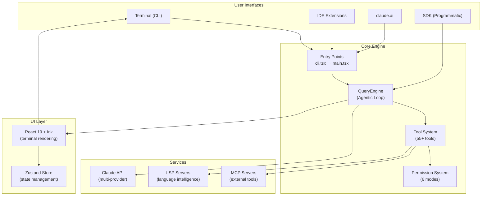

# Claude Code CLI — Reverse Engineering Documentation

> Generated 2026-03-31 from source snapshot extracted via npm package source map.

## Overview

Claude Code is Anthropic's official terminal-based AI coding assistant. It operates as an **agentic loop** — accepting user input, querying the Claude API with streaming, executing tools (file edits, shell commands, web searches, etc.), and iterating until the task is complete.

**Tech Stack:** Bun + TypeScript | React 19 + Ink (terminal UI) | Yoga (flexbox layout) | Commander.js (CLI) | Zod v4 (schemas) | Zustand (state)

**Scale:** ~800K lines of source across 1,500+ files, 55+ tools, 60+ slash commands, 90+ React hooks, 140+ UI components, 340+ utilities.

## Documentation Purpose

This documentation suite is designed so that a developer can **reconstruct the system from architecture to functionality to key code/algorithm logic** consistent with the current source code. Each document includes:

- **Architecture explanations** — design decisions, trade-offs, and the "why" behind each pattern
- **Diagram walk-throughs** — step-by-step explanations of every state machine state, sequence diagram step, and data flow path
- **Key code snippets** — actual TypeScript extracted from the source with file:line references
- **Source references** — file paths and key exports for every major component

## Table of Contents

| # | Document | Lines | Description |
|---|----------|-------|-------------|
| 01 | [System Architecture](01-system-architecture.md) | ~880 | High-level architecture, module dependency graph, subsystem overview, technology stack, design philosophy, code patterns |
| 02 | [Startup and Bootstrap](02-startup-and-bootstrap.md) | ~860 | Entry point decision tree, initialization sequence, bootstrap state, feature flags, operational modes, environment variables, startup profiling |
| 03 | [Query Engine](03-query-engine.md) | ~1120 | QueryEngine class, message flow, API client (multi-provider), streaming, tool call loop, retry logic, thinking mode, token counting, context compaction |
| 04 | [Tools and Commands](04-tools-and-commands.md) | ~1200 | Tool type system, complete tool inventory (55+), tool execution lifecycle, concurrency model, slash command system (60+), command discovery |
| 05 | [Permission System](05-permission-system.md) | ~860 | Multi-layer architecture, 6 permission modes, decision flow, interactive handler with 6-way race, permission rules, persistence, analytics |
| 06 | [Services](06-services.md) | ~990 | MCP protocol (25 files), OAuth, LSP, context compaction, analytics/GrowthBook, policy limits, tool orchestration, initialization order |
| 07 | [UI Architecture](07-ui-architecture.md) | ~920 | Ink rendering pipeline (React → Virtual DOM → Yoga → Screen buffer → ANSI), component tree, 140+ components, Zustand state management, input handling |
| 08 | [Bridge and Coordinator](08-bridge-and-coordinator.md) | ~1100 | IDE communication (VS Code, JetBrains, claude.ai), JWT auth, WebSocket protocol, multi-agent coordinator, skills system, swarm permissions |
| 09 | [Configuration and Context](09-configuration-and-context.md) | ~940 | 5-source settings hierarchy, CLAUDE.md loading, system prompt assembly, context window management, SDK schemas (Zod v4), hook system, utility modules |
| 10 | [Data Flow and State Machines](10-data-flow-and-state-machines.md) | ~1390 | End-to-end data flow sequences, session lifecycle, tool execution, permission decision, MCP connection, bridge session, compaction state machines |

**Total:** ~10,300 lines of documentation with ~110+ Mermaid diagrams.

## Architecture at a Glance

## Key Design Decisions

1. **Fast-path routing** — `--version` and similar flags return instantly without loading the 200+ module dependency tree. The entry point (`cli.tsx`) checks 12+ fast-path patterns before dynamically importing the full CLI.

2. **Parallel prefetch** — MDM settings, keychain, and API connection fire asynchronously during module import (~135ms). Two keychain reads (OAuth + API key) are parallelized to save ~65ms.

3. **Build-time dead-code elimination** — ~90 feature flags via `bun:bundle` compile out entire subsystems from non-Anthropic builds. Feature-gated imports use `require()` inside ternaries so the bundler can eliminate the dead branch.

4. **Multi-layer permission system** — 7 check layers with ML classifier, hooks, rules, and user consent racing in parallel. A 200ms grace period after classifier approval prevents accidental keypress overrides.

5. **Concurrent tool execution** — Read-only tools run in parallel (max 10); write tools execute serially with context propagation via `contextModifier` callbacks.

6. **Context compaction** — Automatic conversation summarization with circuit breaker (3 failures) to manage context window. A 13K token buffer prevents `prompt_too_long` errors.

## Core Source File Map

| File | Purpose | Key Exports |
|------|---------|-------------|
| `src/entrypoints/cli.tsx` | Fast-path routing, entry point | `main()` |
| `src/main.tsx` | Full CLI setup, Commander.js, REPL launch | `main()` |
| `src/QueryEngine.ts` | Conversation lifecycle, message state | `QueryEngine`, `QueryEngineConfig` |
| `src/query.ts` | Agentic loop (API + tools) | `query()` |
| `src/Tool.ts` | Tool interface, ToolUseContext | `Tool<I,O,P>`, `ToolUseContext`, `ToolPermissionContext` |
| `src/tools.ts` | Tool registry, pool assembly | `getAllBaseTools()`, `assembleToolPool()` |
| `src/commands.ts` | Command registry | `getCommands()`, `COMMANDS()` |
| `src/bootstrap/state.ts` | Session singleton state | `State`, `getSessionId()` |
| `src/services/api/claude.ts` | Streaming API calls | `queryModel()` |
| `src/services/api/withRetry.ts` | Retry with backoff | `withRetry()` |
| `src/services/mcp/client.ts` | MCP connection manager | MCP lifecycle |
| `src/hooks/toolPermission/` | Permission system | `useCanUseTool()` |
| `src/state/AppStateStore.ts` | Zustand store | `AppState`, `useAppState()` |

## Reconstructed Environment Notes

This documentation was produced from a reconstructed development environment:

- **~150 stub files** exist for modules missing from the source map extraction
- **TypeScript strict mode is relaxed** (`noImplicitAny: false`, `strictNullChecks: false`)
- **Proprietary packages** (`@ant/*`, `@anthropic-ai/sandbox-runtime`, etc.) are replaced with empty stubs
- **Native modules** (`color-diff-napi`, `modifiers-napi`, `audio-capture-napi`) are stubbed

Some implementation details may be incomplete where stubs obscure the actual logic. Code snippets in the documentation are extracted from the actual source files and include file:line references for verification.
